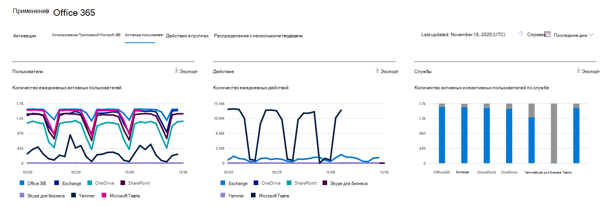

# Отчеты Microsoft 365 в центре администрирования — активные пользователи

На панели мониторинга **отчетов** Microsoft 365 вы увидите обзор действий по продуктам в вашей организации. Вы можете просмотреть отчеты по отдельным продуктам, чтобы получить более подробные сведения о действиях с каждым приложением. Ознакомьтесь со статьей [Обзор отчетов](activity-reports.md).
  
Например, из отчета **Активные пользователи** можно узнать, сколько лицензий на продукты используется сотрудниками организации, и просмотреть подробные сведения о том, какие продукты кто использует. Этот отчет поможет администраторам выяснить, какие продукты используются редко, или определить пользователей, которым могут понадобиться дополнительное обучение и сведения. 
  
> [!NOTE]
> Для просмотра отчетов необходимо быть глобальным администратором, глобальным читателям или читателями отчетов в Microsoft 365 или Exchange, SharePoint, Teams Service, Team Communications или Skype для бизнеса.  

## Просмотр отчета "Активные пользователи"

1. В центре администрирования перейдите в раздел **отчеты о** \> <a href="https://go.microsoft.com/fwlink/p/?linkid=2074756" target="_blank">использование</a> страницы. 
2. На домашней странице панели мониторинга нажмите кнопку **More more (просмотреть дополнительные** ) на карточке активные пользователи — Microsoft 365 Services.

## Анализ отчета "Активные пользователи"

Просмотреть список Активные пользователи можно в отчете Office 365, выбрав вкладку **Активные пользователи** . 

|||
|:-----|:-----|
|1.    |В отчете **Активные пользователи** можно отследить тенденции за последние 7, 30, 90 и 180 дней. Тем не менее, если вы просматриваете определенный день в отчете, в таблице (7) будут отображаться данные в течение 28 дней с текущей даты (не Дата создания отчета).    |
|2.    |Данные в каждом отчете обычно закрываются в течение последних 24 – 48 часов.    |
|3.    |На диаграмме **Пользователи** отображаются активные активные пользователи в отчетном периоде, разделенном продуктом.    На диаграмме **активности** отображается число ежедневных действий в отчетном периоде, разделенных продуктом.   Диаграмма **Службы** показывает количество пользователей по типу действия и службе.    |
|4.    | На диаграмме **Пользователи** на оси x отображается выбранный период времени отчета, а на оси y отображаются разделенные Ежедневные активные пользователи и цвета, закодированные с помощью типа лицензии.     На ****   оси x на диаграмме активности отображается выбранный период времени отчета, а на оси y отображается значение счетчика ежедневных действий и цветовой маркировки по типу лицензии.   На диаграмме **Службы** ось X показывает отдельные службы, включенные для пользователей в заданный период времени, а ось Y — количество пользователей с определенным статусом активности (обозначенным цветом).    |
|5.    |Вы можете отфильтровать ряды, которые вы видите на диаграмме, выбрав элемент в условных обозначениях. При выборе другого значения данные в таблице-сетке не меняются.    |
|6.    |Вы также можете экспортировать данные отчета в CSV-файл Excel, выбрав ссылку **Экспорт** . При этом данные всех пользователей будут экспортированы в формат, позволяющий сортировать и фильтровать их для дальнейшего анализа. Если у вас менее 2000 пользователей, вы можете сортировать и фильтровать значения в самой таблице отчета. Если пользователей больше 2000, для фильтрации и сортировки потребуется экспортировать данные.    |
|7.    |Вы можете отобразить в таблице-сетке нужные сведения с помощью элементов управления столбцов:    Если ваша подписка управляется 21Vianet, то вы не увидите Yammer.     |
|||

Если политики организации не позволяют просматривать отчеты, в которых есть личные сведения пользователей, можно изменить параметр конфиденциальности для всех отчетов. Ознакомьтесь с разделом " **как скрыть сведения о уровне пользователя?** " в разделе [отчеты об активности в центре администрирования Microsoft 365](activity-reports.md).  
