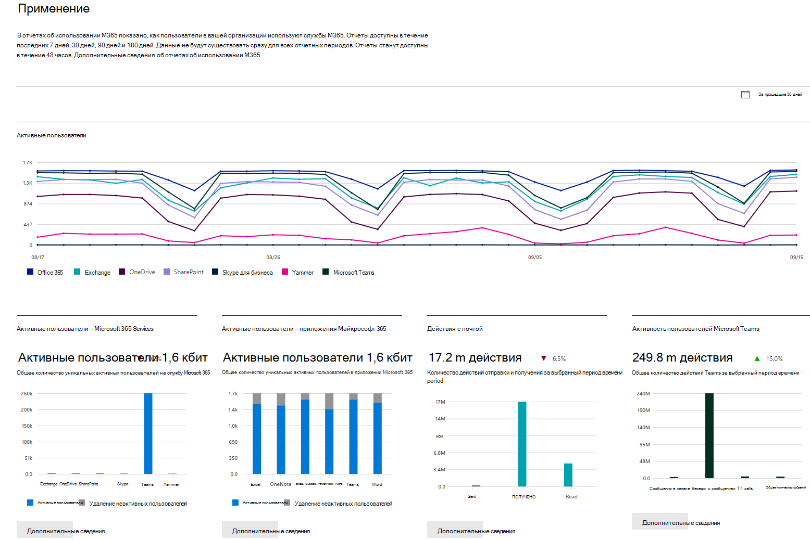

# Отчеты по Microsoft 365 в Центре администрированияMicrosoft 365 Reports in the admin center

Вы можете без труда узнать, как сотрудники вашей компании используют службы Microsoft 365. Например, вы можете выяснить, кто использует службы активно и почти выбрал квоты, а кому лицензия на Microsoft 365, возможно, не нужна совсем.You can easily see how people in your business are using Microsoft 365 services. For example, you can identify who is using a service a lot and reaching quotas, or who may not need an Microsoft 365 license at all.
  
Доступны отчеты за последние 7, 30, 90 и 180 дней. В начале каждого из периодов отчетные данные отсутствуют, поэтому отчеты появляются в течение 48 часов.Reports are available for the last 7 days, 30 days, 90 days, and 180 days. Data won't exist for all reporting periods right away. The reports become available within 48 hours.
  
Смотрите это видео на обзор: о том, как вы можете использовать отчеты:Watch this video for on overview: on how you can use the reports:
  
> [!VIDEO https://www.microsoft.com/videoplayer/embed/fb726f8e-aead-43b2-ba0f-53ba5b886bf7?autoplay=false]
  
## Доступ к панели мониторинга "Отчеты"How to get to the Reports dashboard

::: moniker range="o365-worldwide"

1. В центре администрирования перейдите в раздел **отчеты о** \> <a href="https://go.microsoft.com/fwlink/p/?linkid=2074756" target="_blank">использование</a> страницы.In the admin center, go to the **Reports** \> <a href="https://go.microsoft.com/fwlink/p/?linkid=2074756" target="_blank">Usage</a> page.

::: moniker-end

::: moniker range="o365-germany"

1. В <a href="https://go.microsoft.com/fwlink/p/?linkid=848041" target="_blank">центре администрирования</a>откройте вкладку **отчеты** \> **использование**.In the <a href="https://go.microsoft.com/fwlink/p/?linkid=848041" target="_blank">admin center</a>, go to the **Reports** \> **Usage** page.

::: moniker-end

::: moniker range="o365-21vianet"

1. В <a href="https://go.microsoft.com/fwlink/p/?linkid=850627" target="_blank">центре администрирования</a>откройте вкладку **отчеты** \> **использование**.In the <a href="https://go.microsoft.com/fwlink/p/?linkid=850627" target="_blank">admin center</a>, go to the **Reports** \> **Usage** page.

::: moniker-end

2. Чтобы просмотреть страницу сведений об отчете, нажмите кнопку **Еще** в карточке активности для службы (например, электронной почты или OneDrive).Click on the **View more** button from the at-a-glance activity card for a service (such as email or OneDrive) to see the report detail page. Там представлены различные отчеты для службы в виде вкладок.In there different reports for the service are provided in tabs.   

## Кто может просматривать отчетыWho can see reports

Просматривать отчеты могут пользователи со следующими разрешениями: People who have the following permissions:
  
- Глобальные администраторы. Мы рекомендуем, чтобы эту роль выполняли только несколько человек в вашей компании.Global admins: We recommend that only a few people in your company have this role. Это снижает риск для вашего бизнеса.It reduces the risk to your business.
    
- администраторы Exchange;Exchange admins
    
- администраторы SharePoint;SharePoint admins
    
- администраторы Skype для бизнеса;Skype for Business admins

- Глобальный читательGlobal reader
    
- Читатель отчетовReports reader

- Администратор служб TeamsTeams Service Administrator

- Администратор коммуникаций TeamsTeams Communications Administrator
    
Дополнительные сведения см. в статье [о ролях администратора](../add-users/about-admin-roles.md) и [назначение ролей администратора](../add-users/assign-admin-roles.md).To learn more, see [About admin roles](../add-users/about-admin-roles.md) and [Assign admin roles](../add-users/assign-admin-roles.md).
  
## Какие отчеты о деятельности доступны в административном центреWhich activity reports are available in the admin center

В зависимости от вашей подписки, здесь доступны доступные отчеты.Depending on your subscription, here are the available reports.
  
- [Действия с почтойEmail activity](email-activity.md)
    
- [Использование почтовых ящиковMailbox usage](mailbox-usage.md)
    
- [Активации OfficeOffice activations](microsoft-office-activations-ww.md)

- [Активации Office для государственных учреждений СШАOffice activations for US Government](microsoft-office-activations.md)

- [Активные пользователиActive Users](active-users-ww.md)

- [Активные пользователи для государственных учреждений СШАActive Users for US Government](active-users.md)
  
- [Использование почтовых приложенийEmail apps usage](email-apps-usage.md)

- [Активность в FormsForms activity](forms-activity-ww.md)

- [Активность в Forms для государственных учреждений СШАForms activity for US Government](forms-activity.md)

- [Активность в Dynamics 365 Customer VoiceDynamics 365 Customer Voice activity](forms-pro-activity-ww.md)
  
- [Активность в Dynamics 365 Customer Voice для государственных учреждений СШАDynamics 365 Customer Voice activity for US Government](forms-pro-activity.md)

- [Группы Microsoft 365Microsoft 365 groups](office-365-groups-ww.md)

- [Группы Microsoft 365 для государственных учреждений СШАMicrosoft 365 groups for US Government](office-365-groups.md)
  
- [Действия пользователей в OneDrive для бизнесаOneDrive for Business user activity](onedrive-for-business-activity-ww.md)

- [Действия пользователей в OneDrive для бизнеса для государственных учреждений СШАOneDrive for Business user activity for US Government](onedrive-for-business-activity.md)

- [Использование OneDrive для бизнесаOneDrive for Business usage](onedrive-for-business-usage-ww.md)

- [Использование OneDrive для бизнеса для государственных учреждений СШАOneDrive for Business usage for US Government](onedrive-for-business-usage.md)

- [Использование Приложений Microsoft 365Microsoft 365 Apps usage](microsoft365-apps-usage-ww.md)

- [Использование Приложений Microsoft 365 для государственных учреждений СШАMicrosoft 365 Apps usage for US Government](microsoft365-apps-usage.md)
  
- [Использование сайтов SharePointSharePoint site usage](sharepoint-site-usage-ww.md)

- [Использование сайтов SharePoint для государственных учреждений СШАSharePoint site usage for US Government](sharepoint-site-usage.md)
  
- [Действия в SharePointSharePoint activity](sharepoint-activity-ww.md)

- [Действия в SharePoint для государственных учреждений СШАSharePoint activity for US Government](sharepoint-activity.md)
  
- [Действия в Skype для бизнеса OnlineSkype for Business Online activity](https://docs.microsoft.com/SkypeForBusiness/skype-for-business-online-reporting/activity-report)
  
- [Действия организатора конференции Skype для бизнеса OnlineSkype for Business Online conference organized activity](https://docs.microsoft.com/SkypeForBusiness/skype-for-business-online-reporting/conference-organizer-activity-report)
  
- [Действия участника конференции Skype для бизнеса OnlineSkype for Business Online conference participant activity](https://docs.microsoft.com/SkypeForBusiness/skype-for-business-online-reporting/conference-participant-activity-report)
  
- [Одноранговые сеансы в Skype для бизнеса OnlineSkype for Business Online peer-to-peer activity](https://docs.microsoft.com/SkypeForBusiness/skype-for-business-online-reporting/peer-to-peer-activity-report)
  
::: moniker range="o365-worldwide"

- [Действия в YammerYammer activity](yammer-activity-report-ww.md)

::: moniker-end

::: moniker range="o365-worldwide"

- [Действия в Yammer для государственных учреждений СШАYammer activity for US Government](yammer-activity-report.md)

::: moniker-end

::: moniker range="o365-worldwide"

- [Использование устройств в YammerYammer device usage](yammer-device-usage-report-ww.md)

::: moniker-end

::: moniker range="o365-worldwide"

- [Использование устройств в Yammer для государственных учреждений СШАYammer device usage for US Government](yammer-device-usage-report.md)

::: moniker-end

::: moniker range="o365-worldwide"

- [Отчет о действиях групп в YammerYammer groups activity report](yammer-groups-activity-report-ww.md)

::: moniker-end

::: moniker range="o365-worldwide"

- [Отчет действиях групп в Yammer для государственных учреждений СШАYammer groups activity report for US Government](yammer-groups-activity-report.md)

::: moniker-end

::: moniker range="o365-worldwide"

- [Действия пользователей Microsoft TeamsMicrosoft Teams user activity](microsoft-teams-user-activity-preview.md)

::: moniker-end

::: moniker range="o365-worldwide"

- [Действия пользователей Microsoft Teams для государственных учреждений СШАMicrosoft Teams user activity for US Government](microsoft-teams-user-activity.md)

::: moniker-end

::: moniker range="o365-worldwide"

- [Использование устройств Microsoft TeamsMicrosoft Teams device usage](microsoft-teams-device-usage-preview.md)

::: moniker-end

::: moniker range="o365-worldwide"

- [Использование устройств в Microsoft Teams для государственных учреждений США Microsoft Teams device usage for US Government](microsoft-teams-device-usage.md)

::: moniker-end

## Просмотр сведений о лицензииHow to view licensing information

- Чтобы узнать количество назначенных и неназначенных лицензий, в центре администрирования перейдите на страницу **выставление счетов** \> <a href="https://go.microsoft.com/fwlink/p/?linkid=842264" target="_blank">лицензий</a>.To see how many licenses you have assigned and unassigned, in the admin center, go to the **Billing** \> <a href="https://go.microsoft.com/fwlink/p/?linkid=842264" target="_blank">Licenses</a> page.
    
- Чтобы узнать, у кого есть лицензия, не лицензия или гость, в центре администрирования перейдите в раздел **Пользователи** \> <a href="https://go.microsoft.com/fwlink/p/?linkid=834822" target="_blank">активные пользователи</a> страницы.To see who is licensed, unlicensed, or guest, in the admin center, go to the **Users** \> <a href="https://go.microsoft.com/fwlink/p/?linkid=834822" target="_blank">Active users</a> page. 
  
## Просмотр сведений об использовании для определенного пользователяHow to view usage information for a specific user

Чтобы определить, в каком объеме использует службу конкретный пользователь, используйте отчеты по этой службе. Например, чтобы узнать, какой объем хранилища почтовых ящиков использовал конкретный пользователь, откройте отчет "Использование почтового ящика" и отсортируйте пользователей по имени. Если у вас тысячи пользователей, экспортируйте отчет в Excel, чтобы можно было быстро отфильтровать список.Use the service reports to research how much a specific user is using the service. For example, to find out how much mailbox storage a specific user has consumed, open the Mailbox usage report, and sort the users by name. If you have thousands of users, export the report to Excel so you filter through the list quickly.
  
Невозможно создать отчет, в котором указывается учетная запись пользователя и выводится список служб, которые он использует и в каком объеме.You can't generate a report where you enter a user's account and then get a list of which services they are using and how much.

Существуют условия, при которых новые пользователи отображаются как **неизвестные**.There are circumstances where new users show up as **unknown**. Обычно это связано с периодическими задержками при создании профилей пользователей.This is usually due to occasional delays in creating user profiles.  
  
## Скрытие сведений о пользователях в отчетахHide user details in the reports

Если вы хотите скрыть информацию на уровне пользователя при создании отчетов, вы можете быстро внести это изменение в центр администрирования.If you want to hide user level information when you're generating your reports, you can quickly make that change in the admin center.
  
1. В центре администрирования перейдите в раздел **Параметры** \> <a href="https://go.microsoft.com/fwlink/p/?linkid=2053743" target="_blank">Услуги&amp;</a> надстроек.In the admin center, go to the **Settings** \> <a href="https://go.microsoft.com/fwlink/p/?linkid=2053743" target="_blank">Services &amp; add-ins</a> page.

2. Выберите **Отчеты**.Select **Reports**. 
  
3. В области **отчеты** выберите нужные параметры, а затем сохраните изменения.In the **Reports** pane, select the options you want, and then save your changes.
  
Список пользователей будет выглядеть следующим образом:Your user list will look like this:
  

  
Изменения будут применены к отчетам на панели мониторинга через несколько минут. Этот параметр также влияет на API отчетов.It'll take a few minutes for these changes to take effect on the reports in the reports dashboard. This setting also applies to the reports API.
  
## Что происходит с данными об использовании, когда учетная запись пользователя закрыта?What happens to usage data when a user account is closed?

Каждый раз, когда вы закрываете учетную запись пользователя, Microsoft удаляет данные об использовании этого пользователя в течение 30 дней.Whenever you close a user's account, Microsoft will delete that user's usage data within 30 days. Этот пользователь будет по-прежнему включен в итоговые данные диаграммы активности (см. Номер 1) за периоды, в которых он был активен, но не будет отображаться в таблице сведений о пользователе (см. Номер 2).That user will still be included in the Activity chart totals (see number 1) for the periods she was active in, but will not appear in the User Details table (see number 2).
  
Тем не менее, когда вы выбираете конкретный день (см. Номер 3), до 28 дней от текущей даты, отчет показывает использование пользователя для этого дня в таблице Сведения о пользователе (см. Номер 2).However, when you select a particular day (see number 3), up to 28 days from the current date, the report show the user's usage for that day in the User Details table (see number 2).
  
## Статьи по темеRelated articles

[Отчеты в центре безопасности и соответствия требованиям &amp;Reports in the Security &amp; Compliance Center](https://docs.microsoft.com/microsoft-365/compliance/reports-in-security-and-compliance)
  
