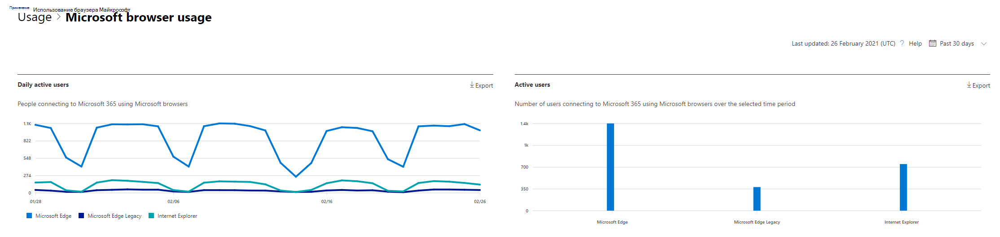

# Отчеты Microsoft 365 в центре администрирования — использование браузера Майкрософт

Панель мониторинга отчетов  Microsoft 365 показывает обзор действий в продуктах организации. Это позволяет подробно и подробно и подробно проиндексированно использовать отдельные отчеты о уровне продукта, чтобы получить более подробное представление о действиях каждого продукта. Ознакомьтесь со статьей [Обзор отчетов](activity-reports.md). В отчете об использовании браузера Майкрософт можно получить сведения об internet Explorer, Microsoft Edge Legacy и новом использовании Microsoft Edge. Отчеты об использовании основаны на веб-службах Microsoft 365, доступных через браузер Майкрософт.

 > [!NOTE]
 > Чтобы увидеть отчеты, необходимо быть глобальным администратором, глобальным читателем или читателем отчетов в Microsoft 365 или Exchange, SharePoint или Skype для бизнеса.

## Как добраться до отчета об использовании браузера Майкрософт

1. В центре администрирования перейдите в раздел **отчеты о** \> <a href="https://go.microsoft.com/fwlink/p/?linkid=2074756" target="_blank">использование</a> страницы. 
2. На домашней странице панели мониторинга нажмите кнопку **Просмотр** дополнительных данных на карточке использования браузера Майкрософт.

## Интерпретация отчета об использовании браузера Майкрософт

|Элемент|Описание|
 |:-----|:-----|
 |1.   |Отчет **об использовании** браузера Майкрософт можно просмотреть для тенденций за последние 7 дней, 30 дней, 90 дней или 180 дней.    |
 |2.   |Данные в каждом отчете обычно охватывают до последних семи дней.   |
 |3.   |На **ежедневной диаграмме** активных пользователей показано ежедневное количество пользователей для Microsoft Edge, Microsoft Edge Legacy и Internet Explorer при доступе к службам Microsoft 365.   |
 |4. |На **диаграмме** "Активные пользователи" показано общее число пользователей, использующих Microsoft Edge, Microsoft Edge Legacy и Internet Explorer для доступа к службам Microsoft 365 за выбранный период времени. |
 |5. |В таблице показана разбивка данных по пользователям. Вы можете добавить столбцы в таблицу или удалить их из нее.   **Имя пользователя —** это адрес электронной почты пользователя, подключенного к службам Microsoft 365 с помощью браузеров Майкрософт.  **Используется Microsoft Edge** показывает метку галочки, если пользователь использовал Microsoft Edge для подключения к службам Microsoft 365.  **Используется Microsoft Edge Legacy** показывает метку галочки, если пользователь использовал Microsoft Edge Legacy для подключения к службам Microsoft 365.  **Используется Internet Explorer** показывает метку галочки, если пользователь использовал Internet Explorer для подключения к службам Microsoft 365. |
 |6. |Выберите **значок Выберите столбцы** для добавления или удаления столбцов из отчета.|
 |7. |Вы также можете экспортировать данные отчета в файл Excel .csv, выбрав ссылку **Экспорт.** Это экспортирует данные для всех пользователей и позволяет делать простые агрегации, сортировки и фильтрации для дальнейшего анализа. Если у вас меньше 100 пользователей, вы можете сортировать и фильтровать в таблице в самом отчете. Если у вас более 100 пользователей, для фильтрации и сортировки необходимо экспортировать данные.|
