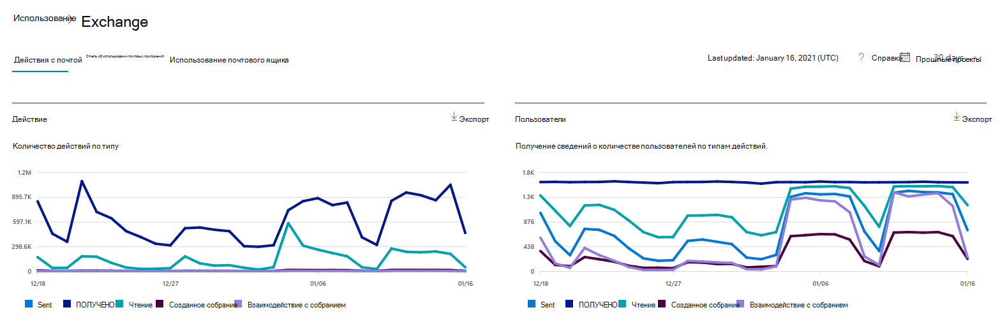

# Microsoft 365 Отчеты в центре администрирования — действия электронной почты

Панель Microsoft 365 **отчетов** показывает обзор действий в продуктах организации. Вы можете просмотреть отчеты по отдельным продуктам, чтобы получить более подробные сведения о действиях с каждым приложением. Ознакомьтесь со статьей [Обзор отчетов](activity-reports.md).
  
Например, вы можете просмотреть общие сведения о трафике электронной почты организации на странице "Отчеты", а затем перейти в мини-приложение "Действия с электронной почтой", чтобы изучить тенденции и данные о пользователях.
  
> [!NOTE]
> Чтобы увидеть отчеты, вы должны быть глобальным администратором, глобальным читателем или читателем отчетов в Microsoft 365 или Exchange, SharePoint, Teams Service, Teams Communications или Skype для бизнеса администратором. 

## Получение отчета об активности для электронной почты

1. В центре администрирования перейдите в раздел **отчеты о** \> <a href="https://go.microsoft.com/fwlink/p/?linkid=2074756" target="_blank">использование</a> страницы.
2. Выберите **Просмотр дополнительных в** рамках действия **электронной почты**. 
3. Из **выпадаемого списка** действий электронной почты выберите Exchange  \> **действий электронной почты.**
  
## Анализ отчета об активности для электронной почты

Чтобы получить представление о действиях пользователей с электронной почтой, взгляните на диаграммы **Активность** и **Пользователи**. 
  

  
|Item|Описание|
|:-----|:-----|
|1.    |В отчете **Действия с почтой** можно отследить тенденции за последние 7, 30, 90 и 180 дней. Однако если выбрать определенный день в отчете, в таблице (7) будут показываться данные на срок до 28 дней с текущей даты (а не даты, когда был создан отчет).    |
|2.    |Данные в каждом отчете обычно охватывают до последних 24-48 часов.    |
|3.    |На диаграмме **Активность** показана тенденция использования электронной почты в организации. Вы можете понять разделение действий, взаимодействующих между отправкой электронной почты, чтением электронной почты, полученной электронной почтой, созданными собраниями или собраниями.    |
|4.    |Диаграмма **Пользователи** показывает количество уникальных пользователей, которые работают с электронной почтой. Вы можете посмотреть тенденцию пользователей, которые выполняют отправку электронной почты, чтение электронной почты, получение электронной почты, создание собраний или взаимодействие с ними.    |
|5.    | На **диаграмме Действия** ось Y — это количество активности от отправленной электронной почты типа, полученной электронной почты, чтения электронной почты, созданных собраний и взаимодействия собраний.     На **диаграмме** действий пользователей ось Y — это выполняемая пользователем активность электронной почты типа, полученной электронной почты, чтения электронной почты, созданного собрания или встречи.     На оси X обеих диаграмм представлен диапазон дат, выбранный для отчета.    |
|6.    |Вы можете фильтровать серии, которые вы видите на диаграмме, выбрав элемент в легенде.    |
|7.    | В таблице показана разбивка действий с электронной почтой по пользователям. В ней указаны все пользователи, которым назначен продукт Exchange, и их действия с электронной почтой.     **Имя пользователя**: адрес электронной почты пользователя.    **Отображаемая** фамилия — полное имя пользователя.    Статус **Удаленный** означает, что пользователь сейчас удален, но был активен в течение какой-то части отчетного периода.    **Дата удаления** — это дата удаления пользователя.    **Дата последнего действия** — дата последнего чтения или отправки сообщения пользователем.    **Действия отправки** — количество зарегистрированных действий отправки электронной почты пользователем.    **Действия получения** — количество зарегистрированных действий получения электронной почты пользователем.    **Действия чтения** — количество зарегистрированных действий чтения электронной почты пользователем.    **Действия, созданные** на собрании, — это количество случаев, когда для пользователя было записано действие отправки запроса на собрание.    **Действия, взаимодействующие** с собранием, — это количество случаев, когда пользователь принимает, предварительно принимает, снижает или отменяет действие.    **Назначен продукт —** это продукты, которые назначены этому пользователю.     Если политики организации не позволяют просматривать отчеты, в которых есть личные сведения пользователей, можно изменить параметр конфиденциальности для всех отчетов. Ознакомьтесь с **разделом Как** скрыть сведения об уровне пользователя? в разделе Отчеты об активности в [центре администрирования Microsoft 365.](activity-reports.md)    |
|8.    |Выберите **выберите столбцы для** добавления или удаления столбцов из отчета.    |
|9.    |Вы также можете экспортировать данные отчета в Excel .csv файл, выбрав ссылку **Экспорт.** При этом данные всех пользователей будут экспортированы в формат, позволяющий сортировать и фильтровать их для дальнейшего анализа. Если у вас менее 2000 пользователей, вы можете сортировать и фильтровать значения в самой таблице отчета. Если пользователей больше 2000, для фильтрации и сортировки потребуется экспортировать данные.    |
|||
   
> [!NOTE]
> Отчет об активности электронной почты доступен только для почтовых ящиков, связанных с пользователями, у которых есть лицензии.
