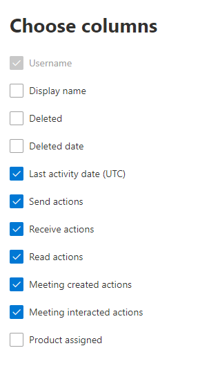

# Microsoft 365 Отчеты в центре администрирования — действия электронной почтыMicrosoft 365 Reports in the admin center - Email activity

Панель Microsoft 365 **отчетов** показывает обзор действий в продуктах организации.The Microsoft 365 **Reports** dashboard shows you the activity overview across the products in your organization. Вы можете просмотреть отчеты по отдельным продуктам, чтобы получить более подробные сведения о действиях с каждым приложением.It enables you to drill in to individual product level reports to give you more granular insight about the activities within each product. Ознакомьтесь со статьей [Обзор отчетов](activity-reports.md).Check out [the Reports overview topic](activity-reports.md).
  
Например, вы можете просмотреть общие сведения о трафике электронной почты организации на странице "Отчеты", а затем перейти в мини-приложение "Действия с электронной почтой", чтобы изучить тенденции и данные о пользователях.For example, you can get a high level view of email traffic within your organization from the Reports page, and then you can drill into the Email activity widget to understand the trends and per user level details of the email activity within your organization.
  
> [!NOTE]
> Чтобы увидеть отчеты, вы должны быть глобальным администратором, глобальным читателем или читателем отчетов в Microsoft 365 или Exchange, SharePoint, Teams Service, Teams Communications или Skype для бизнеса администратором.You must be a global administrator, global reader or reports reader in Microsoft 365 or an Exchange, SharePoint, Teams Service, Teams Communications, or Skype for Business administrator to see reports. 

## Получение отчета об активности для электронной почтыHow to get to the email activity report

1. В центре администрирования перейдите в раздел **отчеты о** \> <a href="https://go.microsoft.com/fwlink/p/?linkid=2074756" target="_blank">использование</a> страницы.In the admin center, go to the **Reports** \> <a href="https://go.microsoft.com/fwlink/p/?linkid=2074756" target="_blank">Usage</a> page.
2. Выберите **Просмотр дополнительных в** рамках действия **электронной почты**.Select **View More** under **Email activity**. 
3. Из **выпадаемого списка** действий электронной почты выберите Exchange  \> **действий электронной почты.**From the **Email activity** drop-down list, select **Exchange** \> **Email activity**.
  
## Анализ отчета об активности для электронной почтыInterpret the email activity report

Чтобы получить представление о действиях пользователей с электронной почтой, взгляните на диаграммы **Активность** и **Пользователи**.You can get a view into your user's email activity by looking at the **Activity** and **Users** charts. 
  

  
|ItemItem|ОписаниеDescription|
|:-----|:-----|
|1.1.    |В отчете **Действия с почтой** можно отследить тенденции за последние 7, 30, 90 и 180 дней.The **Email activity** report can be viewed for trends over the last 7 days, 30 days, 90 days, or 180 days. Однако если выбрать определенный день в отчете, в таблице (7) будут показываться данные на срок до 28 дней с текущей даты (а не даты, когда был создан отчет).However, if you select a particular day in the report, the table (7) will show data for up to 28 days from the current date (not the date the report was generated).    |
|2.2.    |Данные в каждом отчете обычно охватывают до последних 24-48 часов.The data in each report usually covers up to the last 24 to 48 hours.    |
|3.3.    |На диаграмме **Активность** показана тенденция использования электронной почты в организации.The **Activity** chart enables you to understand the trend of the amount of email activity going on in your organization. Вы можете понять разделение действий, взаимодействующих между отправкой электронной почты, чтением электронной почты, полученной электронной почтой, созданными собраниями или собраниями.You can understand the split of email send, email read, email received, meeting created, or meeting interacted activities.    |
|4.4.    |Диаграмма **Пользователи** показывает количество уникальных пользователей, которые работают с электронной почтой.The **User** chart enables you to understand the trend of the amount of unique users who are generating the email activities. Вы можете посмотреть тенденцию пользователей, которые выполняют отправку электронной почты, чтение электронной почты, получение электронной почты, создание собраний или взаимодействие с ними.You can look at the trend of users performing email sending, email reading, email receiving, meeting creating, or meeting interacting activities.    |
|5.5.    | На **диаграмме Действия** ось Y — это количество активности от отправленной электронной почты типа, полученной электронной почты, чтения электронной почты, созданных собраний и взаимодействия собраний.On the **Activity** chart, the Y axis is the count of activity of the type email sent, email received, email read, meeting created, and meeting interacted.     На **диаграмме** действий пользователей ось Y — это выполняемая пользователем активность электронной почты типа, полученной электронной почты, чтения электронной почты, созданного собрания или встречи.On the **Users** activity chart, the Y axis is the user's performing activity of the type email sent, email received, email read, meeting created, or meeting interacted.     На оси X обеих диаграмм представлен диапазон дат, выбранный для отчета.The X axis on both charts is the selected date range for this specific report.    |
|6.6.    |Вы можете фильтровать серии, которые вы видите на диаграмме, выбрав элемент в легенде.You can filter the series you see on the chart by selecting an item in the legend.    |
|7.7.    | В таблице показана разбивка действий с электронной почтой по пользователям.The table shows you a breakdown of the email activities at the per-user level. В ней указаны все пользователи, которым назначен продукт Exchange, и их действия с электронной почтой.This shows all users that have an Exchange product assigned to them and their email activities.     **Имя пользователя**: адрес электронной почты пользователя.**Username** is the email address of the user.    **Отображаемая** фамилия — полное имя пользователя.**Display name** is the full name if the user.    Статус **Удаленный** означает, что пользователь сейчас удален, но был активен в течение какой-то части отчетного периода.**Deleted** refers to the user whose current state is deleted, but was active during some part of the reporting period of the report.    **Дата удаления** — это дата удаления пользователя.**Deleted date** is the date the user was deleted.    **Дата последнего действия** — дата последнего чтения или отправки сообщения пользователем.**Last activity date** refers to the last time the user performed a read or send email activity.    **Действия отправки** — количество зарегистрированных действий отправки электронной почты пользователем.**Send actions** is the number of times an email send action was recorded for the user.    **Действия получения** — количество зарегистрированных действий получения электронной почты пользователем.**Receive actions** is the number of times an email received action was recorded for the user.    **Действия чтения** — количество зарегистрированных действий чтения электронной почты пользователем.**Read actions** is the number of times an email read action was recorded for the user.    **Действия, созданные** на собрании, — это количество случаев, когда для пользователя было записано действие отправки запроса на собрание.**Meeting created actions** is the number of times a meeting request send action was recorded for the user.    **Действия, взаимодействующие** с собранием, — это количество случаев, когда пользователь принимает, предварительно принимает, снижает или отменяет действие.**Meeting interacted actions** is the number of times a meeting request accept, tentative, decline, or cancel action was recorded for the user.    **Назначен продукт —** это продукты, которые назначены этому пользователю.**Product assigned** is the products that are assigned to this user.     Если политики организации не позволяют просматривать отчеты, в которых есть личные сведения пользователей, можно изменить параметр конфиденциальности для всех отчетов.If your organization's policies prevents you from viewing reports where user information is identifiable, you can change the privacy setting for all these reports. Ознакомьтесь с **разделом Как** скрыть сведения об уровне пользователя? в разделе Отчеты об активности в [центре администрирования Microsoft 365.](activity-reports.md)Check out the **How do I hide user level details?** section in the [Activity Reports in the Microsoft 365 admin center](activity-reports.md).    |
|8.8.    |Выберите **выберите столбцы для** добавления или удаления столбцов из отчета.Select **Choose columns** to add or remove columns from the report.    |
|9.9.    |Вы также можете экспортировать данные отчета в Excel .csv файл, выбрав ссылку **Экспорт.**You can also export the report data into an Excel .csv file, by selecting the **Export** link. При этом данные всех пользователей будут экспортированы в формат, позволяющий сортировать и фильтровать их для дальнейшего анализа.This exports data of all users and enables you to do simple sorting and filtering for further analysis. Если у вас менее 2000 пользователей, вы можете сортировать и фильтровать значения в самой таблице отчета.If you have less than 2000 users, you can sort and filter within the table in the report itself. Если пользователей больше 2000, для фильтрации и сортировки потребуется экспортировать данные.If you have more than 2000 users, in order to filter and sort, you will need to export the data.    |
|||
   
> [!NOTE]
> Отчет об активности электронной почты доступен только для почтовых ящиков, связанных с пользователями, у которых есть лицензии.The Email activity report is only available for mailboxes that are associated with users who have licenses.
