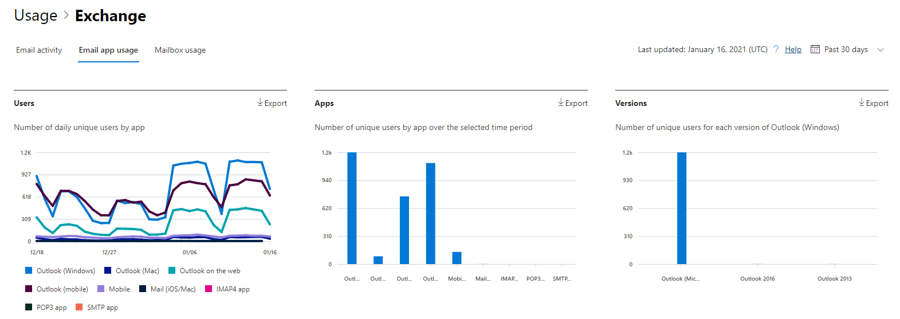

# Microsoft 365 Отчеты в центре администрирования — использование приложений электронной почты

Панель Microsoft 365 **отчетов** показывает обзор действий в продуктах организации. Вы можете просмотреть отчеты по отдельным продуктам, чтобы получить более подробные сведения о действиях с каждым приложением. Ознакомьтесь со статьей [Обзор отчетов](activity-reports.md). В отчете об использовании приложений электронной почты вы можете увидеть, сколько приложений электронной почты подключаются к Exchange Online. Вы также можете просмотреть сведения об используемых версиях приложений Outlook, чтобы найти сотрудников, которые используют неподдерживаемые версий.
  
> [!NOTE]
> Чтобы увидеть отчеты, вы должны быть глобальным администратором, глобальным читателем или читателем отчетов в Microsoft 365 или Exchange, SharePoint, Teams Service, Teams Communications или Skype для бизнеса администратором.  
 
## Как добраться до отчета о приложениях электронной почты

1. В центре администрирования перейдите в раздел **отчеты о** \> <a href="https://go.microsoft.com/fwlink/p/?linkid=2074756" target="_blank">использование</a> страницы.
2. Выберите **Просмотр дополнительных в** рамках действия **электронной почты**. 
3. Из **выпадаемого списка** активности электронной почты выберите Exchange использования приложений  \> **электронной почты.**
  
## Интерпретация отчета о приложениях электронной почты

Вы можете получить представление в действиях приложений электронной почты, просмотрев **диаграммы пользователей** **и клиентов.** 
  

  
|Item|Описание|
|:-----|:-----|
|1.    |Отчет **об использовании приложений** электронной почты можно просмотреть для тенденций за последние 7 дней, 30 дней, 90 дней или 180 дней. Однако если выбрать определенный день в отчете, в таблице (7) будут показываться данные на срок до 28 дней с текущей даты (а не даты, когда был создан отчет).    |
|2.    |Данные в каждом отчете обычно охватывают до последних 24-48 часов.    |
|3.    |В представлении **Пользователи** показано количество уникальных пользователей, которые подключались к Exchange Online с помощью любой почтовой программы.    |
|4.    |В представлении **Приложения** отображается количество уникальных пользователей по приложениям за выбранный период.    |
|5.    |В **представлении Versions** показано количество уникальных пользователей для каждой версии Outlook в Windows.    |
|6.    | На диаграмме **Пользователи** ось Y представляет общее количество уникальных пользователей, которые подключались к приложению в любой день отчетного периода.     Ось X на диаграмме **Пользователи** представляет число уникальных пользователей, которые использовали приложение в течение отчетного периода.     На диаграмме **Приложения** ось Y представляет общее количество уникальных пользователей, которые использовали определенное приложение в течение отчетного периода.     На оси X диаграммы **Приложения** представлен список приложений в организации.     На диаграмме **Версии** ось Y представляет общее количество уникальных пользователей определенной версии классического приложения Outlook. Если отчет не может разрешить номер версии Outlook, количество будет показываться как **Undetermined**.     На оси X диаграммы **Версии** представлен список приложений в организации.    |
|7.    |Вы можете фильтровать серии, которые вы видите на диаграмме, выбрав элемент в легенде.    |
|8.    | В столбцах могут быть не все указанные ниже элементы, если не добавить их.  **Имя пользователя —** это имя владельца приложения электронной почты.    **Последняя дата действия** — это последняя дата, когда пользователь прочитал или отправил сообщение электронной почты.    Примерами почтовых приложений являются **Почта Mac**, **Outlook для Mac**, **Outlook**, **Outlook Mobile** и **Outlook в Интернете**.     Если политики организации не позволяют просматривать отчеты, в которых есть личные сведения пользователей, можно изменить параметр конфиденциальности для всех отчетов. Ознакомьтесь с **разделом Как** скрыть сведения об уровне пользователя? в разделе Отчеты об активности в [центре администрирования Microsoft 365.](activity-reports.md)    |
|9.    |Выберите **выберите столбцы для** добавления или удаления столбцов из отчета.    |
|10.    |Вы также можете экспортировать данные отчета в Excel .csv файл, выбрав ссылку **Экспорт.** При этом данные всех пользователей будут экспортированы в формат, позволяющий сортировать и фильтровать их для дальнейшего анализа. Если у вас менее 2000 пользователей, вы можете сортировать и фильтровать значения в самой таблице отчета. Если пользователей больше 2000, для фильтрации и сортировки потребуется экспортировать данные.    |
|||
   
