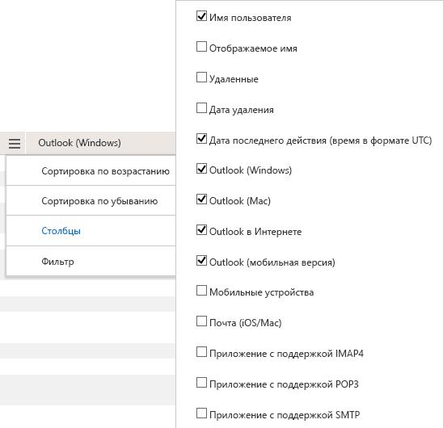

# Отчеты Microsoft 365 в центре администрирования — использование почтовых приложенийMicrosoft 365 Reports in the admin center - Email apps usage

На панели мониторинга **отчетов** Microsoft 365 вы увидите обзор действий по продуктам в вашей организации.The Microsoft 365 **Reports** dashboard shows you the activity overview across the products in your organization. Вы можете просмотреть отчеты по отдельным продуктам, чтобы получить более подробные сведения о действиях с каждым приложением.It enables you to drill in to individual product level reports to give you more granular insight about the activities within each product. Ознакомьтесь со статьей [Обзор отчетов](activity-reports.md).Check out [the Reports overview topic](activity-reports.md). В отчете об использовании почтовых приложений можно узнать, сколько почтовых приложений подключаются к Exchange Online.In the email apps usage report, you can see how many email apps are connecting to Exchange Online. Вы также можете просмотреть сведения об используемых версиях приложений Outlook, чтобы найти сотрудников, которые используют неподдерживаемые версий.You can also see the version information of Outlook apps that users are using, which will allow you to follow up with those who are using unsupported versions to install supported versions of Outlook.
  
> [!NOTE]
> Для просмотра отчетов необходимо быть глобальным администратором, глобальным читателям или читателями отчетов в Microsoft 365 или Exchange, SharePoint, Teams Service, Team Communications или Skype для бизнеса.You must be a global administrator, global reader or reports reader in Microsoft 365 or an Exchange, SharePoint, Teams Service, Teams Communications, or Skype for Business administrator to see reports.  
 
## Получение отчета о почтовых приложенияхHow to get to the email apps report

1. В центре администрирования перейдите в раздел **отчеты о** \> <a href="https://go.microsoft.com/fwlink/p/?linkid=2074756" target="_blank">использование</a> страницы.In the admin center, go to the **Reports** \> <a href="https://go.microsoft.com/fwlink/p/?linkid=2074756" target="_blank">Usage</a> page.

    
2. В раскрывающемся списке **выберите отчет** выберите **Exchange** \> **использование почтовых приложений**Exchange.From the **Select a report** drop-down, select **Exchange** \> **Email app usage**.
  
## Интерпретация отчета о почтовых приложенияхInterpret the email apps report

Вы можете получить представление об активности почтовых приложений, изучив диаграммы **пользователей** и **клиентов** .You can get a view into email apps activity by looking at the **Users** and **Clients** charts. 
  

  
|ItemItem|ОписаниеDescription|
|:-----|:-----|
|1.1.    |Отчет **об использовании почтовых приложений** можно просмотреть для тенденций за последние 7, 30, 90 дней или 180 дней.The **Email apps usage** report can be viewed for trends over the last 7 days, 30 days, 90 days, or 180 days. Тем не менее, если выбрать определенный день в отчете, в таблице (7) будут отображаться данные в течение 28 дней с текущей даты (не Дата создания отчета).However, if you select a particular day in the report, the table (7) will show data for up to 28 days from the current date (not the date the report was generated).    |
|2.2.    |Данные в каждом отчете обычно закрываются в течение последних 24 – 48 часов.The data in each report usually covers up to the last 24 to 48 hours.    |
|3.3.    |В представлении **Пользователи** показано количество уникальных пользователей, которые подключались к Exchange Online с помощью любой почтовой программы.The **Users** view shows you the number of unique users that connected to Exchange Online using any email app.    |
|4.4.    |В представлении **Приложения** отображается количество уникальных пользователей по приложениям за выбранный период.The **Apps** view shows you the number of unique users by app over the selected time period.    |
|5.5.    |В представлении **версии** отображается количество уникальных пользователей для каждой версии Outlook в Windows.The **Versions** view shows you the number of unique users for each version of Outlook in Windows.    |
|6.6.    | На диаграмме **Пользователи** ось Y представляет общее количество уникальных пользователей, которые подключались к приложению в любой день отчетного периода.On the **Users** chart, the Y axis is the total count of unique users that connected to an app on any day of the reporting period.     Ось X на диаграмме **Пользователи** представляет число уникальных пользователей, которые использовали приложение в течение отчетного периода.On the **Users** chart, the X axis is number of unique users that used the app for that reporting period.     На диаграмме **Приложения** ось Y представляет общее количество уникальных пользователей, которые использовали определенное приложение в течение отчетного периода.On the **Apps** chart, the Y axis is the total count of unique users who used a specific app during the reporting period.     На оси X диаграммы **Приложения** представлен список приложений в организации.On the **Apps** chart, the X axis is the list of apps in your organization.     На диаграмме **Версии** ось Y представляет общее количество уникальных пользователей определенной версии классического приложения Outlook.On the **Versions** chart, the Y axis is the total count of unique users using a specific version of Outlook desktop. Если отчет не может разрешить номер версии Outlook, то количество будет отображаться как **неопределенное**.If the report can't resolve the version number of Outlook, the quantity will show as **Undetermined**.     На оси X диаграммы **Версии** представлен список приложений в организации.On the **Versions** chart, the X axis is the list of apps in your organization.    |
|7.7.    |Вы можете отфильтровать ряды, которые вы видите на диаграмме, выбрав элемент в условных обозначениях.You can filter the series you see on the chart by selecting an item in the legend. Например, на диаграмме **Пользователи** выберите **Mac-почта** или список **Outlook** Select the email client to get more reporting data on that client.](../../media/19b9da1b-7b69-4a04-8527-38349f859e84.png) для просмотра только сведений, относящихся к этой категории.to see only the info related to each one. При выборе другого значения данные в таблице-сетке не меняются.Changing this selection doesn't change the info in the grid table. Примерами почтовых приложений являются Почта Mac, Outlook для Mac, Outlook Mobile, классическая версия Outlook и Outlook в Интернете.Mac mail, Outlook for Mac, Outlook mobile, Outlook desktop, and Outlook on the web are examples of email apps you may have in your organization.    |
|8.8.    | В столбцах могут быть не все указанные ниже элементы, если не добавить их.You might not see all the items in the list below in the columns until you add them.  **Username** имя владельца почтового приложения.**Username** is the name of the email app's owner.    **Дата последнего действия** — это самая поздняя дата, когда пользователь прочитает или отправил сообщение электронной почты.**Last activity date** is the latest date the user read or sent an email message.    Примерами почтовых приложений являются **Почта Mac**, **Outlook для Mac**, **Outlook**, **Outlook Mobile** и **Outlook в Интернете**.**Mac mail**, **Mac Outlook** and **Outlook**, **Outlook mobile** and **Outlook on the web** are examples of email apps you may have in your organization.     Если политики организации не позволяют просматривать отчеты, в которых есть личные сведения пользователей, можно изменить параметр конфиденциальности для всех отчетов.If your organization's policies prevents you from viewing reports where user information is identifiable, you can change the privacy setting for all these reports. Ознакомьтесь с разделом " **как скрыть сведения о уровне пользователя?** " в [отчетах об активности в центре администрирования Microsoft 365](activity-reports.md).Check out the **How do I hide user level details?** section in the [Activity Reports in the Microsoft 365 admin center](activity-reports.md).    |
|9.9.    |Выберите **Управление столбцами** , чтобы добавить столбцы в отчет или удалить их из него.Select **Manage columns** to add or remove columns from the report.    |
|десяти.10.    |Вы также можете экспортировать данные отчета в CSV-файл Excel, выбрав ссылку **Экспорт** .You can also export the report data into an Excel .csv file, by selecting the **Export** link. При этом данные всех пользователей будут экспортированы в формат, позволяющий сортировать и фильтровать их для дальнейшего анализа.This exports data of all users and enables you to do simple sorting and filtering for further analysis. Если у вас менее 2000 пользователей, вы можете сортировать и фильтровать значения в самой таблице отчета.If you have less than 2000 users, you can sort and filter within the table in the report itself. Если пользователей больше 2000, для фильтрации и сортировки потребуется экспортировать данные.If you have more than 2000 users, in order to filter and sort, you will need to export the data.    |
|||
   
