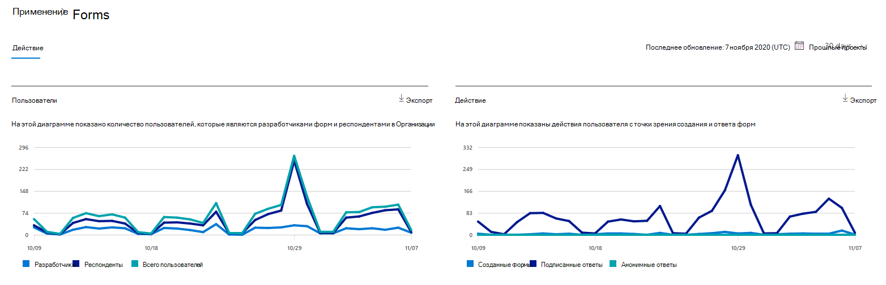
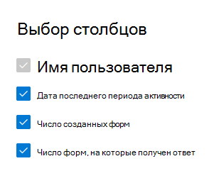

# Microsoft 365 Отчеты в центре администрирования — действия формMicrosoft 365 Reports in the admin center - Forms activity

Панель Microsoft 365 **отчетов** показывает обзор действий в продуктах организации.The Microsoft 365 **Reports** dashboard shows you the activity overview across the products in your organization. Вы можете просмотреть отчеты по отдельным продуктам, чтобы получить более подробные сведения о действиях с каждым приложением.It lets you drill in to individual product level reports to give you more granular insight about the activities within each product. Ознакомьтесь со статьей [Обзор отчетов](activity-reports.md).Check out [the Reports overview topic](activity-reports.md).
  
Например, вы можете понять активность каждого пользователя, лицензированного на использование Microsoft Forms, посмотрев их взаимодействие с формами.For example, you can understand the activity of every user licensed to use Microsoft Forms by looking at their interaction with forms. Это также помогает понять уровень совместной работы, если посмотреть на количество созданных форм и форм, на которые откликнулся пользователь.It also helps you to understand the level of collaboration going on by looking at the number of forms created and forms the user responded to.
  
> [!NOTE]
> Чтобы увидеть отчеты, вы должны быть глобальным администратором, глобальным читателем или читателем отчетов в Microsoft 365 или Exchange, SharePoint, Teams Service, Teams Communications или Skype для бизнеса администратором.You must be a global administrator, global reader or reports reader in Microsoft 365 or an Exchange, SharePoint, Teams Service, Teams Communications, or Skype for Business administrator to see reports.  
 
## Как добраться до отчета о действиях FormsHow to get to the Forms activity report

1. В центре администрирования перейдите в раздел **отчеты о** \> <a href="https://go.microsoft.com/fwlink/p/?linkid=2074756" target="_blank">использование</a> страницы.In the admin center, go to the **Reports** \> <a href="https://go.microsoft.com/fwlink/p/?linkid=2074756" target="_blank">Usage</a> page. 
2. На домашней странице панели мониторинга нажмите кнопку **Просмотр дополнительных** на карте Forms.From the dashboard homepage, click on the **View more** button on the Forms card.
  
## Интерпретация отчета о деятельности FormsInterpret the Forms activity report

Действия в отчете Forms можно просмотреть, выбрав вкладку **Activity.**You can view the activities in the Forms report by choosing the **Activity** tab. 

Выберите **выберите столбцы для** добавления или удаления столбцов из отчета.Select **Choose columns** to add or remove columns from the report.    

Вы также можете экспортировать данные отчета в Excel .csv, выбрав ссылку **Экспорт.**You can also export the report data into an Excel .csv file by selecting the **Export** link. При этом данные всех пользователей будут экспортированы в формат, позволяющий сортировать и фильтровать их для дальнейшего анализа.This exports data of all users and enables you to do simple sorting and filtering for further analysis. Если у вас менее 2000 пользователей, вы можете сортировать и фильтровать значения в самой таблице отчета.If you have less than 2000 users, you can sort and filter within the table in the report itself. Если пользователей больше 2000, для фильтрации и сортировки потребуется экспортировать данные.If you have more than 2000 users, in order to filter and sort, you will need to export the data. 
  
|ItemItem|ОписаниеDescription|
|:-----|:-----|
|**Метрика****Metric**|**Определение****Definition**|
|UsernameUsername    |Адрес электронной почты пользователя, который выполнял действия в Microsoft Forms.The email address of the user who performed the activity on Microsoft Forms.    |
|Последняя дата действия (UTC)Last activity date (UTC)    |Последняя дата выполнения пользователем действия формы для выбранного диапазона дат.The latest date a form activity was performed by the user for the selected date range. Для просмотра действий, которые произошли в определенный день, выберите эту дату непосредственно на диаграмме.To see activity that occurred on a specific date, select the date directly in the chart.  Это позволит отфильтровать таблицу для отображения данных активности файлов только для пользователей, которые выполняли действие в этот конкретный день.This will filter the table to display file activity data only for users who performed the activity on that specific day.    |
|Количество созданных формNumber of forms created    |Количество форм, созданных пользователем.The number of forms that the user created.     |
|Количество ответивных формNumber of forms responded    |Количество форм, на которые пользователь представил ответы.The number of forms that the user has submitted responses to.|
|||
