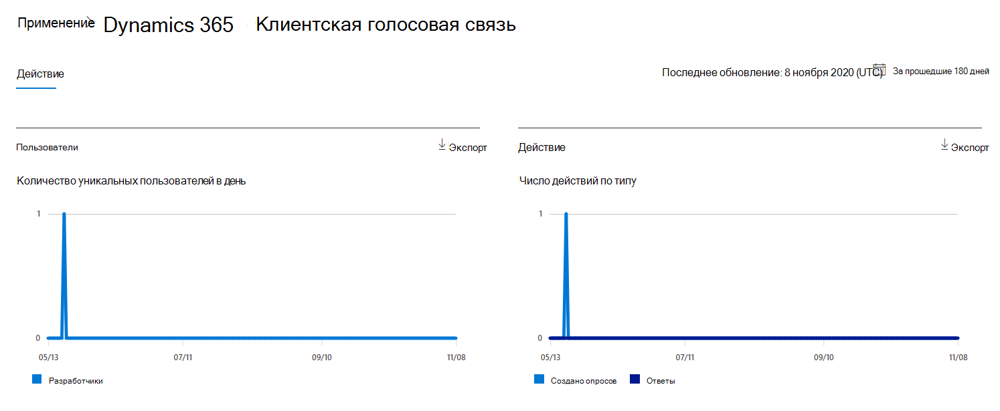
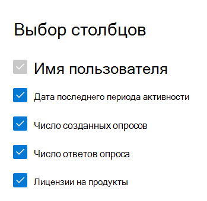

# Отчеты Microsoft 365 в Центре администрирования — действия с голосовой почтой клиентов Dynamics 365Microsoft 365 Reports in the admin center - Dynamics 365 Customer Voice activity

На информационной панели  "Отчеты Microsoft 365" представлен обзор действий в продуктах организации.The Microsoft 365 **Reports** dashboard shows you the activity overview across the products in your organization. Вы можете просмотреть отчеты по отдельным продуктам, чтобы получить более подробные сведения о действиях с каждым приложением.It lets you drill in to individual product level reports to give you more granular insight about the activities within each product. Ознакомьтесь со статьей [Обзор отчетов](activity-reports.md).Check out [the Reports overview topic](activity-reports.md).
  
Например, вы можете понять действия каждого пользователя, у кого есть лицензия на использование голосовой связи клиента Microsoft Dynamics 365, изумив их взаимодействие с голосовой службой клиента Dynamics 365.For example, you can understand the activity of every user licensed to use Microsoft Dynamics 365 Customer Voice by looking at their interactions with Dynamics 365 Customer Voice. Кроме того, это помогает понять уровень совместной работы, изумив количество созданных опросов Pro и опросов Pro, на которые ответили пользователи.It also helps you to understand the level of collaboration going on by looking at the number of Pro Surveys created and Pro Surveys to which the users responded to. 
  
> [!NOTE]
> Чтобы увидеть отчеты, вы должны быть глобальным администратором, глобальным читателем или читателем отчетов в Microsoft 365 или Exchange, SharePoint, службе Teams, коммуникациях Teams или администраторе Skype для бизнеса.You must be a global administrator, global reader or reports reader in Microsoft 365 or an Exchange, SharePoint, Teams Service, Teams Communications, or Skype for Business administrator to see reports.  
 
## Как получить отчет об активности голосовой почты клиентов Dynamics 365How to get to the Dynamics 365 Customer Voice activity report

1. В центре администрирования перейдите в раздел **отчеты о** \> <a href="https://go.microsoft.com/fwlink/p/?linkid=2074756" target="_blank">использование</a> страницы.In the admin center, go to the **Reports** \> <a href="https://go.microsoft.com/fwlink/p/?linkid=2074756" target="_blank">Usage</a> page. 
2. На домашней странице панели мониторинга  нажмите кнопку "Подробнее" на карточке голосовой связи клиента Dynamics 365.From the dashboard homepage, click on the **View more** button on the Dynamics 365 Customer Voice card.
  
## Интерпретация отчета об активности голосовой почты клиента Dynamics 365Interpret the Dynamics 365 Customer Voice activity report

Вы можете просмотреть действия в отчете о голосовой связи клиента Dynamics 365, выбрав вкладку **"Действия".**You can view the activities in the Dynamics 365 Customer Voice report by choosing the **Activity** tab. 

Выберите **"Выбрать столбцы",** чтобы добавить или удалить столбцы из отчета.Select **Choose columns** to add or remove columns from the report.    

Вы также можете экспортировать данные отчета в CSV-файл Excel, выбрав ссылку **"Экспорт".**You can also export the report data into an Excel .csv file by selecting the **Export** link. При этом данные всех пользователей будут экспортированы в формат, позволяющий сортировать и фильтровать их для дальнейшего анализа.This exports data of all users and enables you to do simple sorting and filtering for further analysis. Если у вас менее 2000 пользователей, вы можете сортировать и фильтровать значения в самой таблице отчета.If you have less than 2000 users, you can sort and filter within the table in the report itself. Если пользователей больше 2000, для фильтрации и сортировки потребуется экспортировать данные.If you have more than 2000 users, in order to filter and sort, you will need to export the data. 
  
|ЭлементItem|ОписаниеDescription|
|:-----|:-----|
|**Метрика****Metric**|**Определение****Definition**|
|Имя пользователяUsername    |Адрес электронной почты пользователя, выполнившего действие в Microsoft Forms.The email address of the user who performed the activity on Microsoft Forms.    |
|Дата последнего действия (UTC)Last activity date (UTC)    |Последняя дата выполнения пользователем действия формы для выбранного диапазона дат.The latest date a form activity was performed by the user for the selected date range. Для просмотра действий, которые произошли в определенный день, выберите эту дату непосредственно на диаграмме.To see activity that occurred on a specific date, select the date directly in the chart. Это позволит отфильтровать таблицу для отображения данных о действиях с файлами только для пользователей, выполнивших действие в этот день.This will filter the table to display file activity data only for users who performed the activity on that specific day.    |
|Количество созданных опросовNumber of surveys created    |Количество опросов, созданных пользователем.The number of surveys that the user created.     |
|Количество ответов на опросNumber of survey responses    |Количество ответов от ответчиков, которым был распространен опрос.The number of responses from responders to whom the survey was distributed to.|
|||