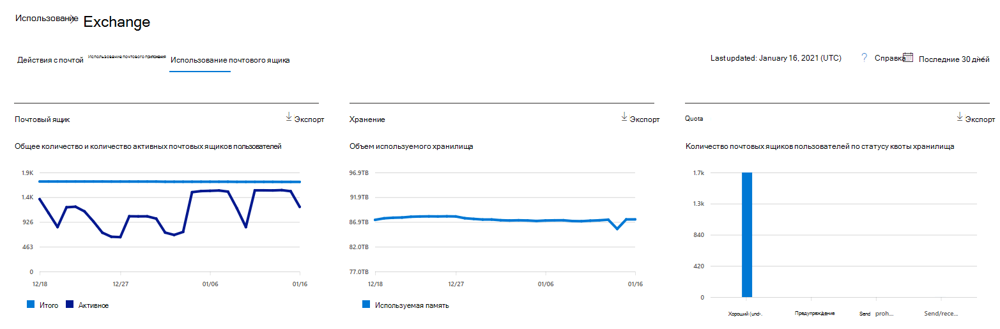
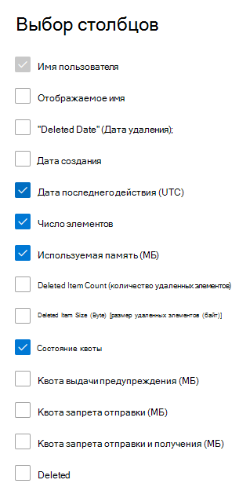

# Отчеты Microsoft 365 в центре администрирования — использование почтовых ящиков

Отчет  об использовании почтовых ящиков предоставляет сведения о пользователях с почтовым ящиком пользователя и уровне активности каждого из них в зависимости от отправки, чтения, создания встречи, отправки собрания, приема собраний, отклонив собрание и отменив действия собрания. В нем также представлены сведения о том, какой объем хранилища используется для почтового ящика каждого пользователя и сколько из них приближаются к квотам. 
  
> [!NOTE]
> Чтобы увидеть отчеты, необходимо быть глобальным администратором, глобальным читателем или читателем отчетов в Microsoft 365 или Exchange, SharePoint, Teams Service, Teams Communications или Skype для бизнеса. 
 
## Просмотр отчета об использовании почтового ящика

1. В центре администрирования перейдите в раздел **отчеты о** \> <a href="https://go.microsoft.com/fwlink/p/?linkid=2074756" target="_blank">использование</a> страницы.
2. Выберите **Просмотр дополнительных в** рамках действия **электронной почты**. 
3. Из **выпадаемого списка действий** электронной почты выберите **использование** \> **почтовых ящиков** Exchange.

## Анализ отчета об использовании почтового ящика

Чтобы изучить **использование почтовых ящиков** в организации, просмотрите диаграммы **Почтовый ящик**, **Хранилище** и **Квота**. 
  

|Item|Описание|
|:-----|:-----|
|1.    |В отчете **Использование почтового ящика** можно отследить тенденции за последние 7, 30, 90 и 180 дней. Однако если выбрать определенный день в отчете, в таблице будут показываться данные на срок до 28 дней с текущей даты (а не даты, когда был создан отчет).    |
|2.    |Данные в каждом отчете обычно охватывают до последних 24-48 часов.    |
|3.    |На диаграмме "Почтовый ящик" показано общее количество почтовых ящиков пользователей в организации, а также число активных почтовых ящиков в каждый день отчетного периода. Почтовый ящик пользователя считается активным, если у него было сообщение электронной почты, отправление, чтение, создание встречи, отправка собрания, принятие собрания, отклонение собрания и отмена действий собрания.    |
|4.    |На диаграмме **Хранилище** показан объем хранилища, используемый в вашей организации. Диаграмма хранения не включает архивные почтовые ящики. Дополнительные сведения о автоматическом расширении архива см. в обзоре неограниченного архива в [Microsoft 365.](../../compliance/unlimited-archiving.md)  |
|5.    | Диаграмма **Квота** показывает количество почтовых ящиков пользователей для каждой категории квоты. Существует четыре категории:     "Хорошо" — количество пользователей, для хранилища которых не превышена квота предупреждения.     "Предупреждение" — количество пользователей, для хранилища которых превышена квота предупреждения, но не квота запрета отправки.     "Невозможно отправлять" — количество пользователей, для хранилища которых превышена квота запрета отправки, но не квота запрета отправки и получения.     "Невозможно отправлять и получать" — количество пользователей, для хранилища которых превышена квота запрета отправки и получения.    |
|6.    | На диаграмме **Почтовый ящик** ось Y представляет собой количество почтовых ящиков пользователей.     На оси Y диаграммы **Хранилище** показан объем хранилища, занятый почтовыми ящиками пользователей в организации.     На диаграмме **Квота** ось Y представляет собой количество почтовых ящиков пользователей для каждой квоты хранилища.     На оси X диаграмм "Почтовый ящик" и "Хранилище" представлен диапазон дат, выбранный для отчета.     Ось X диаграммы "Квота" отражает категорию квоты.    |
|7.    |Вы можете фильтровать диаграммы, которые вы видите, выбрав элемент в легенде.    |
|8.    | В таблице показана разбивка использования почтовых ящиков по пользователям. Вы можете добавить в нее дополнительные столбцы.    **Имя пользователя** — это адрес электронной почты пользователя.    **Отображаемое имя** —это полное имя пользователя.    Статус **Удаленный** означает, что почтовый ящик сейчас удален, но был активен в течение какой-то части отчетного периода.    **Дата удаления** — это дата удаления почтового ящика.    **Дата создания** — это дата создания почтового ящика.    **Дата последнего действия** — это дата отправки или прочтения сообщения в почтовом ящике.    **Количество элементов** — это общее число элементов в почтовом ящике.    **Используемое хранилище (МБ)** —объем занятого хранилища.    **Количество удаленных элементов** относится к общему числу удаленных элементов в почтовом ящике.   **Удаленный размер элемента (MB)** относится к общему размеру всех удаленных элементов в почтовом ящике.   **Квота предупреждения (МБ)** — ограничение, при котором владелец почтового ящика будет получать предупреждение о том, что квота хранилища скоро будет превышена.    **Квота запрета отправки (МБ)** — ограничение, при котором почтовый ящик больше не может отправлять сообщения.    **Квота запрета отправки и получения (МБ)** — ограничение, при котором почтовый ящик больше не может отправлять и получать сообщения.     Если политики организации не позволяют просматривать отчеты, в которых есть личные сведения пользователей, можно изменить параметр конфиденциальности для всех отчетов. Ознакомьтесь с сведениями о **пользователе Hide** в разделе Отчеты о деятельности в центре администрирования [Microsoft 365.](activity-reports.md)    |
|9.    |Выберите **выберите столбцы для** добавления или удаления столбцов из отчета.    |
|10.    |Вы также можете экспортировать данные отчета в файл Excel .csv, выбрав ссылку **Экспорт.**    |
|||
