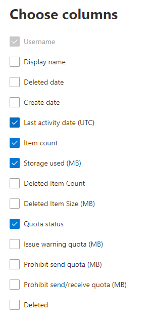

# Microsoft 365 Отчеты в центре администрирования — использование почтовых ящиковMicrosoft 365 Reports in the admin center - Mailbox usage

Отчет  об использовании почтовых ящиков предоставляет сведения о пользователях с почтовым ящиком пользователя и уровне активности каждого из них в зависимости от отправки, чтения, создания встречи, отправки собрания, приема собраний, отклонив собрание и отменив действия собрания.The **Mailbox usage report** provides information about users with a user mailbox and the level of activity by each based on the email send, read, create appointment, send meeting, accept meeting, decline meeting and cancel meeting activity. В нем также представлены сведения о том, какой объем хранилища используется для почтового ящика каждого пользователя и сколько из них приближаются к квотам.It also provides information about how much storage has been consumed by each user mailbox, and how many of them are approaching storage quotas. 
  
> [!NOTE]
> Чтобы увидеть отчеты, вы должны быть глобальным администратором, глобальным читателем или читателем отчетов в Microsoft 365 или Exchange, SharePoint, Teams Service, Teams Communications или Skype для бизнеса администратором.You must be a global administrator, global reader or reports reader in Microsoft 365 or an Exchange, SharePoint, Teams Service, Teams Communications, or Skype for Business administrator to see reports. 
 
## Просмотр отчета об использовании почтового ящикаHow to get to the mailbox usage report

1. В центре администрирования перейдите в раздел **отчеты о** \> <a href="https://go.microsoft.com/fwlink/p/?linkid=2074756" target="_blank">использование</a> страницы.In the admin center, go to the **Reports** \> <a href="https://go.microsoft.com/fwlink/p/?linkid=2074756" target="_blank">Usage</a> page.
2. Выберите **Просмотр дополнительных в** рамках действия **электронной почты**.Select **View More** under **Email activity**. 
3. Из списка **выпаданий** активности  электронной почты выберите Exchange \> **использования почтовых ящиков.**From the **Email activity** drop-down list, select **Exchange** \> **Mailbox usage**.

## Анализ отчета об использовании почтового ящикаInterpret the mailbox usage report

Чтобы изучить **использование почтовых ящиков** в организации, просмотрите диаграммы **Почтовый ящик**, **Хранилище** и **Квота**.You can get a view into your organization's **Mailbox usage** by looking at the **Mailbox**, **Storage** and **Quota** charts. 
  

|ItemItem|ОписаниеDescription|
|:-----|:-----|
|1.1.    |В отчете **Использование почтового ящика** можно отследить тенденции за последние 7, 30, 90 и 180 дней.The **Mailbox usage** report can be viewed for trends over the last 7 days, 30 days, 90 days, or 180 days. Однако если выбрать определенный день в отчете, в таблице будут показываться данные на срок до 28 дней с текущей даты (а не даты, когда был создан отчет).However, if you select a particular day in the report, the table will show data for up to 28 days from the current date (not the date the report was generated).    |
|2.2.    |Данные в каждом отчете обычно охватывают до последних 24-48 часов.The data in each report usually covers up to the last 24 to 48 hours.    |
|3.3.    |На диаграмме "Почтовый ящик" показано общее количество почтовых ящиков пользователей в организации, а также число активных почтовых ящиков в каждый день отчетного периода.The Mailbox chart shows you the total number of user mailbox in your organization, and the total number that are active on any given day of the reporting period. Почтовый ящик пользователя считается активным, если у него было сообщение электронной почты, отправление, чтение, создание встречи, отправка собрания, принятие собрания, отклонение собрания и отмена действий собрания.A user mailbox is considered active if it had an email send, read, create appointment, send meeting, accept meeting, decline meeting and cancel meeting activity.    |
|4.4.    |На диаграмме **Хранилище** показан объем хранилища, используемый в вашей организации.The **Storage** chart shows you amount of storage used in your organization. служба хранилища Диаграмма не включает архивные почтовые ящики.Storage Chart doesn't include archive mailboxes. Дополнительные сведения о автоматическом расширении архива см. в обзоре неограниченного архива [в Microsoft 365.](../../compliance/unlimited-archiving.md)For more information about auto-expanding archiving, see [Overview of unlimited archiving in Microsoft 365](../../compliance/unlimited-archiving.md).  |
|5.5.    | Диаграмма **Квота** показывает количество почтовых ящиков пользователей для каждой категории квоты. Существует четыре категории:  The **Quota** chart shows you the number of user mailboxes in each quota category. There are four quota categories:     "Хорошо" — количество пользователей, для хранилища которых не превышена квота предупреждения.Good - number of users whose storage used is below the issue warning quota.     "Предупреждение" — количество пользователей, для хранилища которых превышена квота предупреждения, но не квота запрета отправки.Warning - number of users whose storage used is at or above issue warning, but below prohibit send quota     "Невозможно отправлять" — количество пользователей, для хранилища которых превышена квота запрета отправки, но не квота запрета отправки и получения.Can't send - number of users whose storage used is at or above the prohibit send quota, but below prohibit send/receive quota     "Невозможно отправлять и получать" — количество пользователей, для хранилища которых превышена квота запрета отправки и получения.Can't send/receive - number of users whose storage used is at or above prohibit send/receive quota    |
|6.6.    | На диаграмме **Почтовый ящик** ось Y представляет собой количество почтовых ящиков пользователей.On the **Mailbox** chart, the Y axis is the count of user mailboxes.     На оси Y диаграммы **Хранилище** показан объем хранилища, занятый почтовыми ящиками пользователей в организации.On the **Storage** chart, the Y axis is the amount of storage being used by user mailboxes in your organization.     На диаграмме **Квота** ось Y представляет собой количество почтовых ящиков пользователей для каждой квоты хранилища.On the **Quota** chart, the Y axis is the number of user mailboxes in each storage quota.     На оси X диаграмм "Почтовый ящик" и "Хранилище" представлен диапазон дат, выбранный для отчета.The X axis on the Mailbox and Storage charts is the selected date range for this specific report.     Ось X диаграммы "Квота" отражает категорию квоты.The X axis on the Quota charts is the quota category.    |
|7.7.    |Вы можете фильтровать диаграммы, которые вы видите, выбрав элемент в легенде.You can filter charts you see by selecting an item in the legend.    |
|8.8.    | В таблице показана разбивка использования почтовых ящиков по пользователям. Вы можете добавить в нее дополнительные столбцы.  The table shows you a breakdown of mailbox usage at the per-user level. You can add additional columns to the table.    **Имя пользователя** — это адрес электронной почты пользователя.**User name** is the email address of the user.    **Отображаемое имя** —это полное имя пользователя.**Display Name** is the full name if the user.    Статус **Удаленный** означает, что почтовый ящик сейчас удален, но был активен в течение какой-то части отчетного периода.**Deleted** refers to the mailbox whose current state is deleted, but was active during some part of the reporting period of the report.    **Дата удаления** — это дата удаления почтового ящика.**Deleted date** is the date the mailbox was deleted.    **Дата создания** — это дата создания почтового ящика.**Create date** is the date the mailbox was created.    **Дата последнего действия** — это дата отправки или прочтения сообщения в почтовом ящике.**Last activity date** refers to the date the mailbox had an email send or read activity.    **Количество элементов** — это общее число элементов в почтовом ящике.**Item count** refers to the total number of items in the mailbox.    **Используемое хранилище (МБ)** —объем занятого хранилища.**Storage used (MB)** refers to the total storage used.    **Количество удаленных элементов** относится к общему числу удаленных элементов в почтовом ящике.**Deleted Item Count** refers to the total number of deleted items in the mailbox.   **Удаленный размер элемента (MB)** относится к общему размеру всех удаленных элементов в почтовом ящике.**Deleted Item Size (MB)** refers to the total size of all deleted items in the mailbox.   **Квота предупреждения (МБ)** — ограничение, при котором владелец почтового ящика будет получать предупреждение о том, что квота хранилища скоро будет превышена.**Issue warning quota (MB)** refers to the storage limit when the mailbox owner will receive a warning that it's about to hit the storage quota.    **Квота запрета отправки (МБ)** — ограничение, при котором почтовый ящик больше не может отправлять сообщения.**Prohibit send quota (MB)** refers to the storage limit when the mailbox can no longer send emails.    **Квота запрета отправки и получения (МБ)** — ограничение, при котором почтовый ящик больше не может отправлять и получать сообщения.**Prohibit send receive quota (MB)** refers to the storage limit when the mailbox can no longer send or receive emails.     Если политики организации не позволяют просматривать отчеты, в которых есть личные сведения пользователей, можно изменить параметр конфиденциальности для всех отчетов.If your organization's policies prevents you from viewing reports where user information is identifiable, you can change the privacy setting for all these reports. Ознакомьтесь с сведениями о пользователе Hide в разделе **Отчеты** о деятельности в [центре администрирования Microsoft 365.](activity-reports.md)Check out the **Hide user details in the reports** section in the [Activity Reports in the Microsoft 365 admin center](activity-reports.md).    |
|9.9.    |Выберите **выберите столбцы для** добавления или удаления столбцов из отчета.Select **Choose columns** to add or remove columns from the report.    |
|10.10.    |Вы также можете экспортировать данные отчета в Excel .csv файл, выбрав ссылку **Экспорт.**You can also export the report data into an Excel .csv file, by selecting the **Export** link.    |
|||
