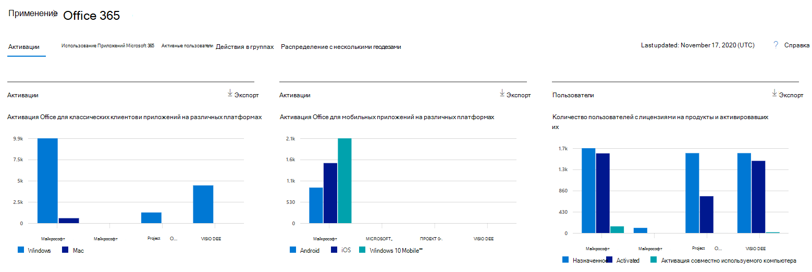
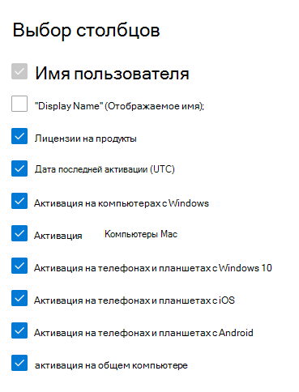

# Microsoft 365 Отчеты в центре администрирования — Microsoft Office активации

Панель Microsoft 365 **отчетов** показывает обзор действий в продуктах организации. Вы можете просмотреть отчеты по отдельным продуктам, чтобы получить более подробные сведения о действиях с каждым приложением. Ознакомьтесь с [общими сведениями о панели отчетов](activity-reports.md).
  
Отчет об активации Office дает представление о том, кто из пользователей активировал подписку Office по крайней мере на одном устройстве. Он обеспечивает разбивку активаций Приложения Microsoft 365 для предприятий, Project и Visio Pro для Office 365, а также разбивку активаций на настольных компьютерах и устройствах. Этот отчет помогает определить пользователей, которым может понадобиться дополнительная помощь по активации подписки на Office.
  
> [!NOTE]
> Чтобы увидеть отчеты, вы должны быть глобальным администратором, глобальным читателем или читателем отчетов в Microsoft 365 или Exchange, SharePoint, Teams Service, Teams Communications или Skype для бизнеса администратором.  
  
## Открытие отчета по активации Office

1. В центре администрирования перейдите в раздел **отчеты о** \> <a href="https://go.microsoft.com/fwlink/p/?linkid=2074756" target="_blank">использование</a> страницы. 
2. На домашней странице панели мониторинга нажмите кнопку **Просмотр** дополнительных на Office активаций.
  
## Анализ отчета по активации Office
  
Вы можете просмотреть активации в отчете Office 365, выбрав вкладку **Активации.** 

Выберите **выберите столбцы для** добавления или удаления столбцов из отчета.    

Вы также можете экспортировать данные отчета в Excel .csv, выбрав ссылку **Экспорт.** При этом данные всех пользователей будут экспортированы в формат, позволяющий сортировать и фильтровать их для дальнейшего анализа. Если у вас менее 2000 пользователей, вы можете сортировать и фильтровать значения в самой таблице отчета. Если пользователей больше 2000, для фильтрации и сортировки потребуется экспортировать данные. 

|Item|Описание|
|:-----|:-----|
|**Метрика**|**Определение**|
|Username    |Электронный адрес пользователя.    |
|Отображаемое имя    |Полное имя пользователя.    |
|Лицензии на продукт    |Продукты, которые назначены этому пользователю.    |
|Последняя активированная дата (UTC)    |Дата активации пользователя Office на рабочем столе или устройстве.    |
|Активация на Windows компьютерах    |Количество настольных Windows, активированного пользователем, Office включено.    |
|Активация на компьютерах Mac   |Число настольных компьютеров Mac, активированного пользователем Office.|
|Активация Windows 10 телефонах и планшетах    |Количество мобильных Windows 10, активированное пользователем, Office включено.    |
|Активация на телефонах и планшетах iOS    |Количество устройств iOS, активированного пользователем, Office включено.|
|Активация на android-телефонах и планшетах    |Количество устройств Android, активированного пользователем, Office включено.    |
|Активация используемых общих компьютеров |Это верно, если пользователь использовал Office с помощью активации общего компьютера.|
|||
   