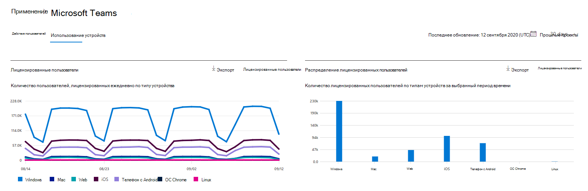
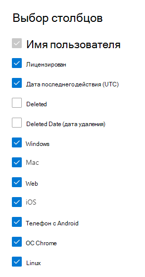

# Отчеты Microsoft 365 в центре администрирования — использование устройств Microsoft Teams

Панель мониторинга отчетов  Microsoft 365 показывает обзор действий в продуктах организации. Вы можете просмотреть отчеты по отдельным продуктам, чтобы получить более подробные сведения о действиях с каждым приложением. Ознакомьтесь с [общими сведениями о панели отчетов](activity-reports.md). С помощью отчета об использовании приложений Microsoft Teams вы можете получить представление о том, какие приложения Microsoft Teams используются в вашей организации.
  
> [!NOTE]
> Чтобы увидеть отчеты, необходимо быть глобальным администратором, глобальным читателем или читателем отчетов в Microsoft 365 или Exchange, SharePoint, Teams Service, Teams Communications или Skype для бизнеса.  
 
## Как найти отчет об использовании приложений Microsoft Teams?

1. В центре администрирования перейдите в раздел **отчеты о** \> <a href="https://go.microsoft.com/fwlink/p/?linkid=2074756" target="_blank">использование</a> страницы. 
2. На домашней странице панели мониторинга щелкните кнопку **Просмотр** дополнительных на карте действий Microsoft Teams.
  
## Интерпретация данных в отчете об использовании приложений Microsoft Teams

Вы можете просмотреть использование устройства в отчете Teams, выбрав вкладку **использования** устройства. 

Выберите **выберите столбцы для** добавления или удаления столбцов из отчета.    

Вы также можете экспортировать данные отчета в файл Excel .csv, выбрав ссылку **Экспорт.** При этом данные всех пользователей будут экспортированы в формат, позволяющий сортировать и фильтровать их для дальнейшего анализа. Если у вас менее 2000 пользователей, вы можете сортировать и фильтровать значения в самой таблице отчета. Если пользователей больше 2000, для фильтрации и сортировки потребуется экспортировать данные. 

В отчете **Использование устройств в Microsoft Teams** можно отследить тенденции за последние 7, 30, 90 и 180 дней. Однако если выбрать определенный день в отчете, в таблице (7) будут показываться данные на срок до 28 дней с текущей даты (а не даты, когда был создан отчет).
  
|Item|Описание|
|:-----|:-----|
|**Метрика**|**Определение**|
|Имя пользователя    |Отображаемое имя пользователя.    |
|Windows    |Выбрано, если пользователь был активен в клиенте настольных компьютеров Teams на компьютере с Windows.    |
|Mac    |Выбрано, если пользователь был активен в клиенте на рабочем столе Teams на компьютере macOS.    |
|iOS    |Выбрано, если пользователь был активен в мобильном клиенте Teams для iOS.    |
|Телефон с Android    | Выбрано, если пользователь был активен в мобильном клиенте Teams для Android.    |
|Chrome OS    |Выбрано, если пользователь был активен в клиенте на настольном компьютере Teams на компьютере ChromeOS.|
|Linux    | Выбрано, если пользователь был активен в клиенте настольных компьютеров Teams на компьютере Linux.    |
|Веб    |Выбрано, если пользователь был активен в веб-клиенте Teams на устройствах.|
|Последняя дата действия (UTC)    |Последняя дата (UTC), в которую пользователь участвовал в действии Teams.    |
|Лицензировано|Выбрано, если у пользователя есть лицензия на использование Teams.|
|||