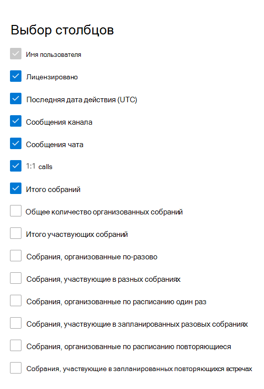

# Отчеты Microsoft 365 в центре администрирования — действия пользователей Microsoft Teams

Панель мониторинга отчетов  Microsoft 365 показывает обзор действий в продуктах организации. Вы можете просмотреть отчеты по отдельным продуктам, чтобы получить более подробные сведения о действиях с каждым приложением. Ознакомьтесь с [общими сведениями о панели отчетов](activity-reports.md). С помощью отчета о действиях пользователей Microsoft Teams вы можете получить представление об активности этих пользователей в вашей организации.
  
> [!NOTE]
> Чтобы увидеть отчеты, необходимо быть глобальным администратором, глобальным читателем или читателем отчетов в Microsoft 365 или Exchange, SharePoint, Teams Service, Teams Communications или Skype для бизнеса.  
 
## Как найти отчет о действиях пользователей Microsoft Teams?

1. В центре администрирования перейдите в раздел **отчеты о** \> <a href="https://go.microsoft.com/fwlink/p/?linkid=2074756" target="_blank">использование</a> страницы.
2. На домашней странице панели мониторинга щелкните кнопку **Просмотр** дополнительных на карте действий Microsoft Teams.

## Интерпретация отчета о действиях пользователей Microsoft Teams

Вы можете просмотреть действия пользователей в отчете Teams, выбрав вкладку **Действия пользователя.**  

Выберите **выберите столбцы для** добавления или удаления столбцов из отчета.    

Вы также можете экспортировать данные отчета в файл Excel .csv, выбрав ссылку **Экспорт.** При этом данные всех пользователей будут экспортированы в формат, позволяющий сортировать и фильтровать их для дальнейшего анализа. Если у вас менее 2000 пользователей, вы можете сортировать и фильтровать значения в самой таблице отчета. Если пользователей больше 2000, для фильтрации и сортировки потребуется экспортировать данные. Экспортируемая форма для  **звукового времени,** времени видео и времени обмена экранами следует формату продолжительности ISO8601. 

В отчете **Действия пользователей Microsoft Teams** можно отследить тенденции за последние 7, 30, 90 и 180 дней. Однако если выбрать определенный день в отчете, в таблице (7) будут показываться данные на срок до 28 дней с текущей даты (а не даты, когда был создан отчет).

Чтобы обеспечить качество данных, мы выполняем ежедневные проверки проверки данных в течение последних трех дней и заполняем все обнаруженные пробелы. Во время процесса можно заметить различия в исторических данных.

|Элемент|Описание|
|:-----|:-----|
|**Метрика**|**Определение**|
|Имя пользователя    |Электронный адрес пользователя. Здесь может отображаться фактический электронный адрес или анонимный идентификатор (при соответствующей настройке).     |
|Сообщения канала     |Количество уникальных сообщений, которые пользователь разместил в командном чате в указанный период времени.    |
|Сообщения чата     |Количество уникальных сообщений, которые пользователь разместил в частном чате в течение указанного периода времени.    |
|Итого собраний     |Количество собраний в Интернете, в которые пользователь участвовал в течение указанного периода времени.    |
|Вызовы 1:1     | Число вызовов 1:1, в которые пользователь участвовал в течение указанного периода времени.    |
|Последняя дата действия (UTC)    |Последняя дата участия пользователя в действии Microsoft Teams.  |
|Собрания, участвующие в разных собраниях     | Количество разных собраний, в которые принимал участие пользователь в течение указанного периода времени.    |
|Собрания, организованные по-разово   |Количество разных собраний, организованных пользователем в указанный период времени.  |
|Общее количество организованных собраний    |Сумма разовых запланированных, повторяющихся, разовых и неклассифицированных собраний, организованных пользователем в указанный период времени.    |
|Итого участвующих собраний    |Сумма разовых, повторяющихся, разовых и неклассифицированных собраний, в которые пользователь участвовал в течение указанного периода времени.    |
|Собрания, организованные по расписанию один раз    |Количество разовых запланированных собраний, организованных пользователем в указанный период времени.    |
|Собрания, организованные по расписанию повторяющиеся    |Количество повторяющихся собраний, организованных пользователем в указанный период времени.    |
|Собрания, участвующие в запланированных разовых собраниях    |Количество разовых запланированных собраний, в которые принимал участие пользователь в течение указанного периода времени.    |
|Собрания, участвующие в запланированных повторяющихся встречах    |Количество повторяющихся собраний, в которые принимал участие пользователь в течение указанного периода времени.    |
|Лицензировано    |Выбрано, если у пользователя есть лицензия на использование Teams.  |
|Другие действия   |Пользователь активен, но выполняет другие действия, чем выставленные типы действий, предлагаемые в отчете (отправка или ответ на сообщения канала и сообщения чата, планирование или участие в вызовах и собраниях 1:1). Примеры действий, когда пользователь меняет состояние Teams или сообщение о состоянии Teams или открывает сообщение сообщения канала, но не отвечает.   |
|неклассифицированные собрания  |Тот, который нельзя классифицировать как расписание, повторяющиеся или ad hoc. Их не хватает и в большинстве случаев их нельзя определить из-за подделаных данных телеметрии. |
|||