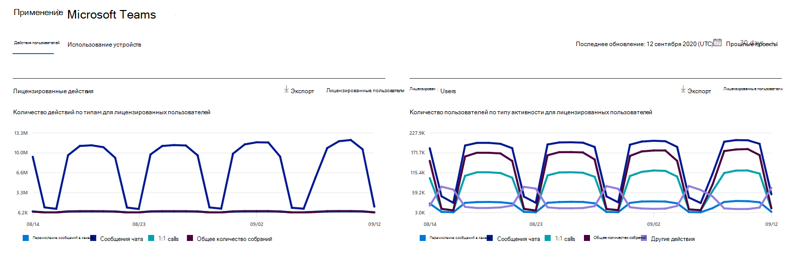
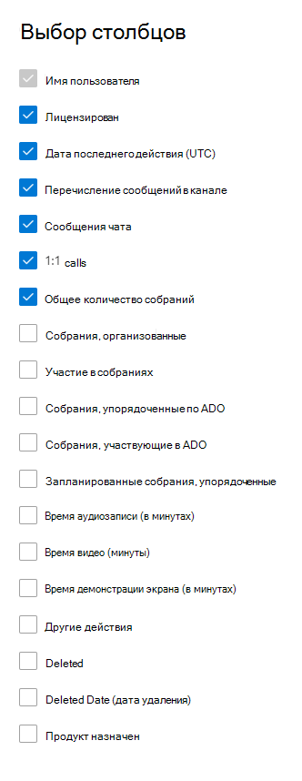

# Отчеты Microsoft 365 в центре администрирования — действия пользователей Microsoft Teams

На панели мониторинга **отчетов** Microsoft 365 вы увидите обзор действий по продуктам в вашей организации. Вы можете просмотреть отчеты по отдельным продуктам, чтобы получить более подробные сведения о действиях с каждым приложением. Ознакомьтесь с [общими сведениями о панели отчетов](activity-reports.md). С помощью отчета о действиях пользователей Microsoft Teams вы можете получить представление об активности этих пользователей в вашей организации.
  
> [!NOTE]
> Для просмотра отчетов необходимо быть глобальным администратором, глобальным читателям или читателями отчетов в Microsoft 365 или Exchange, SharePoint, Teams Service, Team Communications или Skype для бизнеса.  
 
## Как найти отчет о действиях пользователей Microsoft Teams?

1. В центре администрирования перейдите в раздел **отчеты о** \> <a href="https://go.microsoft.com/fwlink/p/?linkid=2074756" target="_blank">использование</a> страницы.
2. На домашней странице панели мониторинга нажмите кнопку **More more (дополнительно** ) в карточке активности Microsoft Teams (обзор).
  
## Интерпретация отчета о действиях пользователей Microsoft Teams

Вы можете просмотреть действия пользователя в отчете Teams, выбрав вкладку **действия пользователя** .  

Выберите **команду Выбрать столбцы** , чтобы добавить столбцы в отчет или удалить их из него.    

Вы также можете экспортировать данные отчета в CSV-файл Excel, щелкнув ссылку **Экспорт** . При этом данные всех пользователей будут экспортированы в формат, позволяющий сортировать и фильтровать их для дальнейшего анализа. Если у вас менее 2000 пользователей, вы можете сортировать и фильтровать значения в самой таблице отчета. Если пользователей больше 2000, для фильтрации и сортировки потребуется экспортировать данные. 

|Item|Описание|
|:-----|:-----|
|**Метрика**|**Определение**|
|Имя пользователя    |Электронный адрес пользователя. Здесь может отображаться фактический электронный адрес или анонимный идентификатор (при соответствующей настройке).     |
|Сообщения канала     |Количество уникальных сообщений, отправленных пользователем в сеансе команды в течение заданного периода времени.    |
|Сообщения чата     |Количество уникальных сообщений, опубликованных пользователем в частном чате за указанный период времени.    |
|Общее количество собраний     |Количество собраний по сети, которые пользователь принимал участие в течение указанного периода времени.    |
|вызовов 1:1     | Количество вызовов 1:1, которые пользователь участвовал в течение указанного периода времени.    |
|Дата последнего действия (UTC)    |Последняя дата, когда пользователь участвовал в действиях Microsoft Teams.  |
|Собранные нерегламентированные собрания     | Количество собраний, не запланированных в календаре, которые пользователь принимал в течение указанного периода времени.    |
|Собрания, организованные как нерегламентированные   |Количество собраний, не запланированных в календаре, которые пользователь организовал в течение заданного периода времени.  |
|Запланированные собрания, упорядоченные    |Количество запланированных собраний, организованных пользователем в течение заданного периода времени.    |
|Лицензирован |Выбирается, если пользователь лицензируется для использования Teams.|
|Другие действия|Пользователь считается активным, но имеет нулевое значение для сообщений чата, 1:1 звонков, сообщений канала, общего количества собраний и собраний. Примеры действий — когда клиент Microsoft Teams активируется на переднем плане, в области сообщение создаются действия, которые появляются в клиенте Microsoft Teams, баннеры показаны в клиенте Microsoft Teams и т. д. |
|||