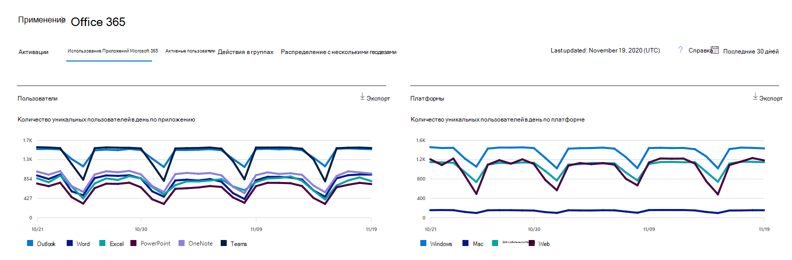

# Отчеты Microsoft 365 в центре администрирования — использование приложений Microsoft 365Microsoft 365 Reports in the admin center - Microsoft 365 Apps usage

На панели мониторинга **отчетов** Microsoft 365 вы увидите обзор действий по продуктам в вашей организации.The Microsoft 365 **Reports** dashboard shows you the activity overview across the products in your organization. Вы можете просмотреть отчеты по отдельным продуктам, чтобы получить более подробные сведения о действиях с каждым приложением.It enables you to drill in to individual product level reports to give you more granular insight about the activities within each product. Ознакомьтесь со статьей [Обзор отчетов](activity-reports.md).Check out [the Reports overview topic](activity-reports.md).

 Например, вы можете узнать о действиях каждого пользователя, лицензированного для использования приложений Microsoft 365, изучив их действия в приложениях и то, как они используются на различных платформах.For example, you can understand the activity of each user licensed to use Microsoft 365 Apps apps by looking at their activity across the apps and how they are utilized across platforms.

 > [!NOTE]
 > Для просмотра отчетов необходимо быть глобальным администратором, глобальным читателям или средством чтения отчетов в Microsoft 365 или администратором Exchange, SharePoint или Skype для бизнеса.You must be a global administrator, global reader or reports reader in Microsoft 365 or an Exchange, SharePoint, or Skype for Business administrator to see reports.

## Получение отчета об использовании приложений Microsoft 365How to get to the Microsoft 365 Apps usage report

1. В центре администрирования перейдите в раздел **отчеты о** \> <a href="https://go.microsoft.com/fwlink/p/?linkid=2074756" target="_blank">использование</a> страницы.In the admin center, go to the **Reports** \> <a href="https://go.microsoft.com/fwlink/p/?linkid=2074756" target="_blank">Usage</a> page. 
2. На домашней странице панели мониторинга нажмите кнопку " **Дополнительно** " в карточке "активные пользователи — Microsoft 365 Apps".From the dashboard homepage, click on the **View more** button on the Active users - Microsoft 365 Apps card.

## Интерпретация отчета об использовании приложений Microsoft 365Interpret the Microsoft 365 Apps usage report

Вы можете получить представление о действиях пользователей в приложениях Microsoft 365, изучив диаграмму **Пользователи** и **платформы** .You can get a view into your user's Microsoft 365 Apps activity by looking at the **Users** and **Platform** charts.

|ЭлементItem|ОписаниеDescription|
 |:-----|:-----|
 |1.1.   |Отчет **об использовании приложений Microsoft 365** можно просмотреть для тенденций за последние семь дней, 30 дней, 90 дней или 180 дней.The **Microsoft 365 Apps usage** report can be viewed for trends over the last 7 days, 30 days, 90 days, or 180 days. Тем не менее, если выбрать определенный день в отчете, в таблице (7) будут отображаться данные в течение 28 дней с текущей даты (не Дата создания отчета).However, if you select a particular day in the report, the table (7) will show data for up to 28 days from the current date (not the date the report was generated).   |
 |2.2.   |Данные в каждом отчете обычно открываются за последние семь дней.The data in each report usually covers up to the last seven days.   |
 |3.3.   |В представлении **Пользователи** отображается тенденция в количестве активных пользователей для каждого приложения — Outlook, Word, Excel, PowerPoint, OneNote и Teams.The **Users** view shows the trend in the number of active users for each app – Outlook, Word, Excel, PowerPoint, OneNote, and Teams. "Активные пользователи" — это любой пользователь, который выполняет какие – либо действия в этих приложениях."Active users" are any who perform any intentional actions within these apps.   |
 |4.4.   |В представлении **платформы** показано изменение числа активных пользователей во всех приложениях для каждой платформы — Windows, Mac, веб-сайт и мобильный.The **Platforms** view shows the trend of active users across all apps for each platform – Windows, Mac, Web, and Mobile.   |
 |5.5. |На диаграмме **Пользователи** ось Y — это количество уникальных активных пользователей для соответствующего приложения.On the **Users** chart, the Y-axis is the number of unique active users for the respective app. На \*\*\*\*   диаграмме платформы ось Y — это количество уникальных пользователей для соответствующей платформы.On the **Platforms** chart, the Y-axis is the number of unique users for the respective platform. Ось X на обеих диаграммах — это дата, когда приложение использовалось на данной платформе.The X-axis on both charts is the date on which an app was used on a given platform. |
 6.6. |Вы можете отфильтровать ряды, которые вы видите на диаграмме, выбрав элемент в условных обозначениях.You can filter the series you see on the chart by selecting an item in the legend. Например, на диаграмме **Пользователи** выберите Outlook, Word, Excel, PowerPoint, OneDrive или Teams, чтобы просмотреть только сведения, относящиеся к каждой из них.For example, on the **Users** chart, select Outlook, Word, Excel, PowerPoint, OneDrive, or Teams to see only the info related to each one. При изменении этого выбора сведения в таблице сетки под ним не изменяются.Changing this selection doesn't change the info in the grid table below it.|
 |7.7. |В таблице показана разбивка данных по пользователям.The table shows you a breakdown of data at the per-user level. Вы можете добавить столбцы в таблицу или удалить их из нее.You can add or remove columns from the table.   **Username** это адрес электронной почты пользователя, выполнившего действия в приложениях Майкрософт.**Username** is the email address of the user who performed the activity on Microsoft Apps.  **Дата последней активации (UTC)** — это последняя дата, когда пользователь активировал свою подписку на Microsoft 365 приложений.**Last activation date (UTC)** is the latest date on which the user activated their Microsoft 365 Apps subscription.  **Дата последнего действия (UTC) Дата последнего** выполнения преднамеренного действия, выполненного пользователем.**Last activity date (UTC)** is the latest date an intentional activity was performed by the user. Для просмотра действий, которые произошли в определенный день, выберите эту дату непосредственно на диаграмме.To see activity that occurred on a specific date, select the date directly in the chart.  В других столбцах указывается, был ли пользователь активен на этой платформе для этого приложения (в приложениях Microsoft 365) в выбранном периоде.The other columns identify if the user was active on that platform for that app (within Microsoft 365 Apps) in the period selected. |
 |8.8. |Нажмите значок " **Выбор столбцов** ", чтобы добавить или удалить столбцы из отчета.Select the **Choose columns** icon to add or remove columns from the report.|
 |9.9. |Вы также можете экспортировать данные отчета в CSV-файл Excel, щелкнув ссылку **Экспорт** .You can also export the report data into an Excel .csv file by selecting the **Export** link. Это приводит к экспорту данных для всех пользователей и позволяет выполнить простую статистическую обработку, сортировку и фильтрацию для дальнейшего анализа.This exports data for all users and enables you to do simple aggregation, sorting, and filtering for further analysis. Если у вас менее 100 пользователей, вы можете выполнить сортировку и фильтрацию в таблице в самом отчете.If you have less than 100 users, you can sort and filter within the table in the report itself. Если у вас больше 100 пользователей, для фильтрации и сортировки потребуется экспортировать данные.If you have more than 100 users, in order to filter and sort, you will need to export the data.|
