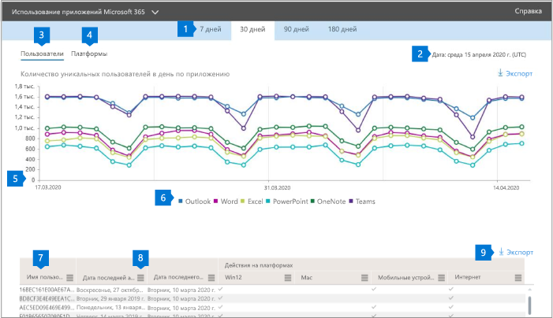

# Отчеты Microsoft 365 в центре администрирования — использование плюс

На панели мониторинга **отчетов** Microsoft 365 вы увидите обзор действий по продуктам в вашей организации. Вы можете просмотреть отчеты по отдельным продуктам, чтобы получить более подробные сведения о действиях с каждым приложением. Ознакомьтесь со статьей [Обзор отчетов](activity-reports.md).

 Например, вы можете узнать о действиях каждого пользователя, имеющего лицензию, для использования приложений ProPlus, изучив их действия в приложениях и их использование на различных платформах.

 > [!NOTE]
 > Для просмотра отчетов необходимо быть глобальным администратором, глобальным читателям или средством чтения отчетов в Microsoft 365 или администратором Exchange, SharePoint или Skype для бизнеса.

## Получение отчета об использовании плюса

1. В центре администрирования перейдите в раздел **отчеты о** \> <a href="https://go.microsoft.com/fwlink/p/?linkid=2074756" target="_blank">использование</a> страницы.

 2. В раскрывающемся списке **выберите отчет** выберите **Office 365** \> **профессиональный плюс использование** .

## Интерпретация отчета об использовании плюса

Вы можете получить представление о своей деятельности пользователя, изучив диаграмму **Пользователи** и **платформы** .

|||
 |:-----|:-----|
 |1.   |Отчет **об использовании плюса** можно просмотреть для тенденций за последние 7, 30, 90 дней или 180 дней. Тем не менее, если выбрать определенный день в отчете, в таблице (7) будут отображаться данные в течение 28 дней с текущей даты (не Дата создания отчета).   |
 |2.   |Данные в каждом отчете обычно закрываются в течение последних 24 – 48 часов.   |
 |3.   |В представлении **Пользователи** иев показана тенденция количества активных пользователей для каждого приложения — Outlook, Word, Excel, PowerPoint, OneNote и Teams. "Активные пользователи" — это любой пользователь, который выполняет какие – либо действия в этих приложениях.   |
 |4.   |В представлении **платформы** показано изменение числа активных пользователей во всех приложениях для каждой платформы — Windows, Mac, веб-сайт и мобильный.   |
 |5. |На диаграмме **Пользователи** ось Y это количество уникальных активных пользователей для соответствующего приложения. На диаграмме **платформы** ось Y это количество уникальных пользователей для соответствующей платформы. Ось X на обеих диаграммах — это дата, когда приложение использовалось для данного объекта Platform. RM. |
 6. |Вы можете отфильтровать ряды, которые вы видите на диаграмме, выбрав элемент в условных обозначениях. Например, на диаграмме **Пользователи** выберите Outlook, Word, Excel, PowerPoint, OneDrive или Teams, чтобы просмотреть только сведения, относящиеся к каждой из них. При изменении этого выбора сведения в таблице сетки под ним не изменяются.|
 |7. |В таблице показана разбивка данных по пользователям. Вы можете добавить столбцы в таблицу или удалить их из нее.   **Username** это адрес электронной почты пользователя, выполнившего действия в приложениях Майкрософт.  **Дата последней активации (UTC)** — это последняя дата, когда пользователь активировал свою подписку плюс.  **Дата последнего действия (UTC) Дата последнего** выполнения преднамеренного действия, выполненного пользователем. Для просмотра действий, которые произошли в определенный день, выберите эту дату непосредственно на диаграмме.  В следующих столбцах, соответствующих каждому приложению, которое определяет, был ли пользователь активен в этом приложении в выбранном периоде:   **Outlook**  **Word**  **Excel** **PowerPoint**  **OneNote**   Следующие столбцы, соответствующие каждой платформе, которые определяют, был ли пользователь активным на этой платформе для любого приложения (в проходе), в выбранном периоде:  **Outlook (Windows)** **Outlook (Mac)** **Outlook (веб)**  **Outlook (Mobile)**  **Word (Windows)**  **Word (Mac)**  **Word (веб)**  **Word (для мобильных устройств)**  **Excel (Windows)**  **Excel (Mac)**  **Excel (веб)**  **Excel (Mobile)**  **PowerPoint (Windows)**  **PowerPoint (Mac)** **PowerPoint (веб)**  **PowerPoint (Mobile)**  **OneNote (Windows)**  **OneNote (Mac)**  **OneNote (Интернет)** **OneNote (Mobile)**  **Teams (Windows)**  **Teams (Mac)**  **Teams (веб)** **Teams (Mobile)** |
 |8. |Выберите значок **Управление столбцами** , чтобы добавить столбцы в отчет или удалить их из него.|
 |9. |Вы также можете экспортировать данные отчета в CSV-файл Excel, щелкнув ссылку **Экспорт** . Это приводит к экспорту данных для всех пользователей и позволяет выполнить простую статистическую обработку, сортировку и фильтрацию для дальнейшего анализа. Если у вас менее 100 пользователей, вы можете выполнить сортировку и фильтрацию в таблице в самом отчете. Если у вас больше 100 пользователей, для фильтрации и сортировки потребуется экспортировать данные.|