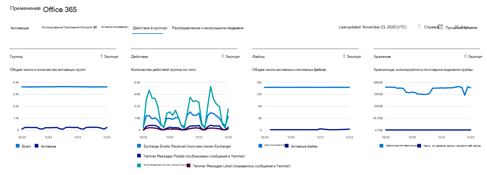
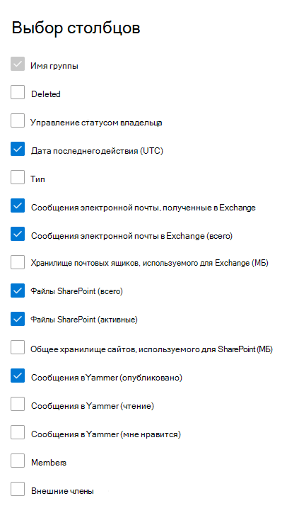

# Отчеты Microsoft 365 в центре администрирования — группы Microsoft 365

Панель мониторинга отчетов  Microsoft 365 показывает обзор действий в продуктах организации. Вы можете просмотреть отчеты по отдельным продуктам, чтобы получить более подробные сведения о действиях с каждым приложением. Ознакомьтесь со статьей [Обзор отчетов](activity-reports.md). В отчете о группах Microsoft 365 вы можете получить сведения о деятельности групп в организации и узнать, сколько групп создается и используется.
  
> [!NOTE]
> Чтобы увидеть отчеты, необходимо быть глобальным администратором, глобальным читателем или читателем отчетов в Microsoft 365 или Exchange, SharePoint, Teams Service, Teams Communications или Skype для бизнеса.  
  
## Как добраться до отчета группы

1. В центре администрирования перейдите в раздел **отчеты о** \> <a href="https://go.microsoft.com/fwlink/p/?linkid=2074756" target="_blank">использование</a> страницы. 
2. На домашней странице панели мониторинга  щелкните кнопку Просмотр дополнительных данных для активных пользователей — Приложений Microsoft 365 или активных пользователей — карты Microsoft 365 Services, чтобы добраться до страницы отчета Office 365.
  
## Интерпретация отчета групп

Активации в отчете Office 365 можно просмотреть, выбрав вкладку **"Группы действий".** 

Выберите **выберите столбцы для** добавления или удаления столбцов из отчета.    

Вы также можете экспортировать данные отчета в файл Excel .csv, выбрав ссылку **Экспорт.** При этом данные всех пользователей будут экспортированы в формат, позволяющий сортировать и фильтровать их для дальнейшего анализа. Если у вас менее 2000 пользователей, вы можете сортировать и фильтровать значения в самой таблице отчета. Если пользователей больше 2000, для фильтрации и сортировки потребуется экспортировать данные. 

|Item|Описание|
|:-----|:-----|
|**Метрика**|**Определение**|
|Имя группы    |Имя группы.    |
|Deleted    |Количество удаленных групп. Если группа удалена, но в ней выполнялись действия в пределах отчетного периода, она будет показана в таблице, но этот флаг будет иметь значение ИСТИНА.    |
|Владелец группы    |Имя владельца группы.    |
|Последняя дата действия (UTC)    |Последняя дата, когда группа получила сообщение. - Это последняя дата, в ходе беседы по электронной почте Yammer или сайта.    |
|Тип    |Тип группы. Группы могут быть частными или общедоступными.    |
|Сообщения электронной почты, полученные в Exchange    |Количество сообщений, полученных группой.|
|Сообщения электронной почты в Exchange (всего)    |Общее количество элементов в почтовом ящике группы.    |
|Хранилище почтовых ящиков, используемого для Exchange (MB)    |Хранилище, используемого почтовым ящиком группы.  |
|Файлы SharePoint (всего)    |Количество файлов, хранимых на сайтах групп SharePoint.    |
|Файлы SharePoint (активные)    |Количество файлов на сайте группы SharePoint, на которые были внесены действия (просмотр или изменение, синхронизация, общий внутренний или внешний доступ) в отчетный период.    |
|Общее хранилище сайта, используемого для SharePoint (MB)    |Объем хранилища в МБ, используемый в отчетный период.    |
|Сообщения в Yammer (опубликовано)    |Количество сообщений, размещенных в группе Yammer за отчетный период.    |
|Сообщения в Yammer (чтение)    |Количество разговоров, читаемых в группе Yammer за отчетный период.    |
|Сообщения в Yammer (понравились)    |Количество сообщений, которые понравились в группе Yammer за отчетный период.    |
|"Участники"    |Количество участников в группе.    |
|Внешние участники |Количество внешних пользователей в группе.|
|||