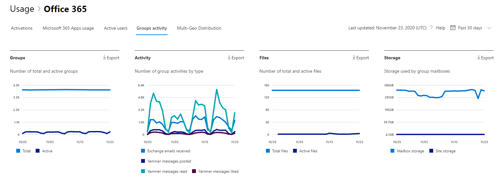

# Отчеты Microsoft 365 в центре администрирования — группы Майкрософт 365Microsoft 365 Reports in the admin center - Microsoft 365 groups

На панели мониторинга **отчетов** Microsoft 365 вы увидите обзор действий по продуктам в вашей организации.The Microsoft 365 **Reports** dashboard shows you the activity overview across the products in your organization. Вы можете просмотреть отчеты по отдельным продуктам, чтобы получить более подробные сведения о действиях с каждым приложением.It enables you to drill in to individual product level reports to give you more granular insight about the activities within each product. Ознакомьтесь со статьей [Обзор отчетов](activity-reports.md).Check out [the Reports overview topic](activity-reports.md). В отчете по группам Microsoft 365 вы можете получить подробные сведения об активности групп в Организации и узнать, сколько групп создано и используется.In the Microsoft 365 groups report, you can gain insights into the activity of groups in your organization and see how many groups are being created and used.
  
> [!NOTE]
> Для просмотра отчетов необходимо быть глобальным администратором, глобальным читателям или читателями отчетов в Microsoft 365 или Exchange, SharePoint, Teams Service, Team Communications или Skype для бизнеса.You must be a global administrator, global reader or reports reader in Microsoft 365 or an Exchange, SharePoint, Teams Service, Teams Communications, or Skype for Business administrator to see reports.  
  
## Получение отчета по группамHow to get to the groups report

1. В центре администрирования перейдите в раздел **отчеты о** \> <a href="https://go.microsoft.com/fwlink/p/?linkid=2074756" target="_blank">использование</a> страницы.In the admin center, go to the **Reports** \> <a href="https://go.microsoft.com/fwlink/p/?linkid=2074756" target="_blank">Usage</a> page. 
2. На домашней странице панели мониторинга нажмите кнопку **More more (просмотреть дополнительные** ) на странице активные пользователи — Microsoft 365 Apps или Active Users-Microsoft 365 Services, чтобы перейти на страницу отчета Office 365.From the dashboard homepage, click on the **View more** button on the Active users - Microsoft 365 Apps or the Active users - Microsoft 365 Services card to get to the Office 365 report page.
  
## Интерпретация отчета по группамInterpret the groups report

Вы можете просмотреть активации в отчете Office 365, выбрав вкладку **действие группы** .You can view the activations in the Office 365 report by choosing the **Groups activity** tab. 

Выберите **команду Выбрать столбцы** , чтобы добавить столбцы в отчет или удалить их из него.Select **Choose columns** to add or remove columns from the report.    

Вы также можете экспортировать данные отчета в CSV-файл Excel, щелкнув ссылку **Экспорт** .You can also export the report data into an Excel .csv file by selecting the **Export** link. При этом данные всех пользователей будут экспортированы в формат, позволяющий сортировать и фильтровать их для дальнейшего анализа.This exports data of all users and enables you to do simple sorting and filtering for further analysis. Если у вас менее 2000 пользователей, вы можете сортировать и фильтровать значения в самой таблице отчета.If you have less than 2000 users, you can sort and filter within the table in the report itself. Если пользователей больше 2000, для фильтрации и сортировки потребуется экспортировать данные.If you have more than 2000 users, in order to filter and sort, you will need to export the data. 

|ЭлементItem|ОписаниеDescription|
|:-----|:-----|
|**Метрика****Metric**|**Определение****Definition**|
|Имя группыGroup name    |Имя группы.The name of the group.    |
|DeletedDeleted    |Число удаленных групп.The number of deleted groups. Если группа удалена, но в ней выполнялись действия в пределах отчетного периода, она будет показана в таблице, но этот флаг будет иметь значение ИСТИНА.If the group is deleted, but had activity in the reporting period it will show up in the grid with this flag set to true.    |
|Владелец группыGroup owner    |Имя владельца группы.The name of the group owner.    |
|Дата последнего действия (UTC)Last activity date (UTC)    |Самая поздняя дата получения сообщения группой.The latest date a message was received by the group. — Это самая поздняя дата, когда в беседе электронной почты, Yammer или на сайте возникла какая-либо операция.- This is the latest date an activity happened in an email conversation, Yammer, or the Site.    |
|ТипType    |Тип группы.The type of group. Группы могут быть частными или общедоступными.This can be private or public group.    |
|Сообщения электронной почты, полученные в ExchangeEmails received in Exchange    |Количество сообщений, полученных группой.The number of messages received by the group.|
|Сообщения электронной почты в Exchange (всего)Emails in Exchange (total)    |Общее количество элементов в почтовом ящике группы.The total number of items in the group's mailbox.    |
|Хранилище почтовых ящиков, используемое для Exchange (МБ)Mailbox storage used for Exchange (MB)    |Хранилище, используемое почтовым ящиком группы.The storage used by the group's mailbox.  |
|Файлы SharePoint (всего)SharePoint files (total)    |Количество файлов, хранящихся на сайтах группы SharePoint.The number of files stored in SharePoint group sites.    |
|Файлы SharePoint (активные)SharePoint files (active)    |Количество файлов на сайте группы SharePoint, к которым были применены (просмотренные или измененные, синхронизированные, общие для внутреннего или внешнего) в течение отчетного периода.The number of files in the SharePoint group site that were acted on (viewed or modified, synched , shared internally or externally) during the reporting period.    |
|Общее хранилище сайта, используемое для SharePoint (МБ)Total site storage used for SharePoint (MB)    |Объем хранилища в МЕГАБАЙТах, использованный в течение отчетного периода.The amount of storage in MB used during the reporting period.    |
|Сообщения в Yammer (опубликованы)Messages in Yammer (posted)    |Количество сообщений, размещенных в группе Yammer за отчетный период.The number of messages posted in the Yammer group over the reporting period.    |
|Сообщения в Yammer (чтение)Messages in Yammer (read)    |Количество бесед, прочитанных в группе Yammer за отчетный период.The number of conversations read in the Yammer group over the reporting period.    |
|Сообщения в Yammer (понравилось)Messages in Yammer (liked)    |Количество сообщений, которые понравится в группе Yammer за отчетный период.The number of messages liked in the Yammer group over the reporting period.    |
|MembersMembers    |Число членов в группе.The number of members in the group.    |
|Внешние элементыExternal members |Количество внешних пользователей в группе.The number of external users in the group.|
|||