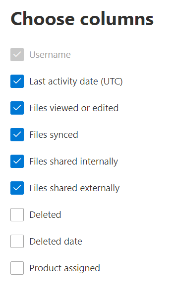

# Отчеты Microsoft 365 в центре администрирования — OneDrive для бизнеса

Панель мониторинга отчетов  Microsoft 365 показывает обзор действий в продуктах организации. Вы можете просмотреть отчеты по отдельным продуктам, чтобы получить более подробные сведения о действиях с каждым приложением. Ознакомьтесь со статьей [Обзор отчетов](activity-reports.md).
  
Например, вы можете понять, чем занимается каждый пользователь, имеющий лицензию на OneDrive, изучив его работу с файлами в OneDrive. Кроме того, можно оценить активность совместной работы, просмотрев количество файлов, которыми поделились сотрудники.
  
> [!NOTE]
> Чтобы увидеть отчеты, необходимо быть глобальным администратором, глобальным читателем или читателем отчетов в Microsoft 365 или Exchange, SharePoint, Teams Service, Teams Communications или Skype для бизнеса.  
 
## Как получить отчет о действиях в OneDrive?

1. В центре администрирования перейдите в раздел **отчеты о** \> <a href="https://go.microsoft.com/fwlink/p/?linkid=2074756" target="_blank">использование</a> страницы. 
2. На домашней странице панели мониторинга нажмите кнопку **Просмотр дополнительных** на карте OneDrive.
  
## Анализ отчета о действиях в OneDrive для бизнеса

Действия в отчете OneDrive можно просмотреть, выбрав вкладку **Activity.** 

Выберите **выберите столбцы для** добавления или удаления столбцов из отчета.    

Вы также можете экспортировать данные отчета в файл Excel .csv, выбрав ссылку **Экспорт.** При этом данные всех пользователей будут экспортированы в формат, позволяющий сортировать и фильтровать их для дальнейшего анализа. Если у вас менее 2000 пользователей, вы можете сортировать и фильтровать значения в самой таблице отчета. Если пользователей больше 2000, для фильтрации и сортировки потребуется экспортировать данные. 
  
|Item|Описание|
|:-----|:-----|
|**Метрика**|**Определение**|
|Имя пользователя    |Имя пользователя владельца учетной записи OneDrive.    |
|Последняя дата действия (UTC)    |Последняя дата выполнения действий файла в учетной записи OneDrive для выбранного диапазона дат. . Для просмотра действий, которые произошли в определенный день, выберите эту дату непосредственно на диаграмме.    |
|Просмотр или редактирование файлов    |Количество файлов, которые пользователь загрузил, скачал, изменил или просмотрел.     |
|Синхронизированные файлы    |Количество файлов, синхронизированных с локального устройства пользователя на учетную запись OneDrive.   |
|Файлы, общие для внутренней    | Количество файлов, которые были общими для пользователей организации или пользователей в группах (в том числе внешних пользователей).    |
|Файлы, общие для внешнего    |Количество файлов, которые были совместно с пользователями за пределами организации.  |
|Deleted    | Это означает, что лицензия пользователя была удалена.    ПРИМЕЧАНИЕ. Действие для удаленного пользователя будет отображаться в отчете до тех пор, пока он или она была лицензирована в течение определенного периода времени. Столбец **Удален** указывает, что пользователь больше не является активным, но участвовал при формировании данных в отчете.    |
|Дата удаления    |Дата, в которую была удалена лицензия пользователя.  |
|Назначен продукт    |Продукты Microsoft 365, лицензированные пользователю.|
|||