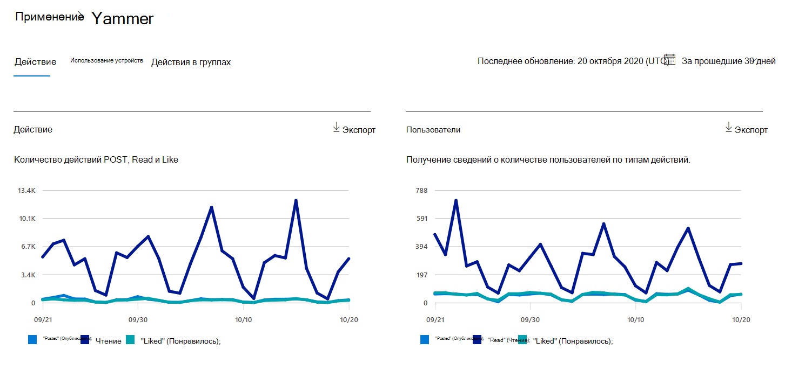
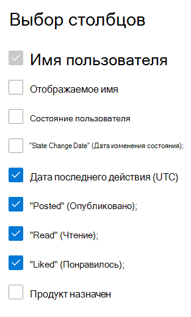

# Отчеты Microsoft 365 в Центре администрирования — отчет об активности в YammerMicrosoft 365 Reports in the admin center - Yammer activity report

Как администратор Microsoft 365 панель мониторинга **отчетов** отображает данные об использовании продуктов в организации.As Microsoft 365 admin, the **Reports** dashboard shows you data on the usage of the products within your organization. Ознакомьтесь [с отчетами об активности в Центре администрирования.](activity-reports.md)Check out [activity reports in the admin center](activity-reports.md). С помощью отчета об активности **в Yammer** вы можете понять уровень вовлеченности вашей организации в Yammer, изусмотрив количество уникальных пользователей, использующих Yammer для публикации, а также прочитав или прочитав сообщение, а также объем активности, созданный в организации.With the **Yammer Activity report**, you can understand the level of engagement of your organization with Yammer by looking at the number of unique users using Yammer to post, like or read a message and the amount of activity generated across the organization. 
  
> [!NOTE]
> Чтобы увидеть отчеты, вы должны быть глобальным администратором, глобальным читателем или читателем отчетов в Microsoft 365 или Exchange, SharePoint, службе Teams, коммуникациях Teams или администраторе Skype для бизнеса.You must be a global administrator, global reader or reports reader in Microsoft 365 or an Exchange, SharePoint, Teams Service, Teams Communications, or Skype for Business administrator to see reports.  
 
## Как получить отчет об активности Yammer?How do I get to the Yammer activity report?

1. В центре администрирования перейдите в раздел **отчеты о** \> <a href="https://go.microsoft.com/fwlink/p/?linkid=2074756" target="_blank">использование</a> страницы.In the admin center, go to the **Reports** \> <a href="https://go.microsoft.com/fwlink/p/?linkid=2074756" target="_blank">Usage</a> page. 
2. На домашней странице панели мониторинга  нажмите кнопку "Подробнее" на карточке Yammer.From the dashboard homepage, click on the **View more** button on the Yammer card.

  
## Анализ отчета об активности в YammerInterpret the Yammer activity report

Вы можете просмотреть действия в отчете Yammer, выбрав вкладку **"Действия".**You can view the activities in the Yammer report by choosing the **Activity** tab. 

Выберите **"Выбрать столбцы",** чтобы добавить или удалить столбцы из отчета.Select **Choose columns** to add or remove columns from the report.    

Вы также можете экспортировать данные отчета в CSV-файл Excel, выбрав ссылку **"Экспорт".**You can also export the report data into an Excel .csv file by selecting the **Export** link. При этом данные всех пользователей будут экспортированы в формат, позволяющий сортировать и фильтровать их для дальнейшего анализа.This exports data of all users and enables you to do simple sorting and filtering for further analysis. Если у вас менее 2000 пользователей, вы можете сортировать и фильтровать значения в самой таблице отчета.If you have less than 2000 users, you can sort and filter within the table in the report itself. Если пользователей больше 2000, для фильтрации и сортировки потребуется экспортировать данные.If you have more than 2000 users, in order to filter and sort, you will need to export the data. 
  
|ЭлементItem|ОписаниеDescription|
|:-----|:-----|
|**Метрика****Metric**|**Определение****Definition**|
|Имя пользователяUsername    |Электронный адрес пользователя.The email address of the user. Здесь может отображаться фактический электронный адрес или анонимный идентификатор (при соответствующей настройке).You can display the actual email address or make this field anonymous. В этой сетке показаны пользователи, которые вошли в Yammer с помощью учетной записи Microsoft 365 или вошли в сеть с помощью единого входа.This grid shows users who logged into Yammer using the Microsoft 365 account or who logged into the network using single sign-on.   |
|Отображаемое имяDisplay name    |Полное имя пользователя.The full name of the user. Здесь может отображаться фактический электронный адрес или анонимный идентификатор (при соответствующей настройке).You can display the actual email address or make this field anonymous.    |
|Состояние пользователяUser state    |Одно из трех значений: Activated, Deleted или Suspended.One of three values: Activated, Deleted, or Suspended. В отчетах содержатся данные по активным, приостановленным и удаленным пользователям.These reports show data for active, suspended, and deleted users. В них не отражены пользователи, ожидающие утверждения, так как они не могут публиковать, читать сообщения и добавлять пометки "Нравится".They do not reflect pending users, because pending users cannot post, read, or like a message.    |
|Дата изменения состояния (UTC)State change date (UTC)    |Дата изменения состояния пользователя в Yammer.The date on which the user's state was changed in Yammer.    |
|Дата последнего действия (UTC)Last activity date (UTC)    | Последняя дата публикации, чтения или понравившейся пользователем публикации сообщения.The last date that the user posted, read, or liked a message.    |
|"Posted" (Опубликовано);Posted    |Количество сообщений, которые пользователь опубликовал в указанный вами период времени.The number of messages the user posted during the time period you specified.  |
|ЧтениеRead    |Количество бесед, которые пользователь прочитал за указанный вами период времени.The number of conversations that the user read during the time period you specified.    |
|"Liked" (Понравилось);Liked    |Количество сообщений, которые пользователю понравились за указанный вами период времени.The number of messages that the user liked during the time period you specified.   |
|Назначенное продуктProduct assigned    |Продукты, которые назначены этому пользователю.The products that are assigned to this user.|
|||