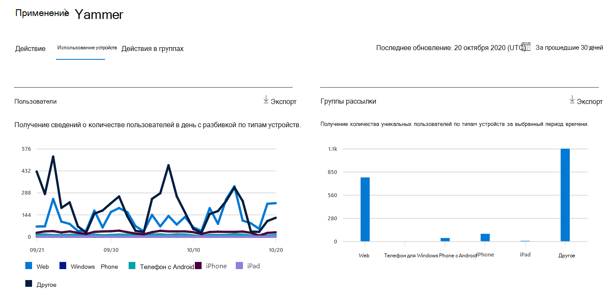
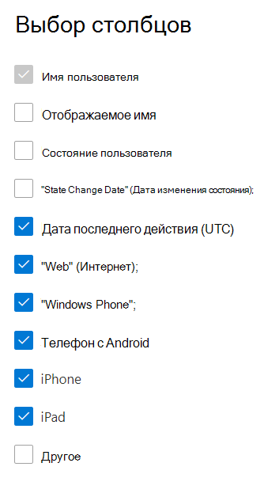

# Отчеты Microsoft 365 в центре администрирования — отчет об использовании устройств в YammerMicrosoft 365 Reports in the admin center - Yammer device usage report

На панели мониторинга **отчетов** Microsoft 365 вы увидите обзор действий по продуктам в вашей организации.The Microsoft 365 **Reports** dashboard shows you the activity overview across the products in your organization. Вы можете просмотреть отчеты по отдельным продуктам, чтобы получить более подробные сведения о действиях с каждым приложением.It enables you to drill in to individual product level reports to give you more granular insight about the activities within each product. Ознакомьтесь со статьей [Обзор отчетов](activity-reports.md).Check out [the Reports overview topic](activity-reports.md).
  
Отчеты об использовании устройств в Yammer содержат сведения об устройствах, на которых используется Yammer. Вы можете просмотреть данные о суточном и общем количестве пользователей с разбивкой по типам устройств. Оба показателя можно просмотреть за выбранный период времени. Кроме того, можно получить информацию о каждом пользователе.The Yammer device usage reports give you information about which devices your users are using Yammer on. You can view the number of daily users by device type, and number of users by device type. You can view both over a selected time period. You can also view details per user.
  
> [!NOTE]
> Для просмотра отчетов необходимо быть глобальным администратором, глобальным читателям или читателями отчетов в Microsoft 365 или Exchange, SharePoint, Teams Service, Team Communications или Skype для бизнеса.You must be a global administrator, global reader or reports reader in Microsoft 365 or an Exchange, SharePoint, Teams Service, Teams Communications, or Skype for Business administrator to see reports.  
 
## Как открыть отчет об использовании устройств в Yammer?How do I get to the Yammer device usage report?

1. В центре администрирования перейдите в раздел **отчеты о** \> <a href="https://go.microsoft.com/fwlink/p/?linkid=2074756" target="_blank">использование</a> страницы.In the admin center, go to the **Reports** \> <a href="https://go.microsoft.com/fwlink/p/?linkid=2074756" target="_blank">Usage</a> page. 
2. На домашней странице панели мониторинга нажмите кнопку " **Дополнительные сведения** " на карточке Yammer.From the dashboard homepage, click on the **View more** button on the Yammer card.
  
## Интерпретация отчета об использовании устройств в YammerInterpret the Yammer device usage report

Вы можете просмотреть сведения об использовании в отчете OneDrive, выбрав вкладку **Использование устройства** .You can view the usage in the OneDrive report by choosing the **Device usage** tab. 

Выберите **команду Выбрать столбцы** , чтобы добавить столбцы в отчет или удалить их из него.Select **Choose columns** to add or remove columns from the report.    

Вы также можете экспортировать данные отчета в CSV-файл Excel, щелкнув ссылку **Экспорт** .You can also export the report data into an Excel .csv file by selecting the **Export** link. При этом данные всех пользователей будут экспортированы в формат, позволяющий сортировать и фильтровать их для дальнейшего анализа.This exports data of all users and enables you to do simple sorting and filtering for further analysis. Если у вас менее 2000 пользователей, вы можете сортировать и фильтровать значения в самой таблице отчета.If you have less than 2000 users, you can sort and filter within the table in the report itself. Если пользователей больше 2000, для фильтрации и сортировки потребуется экспортировать данные.If you have more than 2000 users, in order to filter and sort, you will need to export the data. 
  
|ItemItem|ОписаниеDescription|
|:-----|:-----|
|**Метрика****Metric**|**Определение****Definition**|
|Имя пользователяUsername    |Электронный адрес пользователя.The email address of the user. Здесь может отображаться фактический электронный адрес или анонимный идентификатор (при соответствующей настройке).You can display the actual email address or make this field anonymous. Эта сетка показывает пользователей, выполнивших вход в Yammer с помощью учетной записи Microsoft 365 или которые вошли в сеть с помощью единого входа.This grid shows users who logged into Yammer using the Microsoft 365 account or who logged into the network using single sign-on.   |
|Отображаемое имяDisplay name    |Полное имя пользователя.The full name of the user. Здесь может отображаться фактический электронный адрес или анонимный идентификатор (при соответствующей настройке).You can display the actual email address or make this field anonymous.    |
|Состояние пользователяUser state    |Одно из трех значений: "активно", "удалено" или "приостановлено".One of three values: Active, Deleted, or Suspended. В отчетах содержатся данные по активным, приостановленным и удаленным пользователям.These reports show data for active, suspended, and deleted users. В них не отражены пользователи, ожидающие утверждения, так как они не могут публиковать, читать сообщения и добавлять пометки "Нравится".They do not reflect pending users, because pending users cannot post, read, or like a message.     |
|Дата изменения состояния (UTC)State change date (UTC)    |Дата изменения состояния пользователя в Yammer.The date on which the user's state was changed in Yammer.    |
|Дата последнего действия (UTC)Last activity date (UTC)    |Дата и время последнего действия пользователя в Yammer.The last date (UTC) that the user participated in an Yammer activity.    |
|WebWeb    |Указывает, использовал ли пользователь Yammer в Интернете.Indicates if the user has used Yammer on the web.    |
|Windows PhoneWindows phone    | Указывает, использовалась ли Yammer на Windows Phone.Indicates if the user has used Yammer on a Windows phone.    |
|Телефон с AndroidAndroid phone    |Указывает, используется ли для пользователя Yammer на телефоне с Android.Indicates if the user has used Yammer on an Android phone.  |
|iPhoneiphone   | Указывает, использовалась ли в Yammer на iPhone пользователь Yammer.Indicates if the user has used Yammer on an iPhone.    |
|iPadipad    |Указывает, использовалась ли в Yammer на iPad пользователи Yammer.Indicates if the user has used Yammer on an iPad.  |
|остальныеother    |Указывает, использовался ли Yammer на другом устройстве, не указанном ранее.Indicates if the user has used Yammer on another device, not listed previously.  |
|||