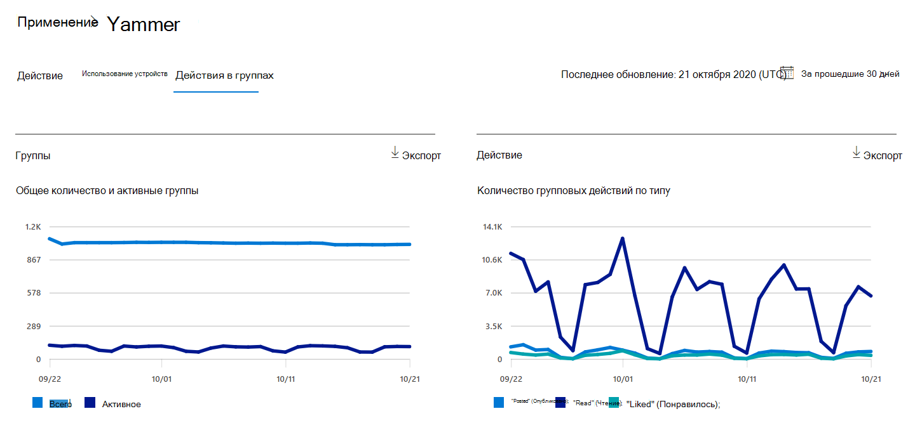
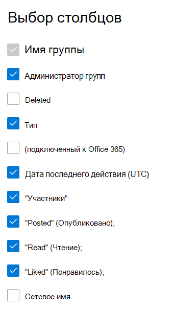

# Отчеты Microsoft 365 в центре администрирования — отчет о действиях в группах Yammer

На панели мониторинга **отчетов** Microsoft 365 вы увидите обзор действий по продуктам в вашей организации. Вы можете просмотреть отчеты по отдельным продуктам, чтобы получить более подробные сведения о действиях с каждым приложением. Ознакомьтесь с [общими сведениями о панели отчетов](activity-reports.md). В отчете о действиях в группах Yammer можно просмотреть сведения об активности, связанной с группами Yammer в вашей организации, и узнать, сколько групп создано и используется.
  
> [!NOTE]
> Для просмотра отчетов необходимо быть глобальным администратором, глобальным читателям или читателями отчетов в Microsoft 365 или Exchange, SharePoint, Teams Service, Team Communications или Skype для бизнеса.  
 
## Как перейти к отчету о действиях в группах Yammer?

1. В центре администрирования перейдите в раздел **отчеты о** \> <a href="https://go.microsoft.com/fwlink/p/?linkid=2074756" target="_blank">использование</a> страницы. 
2. На домашней странице панели мониторинга нажмите кнопку " **Дополнительные сведения** " на карточке Yammer.

  
## Анализ отчета о действиях в группах Yammer

Вы можете просмотреть действия групп в отчете Yammer, выбрав вкладку **действие группы** . 

Выберите **команду Выбрать столбцы** , чтобы добавить столбцы в отчет или удалить их из него.    

Вы также можете экспортировать данные отчета в CSV-файл Excel, щелкнув ссылку **Экспорт** . При этом данные всех пользователей будут экспортированы в формат, позволяющий сортировать и фильтровать их для дальнейшего анализа. Если у вас менее 2000 пользователей, вы можете сортировать и фильтровать значения в самой таблице отчета. Если пользователей больше 2000, для фильтрации и сортировки потребуется экспортировать данные. 
  
|Item|Описание|
|:-----|:-----|
|**Метрика**|**Определение**|
|Имя группы    |Имя группы.   |
|Администратор групп    |Имя администратора группы или владельца.    |
|Deleted    |Число удаленных групп Yammer. Если группа удалена, но в ней выполнялись действия в пределах отчетного периода, она будет показана в таблице, но этот флаг будет иметь значение ИСТИНА.    |
|Тип    |Тип группы, общедоступный или частный.   |
|Подключено к Office 365    |Указывает, является ли группа Yammer также группой Microsoft 365.   |
|Дата последнего действия (UTC)    | Самая поздняя дата, когда сообщение было прочитано, опубликовано или понравится группе.    |
|"Участники"    | Число членов в группе.    |
|"Posted" (Опубликовано);    |Количество сообщений, размещенных в группе Yammer за отчетный период.  |
|Чтение    |Количество бесед, прочитанных в группе Yammer за отчетный период.    |
|"Liked" (Понравилось);    |Количество сообщений, которые понравится в группе Yammer за отчетный период.  |
|Сетевое имя    |Полное имя сети, к которой принадлежит группа. |
|||