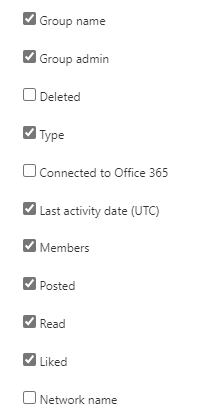

# Отчеты Microsoft 365 в Центре администрирования — отчет о действиях в группах YammerMicrosoft 365 Reports in the admin center - Yammer groups activity report

На информационной панели  "Отчеты Microsoft 365" представлен обзор действий в продуктах организации.The Microsoft 365 **Reports** dashboard shows you the activity overview across the products in your organization. Вы можете просмотреть отчеты по отдельным продуктам, чтобы получить более подробные сведения о действиях с каждым приложением.It enables you to drill in to individual product level reports to give you more granular insight about the activities within each product. Ознакомьтесь с [общими сведениями о панели отчетов](activity-reports.md).Check out [the Reports overview topic](activity-reports.md). В отчете о действиях в группах Yammer можно просмотреть сведения об активности, связанной с группами Yammer в вашей организации, и узнать, сколько групп создано и используется.In the Yammer groups activity report, you can gain insights into the activity of Yammer groups in your organization and see how many Yammer groups are being created and used.
  
> [!NOTE]
> Чтобы увидеть отчеты, вы должны быть глобальным администратором, глобальным читателем или читателем отчетов в Microsoft 365 или Exchange, SharePoint, службе Teams, коммуникациях Teams или администраторе Skype для бизнеса.You must be a global administrator, global reader or reports reader in Microsoft 365 or an Exchange, SharePoint, Teams Service, Teams Communications, or Skype for Business administrator to see reports.  

## Получение отчета о действиях в группах YammerHow to get to the Yammer groups activity report

1. В центре администрирования перейдите в раздел **отчеты о** \> <a href="https://go.microsoft.com/fwlink/p/?linkid=2074756" target="_blank">использование</a> страницы.In the admin center, go to the **Reports** \> <a href="https://go.microsoft.com/fwlink/p/?linkid=2074756" target="_blank">Usage</a> page.

    
2. В **выпадаемом окле "Выберите** отчет" выберите действия **"Группы Yammer".** \> From the **Select a report** drop-down, select **Yammer** \> **Groups activity**.
  
## Анализ отчета о действиях в группах YammerInterpret the Yammer groups activity report

Чтобы получить представление о действиях пользователей в группах Yammer, взгляните на диаграммы **Группы** и **Активность**.You can get a view into Yammer groups activity by looking at the **Groups** and **Activity** charts. 
  
|ЭлементItem|ОписаниеDescription|
|:-----|:-----|
|1.1.    |В отчете **Действия в группах Yammer** можно отследить тенденции за последние 7, 30, 90 и 180 дней.The **Yammer groups activity** report can be viewed for trends over the last 7 days, 30 days, 90 days, or 180 days. Однако если выбрать определенный день в отчете, в таблице (7) будут отображиться данные за 28 дней от текущей даты (а не даты, когда был создан отчет).However, if you select a particular day in the report, the table (7) will show data for up to 28 days from the current date (not the date the report was generated).    |
|2.2.    |Данные в каждом отчете обычно охватывают до последних 24-48 часов.The data in each report usually covers up to the last 24 to 48 hours.   |
|3.3.    |В представлении **Группы** показано общее количество существовавших групп и групп, в которых проходили беседы.The **Groups** view shows a total number of groups that existed , and how many performed group conversation activity.    |
|4.4.    |В представлении **Активность** отображается количество опубликованных, прочитанных и понравившихся пользователям сообщений в группах Yammer.The **Activity** view shows you the number Yammer messages posted, read, and liked in groups.    |
|5.5.    | На диаграмме **Группы** ось Y обозначает количество всех и активных групп.On the **Groups** chart, the Y axis is the count of total or active groups.     На диаграмме **Активность** ось Y представляет количество определенных действий в группах Yammer.On the **Activity** chart, the Y axis is the count of specified activity for Yammer groups.     На оси X всех трех диаграмм представлен диапазон дат, выбранный для отчета.The X axis on all three charts is the selected date range for the specific report.    |
|6.6.    |Вы можете отфильтровать ряды, которые вы видите на диаграмме, выбрав элемент в легенде.You can filter the series you see on the chart by selecting an item in the legend. Например, на диаграмме **"Группы"** выберите значки **"Всего"** или "Всего активных" и "Активные", чтобы увидеть только сведения, связанные   них.  For example, on the **Groups** chart, select **Total** or **Active**   to see only the info related to each one. При выборе другого значения данные в таблице-сетке не меняются.Changing this selection doesn't change the info in the grid table.    |
|7.7.    | Список отображаемых групп определяется набором групп, которые существовали (не были удалены) в самый продолжительный (180-дневный) период создания отчетов. Количество действий (полученных сообщений) зависит от выбранной даты.  The list of groups to show is determined by the set of all groups that existed (weren't deleted) across the widest (180-day) reporting time frame. The activity count (messages received) will vary according to the date selection.    ПРИМЕЧАНИЕ. Вы можете не увидеть все элементы в списке ниже в столбцах, пока не добавим их.NOTE: You might not see all the items in the list below in the columns until you add them. **Имя группы**: название группы.**Group name** is the name of the group.    **Администратор группы**: имя администратора или владельца группы.**Group admin** is the name of the group administrator, or owner.    **Удалена**: количество удаленных групп Yammer. Если группа удалена, но в ней выполнялись действия в пределах отчетного периода, она будет показана в таблице, но этот флаг будет иметь значение ИСТИНА.  **Deleted** is the number of deleted Yammer groups. If the group is deleted, but had activity in the reporting period it will show up in the grid with this flag set to true.    **Тип**: тип группы (общедоступная или частная).**Type** is the type of group, public or private.    **Подключение к Office 365** указывает, является ли группа Yammer также группой Microsoft 365.**Connected to Office 365** indicates whether the Yammer group is also an Microsoft 365 group.    **Дата последнего действия —** это последняя дата прочтия, публикации или понравившейся группе публикации сообщения.**Last activity date** is the latest date a message was read, posted or liked by the group.    **Участники**: число участников группы.**Members** is the number of members in the group.    **Опубликовано**: количество сообщений, опубликованных в группе Yammer за отчетный период.**Posted** is the number of messages posted in the Yammer group over the reporting period.    **Прочитано**: количество бесед, прочитанных в группе Yammer за отчетный период.**Read** is the number of conversations read in the Yammer group over the reporting period.    **Присвоена отметка "Нравится"**: количество сообщений в группе Yammer, которым была присвоена отметка "Нравится" за отчетный период.**Liked** is the number of messages liked in the Yammer group over the reporting period.   **Сетевое** имя — это полное имя сети, к которой принадлежит группа.**Network name** is the full name of the network that the group belongs to.    Если политики организации не позволяют просматривать отчеты, в которых есть личные сведения пользователей, можно изменить параметр конфиденциальности для всех отчетов.If your organization's policies prevents you from viewing reports where user information is identifiable, you can change the privacy setting for all these reports. Ознакомьтесь с **разделом "Как скрыть** сведения об уровне пользователя"? В отчетах об активности в Центре администрирования [Microsoft 365.](activity-reports.md)Check out the **How do I hide user level details?** section in [Activity reports in the Microsoft 365 admin center](activity-reports.md).    |
|8.8.    |Выберите **столбцы,** чтобы добавить или удалить столбцы из отчета.Select **Columns** to add or remove columns from the report.    |
|9.9.    |Вы также можете экспортировать данные отчета в CSV-файл Excel, выбрав ссылку **"Экспорт".**You can also export the report data into an Excel .csv file, by selecting the **Export** link. При этом данные всех пользователей будут экспортированы в формат, позволяющий сортировать и фильтровать их для дальнейшего анализа.This exports data of all users and enables you to do simple sorting and filtering for further analysis. Если у вас менее 2000 пользователей, вы можете сортировать и фильтровать значения в самой таблице отчета.If you have less than 2000 users, you can sort and filter within the table in the report itself. Если пользователей больше 2000, для фильтрации и сортировки потребуется экспортировать данные.If you have more than 2000 users, in order to filter and sort, you will need to export the data.    |
|||
   

