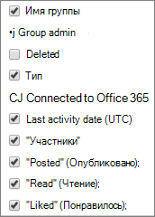

# Отчеты Microsoft 365 в центре администрирования — отчет о действиях в группах Yammer

На панели мониторинга **отчетов** Microsoft 365 вы увидите обзор действий по продуктам в вашей организации. Вы можете просмотреть отчеты по отдельным продуктам, чтобы получить более подробные сведения о действиях с каждым приложением. Ознакомьтесь с [общими сведениями о панели отчетов](activity-reports.md). В отчете о действиях в группах Yammer можно просмотреть сведения об активности, связанной с группами Yammer в вашей организации, и узнать, сколько групп создано и используется.
  
> [!NOTE]
> Для просмотра отчетов необходимо быть глобальным администратором, глобальным читателям или читателями отчетов в Microsoft 365 или Exchange, SharePoint, Teams Service, Team Communications или Skype для бизнеса.  

## Получение отчета о действиях в группах Yammer

1. В центре администрирования перейдите в раздел **отчеты о** \> <a href="https://go.microsoft.com/fwlink/p/?linkid=2074756" target="_blank">использование</a> страницы.

    
2. В раскрывающемся списке **выберите отчет** выберите **действие группы** **Yammer** \> .
  
## Анализ отчета о действиях в группах Yammer

Чтобы получить представление о действиях пользователей в группах Yammer, взгляните на диаграммы **Группы** и **Активность**. 
  
|||
|:-----|:-----|
|1.    |В отчете **Действия в группах Yammer** можно отследить тенденции за последние 7, 30, 90 и 180 дней. Тем не менее, если выбрать определенный день в отчете, в таблице (7) будут отображаться данные в течение 28 дней с текущей даты (не Дата создания отчета).    |
|2.    |Данные в каждом отчете обычно закрываются в течение последних 24 – 48 часов.   |
|3.    |В представлении **Группы** показано общее количество существовавших групп и групп, в которых проходили беседы.    |
|4.    |В представлении **Активность** отображается количество опубликованных, прочитанных и понравившихся пользователям сообщений в группах Yammer.    |
|5.    | На диаграмме **Группы** ось Y обозначает количество всех и активных групп.     На диаграмме **Активность** ось Y представляет количество определенных действий в группах Yammer.     На оси X всех трех диаграмм представлен диапазон дат, выбранный для отчета.    |
|6.    |Вы можете отфильтровать ряды, которые вы видите на диаграмме, выбрав элемент в условных обозначениях. Например, на диаграмме **группы** выберите **итоговые** или **Активные** , чтобы просмотреть только сведения, относящиеся к каждому из них.   При выборе другого значения данные в таблице-сетке не меняются.    |
|7.    | Список отображаемых групп определяется набором групп, которые существовали (не были удалены) в самый продолжительный (180-дневный) период создания отчетов. Количество действий (полученных сообщений) зависит от выбранной даты.    Примечание. в столбцах могут отображаться не все элементы списка, пока вы не добавите их. **Имя группы**: название группы.    **Администратор группы**: имя администратора или владельца группы.    **Удалена**: количество удаленных групп Yammer. Если группа удалена, но в ней выполнялись действия в пределах отчетного периода, она будет показана в таблице, но этот флаг будет иметь значение ИСТИНА.    **Тип**: тип группы (общедоступная или частная).    **Подключение к Office 365** указывает, является ли группа Yammer также группой Microsoft 365.    **Дата последнего действия** — это самая поздняя дата, когда сообщение было прочитано, опубликовано или понравится группе.    **Участники**: число участников группы.    **Опубликовано**: количество сообщений, опубликованных в группе Yammer за отчетный период.    **Прочитано**: количество бесед, прочитанных в группе Yammer за отчетный период.    **Присвоена отметка "Нравится"**: количество сообщений в группе Yammer, которым была присвоена отметка "Нравится" за отчетный период.     Если политики организации не позволяют просматривать отчеты, в которых есть личные сведения пользователей, можно изменить параметр конфиденциальности для всех отчетов. Ознакомьтесь с разделом " **как скрыть сведения о уровне пользователя?** " в разделе [отчеты об активности в центре администрирования Microsoft 365](activity-reports.md).    |
|8.    |Выберите **столбцы** , чтобы добавить столбцы в отчет или удалить их из него.    |
|9.    |Вы также можете экспортировать данные отчета в CSV-файл Excel, выбрав ссылку **Экспорт** . При этом данные всех пользователей будут экспортированы в формат, позволяющий сортировать и фильтровать их для дальнейшего анализа. Если у вас менее 2000 пользователей, вы можете сортировать и фильтровать значения в самой таблице отчета. Если пользователей больше 2000, для фильтрации и сортировки потребуется экспортировать данные.    |
|||
   

