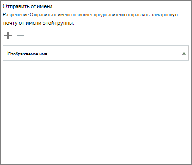

# Разрешение пользователям отправлять сообщения от имени группы или отправлять от негоAllow members to send as or send on behalf of a Group

Член группы Microsoft 365, которому предоставлены разрешения " **Отправить как** " или " **Отправить от имени** ", может отправлять сообщения электронной почты в виде группы или от имени группы.A member of a Microsoft 365 group who has been granted **Send as** or **Send on behalf** permissions can send email as the group, or on behalf of the group. В этом разделе объясняется, как администратор может настроить эти разрешения.This topic explains how an admin can set these permissions.
  
Например, если Меган Бовен входит в **учебную** группу Microsoft 365 и имеет разрешения " **Отправить как** " для группы, то, если она отправляет сообщение электронной почты в качестве группы, она будет выглядеть так, как **учебная** группа отправила сообщение электронной почты.For example, if Megan Bowen is part of the **Training** Microsoft 365 group, and has **Send as** permissions on the group, if she sends an email as the group, it will look like the **Training** group sent the email. 
  
Разрешение " **Отправить от имени** " позволяет пользователю отправлять электронную почту от имени группы Microsoft 365.The **Send on Behalf** permission lets a user send email on behalf of a Microsoft 365 group. Например, если Алекс Вилбер является частью группы **маркетинга** Microsoft 365 и имеет разрешения **на отправку от имени** и отправляет сообщение электронной почты в качестве группы, сообщение будет выглядеть так, как было отправлено **Вилбер от имени маркетингового отдела**.For example, if Alex Wilber is a part of the **Marketing** Microsoft 365 group, and has **Send on Behalf** permissions and sends an email as the group, the email looks like it was sent by **Alex Wilber on behalf of Marketing**.

> [!IMPORTANT]
> Вы можете настроить " **Отправить как** " или " **Отправить от имени** " для определенного пользователя, но не для обоих.You can configure **Send as** or **Send on behalf** for a given user, but not both. Если вы настроили оба значения, то по умолчанию будет **отправляться как**.If you configure both, it will default to **Send as**.

> [!TIP]
> Чтобы узнать, как использовать Outlook и Outlook в Интернете для отправки электронной почты из группы, обратитесь к разделу [Отправка сообщений от имени или от имени группы майкрософт 365](https://support.office.com/article/0f4964af-aec6-484b-a65c-0434df8cdb6b.aspx) .See [Send email from or on behalf of a Microsoft 365 group](https://support.office.com/article/0f4964af-aec6-484b-a65c-0434df8cdb6b.aspx) to learn how to use Outlook and Outlook on the Web to send email from a group.
    
## Разрешение участникам отправлять электронную почту как группуAllow members to send email as a group

В этом разделе объясняется, как разрешить пользователям отправлять электронную почту как группу в [центре администрирования Exchange](https://go.microsoft.com/fwlink/p/?linkid=2059104) в Exchange Online.This section explains how to allow users to send email as a group in the [Exchange admin center](https://go.microsoft.com/fwlink/p/?linkid=2059104) (EAC) in Exchange Online.
  
1. В <a href="https://go.microsoft.com/fwlink/p/?linkid=2059104" target="_blank">центре администрирования Exchange</a>перейдите в раздел группы **получателей** \> **Groups**.In the <a href="https://go.microsoft.com/fwlink/p/?linkid=2059104" target="_blank">Exchange admin center</a>, go to **Recipients** \> **Groups**.
    
2. Выберите команду **изменить** редактирования группы для группы, которую нужно разрешить пользователям отправлять.  Select **Edit**   on Group that you want to allow users to send as. 
    
3. Выберите пункт **Делегирование группы**.Select **group delegation**.
    
4. В разделе **Отправить как** выберите **+** знак, чтобы добавить пользователей, которых нужно отправить в качестве группы.In the **Send As** section, select the **+** sign to add the users that you want to send as the Group. 
    
    
  
5. Введите имя, чтобы найти пользователя, или выберите его из списка.Type to search or pick a user from the list. Нажмите кнопку **ОК** и **Сохраните**.Select **OK** and **Save**.
    
    
  
## Разрешение участникам отправлять электронную почту от имени группыAllow members to send email on behalf of a group

В этом разделе объясняется, как разрешить пользователям отправлять электронную почту от имени группы в центре администрирования Exchange в Exchange Online.This section explains how to allow users to send email on behalf of a group in the Exchange admin center (EAC) in Exchange Online.
  
1. В <a href="https://go.microsoft.com/fwlink/p/?linkid=2059104" target="_blank">центре администрирования Exchange</a>перейдите в раздел группы **получателей** \> **Groups**.In the <a href="https://go.microsoft.com/fwlink/p/?linkid=2059104" target="_blank">Exchange admin center</a>, go to **Recipients** \> **Groups**.
    
2. Выберите команду **изменить**  редактирования группы для группы, которую нужно разрешить пользователям отправлять.Select **Edit**  on the Group that you want to allow users to send as. 
    
3. Выберите пункт **Делегирование группы**.Select **group delegation**.
    
4. В разделе Отправить от имени выберите **+** знак, чтобы добавить пользователей, которых нужно отправить в качестве группы.In the Send on Behalf section, select the **+** sign to add the users that you want to send as the Group. 
    
    
  
5. Введите имя, чтобы найти пользователя, или выберите его из списка.Type to search or pick a user from the list. Нажмите кнопку **ОК** и **Сохраните**.Select **OK** and **Save**.
    
    

## Связанные статьиRelated articles

[Дополнительные сведения о группах Microsoft 365Learn more about Microsoft 365 groups](https://support.office.com/article/learn-about-office-365-groups-b565caa1-5c40-40ef-9915-60fdb2d97fa2)

[Add — RecipientPermissionAdd-RecipientPermission](https://go.microsoft.com/fwlink/p/?LinkId=723960)

[Set — UnifiedGroupSet-UnifiedGroup](https://go.microsoft.com/fwlink/p/?LinkId=616189)
