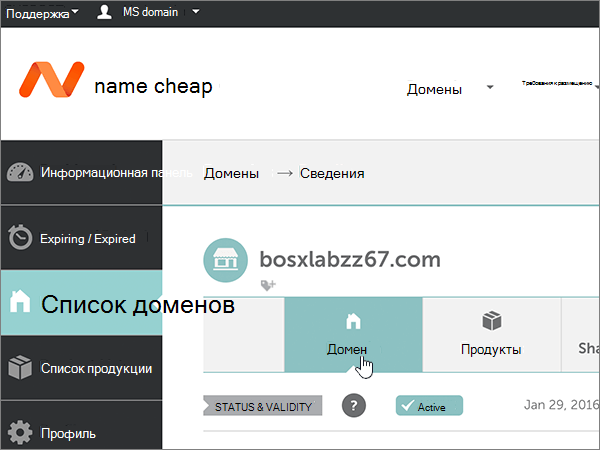

# Изменение доменных имен для microsoft namecheapChange nameservers to set up Microsoft with Namecheap

 Если вы не нашли то, что вы ищете, см. раздел **[Вопросы и ответы по доменам](../setup/domains-faq.yml)**.**[Check the Domains FAQ](../setup/domains-faq.yml)** if you don't find what you're looking for.
  
Следуйте этим инструкциям, если вы хотите, чтобы корпорация Майкрософт управляет вашими записями DNS.Follow these instructions if you want Microsoft to manage your DNS records for you. (При этом вы можете управлять всеми своими записями DNS microsoft [на сайте Namecheap.)](create-dns-records-at-namecheap.md)(If you prefer, you can [manage all your Microsoft DNS records at Namecheap](create-dns-records-at-namecheap.md).)
  
    
## Добавление записи TXT для проверкиAdd a TXT record for verification

1. Чтобы приступить к работе, откройте страницу со своими доменами на сайте Namecheap по [этой ссылке](https://www.namecheap.com/myaccount/login.aspx?ReturnUrl=%2f). Вам потребуется войти в службу.To get started, go to your domains page at Namecheap by using [this link](https://www.namecheap.com/myaccount/login.aspx?ReturnUrl=%2f). You'll be prompted to Sign in and Continue.
    
    
  
2. On the **Landing** page, under **Account,** choose **Domain List** from the drop-down list.On the **Landing** page, under **Account**, choose **Domain List** from the drop-down list. 
    
    
  
3. На странице **"Список доменов"** найдите имя домена, который нужно изменить, а затем выберите **"Управление".**On the **Domain List** page, find the name of the domain that you want to edit, and then select **Manage**.
    
    
  
4. Выберите **"Расширенные DNS".**Select **Advanced DNS**.
    
    
  
5. В разделе **"ЗАПИСИ HOST"** выберите **"ДОБАВИТЬ НОВУЮ ЗАПИСЬ".**In the **HOST RECORDS** section, select **ADD NEW RECORD**.
    
    
  
6. В раскрывающемся списке **Type** (Тип) выберите **TXT Record** (Запись TXT).In the **Type** drop-down, select **TXT Record**.
    
    > [!NOTE]
    > При **выборе** "ADD NEW RECORD" автоматически появляется выпадайка **"Тип".**The **Type** drop-down automatically appears when you select **ADD NEW RECORD**.
  
    
  
7. В поля для новой записи введите (или скопируйте и вставьте) значения из таблицы ниже.In the boxes for the new record, type or copy and paste the values from the following table.
    
    (Выберите значение **TTL** в выпадаемом списке.)(Choose the **TTL** value from the drop-down list.) 
    
|**Type (Тип)****Type**|**Host (Узел)****Host**|**Value** (Значение)**Value**|**TTL** (Срок жизни)**TTL**|
|:-----|:-----|:-----|:-----|
|TXTTXT    |@    |MS=ms *XXXXXXXX*MS=ms *XXXXXXXX*    **Примечание.** Это пример.**Note**: This is an example. Используйте здесь свое конкретное значение **Назначение или адрес "Указывает на"** из этой таблицы.Use your specific **Destination or Points to Address** value here, from the table.           [Как его найти?How do I find this?](../get-help-with-domains/information-for-dns-records.md)          |30 мин30 min    |
   
   
  
8. Выберите **контрольный знак** "Сохранить изменения".Select the **Save Changes** (check mark) control. 
    
    
  
9. Подождите несколько минут, пока созданная запись не будет обновлена в Интернете.Wait a few minutes before you continue, so that the record you just created can update across the Internet.
    
Теперь, когда вы добавили запись на сайте регистратора доменных имен, вы вернемся в корпорацию Майкрософт и запросите поиск записи.Now that you've added the record at your domain registrar's site, you'll go back to Microsoft and request a search for the record.
  
Когда продукт корпорации Майкрософт обнаружит правильную запись TXT, ваш домен будет подтвержден.When Microsoft finds the correct TXT record, your domain is verified.
  
1. В Центре администрирования перейдите на страницу **Settings** (Параметры) \> <a href="https://go.microsoft.com/fwlink/p/?linkid=834818" target="_blank">Domains</a> (Домены).In the admin center, go to the **Settings** \> <a href="https://go.microsoft.com/fwlink/p/?linkid=834818" target="_blank">Domains</a> page.

    
2. На странице **Domains** (Домены) выберите домен, который нужно проверить.On the **Domains** page, select the domain that you are verifying. 
    
    
  
3. На странице **Setup** (Настройка) выберите **Start setup** (Начать настройку).On the **Setup** page, select **Start setup**.
    
    
  
4. На странице **Проверка домена** выберите **Проверить**.On the **Verify domain** page, select **Verify**.
    
    
  
> [!NOTE]
>  Обычно на вступление изменений DNS в силу требуется около 15 минут. Однако иногда распространение внесенного изменения в системе DNS по всему Интернету занимает больше времени. Если после добавления записей DNS возникла проблема с потоком обработки почты или другие неполадки, см. статью [Устранение неполадок после смены имени домена или записей DNS](../get-help-with-domains/find-and-fix-issues.md).Typically it takes about 15 minutes for DNS changes to take effect. However, it can occasionally take longer for a change you've made to update across the Internet's DNS system. If you're having trouble with mail flow or other issues after adding DNS records, see [Troubleshoot issues after changing your domain name or DNS records](../get-help-with-domains/find-and-fix-issues.md). 
  
## Изменение записей сервера доменных именChange your domain's nameserver (NS) records

Чтобы завершить настройку домена с помощью Майкрософт, измените записи доменных имен своего домена у регистратора доменных имен, указав на основной и дополнительный серверы имен Майкрософт.To complete setting up your domain with Microsoft, you change your domain's NS records at your domain registrar to point to the Microsoft primary and secondary name servers. Это настраивает Майкрософт для обновления записей DNS домена за вас.This sets up Microsoft to update the domain's DNS records for you. Мы добавим все записи, так что электронная почта, Skype для бизнеса online и общедоступный веб-сайт будут работать в вашем домене и вам больше не придется ничего настраивать.We'll add all records so that email, Skype for Business Online, and your public website work with your domain, and you'll be all set.
  
> [!CAUTION]
> При изменении записей сервера доменных имен таким образом, чтобы они указывают на серверы доменных имен Майкрософт, это влияет на все службы, связанные с вашим доменом.When you change your domain's NS records to point to the Microsoft name servers, all the services that are currently associated with your domain are affected. Например, все сообщения электронной почты, отправленные на ваш домен (например, rob@ *your_domain*  .com), после внести это изменение в корпорацию Майкрософт начнут приходить в корпорацию Майкрософт.For example, all email sent to your domain (like rob@ *your_domain*  .com) will start coming to Microsoft after you make this change. 
  
> [!IMPORTANT]
>  После выполнения действий, описанных в этом разделе, в списке должны быть указаны  *только*  следующие четыре сервера имен: >  ns1.bdm.microsoftonline.com >  ns2.bdm.microsoftonline.com >  ns3.bdm.microsoftonline.com >  ns4.bdm.microsoftonline.com >  В приведенной ниже процедуре показано, как удалить из списка все остальные, нежелательные серверы имен, а также как добавить  *правильные*  серверы имен, если их еще нет в данном списке.When you have completed the steps in this section, the  *only*  nameservers that should be listed are these four: >  ns1.bdm.microsoftonline.com >  ns2.bdm.microsoftonline.com >  ns3.bdm.microsoftonline.com >  ns4.bdm.microsoftonline.com >  The following procedure will show you how to delete any other, unwanted nameservers from the list, and also how to add the  *correct*  nameservers if they are not already in the list. 
  
1. Чтобы приступить к работе, откройте страницу со своими доменами на сайте Namecheap по [этой ссылке](https://www.namecheap.com/myaccount/login.aspx?ReturnUrl=%2f). Вам потребуется войти в службу.To get started, go to your domains page at Namecheap by using [this link](https://www.namecheap.com/myaccount/login.aspx?ReturnUrl=%2f). You'll be prompted to Sign in and Continue.
    
    
  
2. On the **Landing** page, under **Account,** choose **Domain List** from the drop-down list.On the **Landing** page, under **Account**, choose **Domain List** from the drop-down list. 
    
    
  
3. На странице **"Список доменов"** найдите имя домена, который нужно изменить, а затем выберите **"Управление".**On the **Domain List** page, find the name of the domain that you want to edit, and then select **Manage**.
    
    
  
4. Выберите **домен.**Select **Domain**.
    
    
  
5. Найдите раздел **NAMESERVERS** (Серверы доменных имен), а затем выберите **Custom** (Другое) в раскрывающемся списке **Namecheap Default** (Значения Namecheap по умолчанию).Find the **NAMESERVERS** section, and then select **Custom** from the **Namecheap Default** drop-down list. 
    
    
  
6. В зависимости от того, есть ли на странице, которая отображается сейчас, уже есть или нет, продолжите одну из двух следующих процедур.Depending on whether or not there are already nameservers listed on the page that is displayed now, continue to one of the two following procedures.
    
### На странице НЕ УКАЗАНЫ серверы доменных именIf there are NO nameservers already listed

1. Дважды **выберите ADD NAMESERVER,** чтобы добавить две новые строки.Select **ADD NAMESERVER** twice to add two new rows.
    
    
  
2. В поля **Nameserver** (Сервер доменных имен) введите (или скопируйте и вставьте) значения из таблицы ниже.In the **Nameserver** boxes, type or copy and paste the values from the following table.
    
|||
|:-----|:-----|
|**Nameserver 1** (Сервер доменных имен 1)**Nameserver 1**   |ns1.bdm.microsoftonline.comns1.bdm.microsoftonline.com    |
|**Nameserver 2** (Сервер доменных имен 2)**Nameserver 2**   |ns2.bdm.microsoftonline.comns2.bdm.microsoftonline.com    |
|**Nameserver 3** (Сервер доменных имен 3)**Nameserver 3**   |ns3.bdm.microsoftonline.comns3.bdm.microsoftonline.com    |
|**Nameserver 4** (Сервер доменных имен 4)**Nameserver 4**   |ns4.bdm.microsoftonline.comns4.bdm.microsoftonline.com    |
   
   
  
3. Выберите **контрольный знак** "Сохранить".Select the **Save** (check mark) control. 
    
    
  
> [!NOTE]
> На распространение изменений, внесенных вами в записи серверов имен, в системе DNS по всему Интернету может потребоваться несколько часов.Your nameserver record updates may take up to several hours to update across the Internet's DNS system. Затем ваша почта Майкрософт и другие службы будут настроены для работы с вашим доменом.Then your Microsoft email and other services will be all set to work with your domain. 
  
### На странице УКАЗАНЫ серверы доменных именIf there ARE nameservers already listed

> [!CAUTION]
> Выполните эти действия,  *только*  если у вас есть серверы доменных имен, отличные от четырех  *правильных*  серверов. (Т. е. удалите  *только*  серверы доменных имен,  *отличные*  от **ns1.bdm.microsoftonline.com**, **ns2.bdm.microsoftonline.com**, **ns3.bdm.microsoftonline.com** и **ns4.bdm.microsoftonline.com**.)Follow these steps  *only*  if you have existing nameservers other than the four  *correct*  nameservers. (That is, delete  *only*  any current nameservers that are  *not*  named **ns1.bdm.microsoftonline.com**, **ns2.bdm.microsoftonline.com**, **ns3.bdm.microsoftonline.com**, or **ns4.bdm.microsoftonline.com**.) 
  
1. Если в полях **Nameserver** (Сервер доменных имен) указаны другие серверы доменных имен, удалите их: выберите каждый из них и нажмите клавишу **DELETE**.If there are any other nameservers listed in the **Nameserver** boxes, delete each one by selecting it and then pressing the **Delete** key on your keyboard. 
    
    
  
2. Дважды **выберите ADD NAMESERVER,** чтобы добавить две новые строки.Select **ADD NAMESERVER** twice to add two new rows. 
    
    
  
3. В поля **Nameserver** (Сервер доменных имен) введите (или скопируйте и вставьте) значения из таблицы ниже.In the **Nameserver** boxes, type or copy and paste the values from the following table.
 
    
|||
|:-----|:-----|
|**Name Server 1** (Сервер доменных имен 1)**Name Server 1**   |ns1.bdm.microsoftonline.comns1.bdm.microsoftonline.com    |
|**Name Server 2** (Сервер доменных имен 2)**Name Server 2**   |ns2.bdm.microsoftonline.comns2.bdm.microsoftonline.com    |
|**Nameserver 3** (Сервер доменных имен 3)**Nameserver 3**   |ns3.bdm.microsoftonline.comns3.bdm.microsoftonline.com    |
|**Nameserver 4** (Сервер доменных имен 4)**Nameserver 4**   |ns4.bdm.microsoftonline.comns4.bdm.microsoftonline.com    |
   
   
  
4. Выберите **контрольный знак** "Сохранить".Select the **Save** (check mark) control. 
    
    
  
> [!NOTE]
> На распространение изменений, внесенных вами в записи серверов имен, в системе DNS по всему Интернету может потребоваться несколько часов.Your nameserver record updates may take up to several hours to update across the Internet's DNS system. Затем ваша почта Майкрософт и другие службы будут настроены для работы с вашим доменом.Then your Microsoft email and other services will be all set to work with your domain.
