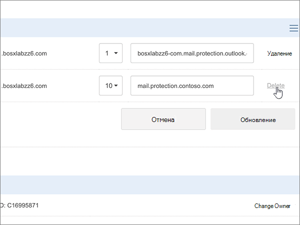

# Создание записей DNS в Crazy Domains для Microsoft

 **[Вопросы и ответы по доменам](../setup/domains-faq.yml)**. 
  
Если ваш поставщик услуг размещения DNS — Crazy Domains, выполните действия, описанные в этой статье, чтобы подтвердить владение доменом и настроить записи DNS для электронной почты, Skype для бизнеса online и других служб.
  
После добавления этих записей в Crazy Domains домен будет настроен на работу с службами Майкрософт.
  

  
> [!NOTE]
> Обычно на вступление изменений DNS в силу требуется около 15 минут. Однако иногда распространение внесенного изменения в системе DNS по всему Интернету занимает больше времени. Если после добавления записей DNS возникла проблема с потоком обработки почты или другие неполадки, см. статью [Устранение неполадок после смены имени домена или записей DNS](../get-help-with-domains/find-and-fix-issues.md). 
  
## Добавление записи TXT для проверки

Прежде чем вы сможете использовать свой домен при работе с продуктами корпорации Майкрософт, мы должны убедиться в том, что вы являетесь его владельцем. Если вы войдете в свою учетную запись на сайте регистратора доменных имен и создадите запись DNS, для корпорации Майкрософт это послужит подтверждением того, что вы владеете доменом.
  
> [!NOTE]
> Эта запись используется исключительно для проверки принадлежности домена. При желании вы сможете удалить ее позже. 
  
1. Чтобы приступить к работе, откройте страницу со своими доменами на сайте Crazy Domains по [этой ссылке](https://manage.crazydomains.com/members/domains/). Сначала вам потребуется выполнить вход.
    
    
  
2. В разделе **Моя учетная запись** выберите **домены**.
    
    
  
3. На странице **Доменные имена** в разделе **Домен** выберите имя обновляемого домена. 
    
    
  
4. В разделе **Параметры DNS** выберите значок списка сброса. 
    
    
  
5. Выберите команду **Add Record** (Добавить запись).
    
    
  
6. В раскрывающемся списке **Add Record** (Добавить запись) выберите пункт **TXT Record** (Запись TXT). 
    
    
  
7. Нажмите **Добавить**.
    
    
  
8. В поля для новой записи введите (или скопируйте и вставьте) значения из таблицы ниже.
    
    |**Sub Domain (Поддомен)**|**Text Record (Текстовая запись)**|
    |:-----|:-----|
    |(Оставьте это поле пустым.)    |MS=ms *XXXXXXXX*    **Примечание.** Это пример. Используйте здесь свое конкретное значение **Назначение или адрес "Указывает на"** из этой таблицы.           [Как его найти?](../get-help-with-domains/information-for-dns-records.md)          |
   
    
  
9. Нажмите кнопку **Обновить**.
    
    
  
10. Подождите несколько минут, пока созданная запись не будет обновлена в Интернете.
    
Теперь, когда запись добавлена на веб-сайт регистратора доменных имен, вернитесь в продукт корпорации Майкрософт и запросите эту запись.
  
Когда продукт корпорации Майкрософт обнаружит правильную запись TXT, ваш домен будет подтвержден.
  
1. В центре администрирования Майкрософт перейдите на страницу **Настройка** \> <a href="https://go.microsoft.com/fwlink/p/?linkid=834818" target="_blank">Домены</a>.

    
2. На странице **Domains** (Домены) выберите домен, который нужно проверить. 
    
    
  
3. На странице **Setup** (Настройка) выберите **Start setup** (Начать настройку).
    
    
  
4. На странице **Проверка домена** выберите **Проверить**.
    
    
  
> [!NOTE]
>  Обычно на вступление изменений DNS в силу требуется около 15 минут. Однако иногда распространение внесенного изменения в системе DNS по всему Интернету занимает больше времени. Если после добавления записей DNS возникла проблема с потоком обработки почты или другие неполадки, см. статью [Устранение неполадок после смены имени домена или записей DNS](../get-help-with-domains/find-and-fix-issues.md). 
  
## Добавьте запись MX, чтобы сообщения электронной почты для вашего домена доставлялись в продукты корпорации Майкрософт.

1. Чтобы приступить к работе, откройте страницу со своими доменами на сайте Crazy Domains по [этой ссылке](https://manage.crazydomains.com/members/domains/). Сначала вам потребуется выполнить вход.
    
    
  
2. В разделе **Моя учетная запись** выберите **домены**.
    
    
  
3. На странице **Доменные имена** в разделе **Домен** выберите имя обновляемого домена. 
    
    
  
4. В разделе **Параметры DNS** выберите значок списка сброса. 
    
    
  
5. Выберите команду **Add Record** (Добавить запись).
    
    
  
6. В раскрывающемся списке **Add Record:** (Добавить запись) выберите пункт **MX Record** (Запись MX). 
    
    
  
7. Нажмите **Добавить**.
    
    
  
8. В поля для новой записи введите (или скопируйте и вставьте) значения из таблицы ниже.
    
    (Выберите **значение Priority** из выпадаемого списка.) 
    
    |**Mail For Zone (Почта для зоны)**|**Priority (Приоритет)**|**Assigned To Server (Назначено серверу)**|
    |:-----|:-----|:-----|
    |(Оставьте это поле пустым.)    |1    Дополнительные сведения о приоритете см. в статье [Что такое приоритет записей MX?](../setup/domains-faq.yml).   | *\<domain-key\>*  .mail.protection.outlook.com    **Примечание:** Получите вашу  *\<domain-key\>*  учетную запись Майкрософт.           [Как его найти?](../get-help-with-domains/information-for-dns-records.md)          |
       
   
  
9. Нажмите кнопку **Обновить**.
    
    
  
10. Если в разделе MX Record указаны другие записи **MX,** выберите **Изменение** для одной из этих записей. 
    
    
  
11. Нажмите **Удалить**.
    
    
  
12. Выберите **Обновление,** чтобы подтвердить удаление. 
    
    
  
13. Повторите эти действия для удаления из списка всех остальных записей MX, кроме той, которую вы добавили на предыдущих шагах.
    
## Добавление шести записей CNAME, необходимых для Корпорации Майкрософт

1. Чтобы приступить к работе, откройте страницу со своими доменами на сайте Crazy Domains по [этой ссылке](https://manage.crazydomains.com/members/domains/). Сначала вам потребуется выполнить вход.
    
    
  
2. В разделе **Моя учетная запись** выберите **домены**.
    
    
  
3. На странице **Доменные имена** в разделе **Домен** выберите имя обновляемого домена. 
    
    
  
4. В разделе **Параметры DNS** выберите значок списка сброса. 
    
    
  
5. Выберите команду **Add Record** (Добавить запись).
    
    
  
6. В раскрывающемся списке **Add Record:** (Добавить запись) выберите пункт **CNAME Record** (Запись CNAME). 
    
    
  
7. Нажмите **Добавить**.
    
    
  
8. Добавьте первую из шести записей CNAME.
    
    В поля для новой записи введите (или скопируйте и вставьте) значения из первой строки таблицы ниже.
    
    |**Sub Domain (Поддомен)**|**Alias for (Псевдоним для)**|
    |:-----|:-----|
    |autodiscover    |autodiscover.outlook.com    |
    |sip    |sipdir.online.lync.com    |
    |lyncdiscover    |webdir.online.lync.com    |
    |enterpriseregistration    |enterpriseregistration.windows.net    |
    |enterpriseenrollment    |enterpriseenrollment-s.manage.microsoft.com    |
   
    
  
9. Выберите **Добавить запись CNAME**.
    
    
  
10. Добавьте вторую запись CNAME.
    
    В полях для новой записи используйте значения из следующей строки в таблице и снова выберите **Add CNAME Record**.
    
    Повторяйте эти действия, пока не будут созданы все шесть записей CNAME.
    
11. Выберите **Обновление,** чтобы сохранить изменения. 
    
    
  
## Добавление записи TXT для SPF, предотвращающей рассылку спама

> [!IMPORTANT]
> Для записи инфраструктуры политики отправителей (SPF) для домена можно указать только одну запись TXT. Если у вашего домена больше одной записи SPF, это приведет к сбоям в работе почты и ошибкам классификации входящих писем и спама. Если вы уже указали запись SPF для домена, не создавайте еще одну для продуктов корпорации Майкрософт. Вместо этого добавьте необходимые значения Microsoft в текущую  запись, чтобы у вас была одна запись SPF, которая включает оба набора значений. 
  
1. Чтобы приступить к работе, откройте страницу со своими доменами на сайте Crazy Domains по [этой ссылке](https://manage.crazydomains.com/members/domains/). Сначала вам потребуется выполнить вход.
    
    
  
2. В разделе **Моя учетная запись** выберите **домены**.
    
    
  
3. На странице **Доменные имена** в разделе **Домен** выберите имя обновляемого домена. 
    
    
  
4. В разделе **Параметры DNS** выберите значок списка сброса. 
    
    
  
5. Выберите команду **Add Record** (Добавить запись).
    
    
  
6. В раскрывающемся списке **Add Record:** (Добавить запись) выберите пункт **TXT Record** (Запись TXT). 
    
    
  
7. Нажмите **Добавить**.
    
    
  
8. В поля для новой записи введите или вставьте значения из таблицы ниже.
    
    |**Sub Domain (Поддомен)**|**Text Record (Текстовая запись)**|
    |:-----|:-----|
    |(Оставьте это поле пустым.)    |v=spf1 include:spf.protection.outlook.com -all    **Примечание.** Рекомендуется скопировать и вставить эту запись, чтобы сохранить все пробелы.               |
   
    
  
9. Нажмите кнопку **Обновить**.
    
    
  
## Добавление двух записей SRV, необходимых для продуктов корпорации Майкрософт

1. Чтобы приступить к работе, откройте страницу со своими доменами на сайте Crazy Domains по [этой ссылке](https://manage.crazydomains.com/members/domains/). Сначала вам потребуется выполнить вход.
    
    
  
2. В разделе **Моя учетная запись** выберите **домены**.
    
    
  
3. На странице **Доменные имена** в разделе **Домен** выберите имя обновляемого домена. 
    
    
  
4. В разделе **Параметры DNS** выберите значок списка сброса. 
    
    
  
5. Выберите команду **Add Record** (Добавить запись).
    
    
  
6. В раскрывающемся списке **Add Record:** (Добавить запись) выберите пункт **SRV Record** (Запись SRV). 
    
    
  
7. Нажмите **Добавить**.
    
    
  
8. Добавьте первую из двух записей SRV.
    
    В поля для новой записи введите (или скопируйте и вставьте) значения из первой строки таблицы ниже.
    
    |**Record Type (Тип записи)**|**Sub Domain (Поддомен)**|**Priority** (Приоритет)|**Weight** (Вес)|**Port** (Порт)|**Target (Назначение)**|
    |:-----|:-----|:-----|:-----|:-----|:-----|
    |SRV Record (Запись SRV)    |_sip._tls    |100    |1    |443    |sipdir.online.lync.com    |
    |SRV Record (Запись SRV)    |_sipfederationtls._tcp    |100    |1    |5061    |sipfed.online.lync.com    |
   
    
  
9. Выберите **Добавить запись SRV**.
    
    
  
10. Добавьте вторую запись SRV.
    
    В поля для новой записи введите значения из второй строки таблицы.
    
11. Выберите **Обновление,** чтобы сохранить изменения. 
    
    
  
> [!NOTE]
> Обычно на вступление изменений DNS в силу требуется около 15 минут. Однако иногда распространение внесенного изменения в системе DNS по всему Интернету занимает больше времени. Если после добавления записей DNS возникла проблема с потоком обработки почты или другие неполадки, см. статью [Устранение неполадок после смены имени домена или записей DNS](../get-help-with-domains/find-and-fix-issues.md). 
