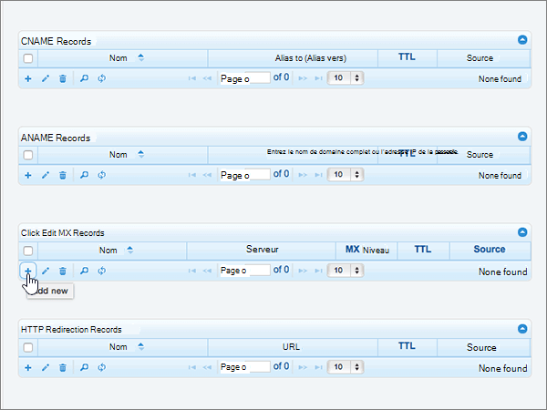

# Создание записей DNS на сайте DNSMadeEasy для Майкрософт

 **[Вопросы и ответы по доменам](../setup/domains-faq.md)**. 
  
Если ваш поставщик услуг размещения DNS — DNSMadeEasy, выполните действия, описанные в этой статье, чтобы подтвердить владение доменом и настроить записи DNS для электронной почты, Skype для бизнеса online и других служб.
  
Когда вы добавите эти записи на сайте DNSMadeEasy, ваш домен будет настроен для работы со службами Майкрософт.
  
Чтобы узнать о размещении и DNS для веб-сайтов с помощью Microsoft, ознакомьтесь со статьей [использование общедоступного веб-сайта с корпорацией Майкрософт](https://support.office.com/article/choose-a-public-website-3325d50e-d131-403c-a278-7f3296fe33a9).
  
> [!NOTE]
> Typically it takes about 15 minutes for DNS changes to take effect. However, it can occasionally take longer for a change you've made to update across the Internet's DNS system. Если у вас возникли проблемы с процессом обработки почты или другими проблемами после добавления записей DNS, ознакомьтесь с разрешениями [и устранение проблем после добавления домена или записей DNS](../get-help-with-domains/find-and-fix-issues.md). 
  
## Добавление записи TXT для проверки

Перед использованием домена с корпорацией Майкрософт необходимо убедиться, что вы являетесь его владельцем. Вы можете войти в свою учетную запись у вас в вашем регистраторе доменных имен и создать запись DNS в Майкрософт, если вы владеете этим доменом.
  
> [!NOTE]
> Эта запись используется исключительно для проверки принадлежности домена. При желании вы сможете удалить ее позже. 
  
> [!IMPORTANT]
> Если вы используете учетную запись DNSMadeEasy, это означает, что добавленный вами домен приобретен у другой компании — регистратора доменных имен. DNSMadeEasy не предоставляет услуг по регистрации доменных имен. Если вы можете выполнить вход на сайте DNSMadeEasy и создать запись DNS, это подтверждает ваше владение доменом. 
  
1. Чтобы приступить к работе, откройте страницу со своими доменами на сайте DNSMadeEasy по [этой ссылке](https://cp.dnsmadeeasy.com/). Сначала вам потребуется выполнить вход.
    
2. На странице **консоли управления** в области **Недавно обновленные домены** выберите домен, который необходимо обновить. 
    
3. На странице **Managed DNS** в области **записи TXT** выберите элемент ( **+** **Добавить новый**).
    
    (You may have to scroll down.)
    
4. In the **Add TXT Records** area, in the boxes for the new record, type or copy and paste the values from the following table. 
    
    ||||
    |:-----|:-----|:-----|
    |**Имя**   |**Value** (Значение)   |**TTL** (Срок жизни)   |
    |(Оставьте это поле пустым.)    |MS=ms *XXXXXXXX*    **Примечание.** Это пример. Используйте указанную здесь **конечную точку или значение адреса** из таблицы. [Как найти это значение?](../get-help-with-domains/information-for-dns-records.md)          |1800    |
   
5. Нажмите кнопку **послать**.
    
6. Подождите несколько минут, пока созданная запись не будет обновлена в Интернете.
    
Теперь, когда вы добавили запись на сайте регистратора доменных имен, вернитесь в корпорацию Майкрософт и запросите запись.
  
После того как корпорация Майкрософт обнаружит правильную запись TXT, ваш домен будет проверен.
  
1. В центре администрирования Майкрософт перейдите на страницу " <a href="https://go.microsoft.com/fwlink/p/?linkid=834818" target="_blank">домены</a> **параметров** \> ".

    
2. На странице **Domains** (Домены) выберите домен, который нужно проверить. 
    
3. На странице **Setup** (Настройка) выберите **Start setup** (Начать настройку).
    
4. На странице **Проверка домена** выберите **Проверить**.
    
> [!NOTE]
> Typically it takes about 15 minutes for DNS changes to take effect. However, it can occasionally take longer for a change you've made to update across the Internet's DNS system. Если у вас возникли проблемы с процессом обработки почты или другими проблемами после добавления записей DNS, ознакомьтесь с разрешениями [и устранение проблем после добавления домена или записей DNS](../get-help-with-domains/find-and-fix-issues.md). 
  
## Добавление записи MX для отправки электронной почты для вашего домена в корпорацию Майкрософт

1. Чтобы приступить к работе, откройте страницу со своими доменами на сайте DNSMadeEasy по [этой ссылке](https://cp.dnsmadeeasy.com/). Сначала вам потребуется выполнить вход.
    
2. На странице **консоли управления** в области **Недавно обновленные домены** выберите домен, который необходимо обновить. 
    
    На странице **консоли управления** в области **Недавно обновленные домены** выберите домен, который необходимо обновить. 
    
    
  
3. На странице **управляемых DNS** в области MX- **записи** выберите элемент управления **(+)** ( **Добавить новый**).
    
    (You may have to scroll down.)
    
    
  
4. В поля для новой записи в области **Add MX Records** (Добавление записей MX) введите (или скопируйте и вставьте) значения из таблицы ниже. 
    
    (Возможно, потребуется прокрутить страницу вниз.)
    
    |**Name**|**Server**|**MX Level (Уровень MX)**|**TTL** (Срок жизни)|
    |:-----|:-----|:-----|:-----|
    |(Оставьте это поле пустым.)    | *\<ключ_домена\>*  .mail.protection.outlook.com    **Это значение ДОЛЖНО оканчиваться точкой (.).**   **Примечание:** \<Получите *ключ* \> домена из учетной записи Майкрософт. [Где это находится?](../get-help-with-domains/information-for-dns-records.md)          |10     Дополнительные сведения о приоритете см. в статье [Приоритет записей MX](https://support.office.com/article/2784cc4d-95be-443d-b5f7-bb5dd867ba83.aspx).      |1800    |
   
    
  
5. Нажмите кнопку **послать**.
    
    
  
6. Если в разделе **MX Records** (Записи MX) есть другие записи MX, выберите их. 
    
    
  
7. После выбора всех записей выберите пункт **Удалить выбранные**.
    
    
  
8. В диалоговом окне **Удаление записей MX** нажмите кнопку **Удалить** , чтобы подтвердить изменения. 
    
    
  
## Добавление пяти записей CNAME, необходимых для Майкрософт

1. Чтобы приступить к работе, откройте страницу со своими доменами на сайте DNSMadeEasy по [этой ссылке](https://cp.dnsmadeeasy.com/). Сначала вам потребуется выполнить вход.
    
2. На странице **консоли управления** в области **Недавно обновленные домены** выберите домен, который необходимо обновить. 
    
3. На странице **УПРАВЛЯЕМЫХ DNS** в области **записи CNAME** выберите элемент управления **("+"** ) ( **Добавить новый**).
    
    (Возможно, потребуется прокрутить страницу вниз.)
    
    
  
4. Добавьте первую из пяти записей CNAME.
    
    В поля для новой записи в области **Add CNAME Records** (Добавление записей CNAME) введите (или скопируйте и вставьте) значения из первой строки приведенной ниже таблицы. 
    
    |**Name (Имя)**|**Alias to (Псевдоним для)**|**TTL (Срок жизни)**|
    |:-----|:-----|:-----|
    |autodiscover    |autodiscover.outlook.com.    **Это значение ДОЛЖНО оканчиваться точкой (.).**   |1800    |
    |sip    |sipdir.online.lync.com.    **Это значение ДОЛЖНО оканчиваться точкой (.).**   |1800    |
    |lyncdiscover    |webdir.online.lync.com.    **Это значение ДОЛЖНО оканчиваться точкой (.).**   |1800    |
    |enterpriseregistration    |enterpriseregistration.windows.net.    **Это значение ДОЛЖНО оканчиваться точкой (.).**   |1800    |
    |enterpriseenrollment    |enterpriseenrollment-s.manage.microsoft.com.    **Это значение ДОЛЖНО оканчиваться точкой (.).**   |1800    |
   
    
  
5. Нажмите кнопку **послать**.
    
    
  
6. Добавьте все остальные четыре записи CNAME.
    
    В разделе **CNAME Records (записи CNAME** **) выберите элемент управления** ( **Добавить новый**), создайте запись, используя значения из следующей строки таблицы, а затем еще раз нажмите кнопку **послать** , чтобы завершить эту запись. 
    
    Повторяйте эту процедуру, пока не будут созданы все пять записей CNAME.
    
## Добавьте запись TXT для SPF, чтобы предотвратить рассылку спама

> [!IMPORTANT]
> Для записи инфраструктуры политики отправителей (SPF) для домена можно указать только одну запись TXT. Если у вашего домена больше одной записи SPF, это приведет к сбоям в работе почты и ошибкам классификации входящих писем и спама. Если у вас уже есть запись SPF для вашего домена, не создавайте ее для Майкрософт. Вместо этого добавьте необходимые значения Майкрософт в текущую запись, чтобы иметь *одну* запись SPF, включающую оба набора значений. Нужны примеры? Ознакомьтесь с этими [записями о внешних доменных именах для Майкрософт](https://support.office.com/article/c0531a6f-9e25-4f2d-ad0e-a70bfef09ac0). Чтобы проверить запись SPF, можно использовать один из этих[средств проверки SPF](../setup/domains-faq.md). 
  
1. Чтобы приступить к работе, откройте страницу со своими доменами на сайте DNSMadeEasy по [этой ссылке](https://cp.dnsmadeeasy.com/). Сначала вам потребуется выполнить вход.
    
2. На странице **консоли управления** в области **Недавно обновленные домены** выберите домен, который необходимо обновить. 
    
3. На странице **УПРАВЛЯЕМЫХ DNS** в области **записи TXT** выберите элемент управления **("+"** ) ( **Добавить новый**).
    
    (Возможно, потребуется прокрутить страницу вниз.)
    
    
  
4. In the **Add TXT Records** area, in the boxes for the new record, type or copy and paste the values from the following table. 
    
    |**Name**|**Value** (Значение)|**TTL** (Срок жизни)|
    |:-----|:-----|:-----|
    |(Оставьте это поле пустым.)    |v=spf1 include:spf.protection.outlook.com -all    **Примечание.** Рекомендуется скопировать и вставить эту запись, чтобы сохранить все пробелы.               |1800    |
   
    
  
5. Нажмите кнопку **послать**.
    
    
  
## Добавление двух записей SRV, необходимых для Майкрософт

1. Чтобы приступить к работе, откройте страницу со своими доменами на сайте DNSMadeEasy по [этой ссылке](https://cp.dnsmadeeasy.com/). Сначала вам потребуется выполнить вход.
    
2. На странице **консоли управления** в области **Недавно обновленные домены** выберите домен, который необходимо обновить. 
    
3. На странице **Managed DNS** ( **записи SRV** ) выберите элемент управления **(+)** ( **Добавить новый**).
    
    (Возможно, потребуется прокрутить страницу вниз.)
    
    
  
4. Добавьте первую из двух записей SRV.
    
    В поля для новой записи в области **Add SRV Records** (Добавление записей SRV) введите (или скопируйте и вставьте) значения из первой строки приведенной ниже таблицы. 
    
    |**Name (Имя)**|**Priority** (Приоритет)|**Weight** (Вес)|**Port** (Порт)|**Host (Узел)**|**TTL (Срок жизни)**|
    |:-----|:-----|:-----|:-----|:-----|:-----|
    |_sip. _tls    |100    |1,1    |443    |sipdir.online.lync.com.    **Это значение ДОЛЖНО оканчиваться точкой (.).**   |1800    |
    |_sipfederationtls. _tcp    |100    |1,1    |5061    |sipfed.online.lync.com.    **Это значение ДОЛЖНО оканчиваться точкой (.).**   |1800    |
   
    
  
5. Нажмите кнопку **послать**.
    
    
  
6. Добавьте вторую запись SRV.
    
    В разделе **SRV Records (записи SRV** ) выберите элемент управления **(** **Добавить новый**), создайте запись, используя значения из следующей строки таблицы, а затем еще раз нажмите кнопку **послать** , чтобы завершить эту запись. 
    
> [!NOTE]
> Typically it takes about 15 minutes for DNS changes to take effect. However, it can occasionally take longer for a change you've made to update across the Internet's DNS system. Если у вас возникли проблемы с процессом обработки почты или другими проблемами после добавления записей DNS, ознакомьтесь с разрешениями [и устранение проблем после добавления домена или записей DNS](../get-help-with-domains/find-and-fix-issues.md). 
  

