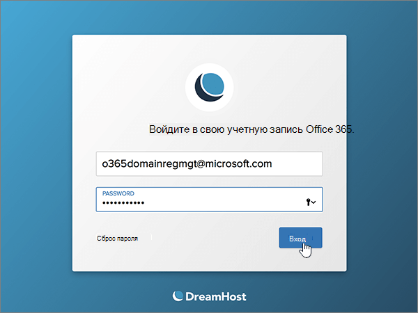

# Создание записей DNS на сайте Dreamhost для Майкрософт

 Если вы не нашли то, что вы ищете, см. раздел **[Вопросы и ответы по доменам](../setup/domains-faq.md)**. 
  
Если ваш поставщик услуг размещения DNS — DreamHost, выполните действия, описанные в этой статье, чтобы подтвердить владение доменом и настроить записи DNS для электронной почты, Lync и других служб.
 
Когда вы добавите эти записи на сайте DreamHost, ваш домен будет настроен для работы со службами Майкрософт.
  
  
> [!NOTE]
> Обычно на вступление изменений DNS в силу требуется около 15 минут. Однако иногда распространение внесенного изменения в системе DNS по всему Интернету занимает больше времени. Если после добавления записей DNS возникла проблема с потоком обработки почты или другие неполадки, см. статью [Устранение неполадок после смены имени домена или записей DNS](../get-help-with-domains/find-and-fix-issues.md). 
  
## Добавление записи TXT для проверки

Прежде чем вы сможете использовать свой домен при работе с продуктами корпорации Майкрософт, мы должны убедиться в том, что вы являетесь его владельцем. Если вы войдете в свою учетную запись на сайте регистратора доменных имен и создадите запись DNS, для корпорации Майкрософт это послужит подтверждением того, что вы владеете доменом.
  
> [!NOTE]
> Эта запись используется исключительно для проверки принадлежности домена. При желании вы сможете удалить ее позже. 
  
1. Чтобы приступить к работе, перейдите на свою страницу доменов на сайте DreamHost по [этой ссылке](https://panel.dreamhost.com/). Сперва вам потребуется выполнить вход.
    
    
  
2. На странице **панели мониторинга** выберите **домены**, а затем **Управление доменами**.
    
    
  
3. На странице " **Управление доменами** " в разделе **домен** выберите **DNS** для домена, который требуется изменить. 
    
    
  
4. In the **Add a custom DNS record** section, in the boxes for the new record, type or copy and paste the values from the following table. 
    
    (You may have to scroll down.)
    
    (Choose the **Type** value from the drop-down list.) 
    
    |**Имя**|**Тип**|**Значение**|**Примечание**|
    |:-----|:-----|:-----|:-----|
    |(Leave this field empty.)    |TXT    |MS=ms *XXXXXXXX*    **Примечание.** Это пример. Используйте здесь свое конкретное значение **Назначение или адрес "Указывает на"** из этой таблицы.           [Как его найти?](../get-help-with-domains/information-for-dns-records.md)          |(Это поле является обязательным.)    |
   
   
  
5. Нажмите кнопку **Добавить запись.**
    
    
  
6. Подождите несколько минут, пока созданная запись не будет обновлена в Интернете.
    
Теперь, когда запись добавлена на веб-сайт регистратора доменных имен, вернитесь в продукт корпорации Майкрософт и запросите эту запись.
  
Когда продукт корпорации Майкрософт обнаружит правильную запись TXT, ваш домен будет подтвержден.
  
1. В центре администрирования Майкрософт перейдите на страницу **Настройка** \> <a href="https://go.microsoft.com/fwlink/p/?linkid=834818" target="_blank">Домены</a>.

    
2. На странице **Domains** (Домены) выберите домен, который нужно проверить. 
    
    
  
3. На странице **Setup** (Настройка) выберите **Start setup** (Начать настройку).
    
    
  
4. На странице **Проверка домена** выберите **Проверить**.
    
    
  
> [!NOTE]
>  Обычно на вступление изменений DNS в силу требуется около 15 минут. Однако иногда распространение внесенного изменения в системе DNS по всему Интернету занимает больше времени. Если после добавления записей DNS возникла проблема с потоком обработки почты или другие неполадки, см. статью [Устранение неполадок после смены имени домена или записей DNS](../get-help-with-domains/find-and-fix-issues.md). 
  

  
## Добавьте запись MX, чтобы сообщения электронной почты для вашего домена доставлялись в продукты корпорации Майкрософт.

Выполните указанные ниже действия.
  
1. Чтобы приступить к работе, перейдите на свою страницу доменов на сайте DreamHost по [этой ссылке](https://panel.dreamhost.com/). Сперва вам потребуется выполнить вход.
    
    
  
2. На странице **панель мониторинга** выберите пункт **почта**, а затем — **Пользовательская MX**.
    
    
  
3. В разделе **Управление доставкой почты** в столбце **действия** выберите команду **изменить** для домена, который требуется изменить. 
    
    
  
4. В поля для новой записи в области **Custom MX Record** (Настраиваемая запись MX) введите (или скопируйте и вставьте) значения из таблицы ниже. 
    
    (Возможно, потребуется прокрутить страницу вниз.)
    
    (Если существуют другие записи MX, пометьте их для удаления.)
    
    |**Запись MX (обязательно)**|
    |:-----|
    |0  *\<ключ_домена\>*  .mail.protection.outlook.com.    **Это значение ДОЛЖНО оканчиваться точкой (.).**   0 — значение приоритета MX. Добавьте его в начало значения MX, отделив от остальной части пробелом.    **Примечание:** Получите * \<ключ\> домена* из учетной записи Майкрософт.           [Как его найти?](../get-help-with-domains/information-for-dns-records.md)          |
   
    
  
5. Выберите **изменить этот домен для использования настраиваемых записей MX сейчас!**
    
    
  
6. Если есть какие-либо другие записи MX, удалите каждую из них, выделив ее и нажав на клавиатуре клавишу **DELETE**. 
    
    
  
7. Если вы удалили какие-либо записи, установите флажок **обновить пользовательские записи MX теперь.**
    
    

  
## Добавление шести записей CNAME, необходимых для Майкрософт

Выполните указанные ниже действия.
  
1. Чтобы приступить к работе, перейдите на свою страницу доменов на сайте DreamHost по [этой ссылке](https://panel.dreamhost.com/). Сперва вам потребуется выполнить вход.
    
    
  
2. На странице **панели мониторинга** выберите **домены**, а затем **Управление доменами**.
    
    
  
3. На странице " **Управление доменами** " в разделе **домен** выберите **DNS** для домена, который требуется изменить. 
    
    
  
4. В поля для новой записи в области **Add a custom DNS record** (Добавление настраиваемой записи DNS) введите (или скопируйте и вставьте) значения из первой строки таблицы ниже. 
    
    (You may have to scroll down.)
    
    (Choose the **Type** value from the drop-down list.) 
    
    |**Имя**|**Тип**|**Значение**|**Примечание**|
    |:-----|:-----|:-----|:-----|
    |autodiscover    |CNAME    |autodiscover.outlook.com.    **Это значение ДОЛЖНО оканчиваться точкой (.).**   |(Это поле является обязательным.)    |
    |sip    |CNAME    |sipdir.online.lync.com.    **Это значение ДОЛЖНО оканчиваться точкой (.).**   |(Это поле является обязательным.)    |
    |lyncdiscover    |CNAME    |webdir.online.lync.com.    **Это значение ДОЛЖНО оканчиваться точкой (.).**   |(Это поле является обязательным.)    |
    |enterpriseregistration    |CNAME    |enterpriseregistration.windows.net.    **Это значение ДОЛЖНО оканчиваться точкой (.).**   |(Это поле является обязательным.)    |
    |enterpriseenrollment    |CNAME    |enterpriseenrollment-s.manage.microsoft.com.    **Это значение ДОЛЖНО оканчиваться точкой (.).**   |(Это поле является обязательным.)    |
   
    
  
5. Нажмите кнопку **Добавить запись.**
    
    
  
6. Используя предыдущие два действия и значения из других пяти строк в таблице, добавьте все остальные пять записей CNAME.

  
## Добавьте запись TXT для SPF, чтобы предотвратить рассылку спама

> [!IMPORTANT]
> Для записи инфраструктуры политики отправителей (SPF) для домена можно указать только одну запись TXT. Если у вашего домена больше одной записи SPF, это приведет к сбоям в работе почты и ошибкам классификации входящих писем и спама. Если вы уже указали запись SPF для домена, не создавайте еще одну для продуктов корпорации Майкрософт. Вместо этого добавьте необходимые значения Майкрософт в текущую запись, чтобы иметь *одну* запись SPF, включающую оба набора значений.
  
Выполните указанные ниже действия.
  
1. Чтобы приступить к работе, перейдите на свою страницу доменов на сайте DreamHost по [этой ссылке](https://panel.dreamhost.com/). Сперва вам потребуется выполнить вход.
    
    
  
2. На странице **панели мониторинга** выберите **домены**, а затем **Управление доменами**.
    
    
  
3. На странице " **Управление доменами** " в разделе **домен** выберите **DNS** для домена, который требуется изменить. 
    
    
  
4. В поля для новой записи в области **Add a custom DNS record** (Добавление настраиваемой записи DNS) введите (или скопируйте и вставьте) значения из первой строки таблицы ниже. 
    
    (You may have to scroll down.)
    
    (Choose the **Type** value from the drop-down list.) 
    
    |**Имя**|**Тип**|**Значение**|**Примечание**|
    |:-----|:-----|:-----|:-----|
    |(Leave this field empty.)    |TXT    |v=spf1 include:spf.protection.outlook.com -all    **Примечание.** Рекомендуется скопировать и вставить эту запись, чтобы сохранить все пробелы.               |(Это поле является обязательным.)    |
   
   
  
5. Нажмите кнопку **Добавить запись.**
    
    
  
6. Повторите два описанных выше шага, используя значения из второй строки таблицы, чтобы добавить еще одну запись SRV.
    
  
## Добавление двух записей SRV, необходимых для продуктов корпорации Майкрософт

Выполните указанные ниже действия.
  
1. Чтобы приступить к работе, перейдите на свою страницу доменов на сайте DreamHost по [этой ссылке](https://panel.dreamhost.com/). Сперва вам потребуется выполнить вход.
    
    
  
2. На странице **панели мониторинга** выберите **домены**, а затем **Управление доменами**.
    
    
  
3. На странице " **Управление доменами** " в разделе **домен** выберите **DNS** для домена, который требуется изменить. 
    
    
  
4. В поля для новой записи в области **Add a custom DNS record** (Добавление настраиваемой записи DNS) введите (или скопируйте и вставьте) значения из первой строки таблицы ниже. 
    
    (You may have to scroll down.)
    
    (Choose the **Type** value from the drop-down list.) 
    
    |**Имя**|**Тип**|**Значение**|**Примечание**|
    |:-----|:-----|:-----|:-----|
    |_sip. _tls    |SRV    |100 1 443    sipdir.online.lync.com.    **Это значение ДОЛЖНО оканчиваться точкой (.).**   |(Это поле является обязательным.)    |
    |_sipfederationtls. _tcp    |SRV    |100 1 5061    sipfed.online.lync.com.    **Это значение ДОЛЖНО оканчиваться точкой (.).**   |(Это поле является обязательным.)    |
   
    
  
5. Нажмите **Добавить запись сейчас!**.
    
    
  
6. Повторите два описанных выше шага, используя значения из второй строки таблицы, чтобы добавить еще одну запись SRV.
    
> [!NOTE]
>  Обычно на вступление изменений DNS в силу требуется около 15 минут. Однако иногда распространение внесенного изменения в системе DNS по всему Интернету занимает больше времени. Если после добавления записей DNS возникла проблема с потоком обработки почты или другие неполадки, см. статью [Устранение неполадок после смены имени домена или записей DNS](../get-help-with-domains/find-and-fix-issues.md). 

  
