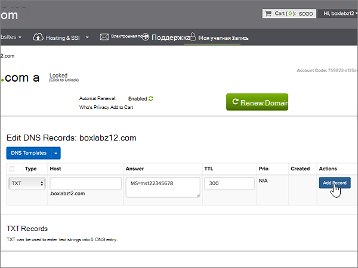

# Создание записей DNS на сайте name.com для Майкрософт

 **[Вопросы и ответы по доменам](../setup/domains-faq.md)**. 
  
Если ваш поставщик услуг размещения DNS — name.com, выполните действия, описанные в этой статье, чтобы подтвердить владение доменом и настроить записи DNS для электронной почты, Skype для бизнеса online и других служб.
  
Когда вы добавите эти записи на сайте name.com, ваш домен будет настроен для работы со службами Майкрософт.
  
Чтобы узнать о размещении и DNS для веб-сайтов с помощью Microsoft, ознакомьтесь со статьей [использование общедоступного веб-сайта с корпорацией Майкрософт](https://support.office.com/article/choose-a-public-website-3325d50e-d131-403c-a278-7f3296fe33a9).
  
> [!NOTE]
> Обычно на вступление изменений DNS в силу требуется около 15 минут. Однако иногда распространение внесенного изменения в системе DNS по всему Интернету занимает больше времени. Если после добавления записей DNS возникла проблема с потоком обработки почты или другие неполадки, см. статью [Устранение неполадок после смены имени домена или записей DNS](../get-help-with-domains/find-and-fix-issues.md). 
  
## Добавление записи TXT для проверки

Перед использованием домена с корпорацией Майкрософт необходимо убедиться, что вы являетесь его владельцем. Вы можете войти в свою учетную запись у вас в вашем регистраторе доменных имен и создать запись DNS в Майкрософт, если вы владеете этим доменом.
  
> [!NOTE]
> Эта запись используется исключительно для проверки принадлежности домена. При желании вы сможете удалить ее позже. 
  
1. Чтобы приступить к работе, откройте страницу со своими доменами на сайте name.com по [этой ссылке](https://www.name.com/account/domain). Сначала вам потребуется выполнить вход.
    
    
  
2. В разделе **My Domains (мои домены**) выберите имя домена, который требуется изменить.
    
    
  
3. В столбце **сведения** выберите * * записи DNS * *. 
    
    
  
4. В поля для новой записи введите (или скопируйте и вставьте) значения из таблицы ниже.
    
    (Choose the **Type** value from the drop-down list.) 
    
    |||||
    |:-----|:-----|:-----|:-----|
    |**Type (Тип)**   |**Host (Узел)**   |**Answer** (Ответ)   |**TTL** (Срок жизни)   |
    |TXT    |(Leave this field empty.)    |MS=ms *XXXXXXXX*    **Примечание.** Это пример. Используйте указанную здесь **конечную точку или значение адреса** из таблицы.           [Как найти это значение?](../get-help-with-domains/information-for-dns-records.md)          |Используйте значение по умолчанию (300).    |
   
    
  
5. Выберите команду **Add Record** (Добавить запись).
    
    
  
6. Подождите несколько минут, пока созданная запись не будет обновлена в Интернете.
    
Теперь, когда вы добавили запись на сайте регистратора доменных имен, вернитесь в корпорацию Майкрософт и запросите запись.
  
После того как корпорация Майкрософт обнаружит правильную запись TXT, ваш домен будет проверен.
  
1. В Центре администрирования перейдите на страницу **Settings** (Параметры) \> <a href="https://go.microsoft.com/fwlink/p/?linkid=834818" target="_blank">Domains</a> (Домены).
    
2. На странице **Domains** (Домены) выберите домен, который нужно проверить. 
    
    
  
3. На странице **Setup** (Настройка) выберите **Start setup** (Начать настройку).
    
    
  
4. На странице **Проверка домена** выберите **Проверить**.
    
    
  
> [!NOTE]
> Обычно на вступление изменений DNS в силу требуется около 15 минут. Однако иногда распространение внесенного изменения в системе DNS по всему Интернету занимает больше времени. Если после добавления записей DNS возникла проблема с потоком обработки почты или другие неполадки, см. статью [Устранение неполадок после смены имени домена или записей DNS](../get-help-with-domains/find-and-fix-issues.md). 
  
## Добавление записи MX для отправки электронной почты для вашего домена в корпорацию Майкрософт

1. Чтобы приступить к работе, откройте страницу со своими доменами на сайте name.com по [этой ссылке](https://www.name.com/account/domain). Сначала вам потребуется выполнить вход.
    
    
  
2. В разделе **My Domains (мои домены**) выберите имя домена, который требуется изменить.
    
    
  
3. В столбце **сведения** выберите **записи DNS**. 
    
    
  
4. В поля для новой записи введите (или скопируйте и вставьте) значения из таблицы ниже.
    
    (Choose the **Type** value from the drop-down list.) 
    
    |**Type (Тип)**|**Host (Узел)**|**Answer** (Ответ)|**TTL (Срок жизни)**|**Prio (Приоритет)**|
    |:-----|:-----|:-----|:-----|:-----|
    |MX    |(Оставьте это поле пустым.)    | *\<ключ_домена\>*  .mail.protection.outlook.com    **Примечание:** Получите * \<ключ\> домена* из учетной записи Майкрософт.           [Как найти это значение?](../get-help-with-domains/information-for-dns-records.md)          |Используйте значение по умолчанию (300).    |нуль    Дополнительные сведения о приоритете см. в статье [Приоритет записей MX](https://support.office.com/article/2784cc4d-95be-443d-b5f7-bb5dd867ba83.aspx).   |
   
   
  
5. Выберите команду **Add Record** (Добавить запись).
    
    
  
6. Если в списке указаны другие записи MX, удалите их. Для этого выполните указанные ниже действия.
    
    Для каждой другой записи MX выберите команду **Удалить** в столбце **действия** . 
    
    
  
    Чтобы подтвердить каждое удаление, нажмите кнопку **Удалить** в столбце **действия** еще раз. 
    
    
  
    Повторяйте эти действия, пока не удалите все остальные записи MX.
    
## Добавление записей CNAME, необходимых для Майкрософт

1. Чтобы приступить к работе, откройте страницу со своими доменами на сайте name.com по [этой ссылке](https://www.name.com/account/domain). Сначала вам потребуется выполнить вход.
    
    
  
2. В разделе **My Domains (мои домены**) выберите имя домена, который требуется изменить.
    
    
  
3. В столбце **сведения** выберите **записи DNS**. 
    
    
  
4. Добавьте первую запись CNAME.
    
    В поля для новой записи введите (или скопируйте и вставьте) значения из первой строки приведенной ниже таблицы.
    
    В раскрывающемся списке выберите значение параметра **Type** (Тип). 
    
    |**Type (Тип)**|**Host (Узел)**|**Answer** (Ответ)|**TTL (Срок жизни)**|
    |:-----|:-----|:-----|:-----|
    |CNAME    |autodiscover    |autodiscover.outlook.com    |Используйте значение по умолчанию (300).    |
    |CNAME    |sip    |sipdir.online.lync.com    |Используйте значение по умолчанию (300).    |
    |CNAME    |lyncdiscover    |webdir.online.lync.com    |Используйте значение по умолчанию (300).    |
    |CNAME    |enterpriseregistration    |enterpriseregistration.windows.net    |Используйте значение по умолчанию (300).    |
    |CNAME    |enterpriseenrollment    |enterpriseenrollment-s.manage.microsoft.com    |Use the default value (300).    |
   
   
  
5. Нажмите кнопку **Добавить запись** , чтобы добавить первую запись. 
    
    
  
6. Добавьте вторую запись CNAME.
    
    Используйте значения из второй строки приведенной выше таблицы, а затем выберите **Добавить запись** , чтобы добавить вторую запись. 
    
    Точно так же добавьте остальные записи, используя значения из третьей, четвертой, пятой и шестой строк таблицы.
    
## Добавление записи TXT для SPF, предотвращающей рассылку спама

> [!IMPORTANT]
> Для записи инфраструктуры политики отправителей (SPF) для домена можно указать только одну запись TXT. Если у вашего домена больше одной записи SPF, это приведет к сбоям в работе почты и ошибкам классификации входящих писем и спама. Если у вас уже есть запись SPF для вашего домена, не создавайте ее для Майкрософт. Вместо этого добавьте необходимые значения Майкрософт в текущую запись, чтобы иметь *одну* запись SPF, включающую оба набора значений. 
  
1. Чтобы приступить к работе, откройте страницу со своими доменами на сайте name.com по [этой ссылке](https://www.name.com/account/domain). Сначала вам потребуется выполнить вход.
    
    
  
2. В разделе **My Domains (мои домены**) выберите имя домена, который требуется изменить.

    
  
3. В столбце **сведения** выберите **записи DNS**. 
    
    
  
4. В поля для новой записи введите (или скопируйте и вставьте) значения из таблицы ниже.
    
    (Choose the **Type** value from the drop-down list.) 
    
    |**Type (Тип)**|**Host (Узел)**|**Answer** (Ответ)|**TTL** (Срок жизни)|
    |:-----|:-----|:-----|:-----|
    |TXT    |(Leave this field empty.)    |v=spf1 include:spf.protection.outlook.com -all    **Примечание.** Рекомендуется скопировать и вставить эту запись, чтобы сохранить все пробелы.               |Use the default value (300).    |
   
   
  
5. Выберите команду **Add Record** (Добавить запись).
    
    
  
## Добавление двух записей SRV, необходимых для Майкрософт

1. Чтобы приступить к работе, откройте страницу со своими доменами на сайте name.com по [этой ссылке](https://www.name.com/account/domain). Сначала вам потребуется выполнить вход.
    
    
  
2. В разделе **My Domains (мои домены**) выберите имя домена, который требуется изменить.
    
    
  
3. В столбце **сведения** выберите **DNS-записи и**. 
    
    
  
4. Добавьте первую запись SRV.
    
    В поля для новой записи введите (или скопируйте и вставьте) значения из первой строки приведенной ниже таблицы.
    
    В раскрывающемся списке выберите значение параметра **Type** (Тип). 
    
    |**Type (Тип)**|**Service (Служба)**|**Weight (Вес)**|**TTL (Срок жизни)**|**Prio (Приоритет)**|**Protocol (Протокол)**|**Port (Порт)**|**Target (Назначение)**|
    |:-----|:-----|:-----|:-----|:-----|:-----|:-----|:-----|
    |SRV|sip|1,1|Используйте значение по умолчанию (300).|100|tls|443|sipdir.online.lync.com   **Примечание.** Рекомендуется скопировать и вставить эту запись, чтобы сохранить все пробелы.               |
    |SRV|sipfederationtls|1,1|Используйте значение по умолчанию (300).|100|tcp|5061|sipfed.online.lync.com  **Примечание.** Рекомендуется скопировать и вставить эту запись, чтобы сохранить все пробелы.               |
   
   
  
5. Выберите команду **Add Record** (Добавить запись).

    
  
6. Добавьте вторую запись SRV.

Используйте значения из следующей строки приведенной выше таблицы, а затем выберите **Добавить запись** , чтобы добавить вторую запись.

>[!NOTE]
>Обычно на вступление изменений DNS в силу требуется около 15 минут. Однако иногда распространение внесенного изменения в системе DNS по всему Интернету занимает больше времени. Если после добавления записей DNS возникла проблема с потоком обработки почты или другие неполадки, см. статью [Устранение неполадок после смены имени домена или записей DNS](../get-help-with-domains/find-and-fix-issues.md).
