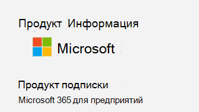

# <a name="determine-if-centralized-deployment-of-add-ins-works-for-your-organization"></a>Определение работы централизованного развертывания надстроек для вашей организации

Централизованное развертывание — это рекомендуемый и наиболее полнофункциональный способ развертывания надстроек Office для пользователей и групп в Организации. Если вы администратор, воспользуйтесь этим руководством, чтобы определить, отвечает ли ваш клиент и пользователи требованиям, чтобы вы могли использовать централизованное развертывание.
Централизованное развертывание поддерживает три системные платформы Windows, Mac и приложения Office в Интернете. Централизованное развертывание также поддерживает iOS и Android (только надстройки Outlook Mobile).
Чтобы надстройка отображалась для всех пользователей, она может занять до 24 часов.
  
## <a name="requirements"></a>Requirements

Для централизованного развертывания надстроек необходимо, чтобы пользователи использовали приложения Microsoft 365 для предприятий (и вошли в Office с помощью своего идентификатора организации), а также почтовые ящики Exchange Online и Active Exchange Online. Ваш каталог подписки должен быть либо либо в, либо в Федеративной для Azure Active Directory.
Вы можете просмотреть определенные требования для Office и Exchange ниже или использовать [средство проверки совместимости централизованного развертывания](https://docs.microsoft.com/office365/admin/manage/centralized-deployment-of-add-ins?view=o365-worldwide#office-365-centralized-deployment-compatibility-checker).

Централизованное развертывание не поддерживает:
  
- надстройки, ориентированные на Word, Excel или PowerPoint в Office 2013; 
- локальную службу каталогов;
- Развертывание надстроек в локальный почтовый ящик Exchange
- развертывание надстроек для SharePoint;  
- Приложения Teams
- развертывание надстроек для модели COM или набора средств Visual Studio для системы Office (VSTO).
- Развертывания Microsoft 365, которые не включают Exchange, такие как приложения Microsoft 365 для бизнеса

### <a name="office-requirements"></a>Требования к Office

- Для надстроек Word, Excel и PowerPoint пользователям необходимо использовать один из следующих компонентов:
  - На устройстве с Windows версии 1704 или более поздней версии для корпоративных приложений Microsoft 365.
  - На компьютере Mac версии 15,34 или более поздней.

- Для работы с Outlook пользователи должны использовать один из следующих компонентов: 
  - Версия 1701 или более поздняя версия приложений Microsoft 365 для предприятий.
  - Версия 1808 или более поздняя версия Office профессиональный плюс 2019 или Office Стандартный 2019.
  - Версия 16.0.4494.1000 или более поздняя версия Office профессиональный плюс 2016 (MSI) или Office Стандартный 2016 (MSI)\*
  - Версия 15.0.4937.1000 или более поздняя версия Office профессиональный плюс 2013 (MSI) или Office Стандартный 2013 (MSI)\*
  - Версия 16.0.9318.1000 или более поздняя версия Office 2016 для Mac 
- Версия 2.75.0 или более поздняя версия Outlook Mobile для iOS 
- Версия 2.2.145 или более поздняя версия Outlook Mobile для Android 
    
    * MSI для Outlook. в соответствующей ленте Outlook отображаются надстройки, установленные администратором, а не раздел "Мои надстройки".
    

#### <a name="find-out-if-microsoft-365-apps-for-enterprise-is-installed"></a>Как узнать, установлены ли приложения Microsoft 365 для предприятия

Чтобы использовать приложения Microsoft 365 для предприятий, пользователю должна быть предоставлена учетная запись Microsoft 365 и должна быть назначена лицензия. Более подробную информацию можно найти в [статье Обзор приложений Microsoft 365 для предприятий](https://go.microsoft.com/fwlink/p/?linkid=846328).

Самый простой способ определить, имеет ли пользователь приложение Microsoft 365 для Enterprise установлено и недавно использовал его, — использовать отчет об активации Microsoft Office, который доступен в центре администрирования Microsoft 365. В отчете представлен список всех пользователей, которые активировали приложения Microsoft 365 для предприятий в течение последних 7 дней, 30 дней, 90 дней или 180 дней. В целях централизованного развертывания активации настольных систем для Windows или Mac являются важными столбцами отчета. Вы можете экспортировать отчет в Excel. Более подробную информацию об отчете можно узнать [в статье Microsoft 365 Reports в центре администрирования — активации Microsoft Office](../activity-reports/microsoft-office-activations.md).
  
Если вы не хотите использовать отчет об активации, можно попросить пользователя открыть приложение Office, например Word, на своем компьютере, а затем выбрать пункт **File** \> **учетная запись**файла. В разделе **сведения о продукте**вы должны увидеть **подписку product** and **Microsoft 365 для предприятий**, как показано на следующем рисунке.


  
Для получения справки о приложениях Microsoft 365 для предприятий ознакомьтесь с [советами по устранению неполадок приложений microsoft 365 для предприятий](https://go.microsoft.com/fwlink/p/?linkid=846339).


### <a name="exchange-online-requirements"></a>Требования Exchange Online

Microsoft Exchange хранит манифесты надстроек в клиенте Организации. Надстройки, развернутые администратором, и пользователи, получающие надстройку, должны находиться в версии Exchange Online, поддерживающей проверку подлинности OAuth.
  
Check with your organization's Exchange admin to find out which configuration is in use. OAuth connectivity per user can be verified by using the [Test-OAuthConnectivity](https://go.microsoft.com/fwlink/p/?linkid=846351) PowerShell cmdlet. 


### <a name="centralized-deployment-compatibility-checker"></a>Средство проверки совместимости централизованного развертывания

С помощью средства проверки совместимости централизованного развертывания можно проверить, настроены ли пользователи клиента для использования централизованного развертывания для Word, Excel и PowerPoint. Средство проверки совместимости не требуется для поддержки Outlook. Скачайте средство проверки совместимости [здесь](https://aka.ms/officeaddindeploymentorgcompatibilitychecker).
  
#### <a name="run-the-compatibility-checker"></a>Запуск средства проверки совместимости
  
1. Запустите окно PowerShell.exe с повышенными привилегиями.
    
2. Выполните следующую команду:

```powershell
Import-Module O365CompatibilityChecker
```
    
3. Выполните команду **Invoke – компатабилитичекк** :

```powershell
Invoke-CompatibilityCheck
```
   в котором запрашивается *_тенантдомаин_* (например, *таилспинтойсинкорпоратед. onmicrosoft. </span> com*) и учетные данные *_TenantAdmin_* (Используйте свои учетные данные глобального администратора), а затем запрашивает согласие.
    
> [!NOTE]
> В зависимости от количества пользователей в клиенте средство завершит проверку в течение нескольких минут или часов. 
  
По завершении работы средство создаст выходной файл в формате с разделителями-запятыми (CSV). По умолчанию файл сохраняется в **C:\Windows\System32** . Выходной файл содержит такие сведения:
  
- имя пользователя;
    
- ИД пользователя (электронный адрес пользователя);
    
- подтверждение готовности к централизованному развертыванию, если остальные пункты содержат нужные сведения;
    
- План Office — это план Office, для которого у них есть лицензия
    
- подтверждение активации Office, если пользователь активировал пакет Office;
    
- сведения о том, что почтовый ящик поддерживается, если применяется почтовый ящик с поддержкой OAuth.


  
## <a name="user-and-group-assignments"></a>Назначения для пользователей и групп

В настоящее время функция централизованного развертывания поддерживает большинство групп, поддерживаемых Azure Active Directory, включая группы Microsoft 365, списки рассылки и группы безопасности.
  
> [!NOTE]
> Сейчас группы безопасности без электронной почты не поддерживаются. 
  
Централизованное развертывание поддерживает назначения для отдельных пользователей, групп и всех пользователей в клиенте. Централизованное развертывание поддерживает пользователей в группах или группах верхнего уровня без родительских групп, но не пользователей в вложенных группах или группах с родительскими группами.
   
Take a look at the following example where Sandra, Sheila, and the Sales Department group are assigned to an add-in. Because the West Coast Sales Department is a nested group, Bert and Fred aren't assigned to an add-in.
  


   
### <a name="find-out-if-a-group-contains-nested-groups"></a>Проверка наличия вложенных групп в группе

Самый простой способ проверить, содержит ли группа вложенные группы, — посмотреть ее карточку контакта в Outlook. Если ввести имя группы в поле " **Кому** " электронного письма, а затем выбрать имя группы при разрешении, оно покажет, содержит ли она пользователей или вложенные группы. В примере ниже на вкладке **Участники** карточки контакта Outlook видно, что в группе Test Group нет пользователей и есть две подгруппы. 
  

  
You can do the opposite query by resolving the group to see if it's a member of any group. In the example below, you can see under the **Membership** tab of the Outlook contact card that Sub Group 1 is a member of the Test Group. 
  

  
Alternately, you can use the Azure Active Directory Graph API to run queries to find the list of groups within a group. For more information, see [Operations on groups | Graph API reference](https://go.microsoft.com/fwlink/p/?linkid=846342).
  
### <a name="contacting-microsoft-for-support"></a>Обращение в службу поддержки Майкрософт

Если вы или ваши пользователи столкнулись с проблемами при загрузке надстройки при использовании приложений Office для Интернета (Word, Excel и т. д.), которые были централизованно развернуты, вам может потребоваться обратиться в службу поддержки Майкрософт ([Узнайте, как](../contact-support-for-business-products.md)). Предоставьте следующие сведения о среде Microsoft 365 в билете поддержки.
  
|**Платформа**|**Данные отладки**|
|:-----|:-----|
|Office  <br/> | Журналы Charles/Fiddler  <br/>  Идентификатор клиента ( [инструкции по его определению](https://docs.microsoft.com/onedrive/find-your-office-365-tenant-id.aspx))  <br/>  ИД. Просмотрите источник одной из страниц Office и найдите значение идентификатора корреляции и отправьте его в службу поддержки:  <br/>`<input name=" **wdCorrelationId**" type="hidden" value=" **{BC17079E-505F-3000-C177-26A8E27EB623}**">`  <br/>  `<input name="user_id" type="hidden" value="1003bffd96933623"></form>`  <br/> |
|Классические клиенты (Windows, Mac)  <br/> | Журналы Charles/Fiddler  <br/>  Номера сборок клиентского приложения (желательно в виде снимка экрана из **файла или учетной записи**)  <br/> |
   

