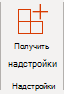

# Управление надстройками в Центре администрирования

Надстройки Office помогут вам персонализировать документы и упростить доступ к информации в Интернете (см. в руб. Начало использования надстройки [Office).](https://support.microsoft.com/office/82e665c4-6700-4b56-a3f3-ef5441996862) 

После развертывания администратором надстройки для пользователей в организации администратор может отключить или включить надстройки, изменить, удалить и управлять доступом к надстройки.

Дополнительные сведения об установке надстройок из центра администрирования см. в дополнительных сведениях о развертывании надстройок [в центре администрирования.](./manage-deployment-of-add-ins.md)
  
## Состояния надстроек

Надстройка может быть в состоянии **On** или **Off.**
  
|**Состояние**|**Механизм перехода**|**Влияние**|
|:-----|:-----|:-----|
|**Active**    |Администратор загрузил надстройки и назначен пользователям или группам.    |Пользователи и группы, которым назначена эта надстройка, видят ее в соответствующих клиентах.    |
|**Отключена**    |Администратор отключил надстройку.    |Пользователи и группы, которым назначена эта надстройка, больше не имеют к ней доступа.    Если изменить состояние надстройки на "Активна", пользователи и группы снова получат к ней доступ.    |
|**Deleted**    |Администратор удалил надстройку.    |Пользователи и группы, которым назначена эта надстройка, больше не имеют к ней доступа.    |
   
Если надстройка больше не используется, рассмотрите возможность удаления надстройки. Например, отключение надстройки может иметь смысл, если надстройка используется только в определенное время года.

## Удаление надстройки

Можно также удалить развернутую надстройка.

1. В центре администрирования перейдите на страницу **Службы** параметров &  >  **надстройки.**

     > [!NOTE]
    > Центр администрирования обновляется до развертывания с интегрированными приложениями. Если вы не видите вышеперечисленные действия, перейдите в раздел Централизованное развертывание, перейдите в **приложения Settings**  >  **Integrated.** В верхней части страницы **Интегрированные приложения** выберите **надстройки.**

2. Выберите развернутую надстройка.

3. Нажмите **кнопку Удалить надстройки**. Снимите кнопку надстройки в правом нижнем углу.

4. Проверьте выбор и выберите **Удаление надстройки.**

## Изменение доступа к надстройки

После развертывания администраторы также могут управлять доступом пользователей к надстройки.

1. В центре администрирования перейдите на страницу **Службы** параметров &  >  **надстройки.**

     > [!NOTE]
    > Центр администрирования обновляется до развертывания с интегрированными приложениями. Если вы не видите вышеперечисленные действия, перейдите в раздел Централизованное развертывание, перейдите в **приложения Settings**  >  **Integrated.** В верхней части страницы **Интегрированные приложения** выберите **надстройки.**

2. Выберите развернутую надстройка.

3. Нажмите **кнопку Изменить** в **статье Кто имеет доступ**.

4. Сохраните изменения.

## Предотвращение скачивания надстройки путем отключения магазина Office для всех клиентов (кроме Outlook)

> [!NOTE]
> Установка надстройки Outlook управляется другим [процессом.](/exchange/clients-and-mobile-in-exchange-online/add-ins-for-outlook/specify-who-can-install-and-manage-add-ins)

Как организация вы можете запретить скачивание новых надстройок Office из Магазина Office. Это можно использовать совместно с централизованным развертыванием, чтобы обеспечить развертывание только утвержденных организацией надстройок для пользователей в организации.
  
**Отключение приобретения надстройки**
  
1. В центре администрирования перейдите в раздел **Параметры** \> [Услуги&amp;](https://go.microsoft.com/fwlink/p/?linkid=2053743) надстроек.

     > [!NOTE]
    > Центр администрирования обновляется до развертывания с интегрированными приложениями. Если вы не видите вышеперечисленные действия, перейдите в раздел Централизованное развертывание, перейдите в **приложения Settings**  >  **Integrated.** В верхней части страницы **Интегрированные приложения** выберите **надстройки.**
    
3. Выберите **приложения и службы,** которые принадлежат пользователю.
    
4. Упусти возможность доступа пользователей к магазину Office.

Это предотвратит получение всеми пользователями следующих надстройок из магазина.
  
- Надстройки для Word, Excel и PowerPoint 2016 из:
    
  - Windows
    
  - Mac
    
  - Office
    
    
- Приобретения, начиная с **AppSource**
    
- Надстройки в Microsoft 365
    
Пользователь, который пытается получить доступ к магазину, увидит следующее сообщение: **К сожалению, Microsoft 365** была настроена для предотвращения индивидуального приобретения надстройок Office Store.
  
Поддержка отключения Магазина Office доступна в следующих версиях:
  
- Windows: 16.0.9001 . В настоящее время доступно.
    
- Mac: 16.10.18011401 - В настоящее время доступен.
    
- iOS: 2.9.18010804 .
    
- Веб - в настоящее время доступен.
    
Это не мешает администратору использовать централизованное развертывание для назначения надстройки из магазина Office.
  
Чтобы предотвратить вход пользователя в учетную запись Майкрософт, можно ограничить использование только учетной записи организации. Дополнительные сведения см. в [рублях Identity, authentication и authorization in Office 2016.](/DeployOffice/security/identity-authentication-and-authorization-in-office)  

> [!NOTE]
> Если пользователи не смогут получить доступ в офисный магазин, они также не смогут выгружать надстройки [Office для тестирования.](/office/dev/add-ins/testing/create-a-network-shared-folder-catalog-for-task-pane-and-content-add-ins)

## Дополнительные данные о пользовательском интерфейсе с надстройки

После развертывания надстройки конечные пользователи могут начать использовать ее в своих приложениях Office (см. статью Начните использовать надстройки [Office).](https://support.microsoft.com/office/82e665c4-6700-4b56-a3f3-ef5441996862) Надстройка отображается на всех платформах, которые поддерживает надстройка.
  
Если надстройка поддерживает команды, они будут отображаться на ленте Office. В приведенном ниже примере для надстройки **Цитаты** отображается команда **Найти цитату**. 

  
Если развернутая надстройка не поддерживает команды надстройки или вы хотите просмотреть все развернутые надстройки, их можно просмотреть с помощью **моих надстройок.** 
  
### В Word 2016, Excel 2016 или PowerPoint 2016

1. Выберите **\> Вставьте мои надстройки.** 
    
2. Откройте вкладку **Управляются администратором** в окне "Надстройки Office". 
    
3. Дважды щелкните надстройку, которую вы развернули ранее (в данном примере — **Цитаты** ).  
  
### В Outlook

1. На **ленте Главная** выберите **Получить надстройки**. 
  
2. Выберите **управляемый администратором** в левом nav. 

## Подробнее

[Развертывание надстроек в Центре администрирования](./manage-deployment-of-add-ins.md)

Получите дополнительные сведения о создании [надстроек Office](/office/dev/add-ins/overview/office-add-ins).
  
Для управления надстройными надстройки используйте централизованные [комлеты Deployment PowerShell.](../../enterprise/use-the-centralized-deployment-powershell-cmdlets-to-manage-add-ins.md)
  
[Устранение неполадок. Пользователь не видит надстройки](/office365/troubleshoot/access-management/user-not-seeing-add-ins)

[Несовершеннолетние и приобретение надстройок в Microsoft Store](./minors-and-acquiring-addins-from-the-store.md)