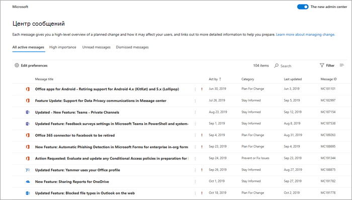

# Управление уведомлениями в Центре сообщенийManage messages in Message center

В Центре сообщений публикуются важные объявления о новых и измененных функциях. В этой статье вы найдете подробные сведения о том, как использовать эти сообщения в рамках управления изменениями.Message center posts are important announcements about new and changed features. This article provides more information about the things you can do with messages to help with change management in your organization.
  
## Чтение сообщенияRead a message

Чтобы перейти в Центр сообщений, перейдите в Центр [администрирования](https://go.microsoft.com/fwlink/p/?linkid=2024339)и выберите **"Центр**  >  **сообщений о состоянии".**To go to the Message center, go to the [admin center](https://go.microsoft.com/fwlink/p/?linkid=2024339), and select **Health** > **Message center**. 

Выберите заголовок сообщения, чтобы открыть его в области чтения.Select a message title to open it in the reading pane. Каждое сообщение содержит сводку об изменении, описание того, как это изменение может повлиять на вас, сведения о том, как подготовить организацию к изменению, и (в большинстве случаев) дополнительную ссылку для получения дополнительных сведений.Every message contains a summary of the change, a statement of how the change may affect you, information about how you can prepare your organization for the change, and (in most cases) an additional information link where you can learn more. Дополнительные сведения по-прежнему доступны даже после истечения срока действия сообщения.The additional information continues to be available, even after a message expires.

## Фильтрация и сортировкаFilter and sort

::: moniker range="o365-worldwide"

Используйте меню **"Фильтр"** для выбора отфильтрованного представления сообщений.Use the **Filter** drop-down menu to select a filtered view of messages.

Можно выбрать любой заголовок столбца для сортировки сообщений по возрастанию или убыванию.You can select any column heading to sort messages in ascending or descending order. Например, на этом рисунке сообщения отсортированы по дате **Действие**.For example, in this diagram the messages are sorted on the **Act by** date.

::: moniker-end

::: moniker range="o365-germany"

Используйте меню **"Представления"** для выбора отфильтрованного представления сообщений.Use the **Views** drop-down menu to select a filtered view of messages. 
 
Можно выбрать любой заголовок столбца для сортировки сообщений по возрастанию или убыванию.You can select any column heading to sort messages in ascending or descending order. Например, на этом рисунке сообщения сортироваться по **акту по** дате.For example, in this illustration the messages are sorted on the **Act by** date.

::: moniker-end

::: moniker range="o365-21vianet"

Используйте меню **"Представления"** для выбора отфильтрованного представления сообщений.Use the **Views** drop-down menu to select a filtered view of messages. 
 
Можно выбрать любой заголовок столбца для сортировки сообщений по возрастанию или убыванию.You can select any column heading to sort messages in ascending or descending order. Например, на этом рисунке сообщения сортироваться по **акту по** дате.For example, in this illustration the messages are sorted on the **Act by** date.

::: moniker-end

## Обратная связь с публикациейGive feedback on a post

В Центре сообщений можно выбрать сообщение, чтобы увидеть подробные сведения.In the Message center, you can select a message to see details.

Если вы хотите отправить отзыв о сообщении,  выберите значок "Нравится" или "Не нравится" и в текстовом поле. If you want to provide feedback on the message, select either the **Like** or **Dislike** icon and provide feedback in the text box that appears. Не предоставлять никаких персональных данных.Do not provide any personal information. При желании вы можете выбрать "ОК", чтобы связаться со мной **по этому** отзыву, а затем выбрать "Отправить". You can optionally select **It's OK to contact me about this feedback** and then select **Send**.

## Пересылка сообщенияShare a message

Действия, требуемые в сообщении, должен выполнить кто-то другой?See a message that someone else needs to act on? Вы можете поделиться содержимым сообщения, отправив его по электронной почте:You can share the contents of the message with any user by email:
  
1. Выберите сообщение, чтобы открыть его, а затем выберите **"Поделиться".**Select the message to open it, and then select **Share**.
  
2. Чтобы поделиться сообщением, введите до двух адресов электронной почты, разделенных двоеточием.To share the message, enter up to two email addresses separated by a colon. Вы можете отправлять сообщения на отдельные и групповые адреса электронной почты.You can send to individual and to group email addresses. При желании вы можете получить копию сообщения по электронной почте (сообщение будет отправлено на ваш основной адрес электронной почты) или добавить личное сообщение, чтобы предоставить получателям дополнительный контекст.Optionally, you can choose to receive a copy of the message in email (the message will go to your primary email address) or add a personal message to provide recipients with more context.
  
3. Выберите **"Поделиться",** чтобы отправить сообщение электронной почты.Select **Share** to send the email.
    
## Создание ссылкиGet a link

Вам нужно убедиться, что другой администратор знает об изменении и принимает соответствующие меры?Need to follow up with another admin to make sure they're aware of a change and taking action? Вы можете создать ссылку на уведомление и отправить ее по электронной почте или через мгновенные сообщения.You can generate a link to share in email or instant messaging, for example, that will connect the user directly to that message. Человек, с которого вы поделились ссылкой, должен быть администратором Microsoft 365 для вашей организации или у него не будет доступа к связанному сообщению.The person you share the link with has to be an admin in Microsoft 365 for your organization or they won't have access to the linked message.

::: moniker range="o365-worldwide"

1. Выберите сообщение, чтобы открыть его.Select the message to open it.

2. Выберите **ссылку "Копировать" на** значок буфера обмена (ссылки).Select the **Copy link to Clipboard** (link) icon.

3. Разрешите веб-странице доступ к буферу обмена.Allow the webpage to access your Clipboard. Прямая ссылка копируется в буфер обмена.A direct link is copied to your Clipboard.

4. Используйте CTRL+V или щелкните правой кнопкой мыши и выберите **"Вставить",** чтобы вставить ссылку.Use Ctrl+V or right-click and select **Paste** to insert the link.

::: moniker-end

::: moniker range="o365-germany"

1. Выберите сообщение, чтобы открыть его.Select the message to open it.

2. Choose **More** \> **Get a link** from the action bar.Choose **More** \> **Get a link** from the action bar.

3. Разрешите веб-странице доступ к буферу обмена.Allow the webpage to access your Clipboard. Прямая ссылка копируется в буфер обмена.A direct link is copied to your Clipboard.

4. Используйте CTRL+V или щелкните правой кнопкой мыши и выберите **"Вставить",** чтобы вставить ссылку.Use Ctrl+V or right-click and select **Paste** to insert the link.

::: moniker-end

::: moniker range="o365-21vianet"

1. Выберите сообщение, чтобы открыть его.Select the message to open it.

2. Choose **More** \> **Get a link** from the action bar.Choose **More** \> **Get a link** from the action bar.

3. Разрешите веб-странице доступ к буферу обмена.Allow the webpage to access your Clipboard. Прямая ссылка копируется в буфер обмена.A direct link is copied to your Clipboard.

4. Используйте CTRL+V или щелкните правой кнопкой мыши и выберите **"Вставить",** чтобы вставить ссылку.Use Ctrl+V or right-click and select **Paste** to insert the link.

::: moniker-end

## Состояния "Прочитанное" и "Непрочитанное"Read and unread states

Любое непрочитанное сообщение в Центре выделяется полужирным шрифтом.Any message in Message center that is unread will appear in bold. При открытии сообщения оно помечается как прочитанное.Opening a message marks it as read. Вы можете пометить сообщение как непрочитанные.You can mark a message as unread.

::: moniker range="o365-worldwide"

1. На главной странице центра сообщений выберите сообщение.On the main page of the message center, select a message.

2. В **верхней** части сообщения выберите значок "Пометить как непрочитанный (конверт)".Select the **Mark as unread** (envelope) icon at the top of the message.
  
::: moniker-end

::: moniker range="o365-germany"

1. Выберите сообщение, чтобы открыть его.Select the message to open it.

2. Выберите **Еще** \> **Пометить как непрочитанное**.Select **More** \> **Mark as unread**.

3. Закройте сообщение.Close the message.

::: moniker-end

::: moniker range="o365-21vianet"

1. Выберите сообщение, чтобы открыть его.Select the message to open it.

2. Выберите **Еще** \> **Пометить как непрочитанное**.Select **More** \> **Mark as unread**.

3. Закройте сообщение.Close the message.

::: moniker-end

## Архив и восстановлениеArchive and restore

Если вы видите сообщение, которое не относится к вам, или, возможно, вы уже сделали это, вы можете заархивировать сообщение, чтобы удалить его из представления Центра сообщений.If you see a message that doesn't pertain to you, or maybe you've already acted on it, you can archive the message to remove it from the Message center view. Представление, которое вы видите в Центре сообщений, является специфическим для вашей учетной записи пользователя, поэтому ее архивы не затрагивают других администраторов.The view that you see in the Message center is specific to your user account, so archiving it from your view doesn't affect other admins.

::: moniker range="o365-worldwide"

- На главной странице Центра сообщений выберите сообщение,  а затем выберите "Архивировать" над списком сообщений.On the main page of the Message center, select a message, and then select **Archive** above the list of messages.

- Откройте сообщение и выберите **"Архивировать"** в нижней части сообщения.Open the message, and then select **Archive** at the bottom of the message.

Требуется вернуть архивное сообщение?Need to get a archived message back? Никаких проблем!No problem.
  
1. Выберите **вкладку "Архивные сообщения"** в верхней части центра сообщений.Select the **Archived messages** tab at the top of the Message center. Появится список архивных сообщений.A list of archived messages appears. 

2. Выберите сообщение, выберите **"Восстановить",** и сообщение будет восстановлено в активные сообщения.Select the message, select **Restore**, and the message is restored to active messages.

::: moniker-end

::: moniker range="o365-germany"

Архивировать сообщение можно двумя способами.There are two ways to archive a message.
  
- Выберите X, который отображается справа от ИД сообщения.Select the X that appears to the right of the Message ID. Сообщение будет удалено из списка.The message is removed from your list. Или:Or,

- Откройте сообщение и выберите **"Архивировать"** в верхней части сообщения.Open the message, and then select **Archive** at the top of the message.

Нужно вернуть удаленное сообщение?Need to get a dismissed message back? Никаких проблем!No problem.
  
1. Выберите фильтр **архивных сообщений** в выпадаемом меню "Представления". Select the **Archived messages** filter from the **Views** drop-down menu. Появится список архивных сообщений.A list of archived messages appears.

2. Выберите **"Восстановить"** справа от ИД сообщения, и сообщение будет восстановлено в активные сообщения.Select **Restore** to the right of the Message ID, and the message is restored to active messages.

::: moniker-end

::: moniker range="o365-21vianet"

Архивировать сообщение можно двумя способами.There are two ways to archive a message.
  
- Выберите X, который отображается справа от ИД сообщения.Select the X that appears to the right of the Message ID. Сообщение будет удалено из списка.The message is removed from your list. Или:Or,

- Откройте сообщение и выберите **"Архивировать"** в верхней части сообщения.Open the message, and then select **Archive** at the top of the message.

Требуется вернуть архивное сообщение?Need to get a archived message back? Никаких проблем!No problem.
  
1. Выберите фильтр **архивных сообщений** в выпадаемом меню "Представления". Select the **Archived messages** filter from the **Views** drop-down menu. Появится список архивных сообщений.A list of archived messages appears.

2. Выберите **"Восстановить"** справа от ИД сообщения, и сообщение будет восстановлено в активные сообщения.Select **Restore** to the right of the Message ID, and the message is restored to active messages.

::: moniker-end

## Отслеживание задач центра сообщений в ПланировщикеTrack your message center tasks in Planner

Многие полезные сведения об изменениях служб Microsoft 365 поступают в центр сообщений Microsoft 365.A lot of actionable information about changes to Microsoft 365 services arrives in the Microsoft 365 message center. Может быть трудно отслеживать, какие изменения требуют выполнения задач, когда и кем, а также отслеживать выполнение каждой задачи.It can be difficult to keep track of which changes require tasks to be done, when, and by whom, and to track each task to completion. Кроме того, вам может потребоваться создать заметку о чем-нибудь и пометку для проверки позже.You also might want to make a note of something and tag it to check on later. Вы можете сделать все это и больше при синхронизации сообщений из Центра администрирования Microsoft 365 с Планировщиком (Майкрософт).You can do all this and more when you sync your messages from the Microsoft 365 admin center to Microsoft Planner. Дополнительные сведения см. в отслеживании [задач центра сообщений в Планировщике.](https://docs.microsoft.com/office365/planner/track-message-center-tasks-planner)For more information, see [Track your message center tasks in Planner](https://docs.microsoft.com/office365/planner/track-message-center-tasks-planner).

Обзор Центра сообщений см. в [центре сообщений в Microsoft 365.](message-center.md)For an overview of Message center, see [Message center in Microsoft 365](message-center.md). Или, чтобы узнать, как настроить языковые параметры, чтобы включить машинный перевод для записей Центра сообщений, см. перевод языков для записей [Центра сообщений.](language-translation-for-message-center-posts.md)Or, to learn how to set your language preferences to enable machine translation for Message center posts, see [Language translation for Message center posts](language-translation-for-message-center-posts.md). Если вы хотите запрограммировать альтернативный способ получения сведений о состоянии службы в режиме реального времени и сообщений центра сообщений, обратитесь к обзору API сообщений о службах [Microsoft 365.](https://go.microsoft.com/fwlink/p/?linkid=848507)If you'd like to program an alternative way to get real-time service health information and Message Center communications, please reference [Microsoft 365 Service Communications API Overview](https://go.microsoft.com/fwlink/p/?linkid=848507).
  
