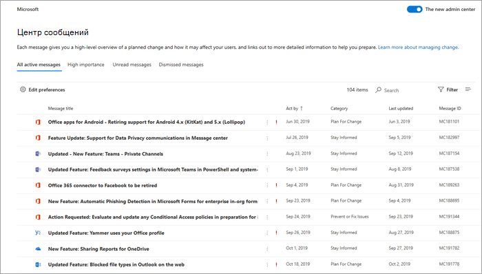

# Центр сообщений

Чтобы отслеживать предстоящие изменения, в том числе новые и измененные функции, запланированное обслуживание или другие важные объявления, перейдите в <a href="https://go.microsoft.com/fwlink/p/?linkid=2070717" target="_blank">Центр сообщений.</a>
  
Чтобы открыть центр сообщений:

::: moniker range="o365-worldwide"

- В центре администрирования перейдите в **Центр** > <a href="https://go.microsoft.com/fwlink/p/?linkid=2070717" target="_blank">сообщений о состоянии здоровья.</a>

::: moniker-end

::: moniker range="o365-germany"

- В центре <a href="https://go.microsoft.com/fwlink/p/?linkid=848041" target="_blank">администрирования перейдите</a>в **центр** > **сообщений о состоянии здоровья.**

::: moniker-end

::: moniker range="o365-21vianet"

- В центре <a href="https://go.microsoft.com/fwlink/p/?linkid=850627" target="_blank">администрирования перейдите</a>в **центр** > **сообщений о состоянии здоровья.**

::: moniker-end

Вы также можете использовать приложение [Microsoft 365 Admin](https://go.microsoft.com/fwlink/p/?linkid=627216) на мобильном устройстве для просмотра центра сообщений, что является отличным способом оставаться актуальным с push-уведомлениями.

Чтобы отписаться от сообщений центра  сообщений, см. в статье Отписка из сообщений центра сообщений.

## Вопросы и ответы

 

****

|Вопрос|Ответ|
|---|---|
|Кто может просматривать записи в Центре сообщений?|Большинство пользователей, которым назначена роль администратора в Microsoft 365 могут просматривать сообщения центра сообщений. [Вот список ролей администратора,](#admin-roles-that-dont-have-access-to-the-message-center) которые не имеют доступа к центру сообщений. Вы также можете назначить роль читателя центра сообщений пользователям, которые должны иметь возможность читать и делиться сообщениями центра сообщений без каких-либо других привилегий администратора.|
|Является ли это единственным способом, с тем чтобы Корпорация Майкрософт сообщила об изменениях в Microsoft 365?|Нет, но центр сообщений — это основной способ сообщения о времени отдельных изменений в Microsoft 365. Сведения [о дополнительных ресурсах см. в Microsoft 365](stay-on-top-of-updates.md) изменениях.|
|Как просмотреть записи на моем языке?|Сообщения центра сообщений написаны только на английском языке, но вы можете контролировать, показываются ли сообщения по умолчанию на английском или автоматически переводятся на предпочтительный язык. Вы также можете выбрать для машинного перевода сообщений на любой язык, который мы поддерживаем. Дополнительные [сведения см. в публикации языкового](language-translation-for-message-center-posts.md) перевода для сообщений центра сообщений.|
|Можно ли ознакомиться с изменениями или функции, прежде чем они будут развернуты в моей организации?|Некоторые изменения и новые функции можно просмотреть, вступая в программу целевого выпуска. Чтобы выбрать в центре администрирования, перейдите Параметры  >  **настройки профилей Организации.**  >    >   (В центре администрирования может потребоваться выбрать **Показать** все в нижней части левой области навигации, чтобы увидеть **Параметры.)** Вы можете выбрать целевой выпуск для всей организации или только для отдельных пользователей. Дополнительные сведения о программе [см.](release-options-in-office-365.md) в Microsoft 365 стандартные или целевые варианты выпуска.|
|Можно ли точно узнать, когда изменение станет доступно для моей организации?|К сожалению, мы не можем назвать точную дату изменения в вашей организации. В публикациях Центра сообщений мы указываем все известные нам детали касательно времени выпуска. Мы работаем над улучшениями, чтобы улучшить этот уровень детализации.|
|Относятся ли эти сообщения напрямую к моей организации?|Мы делаем все возможное, чтобы в Центре сообщений выводились только записи, которые касаются вашей организации. Дорожная Microsoft 365 включает все функции, над которые мы сейчас работаем и развертываем, но не все эти функции применяются к каждой организации.|
|Могу ли я вместо этого получить сообщения центра сообщений по электронной почте?|Конечно! Вы можете выбрать еженедельный дайджест по электронной почте и два других адреса электронной почты. Еженедельный дайджест по электронной почте включен по умолчанию. Если вы не получаете еженедельные дайджесты, проверьте папку нежелательной почты. Дополнительные [сведения](#preferences) о том, как настроить еженедельный дайджест, см. в разделе "Предпочтения" этой статьи.|
|Как перестать получать дайджест Центра сообщений?|Перейдите в центр сообщений в центре администрирования и выберите **Параметры**. На **вкладке Email** отключите возможность отправки уведомлений электронной **почты из центра сообщений.**|
|Как обеспечить, чтобы уведомления о конфиденциальности данных получали правильные контакты в моей организации?|В качестве глобального администратора вы будете получать сообщения о конфиденциальности данных для вашей организации. Кроме того, вы можете назначить роль читателя центра конфиденциальности сообщений людям, которые должны видеть сообщения о конфиденциальности данных. Другие роли администратора с доступом к Центру сообщений не могут просматривать сообщения конфиденциальности данных.     Дополнительные сведения см. [в статье Preferences](#preferences) in this article.|
|Почему я не могу видеть сообщение, которое было ранее?|Для управления количеством сообщений в центре сообщений каждое сообщение истекает и удаляется по истечении определенного периода времени. Как правило, срок действия сообщений истекает через 30 дней после периода времени, описанного в тексте сообщения.|
|

## Фильтрация сообщений

Центр сообщений представляет представление всех активных сообщений в формате таблицы. По умолчанию оно отображает последнее сообщение в верхней части списка. Вы можете выбрать **Службу,** чтобы увидеть сообщения для различных служб, таких как Приложения Microsoft 365, SharePoint Online и т.д.   В **теге** Вы можете выбрать **влияние администратора,** конфиденциальность данных, обновление функций, основные **обновления,** новые функции, выход на пенсию или сообщения о **влиянии** пользователя.     В **состоянии Сообщения** можно выбрать **избранное,** **непрочитанные** или **обновленные** сообщения.

На вкладке Archive показаны сообщения, которые вы заархивировать. Чтобы архивировать сообщение, в области сообщений выберите **архив**.

::: moniker range="o365-worldwide"

С помощью раскрывающихся меню **Служба**, **Тег** и **Состояние сообщения** можно отфильтровать сообщения. Например, на этой схеме к сообщениям применен тег **Влияние на администратора**.

Чтобы отсортировать сообщения в порядке возрастания или убывания, выберите заголовок нужного столбца, кроме заголовков **Служба** и **Тег**.

:::image type="content" source="../../media/message-center-admin-impact1.png" alt-text="Представление Центра сообщений с сортировкой по влиянию на администратора":::

::: moniker-end

::: moniker range="o365-germany"

С помощью раскрывающегося меню **Представления** можно отфильтровать сообщения.

Чтобы отсортировать сообщения в порядке возрастания или убывания, выберите заголовок нужного столбца. Например, на этом рисунке сообщения отсортированы по дате **Действие**.

::: moniker-end

::: moniker range="o365-21vianet"

С помощью раскрывающихся меню **Служба**, **Тег** и **Состояние сообщения** можно отфильтровать сообщения. Например, на этой схеме к сообщениям применен тег **Влияние на администратора**.

Чтобы отсортировать сообщения в порядке возрастания или убывания, выберите заголовок нужного столбца, кроме заголовков **Служба** и **Тег**.

::: moniker-end

### Основные обновления

Основные обновления можно просмотреть,  выбрав главное обновление из **выпадающих** тегов.

Основные обновления будут сообщаться не менее чем за 30 дней, если требуется действие и может включать в себя:

- Изменения в ежедневной производительности, такие как почтовые ящики, собрания, делегации, общий доступ и доступ
- Изменения тем, веб-частей и других компонентов, которые могут повлиять на настраиваемые функции
- Увеличивает или уменьшается до видимой емкости, такой как хранение, количество правил, элементов или продолжительности
- Изменения в брендинге продуктов, которые могут:
  - Вызывает путаницу конечных пользователей,
  - В результате изменения, чтобы помочь рабочим процессам и справочные материалы, или
  - Изменение URL-адреса
- Новая служба или приложение
- Изменения, требующие действий администратора (исключение для предотвращения или устранения проблем)
- Изменение места хранения данных
  
### Предпочтения

Если администрирование распространяется по всей организации, возможно, вам не потребуется или потребуется видеть сообщения обо всех Microsoft 365 службах. Каждый администратор может:

- Установите параметры, которые контролируют отображение сообщений в центре сообщений.
- Фильтрация сообщений
- Установите параметры электронной почты, чтобы получать еженедельный дайджест всех сообщений, сообщений только для основных обновлений и сообщений электронной почты для сообщений конфиденциальности данных.  

::: moniker range="o365-worldwide"

1. Выберите **Параметры** в верхней части центра сообщений.

2. На **вкладке Настраиваемый просмотр** убедитесь, что для каждой службы, которую необходимо отслеживать, выбрано поле. Очистка флажков для служб, которые необходимо отфильтровать из представления центра сообщений.

3. Дайджест электронной почты включен по умолчанию и отправляется на основной адрес электронной почты. Чтобы перестать получать еженедельный  дайджест, отправляйте мне уведомления электронной почты из почтового ящика центра сообщений на **вкладке "Электронная почта".** 

   Вы также можете ввести до двух адресов электронной почты, разделенных полуколоном.

   Вы также можете выбрать электронные письма, которые вы хотите получить, а также еженедельный дайджест выбранных служб.

4. Выберите **Сохранить,** чтобы сохранить изменения.
  
::: moniker-end

::: moniker range="o365-germany"

1. Выберите **параметры центра редактирования сообщений** в верхней части центра сообщений.

2. Убедитесь в том, что  для каждой службы, которую необходимо отслеживать, задайте для торга. Чтобы изменить параметр **Off** для служб, которые необходимо отфильтровать из представления центра сообщений, используйте переключить параметр Off.

3. Дайджест электронной почты включен по умолчанию и отправляется на основной адрес электронной почты. Чтобы перестать получать еженедельный  дайджест, измените еженедельный дайджест отправки параметров сообщений на **Off**.

   Уведомление по электронной почте для основных обновлений — это отдельный контроль. Если вы хотите получать уведомления по электронной почте о крупных обновлениях, убедитесь, что **отправить** мне сообщения электронной почты для основных обновлений **на**. Измените параметр **Off,** чтобы перестать получать электронную почту о крупных обновлениях. 

   Чтобы получать уведомления электронной почты о сообщениях конфиденциальности данных, убедитесь, что **отправить** мне сообщения электронной почты для сообщений конфиденциальности **данных на**. Чтобы перестать получать эти уведомления, измените параметр **Off**. (Сообщения о конфиденциальности данных не включаются в еженедельный дайджест.)

   Основной адрес электронной почты можно выбрать или очистить, но изменить его нельзя. Чтобы указать другие адреса электронной почты, на которые отправляется еженедельная сводка электронной почты, убедитесь, что **отправить** еженедельный дайджест моих сообщений **на**. Введите адрес электронной почты для Microsoft 365 группы или списка рассылки, если более двух человек должны получить дайджест электронной почты.

4. Выберите **Сохранить,** чтобы сохранить изменения.

::: moniker-end

::: moniker range="o365-21vianet"

1. Выберите **Параметры** в верхней части центра сообщений.

2. На **вкладке Настраиваемый просмотр** убедитесь, что для каждой службы, которую необходимо отслеживать, выбрано поле. Очистка флажков для служб, которые необходимо отфильтровать из представления центра сообщений.

3. Дайджест электронной почты включен по умолчанию и отправляется на основной адрес электронной почты. Чтобы перестать получать еженедельный  дайджест, отправляйте мне уведомления электронной почты из почтового ящика центра сообщений на **вкладке "Электронная почта".**

   Вы также можете ввести до двух адресов электронной почты, разделенных полуколоном.

   Вы также можете выбрать электронные письма, которые вы хотите получить, а также еженедельный дайджест выбранных служб.

4. Выберите **Сохранить,** чтобы сохранить изменения.

::: moniker-end

### Отображение сообщений на предпочтительном языке
  
Мы используем машинный перевод для автоматического отображения сообщений на предпочтительном языке. Дополнительные сведения о том, как настроить язык, читайте в публикации [Language translation for Message](language-translation-for-message-center-posts.md) Center.
  
> [!NOTE]
> Еженедельный дайджест и все сообщения, отправленные по электронной почте, отправляются только на английском языке. Получатели могут использовать [Переводчик для Outlook](https://support.microsoft.com/office/3d7e12ed-99d6-406e-a453-b9db0d9653fa) для чтения сообщения на предпочтительном языке.

## Выбор столбцов

Чтобы выбрать столбцы,  на странице Центр сообщения, справа, выберите Выберите столбцы, а в области **Выберите** столбцы выберите те, которые необходимо отобразить.

Ниже представлен краткий обзор сведений, которые вы увидите в каждом столбце.

### Сведения о столбцах

 

****

|Столбец|Описание|
|---|---|
|Флажок|При выборе контрольного знака в строке заголовка столбца будут выбраны все отображаемые в настоящее время сообщения. Выбор контрольного знака рядом с одним или более сообщениями позволяет принимать меры по этим сообщениям.|
|Название сообщения|Заголовки сообщений — это краткие описания предстоящих изменений. Если полное название не отображается, наведите курсор на него, и весь заголовок появится в всплывающее окно.|
|Служба|Значки указывают приложение, к которому применяется сообщение.|
|Дополнительные параметры|Дополнительные параметры позволяют отклонять сообщение, пометить его как прочитанные или непрочитанные, или поделиться им с другим администратором. Чтобы восстановить архивное сообщение, выберите вкладку **Archive,** выберите контрольный знак рядом с сообщением и выберите **Восстановление.**|
|Теги|Для фильтрации сообщений  можно выбрать теги из выпадаемого тега. Доступные теги: **Влияние** **администратора,** главное **обновление,** конфиденциальность **данных,** обновление функций, **новая** **функция,** выход на пенсию и **влияние пользователя.**|
|Категория| Это не отображается по умолчанию, но может быть указано в панели **Выберите столбцы.** Сообщения идентифицированы по одной из следующих трех категорий: 
 **Предотвращение или устранение** проблем. Информирует вас о известных проблемах, влияющих на организацию, и может потребоваться принять меры, чтобы избежать сбоев в работе службы. Предотвращение или устранение проблем отличается от сообщений службы, так как они побуждают вас проявлять инициативу, чтобы избежать проблем. 
 **Планирование изменений.** Информирует вас об изменениях в Microsoft 365, которые могут потребовать от вас действовать, чтобы избежать сбоев в работе службы. Например, мы сообщаем об изменениях требований к системе или об удаляемых функциях. Мы стараемся сообщать об изменениях, требующих действий администратора, по крайней мере за 30 дней. 
 **Будьте в курсе.** Рассказывает о новых или обновленных функций, которые мы включаем в вашей организации. Эти функции обычно сначала объявляются в [Microsoft 365 roadmap](https://go.microsoft.com/fwlink/?linkid=2070821). 
 Может также дать вам знать о запланированном обслуживании в соответствии с нашим соглашением об уровне обслуживания. Запланированное обслуживание может привести к простою, когда вы или ваши пользователи не можете получить доступ к Microsoft 365, определенной функции или службе, такой как электронная почта или OneDrive для бизнеса.|
|Действие|Дата указывается только в том случае, если изменение требует от вас действий, которые необходимо выполнить к определенному сроку. Так как мы редко используем **Закон по столбцу,** если вы видите что-то здесь, вам следует обратить на него дополнительное внимание.|
|Последнее обновление|Дата публикации или последнего обновления сообщения.|
|ИД сообщения|Майкрософт отслеживает записи Центра сообщений по идентификаторам. Вы можете обратиться к этому ID, если вы хотите дать обратную связь или если вы звоните в службу поддержки о конкретном сообщении.|
|

### Роли администратора, у которых нет доступа к центру сообщений

- Администратор соответствия требованиям
- Администратор условного доступа
- Одобрение доступа клиента LockBox
- Администраторы устройств
- Читатели каталогов
- Учетные записи синхронизации каталогов
- Запись каталогов
- администратор службы Intune;
- Администратор привилегированных ролей
- Читатель отчетов

## Оставить отзыв о публикации

В Центре сообщений можно выбрать сообщение, чтобы просмотреть подробные сведения.

Чтобы оставить отзыв о сообщении, выберите значок **Нравится** или **Не нравится** в нижней части области сведений о сообщении и оставьте свой необязательный отзыв в появившемся текстовом поле. Не предоставляйте личные сведения. При необходимости можно выбрать **Со мной можно связаться по поводу отзыва**, а затем **Отправить**.

## Пересылка сообщения

Действия, требуемые в сообщении, должен выполнить кто-то другой? Вы можете поделиться содержимым сообщения, отправив его по электронной почте:
  
1. Выберите сообщение, чтобы открыть его, а затем нажмите **Поделиться**.
  
2. Чтобы поделиться сообщением, введите до двух адресов электронной почты, разделяя их точкой с запятой. Вы можете отправлять сообщения на индивидуальные электронные адреса или в группы адресов электронной почты. При желании можно получить копию сообщения в электронном письме (сообщение будет отправлено на основной адрес электронной почты) или добавить личное сообщение, предоставив получателям больше контекста.
  
3. Нажмите **Поделиться**, чтобы отправить сообщение.

## Получение ссылки

Вам нужно убедиться, что другой администратор знает об изменении и принимает соответствующие меры? Вы можете создать ссылку на уведомление и отправить ее по электронной почте или через мгновенные сообщения. У человека, с которым вы делитесь ссылкой, должен быть доступ к Центру сообщений. Дополнительные сведения см. в разделе [Роли администраторов, у которых нет доступа к Центру сообщений](message-center.md#admin-roles-that-dont-have-access-to-the-message-center).

1. Выберите сообщение, чтобы открыть его.

2. Выберите **Копировать ссылку**.

3. Чтобы вставить ссылку на нужный документ, нажмите клавиши CTRL+V или щелкните правой кнопкой мыши и выберите **Вставить**.

## Состояния "Прочитанное" и "Непрочитанное"

Любое непрочитанное сообщение в Центре выделяется полужирным шрифтом. При открытии сообщения оно помечается как прочитанное. Сообщение можно пометить как непрочитанное.

На главной странице Центра сообщений щелкните многоточие **Дополнительные параметры** рядом с сообщением и выберите **Пометить как непрочитанное**.

Вы также можете открыть сообщение и пометить его как непрочитанное на панели сведений.
  
## Архивация и восстановление

Если вы видите сообщение, которое не относится к вам или которое уже не актуально, вы можете заархивировать сообщение, чтобы удалить его из папки "Входящие". Представление, которое вы видите в Центре сообщений, связано только с вашей учетной записью, поэтому архивация сообщения не повлияет на других администраторов. Архивировать сообщения можно двумя способами.

- На главной странице Центра сообщений выберите сообщение, а затем щелкните **Архивировать** над списком сообщений.
- Откройте сообщение и выберите **Архивировать** в верхней части панели сообщения.

Необходимо вернуть архивное сообщение? Это не проблема.
  
1. В верхней части Центра сообщений выберите вкладку **Архив**. Отобразится список архивных сообщений.

1. Выберите сообщение, нажмите **Восстановить**, и оно будет восстановлено в папке "Входящие".

## Избранные сообщения

Чтобы пометить сообщение как избранное, наведите курсор на его заголовок, после чего рядом с многоточием **Дополнительные параметры** появится звезда **Избранное** :::image type="icon" source="../../media/favorite-star.png" border="false":::, которую можно щелкнуть. После пометки сообщений в качестве избранных вы сможете сортировать и фильтровать их.

## Переход между сообщениями в области сообщения

Открыв сообщение в области чтения, вы можете использовать стрелки **Вверх** и **Вниз** :::image type="icon" source="../../media/updownarrows.png" border="false"::: в верхней части области, чтобы перейти к следующему или предыдущему сообщению в списке.

## Отслеживание задач центра сообщений в Планировщике

Многие полезные сведения об изменениях служб Microsoft 365 поступают в центр сообщений Microsoft 365. Может быть сложно отслеживать, какие изменения требуют выполнения задач, сроки выполнения и исполнителей, а также завершение каждой задачи. Кроме того, вам может потребоваться создать заметку о чем-нибудь и пометку для проверки позже. Вы можете выполнять все эти и другие действия, синхронизировав сообщения из Центра администрирования Microsoft 365 с Планировщиком (Майкрософт). Дополнительные сведения см. в статье [Отслеживание своих задач Центра сообщений в Планировщике](/office365/planner/track-message-center-tasks-planner).

Общие сведения о Центре сообщений см. в статье [Центр сообщений в Microsoft 365](message-center.md). Сведения о настройке языковых параметров для включения машинного перевода записей Центра сообщений, см. в статье [Перевода записей Центра сообщений](language-translation-for-message-center-posts.md). Если вы хотите получать актуальные сведения о работоспособности служб и уведомления Центра сообщений программным путем, см. [Обзор API взаимодействия служб Microsoft 365](/previous-versions/office/developer/o365-enterprise-developers/jj984343(v=office.15)).

## Отписка из сообщений центра сообщений

1. Дайджест электронной почты включен по умолчанию и отправляется на основной адрес электронной почты. Чтобы перестать получать еженедельный дайджест, выберите **Параметры** и отправьте **сообщение электронной почты.**
    - Отослать **еженедельный дайджест моего почтового** ящика сообщений.
    - Уведомление по электронной почте для основных обновлений — это отдельный контроль. Если вы не хотите получать уведомления по электронной почте  о крупных обновлениях, убедитесь, что отправка сообщений электронной почты для основных почтовых ящиков обновлений не выбрана.
    - Чтобы перестать получать уведомления электронной почты  о сообщениях конфиденциальности данных, убедитесь, что почтовый ящик отправки сообщений конфиденциальности данных не выбран.  (Сообщения о конфиденциальности данных не включаются в еженедельный дайджест.)

2. Выберите **Сохранить,** чтобы сохранить изменения.

## См. также:

[Настройка стандартных или целевых параметров](../manage/release-options-in-office-365.md) выпуска (статья)\
[Управление Office функций в What's New](../manage/show-hide-new-features.md) (статья)\
[Бизнес-подписки и документация по выставлению счета](../../commerce/index.yml) (страница ссылки)
