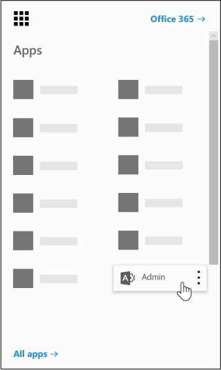

# Power BI в организацииPower BI in your organization

На этой странице описывается, как пользователи в вашей организации могут использовать Power BI и как можно управлять освоением этой службы в вашей организации.This page describes how users in your organization can use Power BI and how you can control how your organization acquires this service.
    
## Что такое Power BI?What is Power BI?

С помощью Microsoft Power BI пользователи могут визуализировать данные, делиться новыми открытиями, а также использовать новые возможности для совместной работы. Дополнительные сведения см. [на сайте Power BI](https://powerbi.microsoft.com/en-us/).Microsoft Power BI enables users to visualize data, share discoveries, and collaborate in intuitive new ways. To learn more, see the [Power BI Web site](https://powerbi.microsoft.com/en-us/).
  
## Соответствует ли Power BI национальные, региональные и отраслевые требования соответствия требованиям?Does Power BI meet national, regional, and industry-specific compliance requirements?

Дополнительные сведения о соответствии Power BI содержатся в [центре управления безопасностью Майкрософт](https://go.microsoft.com/fwlink/?LinkId=785324).To learn more about Power BI compliance, see the [Microsoft Trust Center](https://go.microsoft.com/fwlink/?LinkId=785324).
  
## Как пользователям зарегистрироваться в службе Power BI?How do users sign up for Power BI?

Как администратор вы можете зарегистрироваться в службе Power BI на [веб-сайте Power BI](https://powerbi.microsoft.com/en-us/).As an administrator, you can sign up for Power BI through the [Power BI web site](https://powerbi.microsoft.com/en-us/). Вы также можете зарегистрироваться на странице "Покупка служб" в центре администрирования Microsoft 365.You can also sign up through the purchase services page on the Microsoft 365 admin center. Когда администратор регистрируется в Power BI, он может назначить пользовательские лицензии пользователям, которым требуется доступ.When an administrator signs up for Power BI, they can assign user subscription licenses to users who should have access.
  
Кроме того, отдельные пользователи в вашей организации могут зарегистрироваться в Power BI на [веб-сайте Power BI](https://powerbi.microsoft.com/en-us/). Когда пользователь вашей организации регистрируется для получения Power BI, ему автоматически назначается лицензия Power BI.Additionally, individual users in your organization may be able to sign up for Power BI through the [Power BI web site](https://powerbi.microsoft.com/en-us/). When a user in your organization signs up for Power BI, that user is assigned a Power BI license automatically.
  
## Как зарегистрироваться отдельным пользователям в организации?How do individual users in my organization sign up?

Для пользователей в вашей организации возможны три сценария.There are three scenarios that might apply to users in your organization:
  
### Сценарий 1: у вашей организации уже есть среда Microsoft 365, и пользователь, зарегистрировавшийся в Power BI, уже имеет учетную запись Microsoft 365.Scenario 1: Your organization already has an existing Microsoft 365 environment and the user signing up for Power BI already has an Microsoft 365 account.

В этом случае, если у пользователя уже есть учетная запись организации или учебного заведения в клиенте (например, contoso.com), но еще нет Power BI, корпорация Майкрософт просто активирует план для этой учетной записи, и пользователю автоматически отправляется уведомление с инструкциями по использованию службы Power BI.In this scenario, if a user already has a work or school account in the tenant (for example, contoso.com) but does not yet have Power BI, Microsoft will simply activate the plan for that account, and the user will automatically be notified of how to use the Power BI service.
  
### Сценарий 2: у вашей организации есть среда Microsoft 365, и пользователь, зарегистрировавшийся в Power BI, не имеет учетной записи Microsoft 365.Scenario 2: Your organization has an existing Microsoft 365 environment and the user signing up for Power BI doesn't have an Microsoft 365 account.

В этом сценарии у пользователя есть адрес электронной почты в домене вашей организации (например, contoso.com), но еще нет учетной записи Microsoft 365.In this scenario, the user has an email address in your organization's domain (for example, contoso.com) but does not yet have an Microsoft 365 account. В такой ситуации пользователь может зарегистрироваться в Power BI и автоматически получить учетную запись.In this case, the user can sign up for Power BI and will automatically be given an account. Таким образом пользователь получает доступ к службе Power BI.This lets the user access the Power BI service. Например, если сотрудник с именем Валентин использует свой рабочий адрес электронной почты (например, Nancy@contoso.com) для регистрации, корпорация Майкрософт автоматически добавляет Нэнси в качестве пользователя в среду Contoso Microsoft 365 и активирует Power BI для этой учетной записи.For example, if an employee named Nancy uses her work email address (for example, Nancy@contoso.com) to sign up, Microsoft will automatically add Nancy as a user in the Contoso Microsoft 365 environment and activate Power BI for that account.
  
### Сценарий 3: в вашей организации отсутствует среда Microsoft 365, подключенная к вашему домену электронной почты.Scenario 3: Your organization does not have a Microsoft 365 environment connected to your email domain.

Организации не требуется выполнять никаких административных действий, чтобы воспользоваться возможностями Power BI.There are no administrative actions your organization needs to take to take advantage of Power BI.
  
> [!IMPORTANT]
> Если в Организации имеется несколько доменов электронной почты и вы предпочитаете, чтобы все расширения адресов электронной почты настроились в одном клиенте, перед тем как пользователи будут создавать основной клиент, добавьте все домены адресов электронной почты в этот клиент перед тем, как пользователи создают основной клиент.If your organization has multiple email domains and you prefer all email address extensions to be in the same tenant, before any users create your primary tenant, add all email address domains to that tenant before any users create your primary tenant. Не существует автоматизированного механизма для перемещения пользователей между клиентами после их создания.There is no automated mechanism to move users across tenants after they have been created. Дополнительные сведения об этом процессе можно узнать в статье [Если у меня есть несколько доменов, могу ли я управлять клиентом, к которому добавлены пользователи](#if-i-have-multiple-domains-can-i-control-the-tenant-that-users-are-added-to) , в дальнейшем и [Добавить домен в Office 365](../setup/add-domain.md) Online.For more information on this process, see [If I have multiple domains, can I control the tenant that users are added to?](#if-i-have-multiple-domains-can-i-control-the-tenant-that-users-are-added-to) later in this article and [Add a domain to Office 365](../setup/add-domain.md) online. 
  
## Как изменится существующий в моей организации подход к управлению удостоверениями пользователей?How will this change the way I manage identities for users in my organization today?

Если в вашей организации уже есть среда Microsoft 365, а все пользователи в вашей организации имеют учетные записи Microsoft 365, управление удостоверениями не изменится.If your organization already has an existing Microsoft 365 environment and all users in your organization have Microsoft 365 accounts, identity management will not change.
  
Если в вашей организации уже есть среда Microsoft 365, но не все пользователи в вашей организации имеют учетные записи Microsoft 365, мы создадим пользователя в клиенте и назначаем лицензии, основываясь на рабочем или учебном электронном адресе пользователя.If your organization already has an existing Microsoft 365 environment but not all users in your organization have Microsoft 365 accounts, we will create a user in the tenant and assign licenses based on the user's work or school email address. Это означает, что количество пользователей, которыми вы управляете на текущий момент, будет увеличиваться по мере регистрации пользователей вашей организации для получения службы.This means that the number of users you are managing at any particular time will grow as users in your organization sign up for the service.
  
Если вы управляете своим каталогом локально и используете службы федерации Active Directory, корпорация Майкрософт не будет добавлять пользователей в клиент, а все пользователи, попытавшиеся присоединиться к нему, получат сообщение с просьбой обратиться к администратору своей организации.If you are managing your directory on-premises, and use Active Directory Federation Services (AD FS), Microsoft will not add users to your tenant, and users attempting to join your tenant will receive a message to contact their organization's admin.
  
Если в вашей организации отсутствует среда Microsoft 365, подключенная к домену электронной почты, то способ управления удостоверением не изменится.If your organization does not have an Microsoft 365 environment connected to your email domain, there will be no change in how you manage identity. Пользователи будут добавлены в новый, полностью облачный каталог пользователей, а вы сможете при желании принять на себя обязанности администратора клиента и приступить к управлению.Users will be added to a new, cloud-only user directory, and you will have the option to elect to take over as the tenant admin and manage them.
  
## В чем заключается процесс управления клиентом, созданным корпорацией Майкрософт для моих пользователей?What is the process to manage a tenant created by Microsoft for my users?

Если клиент был создан корпорацией Майкрософт, вы можете переключить на себя управление им, выполнив указанные ниже действия.If a tenant was created by Microsoft, you can claim and manage that tenant by following these steps:
  
1. Присоединитесь к клиенту, [выполнив регистрацию в Power BI](https://go.microsoft.com/fwlink/?LinkId=522448) с использованием домена электронной почты, совпадающего с доменом клиента, которым вы хотите управлять. Например, если корпорация Майкрософт создала клиент contoso.com, вам необходимо присоединиться к нему, используя адрес электронной почты, который заканчивается символами @contoso.com.Join the tenant by [signing up for Power BI](https://go.microsoft.com/fwlink/?LinkId=522448) using an email address domain that matches the tenant domain you want to manage. For example, if Microsoft created the contoso.com tenant, you will need to join the tenant with an email address ending with @contoso.com. 
    
2. Запросите административный контроль, подтвердив владение доменом: после присоединения к клиенту вы можете повысить свой уровень до роли администратора, подтвердив владение доменом. Для этого выполните указанные ниже действия.Claim admin control by verifying domain ownership: once you are in the tenant, you can promote yourself to the admin role by verifying domain ownership. To do so, follow these steps:
 
::: moniker range="o365-worldwide"
   
3. Перейдите на веб-сайт [https://admin.microsoft.com](https://admin.microsoft.com).Go to [https://admin.microsoft.com](https://admin.microsoft.com).
 

::: moniker-end

::: moniker range="o365-germany"

3. Перейдите по ссылке [https://portal.office.de](https://portal.office.de).Go to [https://portal.office.de](https://portal.office.de).

::: moniker-end

::: moniker range="o365-21vianet"

3. Перейдите по ссылке [https://portal.partner.microsoftonline.cn](https://portal.partner.microsoftonline.cn).Go to [https://portal.partner.microsoftonline.cn](https://portal.partner.microsoftonline.cn).

::: moniker-end

    
4. В левом верхнем углу щелкните значок средства запуска приложений и выберите **Администратор**.Select the app launcher icon in the upper-left and choose **Admin**.
    
    
  
5. Прочитайте инструкции на странице **"Станьте администратором** ", а затем выберите **Да, я хочу быть администратором**.Read the instructions on the **Become the admin** page and then select **Yes, I want to be the admin**.
    
    > [!NOTE]
    >  Если этот параметр не отображается, значит, у вас уже есть права администратора.If this option doesn't appear, there is already an administrator in place. 
  
## Если у меня есть несколько доменов, можно ли управлять клиентом, к которому добавлены пользователи?If I have multiple domains, can I control the tenant that users are added to?

По умолчанию клиенты создаются для каждого домена и поддомена электронной почты пользователей.If you do nothing, a tenant will be created for each user email domain and subdomain.
  
Если вы хотите разместить всех пользователей в одном клиенте независимо от расширений адресов электронной почты, сделайте следующее:If you want all users to be in the same tenant regardless of their email address extensions:
  
- Заранее создайте целевой клиент (или используйте существующий) и добавьте в него все имеющиеся домены и поддомены. В этом случае все пользователи с адресами электронной почты, соответствующими этим доменам и поддоменам, при регистрации будут автоматически присоединены к целевому клиенту.Create a target tenant ahead of time or use an existing tenant, and add all the existing domains and subdomains that you want consolidated within that tenant. Then all the users with email addresses ending in those domains and subdomains will automatically join the target tenant when they sign up.
    
> [!IMPORTANT]
> Автоматизированная процедура перемещения уже созданных пользователей в другие клиенты не предусмотрена.There is no supported automated mechanism to move users across tenants once they have been created. Чтобы узнать о добавлении доменов в один клиент Microsoft 365, ознакомьтесь со статьей [Добавление домена в Office 365](../setup/add-domain.md).To learn about adding domains to a single Microsoft 365 tenant, see [Add a domain to Office 365](../setup/add-domain.md). 
  
> [!IMPORTANT]
> Дополнительные сведения и рекомендации по управлению клиентами можно узнать в разделе [что такое администрирование Power BI?](https://docs.microsoft.com/power-bi/service-admin-administering-power-bi-in-your-organization).For additional information and guidance on managing tenants, see [What is Power BI administration?](https://docs.microsoft.com/power-bi/service-admin-administering-power-bi-in-your-organization). 
  
## Как запретить пользователям присоединяться к существующему клиенту?How can I prevent users from joining my existing tenant?

Существуют действия, которые можно использовать в качестве администратора, чтобы запретить пользователям присоединяться к существующему клиенту.There are steps you can take as an admin to prevent users from joining your existing tenant. Если заблокировать эту задачу, попытки входа пользователей завершатся неудачей, и они будут направлены на адрес администратора организации. Не требуется повторять этот процесс, если вы уже отключили автоматическое распространение лицензий (например, Office 365 для учащихся, преподавателей и сотрудников).If you do block this, users' attempts to sign in will fail and they will be directed to contact their organization's admin. You do not need to repeat this process if you have already disabled automatic license distribution before (e.g. Office 365 Education for Students, Faculty and Staff).
  
Для выполнения этих действий требуется Windows PowerShell.These steps require the use of Windows PowerShell. Чтобы начать работу с Windows PowerShell, см. [Руководство по началу работы с PowerShell](https://go.microsoft.com/fwlink/p/?LinkID=286814).To get started with Windows PowerShell, see the [PowerShell getting started guide](https://go.microsoft.com/fwlink/p/?LinkID=286814).
  
Чтобы выполнить следующие действия, необходимо установить последнюю 64 – разрядную версию [модуля PowerShell для Azure Active Directory v2](https://www.powershellgallery.com/packages/AzureADPreview/2.0.2.5).To perform the following steps, you must install the latest 64-bit version of the [Azure Active Directory V2 PowerShell Module](https://www.powershellgallery.com/packages/AzureADPreview/2.0.2.5).
  
После выбора ссылки выберите команду **выполнить** , чтобы запустить пакет установщика.After you select the link, select **Run** to run the installer package. 
  
 **Disable automatic tenant join** (Отключить автоматическое присоединение к клиенту). Используйте эту команду Windows PowerShell, чтобы запретить новым пользователям присоединяться к клиенту, которым вы управляете.**Disable automatic tenant join**: Use this Windows PowerShell command to prevent new users from joining a managed tenant:
  
Отключение автоматического присоединения к клиенту для новых пользователей:  `Set-MsolCompanySettings -AllowEmailVerifiedUsers $false`To disable automatic tenant join for new users:  `Set-MsolCompanySettings -AllowEmailVerifiedUsers $false`
  
Включение автоматического присоединения к клиенту для новых пользователей:  `Set-MsolCompanySettings -AllowEmailVerifiedUsers $true`To enable automatic tenant join for new users:  `Set-MsolCompanySettings -AllowEmailVerifiedUsers $true`
  
> [!NOTE]
> Эта блокировка запрещает новым пользователям в вашей организации подписываться на Power BI.This blocking prevents new users in your organization from signing up for Power BI. Пользователи, которые записываются в Power BI до отключения новых регистраций для вашей организации, сохранят свои лицензии.Users that sign up for Power BI prior to disabling new signups for your organization will still retain their licenses. Сведения [о том, как удалить Power BI для пользователей, которые уже зарегистрированы?](#how-do-i-remove-power-bi-for-users-that-already-signed-up) инструкции по удалению доступа к Power BI для пользователей, которые ранее зарегистрировались для службы.See the [How do I remove Power BI for users that already signed up?](#how-do-i-remove-power-bi-for-users-that-already-signed-up) for instructions on how you can remove access to Power BI for users that had previously signed up for the service. 
  
## Как разрешить пользователям присоединяться к существующему клиенту?How can I allow users to join my existing tenant?

To allow users to join your tenant, run the opposite command as described in the question above:  `Set-MsolCompanySettings -AllowEmailVerifiedUsers $true`To allow users to join your tenant, run the opposite command as described in the question above:  `Set-MsolCompanySettings -AllowEmailVerifiedUsers $true`
  
## Как можно проверить, заблокирован ли клиент?How do I verify if I have the block on in the tenant?

Воспользуйтесь следующим сценарием PowerShell:  `Get-MsolCompanyInformation | fl allow*`Use the following PowerShell script:  `Get-MsolCompanyInformation | fl allow*`
  
## Как запретить имеющимся пользователям начать работу с Power BI?How can I prevent my existing users from starting to use Power BI?

 **Отключение автоматического распространения лицензий:** Используйте этот сценарий Windows PowerShell, чтобы отключить автоматическое распространение лицензий для существующих пользователей.**Disable automatic license distribution:** Use this Windows PowerShell script to disable automatic license distributions for existing users. Не требуется повторять этот процесс, если вы уже отключили автоматическое распространение лицензий (например, Office 365 для учащихся, преподавателей и сотрудников).You do not need to repeat this process if you have already disabled automatic license distribution before (e.g. Office 365 Education for Students, Faculty and Staff). 
  
Отключение автоматической рассылки лицензий для существующих пользователей:  `Set-MsolCompanySettings -AllowAdHocSubscriptions $false`To disable automatic license distribution for existing users:  `Set-MsolCompanySettings -AllowAdHocSubscriptions $false`
  
Включение автоматической рассылки лицензий для существующих пользователей:  `Set-MsolCompanySettings -AllowAdHocSubscriptions $true`To enable automatic license distribution for existing users:  `Set-MsolCompanySettings -AllowAdHocSubscriptions $true`
  
> [!NOTE]
> Флаг *алловадхоксубскриптионс* используется для управления несколькими возможностями пользователя в Организации, в том числе возможность регистрации пользователей для службы управления правами Azure.The *AllowAdHocSubscriptions* flag is used to control several user capabilities in your organization, including the ability for users to sign up for the Azure Rights Management Service. Состояние этого флажка влияет на все эти возможности.Changing this flag will affect all of these capabilities. 
  
## Как разрешить существующим пользователям зарегистрироваться в Power BI?How can I allow my existing users to sign up for Power BI?

To allow your existing users to sign up for Power BI, run the opposite command as described in the question above:  `Set-MsolCompanySettings -AllowAdHocSubscriptions $true`To allow your existing users to sign up for Power BI, run the opposite command as described in the question above:  `Set-MsolCompanySettings -AllowAdHocSubscriptions $true`
  
## Как удалить доступ к Power BI для пользователей, которые уже зарегистрированы?How do I remove Power BI for users that already signed up?

Если пользователь зарегистрировался в службе Power BI, однако вы хотите запретить ему доступ к Power BI, можно удалить лицензию Power BI для этого пользователя.If a user signed up for Power BI but you no longer want them to have access to Power BI, you can remove the Power BI license for that user.

::: moniker range="o365-worldwide"

> [!NOTE]
> Если вы не используете новый Центр администрирования Microsoft 365, можно включить его с помощью переключателя **Попробовать новый Центр администрирования**, расположенного в верхней части главной страницы.If you're not using the new Microsoft 365 admin center, you can turn it on by selecting the **Try the new admin center** toggle located at the top of the Home page.
  
1. В Центре администрирования откройте страницу **Пользователи** \> <a href="https://go.microsoft.com/fwlink/p/?linkid=834822" target="_blank">Активные пользователи</a>.In the admin center, go to the **Users** \> <a href="https://go.microsoft.com/fwlink/p/?linkid=834822" target="_blank">Active users</a> page.
    
2. Найдите пользователя, для которого требуется удалить лицензию, и выберите его имя.Find the user you want to remove the license for, then select their name.
    
3. На вкладке " **лицензии и приложения** " снимите флажок **Microsoft Power BI** .On the **Licenses and Apps** tab, clear the **Microsoft Power BI** check box.
    
4. Нажмите кнопку **Сохранить изменения**.Select **Save changes**.

::: moniker-end

  
::: moniker range="o365-germany"

1. В Центре администрирования откройте страницу **Пользователи** \> <a href="https://go.microsoft.com/fwlink/p/?linkid=847686" target="_blank">Активные пользователи</a>.In the admin center, go to the **Users** \> <a href="https://go.microsoft.com/fwlink/p/?linkid=847686" target="_blank">Active users</a> page.

2. Найдите пользователя, для которого требуется удалить лицензию, и выберите его имя.Find the user you want to remove the license for, then select their name.
    
3. Рядом с пунктом **лицензии на продукты**нажмите кнопку **изменить**.Next to **Product licenses**, select **Edit**. 
    
4. Отключать параметр **Microsoft Power BI** .Toggle off the **Microsoft Power BI** option.
    
5. Нажмите кнопку **Сохранить**.Select **Save**.

::: moniker-end

::: moniker range="o365-21vianet"

1. В Центре администрирования откройте страницу **Пользователи** \> <a href="https://go.microsoft.com/fwlink/p/?linkid=850628" target="_blank">Активные пользователи</a>.In the admin center, go to the **Users** \> <a href="https://go.microsoft.com/fwlink/p/?linkid=850628" target="_blank">Active users</a> page.

2. Найдите пользователя, для которого требуется удалить лицензию, и выберите его имя.Find the user you want to remove the license for, then select their name.
    
3. Рядом с пунктом **лицензии на продукты**нажмите кнопку **изменить**.Next to **Product licenses**, select **Edit**. 
    
4. Отключать параметр **Microsoft Power BI** .Toggle off the **Microsoft Power BI** option.
    
5. Нажмите кнопку **Сохранить**.Select **Save**.

::: moniker-end 

## Как узнать, что к моему клиенту подключились новые пользователи?How do I know when new users have joined my tenant?

Пользователи, присоединившиеся к клиенту в рамках данной программы, получают уникальную лицензию, по которой можно отфильтровать список активных пользователей на панели администратора.Users who have joined your tenant as part of this program are assigned a unique license that you can filter on within your active user pane in the admin dashboard.
  
Чтобы создать новое представление, выполните действия, описанные в разделе [Создание настраиваемого представления пользователя](../add-users/create-edit-or-delete-a-custom-user-view.md#create-a-custom-user-view)в центре администрирования.To create this new view, in the admin center, follow the steps to in [Create a custom user view](../add-users/create-edit-or-delete-a-custom-user-view.md#create-a-custom-user-view). В разделе **назначенная лицензия на продукт**выберите **Microsoft Power BI**.Under **Assigned product license**, select **Microsoft Power BI**. После создания нового представления вы сможете просматривать всех пользователей в клиенте, которые зарегистрированы в этой программе.After the new view has been created, you will be able to see all the users in your tenant who have enrolled in this program.
  
## Есть ли какие-нибудь подводные камни, которые нужно иметь в виду?Are there any additional things I should be prepared for?

Возможно, вы чаще будете сталкиваться с запросами на сброс пароля.You might experience an increase in password reset requests. Сведения об этой процедуре см. в статье [Сброс пароля пользователя](../add-users/reset-passwords.md).For information about this process, see [Reset a user's password](../add-users/reset-passwords.md).
  
Вы можете удалить пользователя из клиента с помощью стандартного процесса в центре администрирования.You can remove a user from your tenant via the standard process in the admin center. Однако если у пользователя по-прежнему имеется активный адрес электронной почты, предоставленный вашей организацией, он сможет снова присоединиться к клиенту, если только вы не заблокируете эту возможность для всех пользователей.However, if the user still has an active email address from your organization, they will be able to rejoin unless you block all users from joining.
  
## Почему лицензии 1 000 000 для Microsoft Power BI отображаются в моем клиенте?Why did 1 million licenses for Microsoft Power BI show up in my tenant?

Пользователи соответствующей организации имеют право использовать службу Microsoft Power BI, и эти лицензии обозначают доступное количество новых пользователей Power BI в вашем клиенте.As a qualifying organization, users in your organization are eligible to use the Microsoft Power BI service and these licenses represent the available capacity for new Power BI users in your tenant. Это бесплатные лицензии.There is no charge for these licenses. Если вы решили разрешить пользователям зарегистрироваться в Power BI, им будет назначена одна из этих доступных свободных лицензий при завершении процесса регистрации.If you've chosen to allow users to sign up for Power BI themselves, they will be assigned one of these available free licenses when they complete the sign up process. Вы также можете назначить эти лицензии пользователям самостоятельно с помощью центра администрирования.You can also choose to assign these licenses to users yourself through the admin center.
  
## Это бесплатный продукт?Is this free? Мне нужно платить за эти лицензии?Will I be charged for these licenses?

Эти лицензии предназначены для бесплатной версии Power BI. Если вам необходимы дополнительные возможности, обратите внимание на версию Power BI Pro.These licenses are for the free version of Power BI. If you're interested in additional capabilities, take a look at the Power BI Pro version.
  
## Зачем нужен 1 миллион лицензий?Why 1 million licenses?

Мы выбрали достаточно большой объем лицензий, чтобы большинство организаций имело достаточное количество лицензий, не откладывая их на пользователей.We chose a number that was large enough that the majority of organizations would have ample licenses to provide this benefit without delay to their users.
  
## Что делать, если требуется больше 1 миллиона лицензий?What if I need more than 1 million licenses?

За сведениями о том, как получить дополнительные лицензии, обратитесь к своему представителю корпорации Майкрософт.Contact your Microsoft account representative for more information if you will need to acquire additional licenses.
