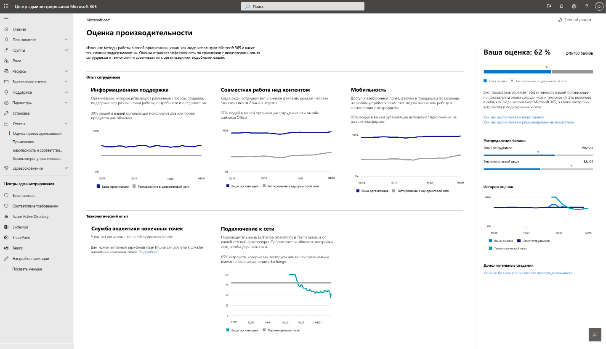

# Оценка производительности Майкрософт (ознакомительная версия)

Microsoft 365 предлагает решения для повышения производительности, позволяющие Организации выполнять бизнес-цели. Оценка производительности предоставляет аналитические сведения о том, как использовать эти решения, которые можно преобразовать в процесс завершения работы.Он содержит: 

- **Видимость** , помогая им понять, как люди работают в форме их текущих оценок с разбивкой по категориям взаимодействия с сотрудниками и технологиями (ожидается в ближайшее время). 
- **Аналитика** , позволяющая выявить возможности для улучшения взаимодействия. 
- **Действия** по обновлению навыков и систем, чтобы все могли работать с ними. 

Оценка и аналитика представлены в двух категориях —  

- Сведения о **сотрудниках:** в этой области показано, как Microsoft 365 помогает создавать производительные и занятые сотрудники, прочисляя совместное использование контента, работайте в любом месте, используя стили общения (ожидается в ближайшее время), а также создавая культуру собраний (ожидается в ближайшее время). 

- **Технология** (ожидается в ближайшее время): помогает оптимизировать работу устройств, таких как профилактическое Устранение распространенных проблем со службой поддержки, а также повышение времени загрузки компьютера и сети для обеспечения правильной работы приложений.  

## Как это работает

### Области оценки 

В пределах каждой категории оценки продуктивности производительности обеспечивается аналитика работы по работе для разных областей. В рамках взаимодействия с сотрудниками рассматриваются следующие аспекты:

- Сотрудничество с контентом  
- Работа в любом месте 
- Общие сведения о стилях общения (ожидается в ближайшее время) 
- Разработка культуры собраний (ожидается в ближайшее время) 

### Оценка действий пользователя 

В каждой области мы измеряем действия на основе исследований, которые представляют способы работы, которые позволяют организациям преобразовываться в высокопродуктивную организацию. Для каждой области мы вычислим% пользователей, выполняющих эти действия в течение последних 28 дней. 

Показатель опыта сотрудника проверен в виде среднего показателя во всех областях. Обратите внимание, что мы будем добавлять новые области в опыт работы с сотрудниками и технологический опыт с течением времени. 

### Продукты, включенные в оценку производительности 

Оценка производительности в настоящее время включает сигналы из раздела Microsoft 365 рабочие нагрузки OneDrive, SharePoint, Word, Excel, PowerPoint, OneNote, Outlook, Yammer, Teams, Skype. 

Ваш рейтинг обновляется ежедневно и отражает действия пользователей, выполненные за последние 28 дней (включая текущий день).

## Доступ и необходимые разрешения 

Для взаимодействия с сотрудниками необходимо иметь подписку на Office 365 для бизнеса или план Microsoft 365 бизнес с несколькими пользователями. 

Чтобы получить доступ к показателю продуктивности корпорации Майкрософт, необходимо иметь следующие роли: 

- Глобальный администратор 
- администраторы Exchange; 
- администраторы SharePoint; 
- администраторы Skype для бизнеса; 
- Администратор Teams 
- Глобальный читатель 
- Читатель отчетов 

Вы можете получить доступ к интерфейсу от имени "Домашняя страница Microsoft 365", выбрав пункт **отчеты о** > **производительности** в левой области навигации.

## Интерпретация оценки производительности 

### Сведения о том, как работает Организация 

на домашней странице ИТ-оценки производительности вы найдете текущий показатель и историю в процентах, основные сведения об областях в каждой категории оценок, которые дополняются тестовыми показателями. 

1.**Оценка производительности** представлена в процентном отношении, а также в <numerator> / <denominator> формате, поэтому вы также можете видеть абсолютные точки (числитель) и максимальное количество возможных точек  
1. Эта сводная таблица позволяет выбрать категорию оценки, на которую нужно обратить внимание. В предварительной версии вы можете просматривать только сведения о **сотрудниках**, но в скором времени будет расширена возможность включения **технологии**. 
1. **Тестирование на одноранговом уровне** позволяет сравнить текущий рейтинг с организациями, которые похожи на вас. Мера тестирования рассчитывается как среднее значение показателей в пределах набора похожих организаций. Набор состоит из организаций, имеющих аналогичное количество включенных пользователей, регион, типы лицензий, которые вы владеете, отрасли и тенуре в Microsoft 365 или Office 365. 
1. Раздел **категории оценки** содержит сведения о показателях производительности и тестах по категориям.
1. **Журнал оценок** показывает, как ваши оценки в каждой категории перемещаются за предыдущие 6 месяцев.
1. Основная аналитика для **совместной работе над контентом** показывает релевантные меры с тестами из этой области, которые вносят вклад в оценку. Нажмите кнопку **Просмотр сведений** , чтобы открыть страницу сведений об области.
1. Основной анализ для **работы мобильного** устройства показывает релевантные меры с тестами из этой области, которые вносят вклад в оценку. Нажмите кнопку **Просмотр сведений** , чтобы открыть страницу сведений об области.  

### Аналитика, позволяющая выявить возможности для усовершенствования взаимодействия 

Для каждой области выберите **Просмотр сведений** в основном представлении, чтобы просмотреть страницу сведений о области, в которой отображаются дополнительные сведения, связанные справочные материалы и действия для оптимизации оценки. .

Все страницы сведений об области имеют следующую структуру: 

- Слева вверху: основная аналитика сохранена на домашней странице.
- Внизу слева: поддержка аналитики для контекстных действий.  
- Right: учебные исследования, демонстрирующие отношение между областью и производительностью.

Кроме того, все аналитические сведения содержат следующие элементы: 

- Заголовок: ключевой сделать вывод или результат отслеживания каждого взгляда;
- Сводка. более подробное объяснение того, почему меры в ценной информации важны для производительности Организации. 
- Визуализация данных: визуально Проведите оценку положения Организации относительно мер, которые могут быть применены к показателям для оценки.
- Actions (действия): контекстное действие, которое поможет вам увеличить желаемый результат для анализа и, таким образом, повысить рейтинг.

### Страница сведений о области — сотрудничество с контентом 

Для работы с контентной страницей вы также сможете понять главную страницу оценки производительности. Он содержит следующие компоненты:

1. Header: сведения о том, какой процент пользователей работает над контентом (результат ключа).
1. Основной текст: Дополнительные сведения о повышении эффективности совместной работы.
1. Визуализация: этот визуальный показатель каждого элемента, который влияет на оценку для этой области, с помощью тестовых показателей:

    - **Читатели**: в этом случае пользователи могут получать доступ к файлам в облаке (Onedrive и SharePoint) на основе пользователей Onedrive и SharePoint с поддержкой SharePoint.
    - **Авторы**: в этом случае пользователи могут изменять, отправлять, синхронизировать, возвращать, копировать и перемещать файлы в облаке (Onedrive и SharePoint) на основе пользователей, поддерживающих Onedrive и SharePoint.
    - **Участники**: в этом случае пользователи могут работать с файлами в облаке (Onedrive и SharePoint) на базе пользователей с включенной поддержкой OneDrive и SharePoint. Два пользователя являются участниками, если один из них прочитал или редактировал облачный документ Word, Excel, PowerPoint, OneNote или PDF после того, как он был создан или изменен в течение 28-дневного периода.

1. **Почему это имеет** значение, вы найдете сводную информацию о совместной работе ссылок на облачные файлы с производительностью. Ознакомьтесь со статьей исследования **из Forrester** , в которой приводится более подробное описание того, как совместная работа кондуЦиве повысить производительность.
1. Поддержка **совместной работы над несколькими файлами** позволяет понять, как пользователи в вашей организации совместно работают над различными файлами. 
1. Поддержка получения подробных сведений о **совместном использовании облачных файлов** в том случае, если пользователи совместно работают с контентом в облаке, а не разделяют внешний и внешний общий доступ.
1. Поддержка подробных сведений о **сообщениях в облачных облачных файлах** в тех случаях, когда пользователи совместно используют файлы через электронную почту, они используют вложения и ссылки на облачные файлы.

Для совместной работы используются типы файлов Word, Excel, PowerPoint и OneNote/PDF.

### Страница сведений об области — работа в любом месте 

На странице "работа с повсеместным использованием" показано, что пользователи (в процентах и абсолютных значениях), которые использовали хотя бы одно приложение для продуктивной работы, на двух или более платформах, настольных, мобильных и веб-. Пользователи получают больше очков за использование больше приложений и платформ. Рассматриваемые приложения — это Outlook, Teams, Word, Excel, PowerPoint, OneNote, Yammer, Skype. Основой для понимания являются пользователи Office 365 профессиональный плюс, Exchange, Yammer, Skype или Teams.

1. **Почему это имеет** значение, то есть сводный обзор использования нескольких платформ для повышения производительности. Ознакомьтесь со статьей исследования **из Forrester** , в которой приводится более подробное описание того, как работает в кондуЦиве повышенной продуктивности.
1. Поддержка подробных сведений о **сообщении электронной почты** число пользователей в Организации с помощью Outlook на различных платформах, находящихся в пределах базы пользователей, активных в Outlook.
1. Поддержка глубокой информации о **разговоре в любом** случае — это то, как пользователи в вашей организации используют Teams на различных платформах в рамках базы пользователей, активных в Teams.
1. Поддержка получения сведений о **доступе к документам Office где угодно** — в чем угодно, как пользователи в вашей организации используют Word, Excel, PowerPoint и OneNote на различных платформах в Active, в Word, Excel, PowerPoint и OneNote.

### Действия по обновлению уровней опыта и систем 

Чтобы повысить удобство действий, каждое вспомогательное представление поступает с помощью встроенных действий, которые могут помочь в преобразовании сотрудников, которые могут быть внесены в конфигурацию или осведомленными кампаниями. При нажатии этих вызовов открывается диалоговое окно Рекомендуемые параметры панели действий, которое вы можете рассмотреть. На данный момент включены действия, выполняемые при **работе с контентом** .

1. **Действия просмотра отображаются** в области, в которой перечислены все действия, связанные с обобщением контента.
1. **Рекомендуйте пользователям совместно работать над** списком пошаговых видеороликов по совместной работе с такими разделами, как совместное редактирование и @mentions. 
1. **Настройка внешнего общего доступа** к странице с обзором внешнего общего доступа, в зависимости от того, что происходит при совместной работе пользователей, в зависимости от того, что они предоставляют и кому.  
1. **Заменить вложения общими ссылками** можно на страницу, в которой объясняется, как предоставить доступ к ссылкам OneDrive вместо вложений по электронной почте для улучшения совместной работы.

При выборе любой из кнопок действий открывается область **рекомендуемых действий** справа, в которой сводка каждого действия и ссылки на страницы документации.

## Мы хотим услышать вас 

Мы хотим, чтобы вы могли с помощью программы предварительной предварительной версии ознакомиться с отзывами и использовать сведения для совместного создания продукта с пересылкой вперед. Вы можете использовать разделы **отзывов** в продукте и/или обратиться к группе оценки производительности по адресу ProductivityScorePreview@service.microsoft.com.

Чтобы запросить доступ к личному просмотру, заполните форму по https://aka.ms/productivityscorepreviewадресу.  
