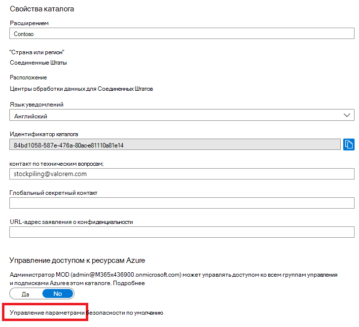
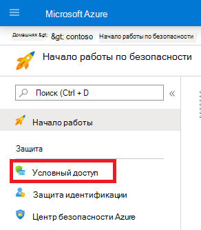
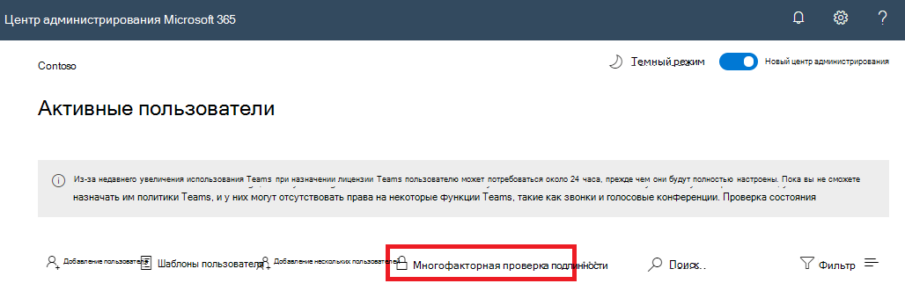

# Многофакторная проверка подлинности в Microsoft 365

Применение паролей — самый распространенный способ проверки подлинности при входе в компьютер или веб-службу, но это еще и самый уязвимый способ. Люди могут выбирать простые пароли и использовать один и тот же пароль для входа в разные компьютеры и службы.

Чтобы обеспечить дополнительный уровень защиты при входе в систему, нужно использовать многофакторную проверку подлинности (MFA), в которой применяется как пароль (который должен быть надежным), так и дополнительные методы проверки, основанные на:

- использовании того, что принадлежит вам и что не поддается простому дублированию, например смартфона;
- использовании того, что уникально для вас и принадлежит вам биологически. Это может быть отпечаток пальца, ваше лицо или другая биометрическая характеристика.

Дополнительный метод проверки используется только после проверки пароля пользователя. При использовании MFA, даже если надежный пользовательский пароль скомпрометирован, у злоумышленника нет вашего смартфона или отпечатка пальца, которые нужны для завершения входа в систему.

## Поддержка MFA в Microsoft 365

По умолчанию как в Microsoft 365, так и в Office 365 служба MFA для учетных записей пользователей поддерживается с помощью:

- отправленных на телефон текстовых сообщений с проверочным кодом, который должны ввести пользователи;
- телефонного звонка;
- приложения для смартфонов Microsoft Authenticator.

В обоих случаях для дополнительной проверки в MFA используется метод "что-то, что у вас с вами не так просто дублировать". Включить MFA для Microsoft 365 и Office 365 можно несколькими способами.

- С помощью параметров безопасности, заданных по умолчанию
- С помощью политик условного доступа
- Для учетной записи каждого отдельного пользователя (не рекомендуется)

Эти способы зависят от вашего плана Microsoft 365.

|Планирование|Рекомендация|Тип клиента|
|---|---|---|
|Все планы Microsoft 365|Используйте параметры безопасности по умолчанию, что требует применения MFA для всех учетных записей пользователей. 
 Вы также можете настроить MFA для каждого пользователя на отдельных учетных записях пользователей, но это не рекомендуется.|Версия для малого бизнеса|
|Microsoft 365 бизнес премиум 
 Microsoft 365 E3 
 Лицензии Azure Active Directory (Azure AD) Premium P1|Используйте политики условного доступа, чтобы сделать обязательным применение MFA для учетных записей пользователей с учетом их принадлежности к группам, используемых ими приложений или других условий.|С версии для малого бизнеса до корпоративной версии|
|Microsoft 365 E5 
 Лицензии Azure AD Premium P2|Используйте защиту идентификации Azure AD, чтобы требовать применения MFA на основе критериев риска при входе в систему.|Корпоративная версия|
||||

### Параметры безопасности по умолчанию

Параметры безопасности по умолчанию — новая функция в платных и пробных подписках Microsoft 365 и Office 365, появившаяся после 21 октября 2019 г. В этих подписках включены параметры безопасности по умолчанию, что предполагает:

- необходимость использования MFA с приложением Microsoft Authenticator для всех пользователей;
- блокировку традиционной проверки подлинности.

На регистрацию MFA в приложении Microsoft Authenticator с помощью смартфонов у пользователей есть 14 дней с момента первого входа в систему после включения параметров безопасности по умолчанию. По истечении 14 дней пользователь не сможет войти в систему до завершения регистрации MFA.

Применение параметров безопасности по умолчанию гарантирует, что все организации имеют базовый уровень безопасности при входе пользователей в систему, включенный по умолчанию. Параметры безопасности по умолчанию можно отключить и вместо них использовать политики условного доступа MFA.

Включить или отключить параметры безопасности по умолчанию можно на портале Azure в области **Свойства** для Azure AD.

Параметры безопасности по умолчанию можно использовать в любом плане Microsoft 365.

Дополнительные сведения см. в статье [Обзор параметров безопасности, заданных по умолчанию](/azure/active-directory/fundamentals/concept-fundamentals-security-defaults).

### Политики условного доступа

Политики условного доступа — это набор правил, определяющих условия, в соответствии с которым оценивается и разрешается вход в систему. Например, вы можете создать политику условного доступа, которая устанавливает указанные ниже условия.

- Если имя учетной записи пользователя является членом группы для пользователей, которым назначены роли Exchange, пользователь, пароль, безопасность, SharePoint или глобальный администратор, требуется MFA, прежде чем разрешить доступ.

Эта политика позволяет вам требовать MFA на основе членства в группах, а не пытаться настроить отдельные учетные записи пользователей для MFA, когда они назначены или не назначены из этих ролей администратора.

Кроме того, вы можете использовать политики условного доступа для более сложных функций, таких как применение MFA для работы в конкретных приложениях или для выполнения входа с совместимого устройства, например ноутбука с Windows 10.

Настроить политики условного доступа можно на портале Azure в области **Безопасность** для Azure AD.

Использование политик условного доступа возможно с:

- Microsoft 365 бизнес премиум
- Microsoft 365 E3 и E5
- лицензиями Azure AD Premium P1 и Azure AD Premium P2.

Для малого бизнеса с Microsoft 365 бизнес премиум можно легко использовать политики условного доступа, выполнив указанные ниже действия.

1. Создайте группу, в которую войдут учетные записи пользователей, для которых требуется применение MFA.
2. Включите политику **Требуется MFA для глобальных администраторов**.
3. Создайте политику условного доступа на уровне группы со следующими параметрами:
    - Назначения > Пользователи и группы: имя группы, указанное выше в шаге 1.
    - Назначения > Облачные приложения или действия: все облачные приложения.
    - Элементы управления доступом > Предоставить > Предоставить доступ > Требовать многофакторную проверку подлинности.
4. Включите политику.
5. Добавьте учетную запись пользователя в группу, созданную на шаге 1 выше, и проверьте ее.
6. Чтобы сделать обязательным применение MFA для дополнительных учетных записей пользователей, добавьте их в группу, созданную на шаге 1.

Эта политика условного доступа позволяет развертывать для пользователей требование применения MFA в удобном для вас темпе.

На предприятиях следует использовать [Общие политики условного доступа](/azure/active-directory/conditional-access/concept-conditional-access-policy-common) для настройки указанных ниже политик.

- [Обязательное использование MFA для администраторов](/azure/active-directory/conditional-access/howto-conditional-access-policy-admin-mfa)
- [Обязательное использование MFA для всех пользователей](/azure/active-directory/conditional-access/howto-conditional-access-policy-all-users-mfa)
- [Блокирование традиционной проверки подлинности](/azure/active-directory/conditional-access/howto-conditional-access-policy-block-legacy)

Дополнительные сведения см. в статье [Обзор условного доступа](/azure/active-directory/conditional-access/overview).

### Защита идентификации Azure AD

Защита идентификации Azure AD позволяет создать дополнительную политику условного доступа [Необходимость MFA в случае среднего или высокого риска при входе](../../security/office-365-security/identity-access-policies.md#require-mfa-based-on-sign-in-risk)

Защиту идентификации Azure AD и политики условного доступа на основе риска можно использовать с:

- Microsoft 365 E5
- Лицензиями Azure AD Premium P2

Дополнительные сведения см. в статье [Общие сведения о защите идентификации Azure AD](/azure/active-directory/identity-protection/overview-identity-protection).

### Устаревший MFA для каждого пользователя (не рекомендуется)

Чтобы установить требование применения MFA при входе в пользовательскую учетную запись, необходимо использовать или параметры безопасности по умолчанию, или политики условного доступа. Однако если ни один из этих вариантов не подходит, корпорация Майкрософт настоятельно рекомендует в подписке любой величины устанавливать MFA для учетных записей пользователей, которым назначены роли администратора, особенно роль глобального администратора.

MFA для отдельных учетных записей пользователей можно включить в области **Активные пользователи** центра администрирования Microsoft 365.

После включения MFA при следующем входе пользователя ему будет предложено выполнить регистрацию для MFA, а также выбрать и протестировать дополнительный метод проверки.

### Совместное использование этих методов

В этой таблице показаны результаты использования MFA с параметрами безопасности по умолчанию, политиками условного доступа и индивидуальными параметрами учетных записей пользователей.

|*Элемент*|Включено|Отключено|Дополнительный метод проверки подлинности|
|---|---|---|---|
|**Параметры безопасности по умолчанию**|Не может использовать политики условного доступа|Возможно использование политик условного доступа|Приложение Microsoft Authenticator|
|**Политики условного доступа**|Если все включено, вы не можете включить по умолчанию безопасность|Если все отключены, вы можете включить настройки безопасности по умолчанию|Указываются пользователем во время регистрации MFA|
|**Устаревший MFA для каждого пользователя (не рекомендуется)**|Переопределяет параметры безопасности по умолчанию и политики условного доступа, требующие MFA для каждого входа в систему.|Переопределено параметрами безопасности по умолчанию и политиками условного доступа|Указываются пользователем во время регистрации MFA|
||||

Если включены параметры безопасности по умолчанию, всем новым пользователям будет предложено пройти регистрацию для MFA и при следующем входе в систему использовать приложение Microsoft Authenticator.

## Способы управления параметрами MFA

Существует два способа управления параметрами MFA.

На портале Azure вы можете выполнять следующие действия.

- Включать и выключать параметры безопасности по умолчанию
- Настраивать политики условного доступа

В центре администрирования Microsoft 365 можно настраивать параметры MFA для каждого пользователя и службы.

## Дальнейшие действия

[Настройка MFA для Microsoft 365](set-up-multi-factor-authentication.md)

## Родственные материалы

[Включение многофакторной проверки подлинности](../../business-video/turn-on-mfa.md) (видео)\
[Видео: включение многофакторной проверки подлинности для телефона](../../business-video/set-up-mfa.md)