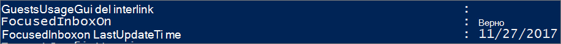

# <a name="configure-focused-inbox-for-everyone-in-your-organization"></a><span data-ttu-id="2a498-103">Настройка сортировки почты для всех пользователей в организации</span><span class="sxs-lookup"><span data-stu-id="2a498-103">Configure Focused Inbox for everyone in your organization</span></span>

  <span data-ttu-id="2a498-104">Если вы отвечаете за настройку работы электронной почты для всех сотрудников организации, эта статья для вас.</span><span class="sxs-lookup"><span data-stu-id="2a498-104">If you're responsible for configuring how email works for EVERYONE in a business this article is for you!</span></span> <span data-ttu-id="2a498-105">В ней объясняется порядок ее настройки или выключения в пределах организации, а также здесь вы найдете [ответы на часто задаваемые вопросы](#faq-for-focused-inbox).</span><span class="sxs-lookup"><span data-stu-id="2a498-105">It explains how to customize it or turn it off for your business, and answers [frequently asked questions](#faq-for-focused-inbox).</span></span>  <br/> <span data-ttu-id="2a498-106">Если вы хотите выключить сортировку почты только для себя, см. статью [Выключение сортировки почты](https://support.microsoft.com/office/f714d94d-9e63-4217-9ccb-6cb2986aa1b2).</span><span class="sxs-lookup"><span data-stu-id="2a498-106">If you would like to turn off Focused Inbox for just yourself, please see [Turn off Focused Inbox](https://support.microsoft.com/office/f714d94d-9e63-4217-9ccb-6cb2986aa1b2).</span></span>  
   
<span data-ttu-id="2a498-p102">Если вы хотите, чтобы пользователи гарантированно получали рабочие сообщения, например письма из отдела кадров или бухгалтерии, настройте функцию "Сортировка почты" так, чтобы эти сообщения отображались в представлении "Отсортированные". Вы также можете указать, будут ли пользователи в вашей организации видеть представление "Отсортированные" в своих почтовых ящиках.</span><span class="sxs-lookup"><span data-stu-id="2a498-p102">If you want to be sure that your users receive business-specific email messages, for example, from HR or payroll, you can configure Focused Inbox so these messages reach the Focused view. You can also control whether users in your organization see the Focused Inbox in their mailbox.</span></span>
  
## <a name="turn-focused-inbox-on-or-off-in-your-organization"></a><span data-ttu-id="2a498-109">Включение и отключение сортировки почты в организации</span><span class="sxs-lookup"><span data-stu-id="2a498-109">Turn Focused Inbox On or Off in your organization</span></span>

<span data-ttu-id="2a498-110">Вы используете PowerShell для включения и выключения сортировки почты для всех пользователей в своей организации.</span><span class="sxs-lookup"><span data-stu-id="2a498-110">You use PowerShell to turn Focused Inbox on or off for everyone in your organization.</span></span> <span data-ttu-id="2a498-111">Хотите, чтобы эта возможность была доступна в Центре администрирования Microsoft 365?</span><span class="sxs-lookup"><span data-stu-id="2a498-111">Do you want to do this in the Microsoft 365 admin center?</span></span> <span data-ttu-id="2a498-112">Сообщите об этом нашей команде разработчиков.</span><span class="sxs-lookup"><span data-stu-id="2a498-112">Let our Engineering team know.</span></span> <span data-ttu-id="2a498-113">**[Проголосуйте здесь!](https://go.microsoft.com/fwlink/?linkid=862489)**</span><span class="sxs-lookup"><span data-stu-id="2a498-113">**[Vote here!](https://go.microsoft.com/fwlink/?linkid=862489)**</span></span>
  
 <span data-ttu-id="2a498-114">**Отключение сортировки почты**</span><span class="sxs-lookup"><span data-stu-id="2a498-114">**To turn off Focused Inbox:**</span></span>
  
<span data-ttu-id="2a498-p104">В данном примере сортировка **отключается** для организации с помощью PowerShell. Но доступ пользователей к функции не блокируется. При желании они могут снова включить сортировку почты в своих клиентах.</span><span class="sxs-lookup"><span data-stu-id="2a498-p104">The following PowerShell example turns Focused Inbox **Off** in your organization. However, it doesn't block the availability of the feature for your users. If they want, they can still re-enable Focused Inbox again on each of their clients.</span></span> 
  
1. <span data-ttu-id="2a498-118">[Подключитесь к Exchange Online с помощью удаленного сеанса PowerShell](https://go.microsoft.com/fwlink/p/?LinkId=396554).</span><span class="sxs-lookup"><span data-stu-id="2a498-118">[Connect to Exchange Online using remote PowerShell](https://go.microsoft.com/fwlink/p/?LinkId=396554).</span></span>
    
2. <span data-ttu-id="2a498-p105">Для выполнения этих процедур у вас должны быть соответствующие разрешения. Сведения о необходимых разрешениях см. в разделе "Правила транспорта" статьи [Политика обмена сообщениями и разрешения для соответствия требованиям](https://go.microsoft.com/fwlink/p/?LinkId=829796).</span><span class="sxs-lookup"><span data-stu-id="2a498-p105">You need to be assigned permissions before you can perform this procedure or procedures. To see what permissions you need, see the "Transport rules" entry in [Messaging policy and compliance permissions](https://go.microsoft.com/fwlink/p/?LinkId=829796).</span></span>
    
3. <span data-ttu-id="2a498-121">Запустите командлет **Get-OrganizationConfig**.</span><span class="sxs-lookup"><span data-stu-id="2a498-121">Run the **Get-OrganizationConfig** cmdlet.</span></span> 
    
 ``` PowerShell
Get-OrganizationConfig
 ```

4. <span data-ttu-id="2a498-122">Найдите параметр **FocusedInboxOn**, чтобы узнать его текущее значение.</span><span class="sxs-lookup"><span data-stu-id="2a498-122">Look for **FocusedInboxOn** to view its current setting:</span></span> 
    
    
  
5. <span data-ttu-id="2a498-124">Чтобы отключить сортировку, запустите следующий командлет:</span><span class="sxs-lookup"><span data-stu-id="2a498-124">Run the following cmdlet to turn Focused Inbox off.</span></span>
    
 ``` PowerShell
 Set-OrganizationConfig -FocusedInboxOn $false
 ```

6. <span data-ttu-id="2a498-125">Запустите командлет **Get-OrganizationConfig** еще раз, и вы увидите, что параметр FocusedInboxOn имеет значение $false, то есть сортировка почты отключена.</span><span class="sxs-lookup"><span data-stu-id="2a498-125">Run the **Get-OrganizationConfig** cmdlet again and you'll see that FocusedInboxOn is set to $false, which means it's been turned off.</span></span> 
    
 <span data-ttu-id="2a498-126">**Включение сортировки почты**</span><span class="sxs-lookup"><span data-stu-id="2a498-126">**To turn on Focused Inbox:**</span></span>
  
- <span data-ttu-id="2a498-127">Чтобы включить сортировку, на шаге 5 описанной выше процедуры запустите следующий командлет:</span><span class="sxs-lookup"><span data-stu-id="2a498-127">In Step 5 above, run the following cmdlet to turn Focused Inbox on.</span></span>
    
 ``` PowerShell
 Set-OrganizationConfig -FocusedInboxOn $true
 ```

## <a name="what-do-users-see-after-i-turn-on-focused-inbox"></a><span data-ttu-id="2a498-128">Что увидят пользователи, когда я включу сортировку почты? </span><span class="sxs-lookup"><span data-stu-id="2a498-128">What do users see after I turn on Focused Inbox?</span></span>

<span data-ttu-id="2a498-p106">Ваши пользователи увидят представление "Отсортированные" только после того, как закроют и снова запустят Outlook. После перезапуска Outlook они увидят в пользовательском интерфейсе подсказку, указывающую на новое представление "Отсортированные".</span><span class="sxs-lookup"><span data-stu-id="2a498-p106">Your users will see the Focused view only after they close and restart Outlook. When they restart Outlook, they'll see a Tip in the Outlook user interface giving them to the option to use the new Focused Inbox.</span></span>
  

  
<span data-ttu-id="2a498-p107">Если вместо функции "Несрочные" вы включите сортировку почты, пользователи могут принять ее ("Попробовать") или отказаться от нее. Если у пользователя есть несколько поддерживаемых клиентов, он может отдельно включать и отключать сортировку почты в каждом из них. Вот как выглядит подсказка:</span><span class="sxs-lookup"><span data-stu-id="2a498-p107">If you're switching from Clutter to Focused Inbox, they can decide to enable it ("Try it") or dismiss the feature. If the user has multiple (supported) clients, they can enable/disable Focused Inbox individually on each one. The tip looks like this:</span></span>
  

  
<span data-ttu-id="2a498-p108">Если пользователь выбирает сортировку почты, функция "Несрочные" отключается автоматически. Папка "Несрочные" преобразуется в стандартную папку, которую пользователь может переименовать или удалить.</span><span class="sxs-lookup"><span data-stu-id="2a498-p108">When a user decides to start using Focused Inbox, Clutter gets disabled automatically. The Clutter folder gets converted into a standard folder, that allows the user to rename or delete it.</span></span>
  
## <a name="turn-focused-inbox-on-or-off-for-specific-users"></a><span data-ttu-id="2a498-138">Включение и отключение сортировки почты для определенных пользователей</span><span class="sxs-lookup"><span data-stu-id="2a498-138">Turn Focused Inbox On or Off for specific users</span></span>

<span data-ttu-id="2a498-p109">В этом примере сортировка **выключается** для пользователя Tim Matthews в организации Contoso. Но его доступ к этой возможности не блокируется. При желании он может снова включить сортировку почты в своих клиентах.</span><span class="sxs-lookup"><span data-stu-id="2a498-p109">This example turns Focused Inbox **Off** for Tim Matthews in the Contoso organization. However, it doesn't block the availability of the feature to him. If his wants, he can still re-enable Focused Inbox again on each of his clients.</span></span> 
  
1. <span data-ttu-id="2a498-142">[Подключитесь к Exchange Online с помощью удаленного сеанса PowerShell](https://go.microsoft.com/fwlink/p/?LinkId=396554).</span><span class="sxs-lookup"><span data-stu-id="2a498-142">[Connect to Exchange Online using remote PowerShell](https://go.microsoft.com/fwlink/p/?LinkId=396554).</span></span>
    
2. <span data-ttu-id="2a498-p110">Для выполнения этих процедур у вас должны быть соответствующие разрешения. Сведения о необходимых разрешениях см. в разделе "Правила транспорта" статьи "Политика обмена сообщениями и разрешения для соответствия требованиям".</span><span class="sxs-lookup"><span data-stu-id="2a498-p110">You need to be assigned permissions before you can perform this procedure or procedures. To see what permissions you need, see the "Transport rules" entry in the Messaging policy and compliance permissions topic.</span></span>
    
3. <span data-ttu-id="2a498-145">Запустите командлет **Get-FocusedInbox**, например:</span><span class="sxs-lookup"><span data-stu-id="2a498-145">Run the **Get-FocusedInbox** cmdlet, for example:</span></span> 
    
 ``` PowerShell
 Get-FocusedInbox -Identity <tim@contoso.com>
 ```

4. <span data-ttu-id="2a498-146">Найдите параметр FocusedInboxOn, чтобы узнать его текущее значение.</span><span class="sxs-lookup"><span data-stu-id="2a498-146">Look for FocusedInboxOn to view its current setting:</span></span>
    
    
  
5. <span data-ttu-id="2a498-148">Запустите следующий командлет, чтобы отключить сортировку почты:</span><span class="sxs-lookup"><span data-stu-id="2a498-148">Run the following cmdlet to turn Focused Inbox off:</span></span>
    
 ``` PowerShell
 Set-FocusedInbox -Identity <tim@contoso.com> -FocusedInboxOn $false
 ```

6. <span data-ttu-id="2a498-149">ИЛИ запустите следующий командлет, чтобы включить сортировку почты:</span><span class="sxs-lookup"><span data-stu-id="2a498-149">OR, run the following cmdlet to turn it on:</span></span>
    
 ``` PowerShell
 Set-FocusedInbox -Identity <tim@contoso.com> -FocusedInboxOn $true
 ```

## <a name="use-the-ui-to-create-a-transport-rule-to-direct-email-messages-to-the-focused-view-for-all-your-users"></a><span data-ttu-id="2a498-150">Создание правила транспорта, которое выводит сообщения в представлении "Отсортированные" для всех пользователей, через пользовательский интерфейс</span><span class="sxs-lookup"><span data-stu-id="2a498-150">Use the UI to create a transport rule to direct email messages to the Focused view for all your users</span></span>

1. <span data-ttu-id="2a498-151">Перейдите в <a href="https://go.microsoft.com/fwlink/p/?linkid=2059104" target="_blank">Центр администрирования Exchange</a>.</span><span class="sxs-lookup"><span data-stu-id="2a498-151">Go to the <a href="https://go.microsoft.com/fwlink/p/?linkid=2059104" target="_blank">Exchange admin center</a>.</span></span>
    
2. <span data-ttu-id="2a498-152">Откройте раздел **Поток почты** \> **Правила**.</span><span class="sxs-lookup"><span data-stu-id="2a498-152">Navigate to **mail flow** \> **Rules**.</span></span> <span data-ttu-id="2a498-153">Нажмите значок  и выберите пункт **Создать новое правило**.</span><span class="sxs-lookup"><span data-stu-id="2a498-153">Select  and then select **Create a new rule...**.</span></span> 
    
3. <span data-ttu-id="2a498-154">После создания правила нажмите **Сохранить**, чтобы запустить правило.</span><span class="sxs-lookup"><span data-stu-id="2a498-154">After you're done creating the new rule, select **Save** to start the rule.</span></span> 
    
    <span data-ttu-id="2a498-155">В примере на приведенном ниже рисунке все сообщения с отправителем "Отдел выплат" будут выводиться в представлении "Отсортированные".</span><span class="sxs-lookup"><span data-stu-id="2a498-155">The following image shows an example where all messages From "Payroll Department" are to be delivered to the Focused Inbox.</span></span>
    
    
  
## <a name="use-powershell-to-create-a-transport-rule-to-direct-email-messages-to-the-focused-view-for-all-your-users"></a><span data-ttu-id="2a498-157">Создание правила транспорта для вывода сообщений в представление "Отсортированные" для всех пользователей с помощью PowerShell</span><span class="sxs-lookup"><span data-stu-id="2a498-157">Use PowerShell to create a transport rule to direct email messages to the Focused view for all your users</span></span>

1. <span data-ttu-id="2a498-158">[Подключитесь к Exchange Online с помощью удаленного сеанса PowerShell](https://go.microsoft.com/fwlink/p/?LinkId=396554).</span><span class="sxs-lookup"><span data-stu-id="2a498-158">[Connect to Exchange Online using remote PowerShell](https://go.microsoft.com/fwlink/p/?LinkId=396554).</span></span>
    
2. <span data-ttu-id="2a498-p112">Для выполнения этих процедур у вас должны быть соответствующие разрешения. Сведения о необходимых разрешениях см. в разделе "Правила транспорта" статьи [Политика обмена сообщениями и разрешения для соответствия требованиям](https://go.microsoft.com/fwlink/p/?LinkId=829796).</span><span class="sxs-lookup"><span data-stu-id="2a498-p112">You need to be assigned permissions before you can perform this procedure or procedures. To see what permissions you need, see the "Transport rules" entry in [Messaging policy and compliance permissions](https://go.microsoft.com/fwlink/p/?LinkId=829796).</span></span>

3. <span data-ttu-id="2a498-161">Чтобы все сообщения, например, с отправителем "Отдел выплат" выводились в представлении "Отсортированные", выполните следующую команду.</span><span class="sxs-lookup"><span data-stu-id="2a498-161">Run the following command to allow all messages from "Payroll Department," for example, to be delivered to the Focused Inbox.</span></span>
    
 ``` PowerShell
 New-TransportRule -Name <name_of_the_rule> -From "Payroll Department" -SetHeaderName "X-MS-Exchange-Organization-BypassFocusedInbox" -SetHeaderValue "true"
 ```

> [!IMPORTANT]
> <span data-ttu-id="2a498-162">В данном примере для параметров X-MS-Exchange-Organization-BypassFocusedInbox и true учитывается регистр.</span><span class="sxs-lookup"><span data-stu-id="2a498-162">In this example, both "X-MS-Exchange-Organization-BypassFocusedInbox" and "true" are case sensitive.</span></span>
> <span data-ttu-id="2a498-163">Итак, функция сортировки почты будет учитывать X-заголовок, обходящий папку несрочных сообщений, поэтому если вы используете эту настройку в папке "Несрочные", она будет использоваться при сортировке.</span><span class="sxs-lookup"><span data-stu-id="2a498-163">Also, Focused Inbox will honor the X-header that bypasses Clutter, so if you use this setting in Clutter, it will be used in Focused Inbox.</span></span> <span data-ttu-id="2a498-164">Дополнительные сведения о синтаксисе и параметрах см. в статье [New-TransportRule](https://go.microsoft.com/fwlink/p/?LinkId=830194).</span><span class="sxs-lookup"><span data-stu-id="2a498-164">For detailed syntax and parameter information, see [New-TransportRule](https://go.microsoft.com/fwlink/p/?LinkId=830194).</span></span>

### <a name="how-do-you-know-this-worked"></a><span data-ttu-id="2a498-165">Как убедиться, что все получилось?</span><span class="sxs-lookup"><span data-stu-id="2a498-165">How do you know this worked?</span></span>

<span data-ttu-id="2a498-166">Чтобы убедиться в том, что правило транспорта "Сортировка" применяется к сообщениям, проверьте их заголовки.</span><span class="sxs-lookup"><span data-stu-id="2a498-166">You can check email message headers to see if the email messages are landing in the Inbox due to the Focused Inbox transport rule bypass.</span></span> <span data-ttu-id="2a498-167">Выберите сообщение из почтового ящика в вашей организации, к которому применяется правило транспорта "Сортировка".</span><span class="sxs-lookup"><span data-stu-id="2a498-167">Pick an email message from a mailbox in your organization that has the Focused Inbox transport rule applied.</span></span> <span data-ttu-id="2a498-168">Просмотрите его заголовок: в нем должно быть указано **X-MS-Exchange-Organization-BypassFocusedInbox: true**.</span><span class="sxs-lookup"><span data-stu-id="2a498-168">Look at the headers stamped on the message, and you should see the **X-MS-Exchange-Organization-BypassFocusedInbox: true** header.</span></span> <span data-ttu-id="2a498-169">Это значит, что обход работает.</span><span class="sxs-lookup"><span data-stu-id="2a498-169">This means the bypass is working.</span></span> <span data-ttu-id="2a498-170">Дополнительные сведения о том, как найти данные в заголовке, см. в статье [Просмотр сведений заголовка Интернета для сообщения электронной почты](https://go.microsoft.com/fwlink/p/?LinkId=822530).</span><span class="sxs-lookup"><span data-stu-id="2a498-170">Check out the [View the Internet header information for an email message](https://go.microsoft.com/fwlink/p/?LinkId=822530) article for info on how to find the header information.</span></span> 
 
## <a name="turn-onoff-clutter"></a><span data-ttu-id="2a498-171">Включение и отключение функции "Несрочные"</span><span class="sxs-lookup"><span data-stu-id="2a498-171">Turn on/off Clutter</span></span>
 
<span data-ttu-id="2a498-p115">Мы получили сообщения о том, что функция "Несрочные" неожиданно прекращает работу у некоторых пользователей. Если это случится, вы сможете снова включить эту функцию для конкретных пользователей. См. статью [Управление функцией "Несрочные" в Office 365 — справка для администраторов](../email/configure-clutter.md).</span><span class="sxs-lookup"><span data-stu-id="2a498-p115">We've received reports that Clutter suddenly stopped working for some users. If this happens, you can enable it again for specific users. See [Configure Clutter for your organization](../email/configure-clutter.md).</span></span>
 
## <a name="faq-for-focused-inbox"></a><span data-ttu-id="2a498-175">Сортировка почты: вопросы и ответы</span><span class="sxs-lookup"><span data-stu-id="2a498-175">FAQ for Focused Inbox</span></span>

<span data-ttu-id="2a498-176">Ниже приведены ответы на часто задаваемые вопросы о сортировке почты.</span><span class="sxs-lookup"><span data-stu-id="2a498-176">Here are answers to Frequently Asked Questions about Focused Inbox.</span></span> 

### <a name="can-i-control-how-i-roll-out-focused-inbox-in-my-organization"></a><span data-ttu-id="2a498-177">Можно ли управлять развертыванием функции "Сортировка почты" в организации?</span><span class="sxs-lookup"><span data-stu-id="2a498-177">Can I control how I roll out Focused Inbox in my organization?</span></span>

<span data-ttu-id="2a498-p116">Да, вы можете отключить или включить сортировку для всей организации либо для отдельных пользователей. См. описание выше.</span><span class="sxs-lookup"><span data-stu-id="2a498-p116">Yes. You can turn Focused Inbox on or off for your entire organization, or you can turn it on or off for specified users. See above.</span></span>
  
### <a name="is-the-focused-inbox-feature-only-available-for-office-2016-clients"></a><span data-ttu-id="2a498-181">Функция сортировки почты доступна только пользователям Office 2016?</span><span class="sxs-lookup"><span data-stu-id="2a498-181">Is the Focused Inbox feature ONLY available for Office 2016 clients?</span></span>

<span data-ttu-id="2a498-182">Да. Функция действует только для пользователей Office 2016.</span><span class="sxs-lookup"><span data-stu-id="2a498-182">Yes, only users with Office 2016 are affected.</span></span> <span data-ttu-id="2a498-183">Ее применение в Outlook 2013 и более ранних версиях не предусмотрено.</span><span class="sxs-lookup"><span data-stu-id="2a498-183">The feature is not going to be backported to Outlook 2013 or earlier.</span></span>
  
### <a name="how-long-does-it-take-for-focused-inbox-changes-to-take-place-in-outlook"></a><span data-ttu-id="2a498-184">Когда изменения в настройке сортировки почты отобразятся в Outlook?</span><span class="sxs-lookup"><span data-stu-id="2a498-184">How long does it take for Focused Inbox changes to take place in Outlook?</span></span>

<span data-ttu-id="2a498-185">Чтобы изменения вступили в силу после включения или отключения сортировки почты, пользователям нужно закрыть и снова запустить Outlook.</span><span class="sxs-lookup"><span data-stu-id="2a498-185">Once you turn on or turn off Focused Inbox, the settings will take effect once your users close and restart Outlook.</span></span>
  
### <a name="what-happens-to-clutter-once-i-turn-on-focused-inbox"></a><span data-ttu-id="2a498-186">Что произойдет с папкой "Несрочные" после включения сортировки почты?</span><span class="sxs-lookup"><span data-stu-id="2a498-186">What happens to Clutter once I turn on Focused Inbox?</span></span>

<span data-ttu-id="2a498-p118">После переключения менее важные сообщения больше не будут доставляться в папку "Несрочные". Вместо этого почта будет распределяться между вкладками "Отсортированные" и "Другие". Функция "Несрочные" и сортировка почты основаны на одном алгоритме, поэтому все сообщения, которые раньше попадали в папку "Несрочные", теперь будут перемещаться на вкладку "Другие". Все сообщения, которые уже находятся в папке "Несрочные", останутся в ней, если вы не удалите или не переместите их.</span><span class="sxs-lookup"><span data-stu-id="2a498-p118">After switching, you'll no longer receive less actionable email in the Clutter folder. Instead, email will be split between the Focused and Other tabs in your inbox. The same algorithm that moved items to the Clutter folder now powers Focused Inbox, meaning that any emails that were set to move to Clutter will now be moved to Other. Any messages already in your Clutter folder will remain there until you decide to delete or move them.</span></span>
  
<span data-ttu-id="2a498-191">Ознакомьтесь со статьей Тони Редмонда ([Tony Redmond](https://www.petri.com/author/tony-redmond)), специалиста со статусом Microsoft MVP: [Как сортировка почты заменяет функцию "Несрочные" в Office 365](https://www.petri.com/focused-inbox-office-365) (на английском языке).</span><span class="sxs-lookup"><span data-stu-id="2a498-191">Check out this post by [Tony Redmond](https://www.petri.com/author/tony-redmond), Microsoft MVP: [How the Focused Inbox Replaces Clutter Inside Office 365](https://www.petri.com/focused-inbox-office-365).</span></span>
  
### <a name="can-i-keep-users-on-clutter-what-is-microsofts-recommendation-when-it-comes-to-using-clutter-vs-focused-inbox"></a><span data-ttu-id="2a498-192">Можно ли оставить пользователям функцию "Несрочные"?</span><span class="sxs-lookup"><span data-stu-id="2a498-192">Can I keep users on Clutter?</span></span> <span data-ttu-id="2a498-193">Что рекомендует Майкрософт при выборе между функцией "Несрочные" и сортировкой почты?</span><span class="sxs-lookup"><span data-stu-id="2a498-193">What is Microsoft's recommendation when it comes to using Clutter vs Focused Inbox?</span></span>

<span data-ttu-id="2a498-p120">Да, вы можете оставить пользователям функцию "Несрочные" и отключить сортировку почты, но рано или поздно сортировка почты полностью заменит функцию "Несрочные", поэтому Майкрософт рекомендует перейти на нее уже сейчас. Дополнительные сведения об использовании папки "Несрочные" в Exchange Online см. в этой записи блога: [Новости о сортировке почты и планы относительно папки "Несрочные"](https://techcommunity.microsoft.com/t5/Outlook-Blog/Update-on-Focused-Inbox-and-our-plans-for-Clutter/ba-p/136448).</span><span class="sxs-lookup"><span data-stu-id="2a498-p120">Yes, you can keep users on Clutter and disable Focused Inbox, however, eventually Clutter will be fully replaced with Focused Inbox so Microsoft's recommends moving to Focused Inbox now. To learn more about when you use Clutter with Exchange Online, see this blog post: [Update on Focused Inbox and our plans for Clutter](https://techcommunity.microsoft.com/t5/Outlook-Blog/Update-on-Focused-Inbox-and-our-plans-for-Clutter/ba-p/136448).</span></span>
  
### <a name="should-i-disable-clutter-for-my-end-users-if-we-are-going-to-move-everyone-to-focused-inbox"></a><span data-ttu-id="2a498-196">Нужно ли мне отключить функцию "Несрочные" для конечных пользователей, если мы собираемся перевести их всех на сортировку почты?</span><span class="sxs-lookup"><span data-stu-id="2a498-196">Should I disable Clutter for my end users if we are going to move everyone to Focused Inbox?</span></span>

<span data-ttu-id="2a498-p121">Нет. Функцию "Несрочные" можно отключить для почтового ящика явным образом с помощью командлета Set-Clutter. Но при этом все сообщения, которые раньше перенаправлялись в папку "Несрочные", будут оставаться в папке "Входящие" владельца почтового ящика до тех пор, пока клиент не обновится до версии, поддерживающей сортировку почты. Поэтому лучше не отключать функцию "Несрочные" до появления обновленных клиентов.</span><span class="sxs-lookup"><span data-stu-id="2a498-p121">No. It's possible to disable Clutter for a mailbox explicitly by running the Set-Clutter cmdlet. However, if you do this, the mailbox owner will see messages that were previously redirected to the Clutter folder remain in the Inbox and they'll have to process those messages until their client is upgraded to a version that supports the Focused Inbox. It's therefore best not to disable Clutter until the upgraded clients are available.</span></span>
  
### <a name="why-are-there-two-different-cmdlets-for-managing-focused-inbox"></a><span data-ttu-id="2a498-201">Почему для управления сортировкой используются два разных командлета?</span><span class="sxs-lookup"><span data-stu-id="2a498-201">Why are there two different cmdlets for managing Focused Inbox?</span></span>

<span data-ttu-id="2a498-202">Состояние сортировки почты определяется на двух уровнях:</span><span class="sxs-lookup"><span data-stu-id="2a498-202">There are two states associated with Focused Inbox.</span></span>
  
- <span data-ttu-id="2a498-203">**Уровень организации**: состояние сортировки и метка времени его последнего обновления.</span><span class="sxs-lookup"><span data-stu-id="2a498-203">**Organization Level**: Focused Inbox state, and an associated last update time-stamp.</span></span> 
    
- <span data-ttu-id="2a498-204">**Уровень почтового ящика**: состояние сортировки и метка времени его последнего обновления.</span><span class="sxs-lookup"><span data-stu-id="2a498-204">**Mailbox Level**: Focused Inbox state, and an associated last update time-stamp</span></span> 
    
### <a name="how-does-outlook-decide-to-show-the-focused-inbox-experience-with-these-two-states"></a><span data-ttu-id="2a498-205">Как эти два состояния учитываются в Outlook при отображении представления "Отсортированные"?</span><span class="sxs-lookup"><span data-stu-id="2a498-205">How does Outlook decide to show the Focused Inbox experience with these two states?</span></span>

<span data-ttu-id="2a498-p122">То, какое из состояний учитывается, зависит от того, какой командлет имеет более новую метку времени. По умолчанию обе метки имеют значение NULL, а функция включена.</span><span class="sxs-lookup"><span data-stu-id="2a498-p122">Outlook decides to show the experience by choosing which cmdlet has the latest time stamp. By default, both time stamps are "null" and in this case, the feature is enabled.</span></span>
  
### <a name="why-does-the-get-focusedinbox-cmdlet-return-true-when-ive-turned-focused-inbox-off-in-my-organization"></a><span data-ttu-id="2a498-208">Почему командлет Get-FocusedInbox возвращает значение true, хотя сортировка для организации выключена?</span><span class="sxs-lookup"><span data-stu-id="2a498-208">Why does the Get-FocusedInbox cmdlet return "true", when I've turned Focused Inbox off in my organization?</span></span>

<span data-ttu-id="2a498-p123">Для управления сортировкой используются два командлета. При выполнении командлета Get-FocusedInbox для почтового ящика возвращается состояние этой функции на уровне почтового ящика. Отображение функции в интерфейсе Outlook зависит от последнего изменения состояния командлета.</span><span class="sxs-lookup"><span data-stu-id="2a498-p123">There are two cmdlets for controlling Focused Inbox. When you run Get-FocusedInbox for a mailbox, it returns the mailbox level state of the feature. The experience in Outlook is chosen based on which cmdlet state was last modified.</span></span>
  
### <a name="can-i-run-a-script-to-see-who-has-turned-on-focused-inbox"></a><span data-ttu-id="2a498-212">Можно ли запустить сценарий, чтобы узнать, кто включил сортировку почты?</span><span class="sxs-lookup"><span data-stu-id="2a498-212">Can I run a script to see who has turned on Focused Inbox?</span></span>

<span data-ttu-id="2a498-p124">Нет, и это сделано намеренно. Сортировка почты включается на стороне клиента, поэтому с помощью командлета можно только определить, поддерживает ли почтовый ящик пользователя возможности клиента. Ее можно одновременно включить в одних клиентах и отключить в других, например включить в приложении Outlook и Outlook Mobile, но отключить в Outlook в Интернете.</span><span class="sxs-lookup"><span data-stu-id="2a498-p124">No, and this is by design. Focused Inbox enablement is a client side setting, so all the cmdlet can do is tell you if the user's mailbox is eligible for the client experience. It is possible for it to be simultaneously enabled in some clients and disabled in others, for example, enabled in Outlook app and Outlook Mobile but disabled in Outlook on the web.</span></span>
