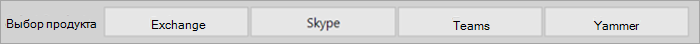
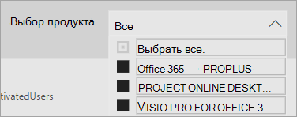

# Поиск и использование отчетов в аналитике использования Microsoft 365Navigate and utilize the reports in Microsoft 365 usage analytics

::: moniker range="o365-21vianet"

> [!NOTE]
> Изменяется Центр администрирования.The admin center is changing. Если ваш интерфейс не соответствует приведенным здесь сведениям, см. раздел [О новом Центре администрирования Microsoft 365](https://docs.microsoft.com/microsoft-365/admin/microsoft-365-admin-center-preview?view=o365-21vianet).If your experience doesn't match the details presented here, see [About the new Microsoft 365 admin center](https://docs.microsoft.com/microsoft-365/admin/microsoft-365-admin-center-preview?view=o365-21vianet).

::: moniker-end

На панели мониторинга выводятся основные данные о главных показателях использования и внедрения службы.The dashboard provides you with a quick overview of the main usage and adoption metrics. Выбрав метрики верхнего уровня, можно получить доступ к отчетам, которые предоставляют дополнительные сведения и сведения.By selecting the top-level metrics, you can access reports that provide more details and insights. На вкладке каждого отчета содержатся представления данных, относящиеся к аспектам использования и внедрения в вашей организации.Each report tab contains data visualizations specific to an aspect of usage and adoption for your organization. Собранные данные объясняются в заголовке каждого отчета, и отображается плитка, содержащая дополнительные сведения об зрительных визуализациях, которые просматриваются на вкладке отчета.The data collected is explained in the title of each report and a tile appears that contains further information about the visualizations on the report tab that you are viewing.

Вот некоторые советы по началу работы с отчетами:To get started with your reports, here are some tips:

- Используйте вкладки навигации слева или со связанной метрикой на странице " **Сводная сводка** ", чтобы перейти к каждому отчету верхнего уровня.Use the navigation tabs on the left or on a related metric on the **Executive Summary** page to navigate to each top-level report.

    

- Используйте вкладки навигации в верхней части каждого отчета верхнего уровня, чтобы перейти к различным отчетам на этом уровне.Use the navigation tabs at the top of each top-level report to navigate to different reports within that level.

    

- Во многих отчетах есть срез, на котором можно фильтровать по продукту, атрибуту AAD или действию, которое нужно просмотреть.Many reports contain a slicer where you can filter on the product, AAD attribute, or activity that you want to view. Это может быть один или несколько выбранных вариантов.These can be either single-select or multi-select.

    

    

- Наводите указатель на точки данных, чтобы просмотреть выноски с подробными сведениями.Hover over data points to view a callout that contains details.

    

Пользователь, у которого есть созданная вами шаблон приложения, будет иметь возможность настраивать отчет в соответствии с его потребностями.The user who has instantiated the template app will have the ability to customize the report to their needs. Настройка приложения шаблона:To customize the template app:

- В верхней части отчета выберите **изменить отчет** .Select **Edit report** at the top of the report.

    

- Создайте собственные визуальные элементы на основе [наборов данных](usage-analytics-data-model.md).Create your own visuals by using the underlying [datasets](usage-analytics-data-model.md).

- Подключите собственные источники данных с помощью PowerBI Desktop.Use PowerBI Desktop to bring in your own data sources.

Чтобы предоставить общий доступ к отчетам, просто нажмите кнопку Общий доступ.To share your reports, just select the share button  в верхней части страницы.at the top of the page.

Сведения о настройке отчетов можно найти [в статье Настройка отчетов в аналитике использования Microsoft 365](customize-reports.md).To learn how to customize the reports, see [Customizing the reports in Microsoft 365 usage analytics](customize-reports.md).

Много дополнительной информации вы найдете в справочной документации по Power BI.You can find lots of additional information in the Power BI help documentation:

- [Основные понятия Power BIPower BI basic concepts](https://docs.microsoft.com/power-bi/service-basic-concepts)

    Сведения о панели мониторинга, наборах данных, отчетах и других концепциях Power BI.Learn about dashboard, datasets, reports, and other Power BI concepts.

- [Приступая к работе с Power BIGet started with Power BI](https://docs.microsoft.com/power-bi/service-get-started?wt.mc_id=O365_Reports_PBI_contentpack)

    Основные функциональные возможности Power BI. Ссылки на сведения о том, как работать с Power BI Desktop.Learn the basic functionality in Power BI. Find links to how to use Power BI Desktop.

- [Предоставление общего доступа к панели мониторинга и отчетамShare dashboards and reports](https://docs.microsoft.com/power-bi/service-share-dashboards)

    Узнайте, как предоставлять общий доступ к отчетам коллегам или лицам, не входящим в вашу организацию.Learn how to share reports with your colleagues or people outside your organization. Кроме того, можно предоставить общий доступ к отчету или фильтрованной версии отчета.You can also share the report or a filtered version of the report.
