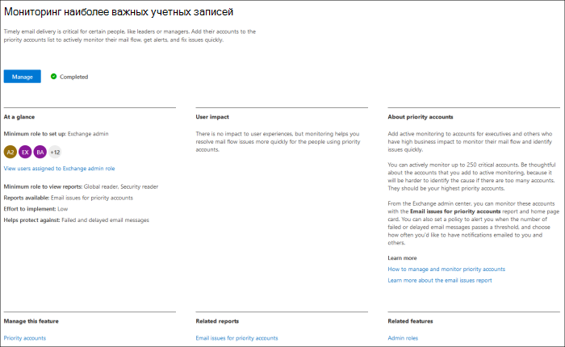
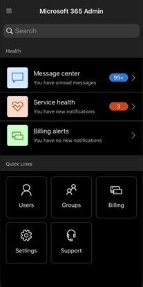
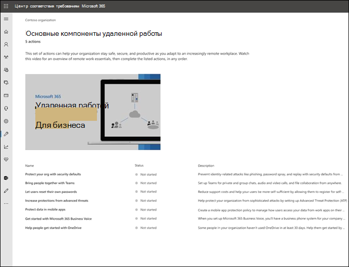
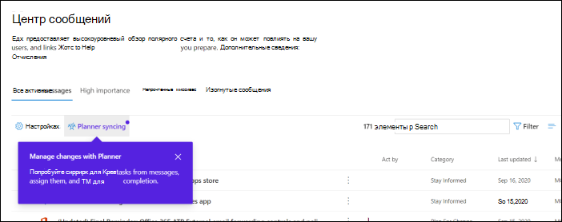
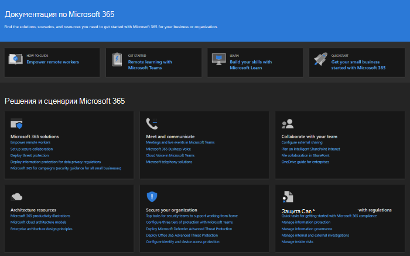
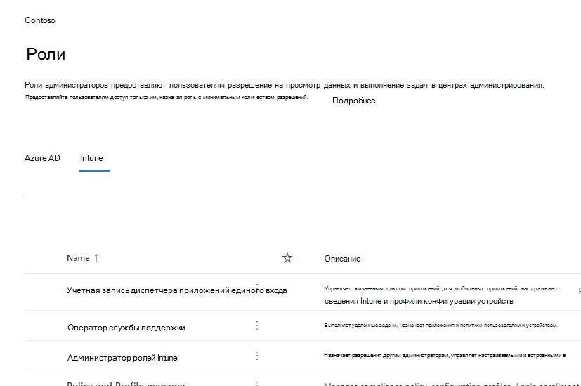
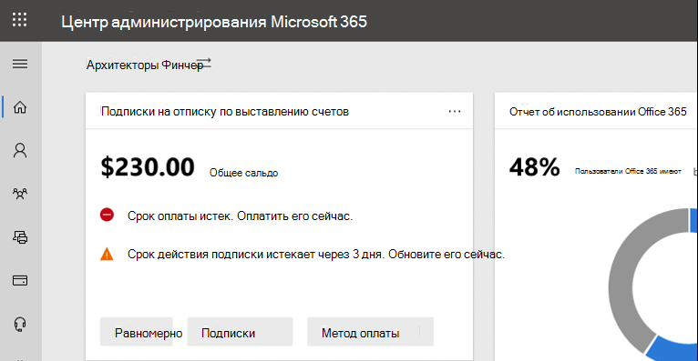

# Новые возможности центра администрирования Microsoft 365What's new in the Microsoft 365 admin center

::: moniker range="o365-21vianet"

> [!NOTE]
> Некоторые сведения в этой статье могут не применяться к Office 365, эксплуатируемой 21Vianet.Some of the information in this article might not apply to Office 365 operated by 21Vianet.

::: moniker-end

Мы постоянно добавляем новые функции в центр администрирования [Microsoft 365,](microsoft-365-admin-center-preview.md)устраняем проблемы, о которых мы узнали, и внося изменения на основе отзывов.We're continuously adding new features to [the Microsoft 365 admin center](microsoft-365-admin-center-preview.md), fixing issues we learn about, and making changes based on your feedback. Взгляните ниже, чтобы узнать, что доступно для вас сегодня.Take a look below to see what's available for you today. Некоторые функции выкатываются с разной скоростью для наших клиентов.Some features get rolled out at different speeds to our customers. Если вы еще не видите функцию, [попробуйте добавить себя в целевой выпуск](manage/release-options-in-office-365.md).If you aren't seeing a feature yet, [try adding yourself to targeted release](manage/release-options-in-office-365.md).

И если вы хотите узнать, что нового с другими облачными службами Майкрософт:And if you'd like to know what's new with other Microsoft cloud services:

- [Новые возможности в Azure Active DirectoryWhat's new in Azure Active Directory](https://docs.microsoft.com/azure/active-directory/fundamentals/whats-new)
- [Новые возможности центра администрирования ExchangeWhat's new in the Exchange admin center](https://docs.microsoft.com/Exchange/whats-new)
- [Новые возможности Microsoft IntuneWhat's new in Microsoft Intune](https://docs.microsoft.com/mem/intune/fundamentals/whats-new)
- [Новые возможности центра соответствия требованиям Microsoft 365What's new in the Microsoft 365 compliance center](https://docs.microsoft.com/Office365/SecurityCompliance/whats-new)
- [Новые возможности Microsoft 365 DefenderWhat's new in Microsoft 365 Defender](https://docs.microsoft.com/microsoft-365/security/mtp/whats-new)
- [Новые возможности центра администрирования SharePointWhat's new in the SharePoint admin center](https://docs.microsoft.com/sharepoint/what-s-new-in-admin-center)
- [Обновления OfficeOffice updates](https://docs.microsoft.com/OfficeUpdates/)

## Ignite 2021 (март)Ignite 2021 (March)

Добро пожаловать в Microsoft Ignite.Welcome to Microsoft Ignite. Мы надеемся, что вы смогли принять участие в одном из наших сеансов: [Microsoft Ignite 2021](https://myignite.microsoft.com/sessions).We hope you were able to attend some of one of our sessions: [Microsoft Ignite 2021](https://myignite.microsoft.com/sessions). Вот некоторые из вещей, о которых мы говорили в Ignite.Here's a few of the things we talked about at Ignite.
> [!NOTE]
> Не все функции будут доступны всем сразу.Not all features are going to be available to everyone right away. Если вы не видите новые функции, [присоединитесь к целевому выпуску](manage/release-options-in-office-365.md).If you aren't seeing the new features, [join Targeted Release](manage/release-options-in-office-365.md).

### Центр сообщенийMessage center

Мы обновили центр сообщений, чтобы помочь вам найти соответствующие сообщения и добавить более гибкий опыт чтения.We’ve revamped the Message center to help you discover relevant messages and added a more flexible reading experience. Добавлен новый столбец **Service,** который поможет вам сканировать, к какой службе относится сообщение, и фильтровать сообщения службой и другими метаданными.We've added a new **Service** column to help you scan which Service a message applies to and filter messages by Service and other metadata. Вы можете выбрать сообщение для его пометки, выбрать столбцы, которые отображаются в списке сообщений, и перемещаться между сообщениями с задней и следующей кнопками.You can favorite a message to mark it for follow up, choose which columns appear in the message list, and navigate between messages with the back and next buttons. Кроме того, мы улучшили процесс, чтобы было проще давать отзывы о сообщениях центра сообщений.We've also improved the process to make it easier to give feedback on Message center posts.

:::image type="content" source="../media/message-center.png" alt-text="Снимок экрана: домашняя страница центра сообщений, на которой отображаются почтовые ящики и сообщения":::

Дополнительные новости о новых функциях можно узнать в [центре управления](manage/manage-messages.md)сообщениями.To learn more about the new features, check out [Manage messages in Message center](manage/manage-messages.md).

## Ignite 2020 (август & сентября)Ignite 2020 (August & September)

Добро пожаловать в Microsoft Ignite — наш первый сайт Ignite.Welcome to Microsoft Ignite - our first online-only Ignite. Мы надеемся увидеть вас в одном из наших сеансов: [Каталог сеансов Microsoft Ignite 2020](https://myignite.microsoft.com/sessions).We hope to see you in one of our sessions: [Microsoft Ignite 2020 Session Catalog](https://myignite.microsoft.com/sessions). Вот лишь некоторые из вещей, о которые мы будем говорить в Ignite.Here's just a few of the things we'll be talking about at Ignite.
> [!NOTE]
> Не все функции будут доступны всем сразу.Not all features are going to be available to everyone right away. Если вы не видите новые функции, [присоединитесь к целевому выпуску](manage/release-options-in-office-365.md).If you aren't seeing the new features, [join Targeted Release](manage/release-options-in-office-365.md).

### Управление несколькими арендаторамиMulti-tenant management

Мы разработали набор функций для нескольких администраторов, таких как вы, чтобы сделать свою работу быстрее и эффективнее.We've developed a set of features for multi-tenant admins like you to get your job done faster and more efficiently. Дополнительные сведения см. в [руб. Управление несколькими арендаторами.](multi-tenant/manage.md)For more information, see [Manage multiple tenants](multi-tenant/manage.md).

- **Ваши клиенты.** Быстро переключаться между арендаторами, которые вы управляете.**Your tenants**: Quickly switch between the tenants you manage.
- **Все** клиенты : новая страница, на которой можно быстро увидеть состояние всех служб клиента, запросы на открытые службы, продукты и выставление счета, рекомендуемые задачи установки и количество пользователей в этом клиенте.**All tenants**: A new page where you can quickly see the health of all your tenants' services, any open service requests, your products and billing, recommended setup tasks, and the number of users in that tenant.
- **Настройка.** Страница установки с несколькими арендаторами предоставляет представление списка страницы Установки, но организована для многих клиентов.**Setup**: The multi-tenant Setup page gives you a list view of the Setup page, but organized for many tenants. Вы можете увидеть, какие функции не включены, какие задачи являются завершены для всех клиентов, задачи, которые по-прежнему необходимо выполнить.You can see which features aren't turned on, which tasks are complete for all tenants, tasks that tenants still need to complete. Это представление поможет отслеживать принятие функций и убедиться, что рекомендуемые задачи установки безопасности всегда будут выполняться.This view will help you keep track of feature adoption and to make sure the recommended security setup tasks are always done.
- **Здоровье службы.** В представлении о состоянии службы показано, влияют ли какие-либо инциденты или советы на клиентов.**Service health**: The service health view shows you if any incidents or advisories are affecting the tenants. В нем даже будет посвеяно, сколько из управляемых клиентов затронуто.It will even tell you how many of your managed tenants are affected. Просто выберите инцидент, чтобы получить дополнительные сведения на вкладке обзор, а затем переключение на вкладку Клиенты затронуты, чтобы сверлить и поддерживать этого клиента.Just select an incident to get more information on the overview tab, then switch over to the Tenants affected tab to drill down and support that tenant.
- **Миграция** почтовых ящиков с перекрестным клиентом — это новая служба, которая теперь является общедоступным предварительным просмотром, которая позволяет перемещать почтовые ящики между пользователями без необходимости отключения от борта, а затем и на борту почтовых ящиков.**Cross-tenant mailbox migrations** is a new service, now in public preview, that lets you move mailboxes between tenants without the need to offboard and then onboard mailboxes. 
- **Совместное использование домена** для нескольких клиентов. В ближайшее время вы можете присоединиться к закрытому предварительному просмотру возможностей, позволяющих совместно использовать домен для нескольких клиентов.**Cross-tenant domain sharing**: Soon, you can join a private preview for capabilities that allow you to share a domain across multiple tenants. Например, если Contoso приобретает wingtip Toys, Contoso может делиться доменом с Wingtip Toys, чтобы люди в обоих клиентах могли использовать "contoso.com" в качестве адресов электронной почты.For example, if Contoso acquires Wingtip Toys, Contoso can share the domain with Wingtip Toys so that people in both tenants can use "contoso.com" as their email addresses.

### Мониторинг наиболее важных учетных записейMonitor your most important accounts

Вы можете отслеживать и отслеживать неудавшие или отложенные сообщения электронной почты, отправленные пользователям, которые имеют большое влияние на бизнес, например вашему генеральному директору.You can monitor and track failed or delayed email messages sent to your users who have a high business impact, like your CEO. Отслеживайте учетные записи приоритетов, добавляя пользователей в список приоритетных учетных записей в центре администрирования Microsoft 365.You track priority accounts by adding users to your priority accounts list in the Microsoft 365 admin center. Добавьте руководителей, руководителей, руководителей или других пользователей, которые имеют доступ к конфиденциальной или приоритетной информации.Add executives, leaders, managers, or other users who have access to sensitive or high priority information.

Учетные записи приоритетов доступны только организациям, которые соответствуют следующим требованиям:Priority accounts are only available to organizations that meet both of the following requirements:

- Office 365 E3 или Microsoft 365 E3 или Office 365 E5 или Microsoft 365 E5.Office 365 E3 or Microsoft 365 E3, or Office 365 E5 or Microsoft 365 E5.
- Не менее 10 000 лицензий и не менее 50 активных пользователей Exchange Online ежемесячно.At least 10,000 licenses and at least 50 monthly active Exchange Online users.

Существует два способа начать работу:There are two ways to get started:

- Перейдите **к пользователям,** а затем в меню "Больше действий" выберите **Управление** учетной записью приоритета, чтобы добавить пользователей в список.Go to **Users**, and then in the "more actions" menu select **Manage priority accounts** to add users to the list.
- Перейдите **к установке,** найдите задачу установки **Monitor ваши** наиболее важные учетные записи, а затем выберите **Начало** работы .Go to **Setup**, find the setup task **Monitor your most important accounts**, and then select **Get started**.

Дополнительные сведения о приоритетных учетных записях можно узнать в [мониторинге приоритетных учетных записей.](https://docs.microsoft.com/microsoft-365/admin/setup/priority-accounts)For more info on priority accounts, check out [Monitoring priority accounts](https://docs.microsoft.com/microsoft-365/admin/setup/priority-accounts).

### Поиск быстрее и улучшение результатов с любой страницыSearch faster and get better results from any page

Мы начали развертывание нового интерфейса поиска для центра администрирования, и мы не можем дождаться, когда вы опробуете его. 

- Поле Поиска переместилось в область загона, где написано "Центр администрирования Microsoft 365", поэтому теперь вы будете искать на любой странице, а не только на домашней странице.The Search box moved to the header area where it says "Microsoft 365 admin center" so you now search from any page, not just the Home page. У нас даже есть ярлык: **Alt+S**.We've even got a shortcut: **Alt+S**.
- Поиск является более интеллектуальным и даст вам лучшие результаты, даже быстрее.Search is smarter and will give you better results, even faster. Попробуйте ввести "2fa", чтобы начать работу.Try typing "2fa" to get started.
- Результаты поиска организованы по типу элемента или действию, которые можно принять.Search results are organized by the type of item or action you can take.
  - **Пользователи.** Выберите имя пользователя, и вы можете изменить его прямо там.**Users**: Select the user's name and you can edit that user right there. Если вы выберите меню "Больше действий" рядом с их именем, вы можете сбросить пароль.If you select the "more actions" menu next to their name, you can reset their password. Вы можете искать по имени, фамилии, имени, имени пользователя или основному адресу электронной почты и псевдонимам электронной почты.You can search by display name, last name, first name, username or primary email address, and email aliases. Но чтобы получить точное совпадение, поиск по основному адресу электронной почты или имени пользователя.But to get an exact match, search by primary email address or username.
  - **Группы.** Изменить группу с любой страницы, добавить участников, назначить владельцев.**Groups**: Edit the group from any page, add members, assign owners.
  - **Действия.** Аналогично тому, как можно искать пользователя, а затем сбросить пароль, можно также сбросить пароль с любой страницы, а затем сбросить один или несколько паролей для пользователей.**Actions**: Similar to how you can search for a user and then reset their password, you can also search "reset password" from any page and then reset one or more passwords for users.
  - **Навигация.** Результаты в навигации могут быстро помочь быстро добраться до страницы в центре администрирования.**Navigation**: Results under Navigation can quickly help you get to a page in the admin center quickly. Например, поиск "ролей" будет проходить на страницу Roles для ролей Azure AD.For example, searching "roles" will take you to the Roles page for Azure AD roles.
  - **Параметры.** Поиск любых параметров, связанных с организацией, служб, на которые вы подписаны, а также параметров безопасности и конфиденциальности.**Settings**: Search for any setting related to your organization, the services you subscribe to, and security and privacy settings. 
  - **Домены**. Вы можете найти быстрые ссылки на домены, а затем ссылка будет принимать вас к обзору домена и здоровья страницы.**Domains**: You can find quick links to your domains, and then the link will take you to that domain's Overview and health page.
  - **Документация.** Если мы не можем найти результат для вас, мы попытаемся найти документацию, чтобы помочь.**Documentation**: If we can't find a result for you, we'll try to find some documentation to help. Чтобы найти совпадение, для кураторского списка статей требуется немного больше времени, поэтому подождите секунду, чтобы поиск нашел результаты.It takes a little longer for the curated list of articles to find a match, so wait a second to let Search find the results. 
  - **Обратная** связь. Не нашли то, что вы искали?**Feedback**: Didn't find what you were looking for? Отправьте нам отзывы из Search.Send us feedback from Search. Мы добавим функции поиска для дополнительных страниц и дополнительных функций в центре администрирования.We will add searching functionality for more pages and more features across the admin center.

### Мобильное приложение администратора Microsoft 365Microsoft 365 admin mobile app

Мобильное приложение администратора Microsoft [365,](https://www.microsoft.com/microsoft-365/business/manage-office-365-admin-app)включенное в подписку, позволяет управлять Microsoft 365 с мобильного устройства, чтобы вы могли уходить с рабочего стола, чтобы выполнять каждодневные задачи.The [Microsoft 365 admin mobile app](https://www.microsoft.com/microsoft-365/business/manage-office-365-admin-app), which is included with your subscription, lets you manage Microsoft 365 from your mobile device so you can get away from your desk to do every day tasks. На самом деле в приложении более 90 функций, и мы только что добавили еще несколько:In fact, there are over 90 features in the app--and we just added a few more:

- Поддержка политик управления мобильными приложениями и условного доступа Microsoft **Intune.** Теперь вы можете использовать свое личное устройство для управления Microsoft 365, даже если в вашей организации включено управление мобильными приложениями и политики условного доступа Intune.**Support for Microsoft Intune's Mobile Application Management and Conditional Access policies**: You can now use your personal device to manage Microsoft 365 even if your org has turned on Intune's Mobile Application Management and conditional access policies.
- **Уведомления центра сообщений.** Включив уведомления центра сообщений в **"Уведомления** о параметрах", если вы хотите получать уведомления о новых сообщениях  >   центра сообщений.**Message center notifications**: Turn on message center notifications at **Settings** > **Notifications** if you wish to be alerted about new message center posts. С помощью уведомлений мы хотим убедиться, что вы будете в курсе важных сведений и событий в клиенте.Through notifications, we want to ensure you stay informed about important information and events across your tenant.
- **Оповещения о выставлении** счета. Вы также можете включить уведомления о выставлении счета в **"Уведомления** о параметрах", если вы хотите получать уведомления о выставлении счета на устройстве, если срок действия подписки  >   истекает.**Billing alerts**: You can also turn on billing notifications at **Settings** > **Notifications** if you want to get billing notifications on your device if a subscription is about to expire.
- **Темный** режим: Добро пожаловать на темную сторону мобильного приложения.**Dark mode**: Welcome to the dark side of the mobile app. Это была одна из самых востребованных функций.This was one of our most requested features. Перейдите **к**  >  **темам параметров,** чтобы включить его.Go to **Settings** > **Themes** to turn it on.
- **Сообщить о проблеме.** Теперь вы можете сообщить о проблеме в приложении или просмотреть проблемы, о которых сообщают другие администраторы.**Report an issue**: You can now report an issue in the app or view issues reported by other admins. Посетите **службу здравоохранения,** чтобы проверить его.Visit **Service health** to check it out.

### Рекомендации по использованию для малого и среднего бизнесаUsage recommendations for small and medium businesses

Малый и средний бизнес может  получить рекомендации на домашней странице, если некоторые люди в организации не активно используют приложения Teams, OneDrive или Office.Small and medium businesses might get a recommendation on the **Home** page if some of the people in the org aren't actively using Teams, OneDrive, or Office apps. При просмотре рекомендации можно быстро отправить неактивным пользователям сообщение об обучении По электронной почте, чтобы помочь им начать работу с приложением и убедиться, что вы получаете полную стоимость от подписки.When you view the recommendation, you can quickly email Microsoft training to inactive users to help them get started with the app and to make sure you are getting the full value from your subscriptions.

### Удаленная коллекция работRemote work collection

В октябре мы добавим удаленную рабочую коллекцию, чтобы помочь владельцам малого бизнеса и их сотрудникам выйти в Интернет и работать удаленно.In October, we'll be adding a remote work collection to help small business owners and their staff get online and working remotely.  **Настройка удаленных основных компонентов** работы — это кураторский список всех функций, которые Корпорация Майкрософт рекомендует безопасно включить удаленную работу и эффективно сотрудничать.**Remote work essentials** setup is a curated list of all features Microsoft recommends to securely enable remote work and to collaborate effectively. Через пару недель вы можете попробовать его в **настройках удаленных** основных  >  **элементов работы**.In a couple of weeks, you can try it out in **Setup** > **Remote work essentials**.

Дополнительные сведения о том, как безопасно разрешить удаленную работу и удобный веб-адрес, который легко запомнить и поделиться, перейдите в [aka.ms/remote-business.](https://aka.ms/remote-business)For more information about how to securely allow remote work and a handy web address that's easy to remember and share, go to [aka.ms/remote-business](https://aka.ms/remote-business).

### Нужна помощь? перемещение в другие центры администрированияNeed help? moving to more admin centers

Мы постоянно смотрим и обновляем контент и средства, чтобы не отстать от изменений в продукте.We're continuously looking at and updating the content and tools to keep up with changes in the product. Теперь у нас есть еще много средств самообслуживной диагностики, которые помогут вам быстро и эффективно устранять проблемы.We now have many more self-serve diagnostic tools to help you resolve issues quickly and efficiently. Вот некоторые из них, которые были недавно добавлены:Here are a few that were recently added:

- Изменение политики регулирования веб-службы ExchangeChange your Exchange Web Service throttling policy
- Проверка состояния подготовка и проверка teams для определенных пользователейChecking status of Teams provisioning and validation to specific users
- Устранение проблем установки DKIMFix DKIM setup issues
- Диагностика ошибок регистрации пользователей IntuneDiagnose Intune user enrollment errors

И мы развертываем новый и улучшенный опыт поддержки, который вы уже видите в центре администрирования Microsoft 365, в другие центры администрирования.And we are rolling out the new and improved support experience you already see in the Microsoft 365 admin center to some of the other admin centers. Центр администрирования Teams и центры администрирования безопасности и соответствия требованиям уже имеют этот новый опыт.Teams Admin Center and Security and Compliance Admin Centers already have this new experience. И скоро **центр администрирования Exchange,** центр  администрирования **SharePoint** и Office.com будут обновлены вместе с этим новым интерфейсом справки для администраторов.And soon, **Exchange admin center**, **SharePoint admin center**, and **Office.com** will be updated along with this new help experience for admins.

### Управление изменениями с помощью Microsoft PlannerManage changes with Microsoft Planner

В мае мы объявили, что скоро вы сможете синхронизировать сообщения центра сообщений с Microsoft Planner, и теперь он доступен для всех пользователей.In May, we announced that you'll soon be able to sync Message center posts to Microsoft Planner and now it's available for everyone to use.  Теперь можно создавать задачи из сообщений, назначать их и отслеживать их до завершения.You can now create tasks from messages, assign them, and track them to completion. При первом выборе синхронизации **планировщика** необходимо подключиться к соответствующему плану.The first time, you select **Planner syncing** you'll need to connect to the appropriate plan.

Чтобы узнать больше об этом, ознакомьтесь с этой статьей и видео, чтобы узнать, как она работает: Отслеживание сообщений центра сообщений [в Planner](https://docs.microsoft.com/Office365/Planner/track-message-center-tasks-planner)To learn more about it, check out this article and video to see how it works: [Track your message center posts in Planner](https://docs.microsoft.com/Office365/Planner/track-message-center-tasks-planner)

### Документация, обучение и видеоDocumentation, Training, and Videos

- Совершенно новое и как раз вовремя для Microsoft Ignite —[виртуальный концентратор](https://adoption.microsoft.com/virtual-hub/).Brand new and just in time for Microsoft Ignite--[The Virtual Hub](https://adoption.microsoft.com/virtual-hub/). Глубокое погружение в техническую подготовку для ИТ-специалистов и разработчиков.Deep dive into technical training for IT pros and developers. Быстро найдите около 20 новых видео в #SIDETRACKED, имя трека администрирования Ignite в этом году.Quickly find around 20 new videos as part of #SIDETRACKED, the name of the Ignite admin track this year.
- Что нового в серии видео [Microsoft 365.](https://www.youtube.com/watch?v=OVjb2lGJ4GU&t=2s) В этом месяце мы закроем новые функции, доступные в доске для teams и в Интернете, как автоматизировать подготовка пользователей к Azure AD, новые триггеры и действия Power Automate в Teams и другие.[What's new with Microsoft 365](https://www.youtube.com/watch?v=OVjb2lGJ4GU&t=2s) video series: This month, we cover new features available in Whiteboard for Teams and on the web, how to automate user provisioning to Azure AD, new Power Automate triggers and actions in Teams, and more. И следите за обновлениями на следующий месяц, где мы будем иметь повторение всех великих вещей, происходящих в Ignite!And stay tuned for next month, where we'll have a recap of all the great things happening at Ignite!
- Мы сделали редизайн страницы [документации Microsoft 365,](https://docs.microsoft.com/microsoft-365) которая в первую очередь посвящена решениям.We did a redesign of the [Microsoft 365 documentation](https://docs.microsoft.com/microsoft-365) page that focuses on solutions first. Мы выделим новые решения, когда они станут доступны на этой странице, поэтому следите за их решением.We'll highlight new solutions as they become available on this page, so keep an eye out.

## Июль 2020 г.July 2020

### Готовимся к Ignite 2020Getting ready for Ignite 2020

По мере перехода к сезону Ignite в Microsoft мы выпускаем не так много функций, чтобы нам было о чем поговорить во время сеансов.As we're moving into Ignite season at Microsoft, we're not releasing as many features so that we have a lot to talk about during our sessions.

Следующее обновление этой статьи будет в день открытия нашего первого воспламенение только в Интернете.The next update to this article will be on opening day of our first online-only Ignite. И в этом году участие бесплатно!And this year, it is free to attend! Проверьте это, получить регистрацию: [Microsoft Ignite 2020](https://www.microsoft.com/ignite).Check it out, get signed up: [Microsoft Ignite 2020](https://www.microsoft.com/ignite).

### Ваши продуктыYour products

В управлении подписками проделана большая работа, чтобы сделать страницу более быстрой для загрузки, быстрее найти то, что вы ищете, и соответствовать стандартам веб-доступности (рекомендации[WCAG 2.1).](http://www.w3.org/TR/WCAG21/)There has been a lot of work done in the subscriptions management to make the page faster to load, faster to find what you're looking for, and to meet the web accessibility standards ([WCAG 2.1 guidelines](http://www.w3.org/TR/WCAG21/)).

- **Редизайн** таблицы. Таблица была изменена таким образом, чтобы можно было группировать аналогичные подписки.**Table redesign**: The table was redesigned so that you can group similar subscriptions. Перейдите **к выставлению**  >  **купюру продуктов.**Go to **Billing** > **Your products**.
- **Сведения о** продукте. Получите больше сведений о подписках, выбрав продукт в списке.**Product details**: Get more details than ever about your subscriptions by selecting the product in the list.
- **Сделайте все это отсюда**. И вам не придется перейти на несколько страниц, чтобы управлять одним продуктом.**Do it all from here**: And you don't have to go to jump around several pages to manage one product. Например, если требуется отменить подписку, панель откроется для действий прямо там.For example, if you need to cancel a subscription, the panel will open to do the action right there.

### ДоменыDomains

Управление доменом может быть сложным, и мы выпустили новую функцию, чтобы сделать это проще.Domain management can be complicated, and we've released a new feature to make that easier. Перейдите > Параметры доменов, а затем выберите домен, чтобы получить дополнительные сведения о вашем домене и здоровье домена.Go to Settings > Domains and then select a domain to get more information about your domain and the domain's health.

:::image type="content" source="../media/MAC-WN-DomainDNS.PNG" alt-text="Страница сведения о доменах для contoso.com":::

### Документы, обучение и видео (июль 2020 г.)Docs, training, and videos (July 2020)

Новые возможности с видеосерией [Microsoft 365.](https://youtu.be/m1Nu8WJgCDY) В этом месяце мы подробно освещаем новые возможности Yammer для веб-и мобильных устройств, как интегрировать приложение Yammer Communities для Microsoft Teams, новые пакеты политик для поддержки сотрудников и менеджеров firstline и другие.[What's new with Microsoft 365](https://youtu.be/m1Nu8WJgCDY) video series: This month, we cover the new Yammer experience for web and mobile, how to integrate the Yammer Communities app for Microsoft Teams, new policy packages to support Firstline Workers and managers, and more.

## Июнь 2020 г.June 2020

### Ведение управления Office What's NewKeeping up with Office What's New management

Несколько месяцев назад мы добавили параметр, который позволяет управлять новыми сообщениями, которые показываются в приложениях [Office пользователя.](#office-whats-new-management)A few months ago, we added a setting that lets you manage the [What's New messages that show up in a user's Office apps](#office-whats-new-management). В этом месяце мы выпустили новую карту домашней страницы,  которая поможет вам быстро действовать и отслеживать новые сообщения, которые вы хотите показать пользователям в вашей организации.This month, we released a new Home page card that will help you act quickly and keep track of the **What's New** messages that you want shown to the users in your organization.

### Документы, обучение и видео (июнь)Docs, training, and videos (June)

- [Начало работы с TeamsGetting started with Teams](https://support.microsoft.com/office/184f1aba-2f91-43f0-86e1-9fae607e24f6)

## Май 2020 г.May 2020

### Новый канал обновления для OfficeNew update channel for Office

12 мая мы объявили о доступности нового канала обновления для Office: Monthly Enterprise Channel.On May 12, we announced the availability of a new update channel for Office:  Monthly Enterprise Channel. Этот канал обновления предоставляет пользователям новые функции Office один раз в месяц во второй вторник месяца.This update channel provides your users with new Office features once a month, on the second Tuesday of the month.

Если вы позволяете пользователям самостоятельно устанавливать Office с портала, для них можно выбрать ежемесячный корпоративный канал.If you allow your users to self-install Office from the portal, you can select Monthly Enterprise Channel for them. Чтобы сделать это, войдите в центр администрирования Microsoft 365 и перейдите к показать все параметры параметров загрузки программного обеспечения Office.  >   >    >    >  To do this, sign in to the Microsoft 365 admin center and go to **Show all** >**Settings** > **Org settings** > **Services** > **Office software download settings**. Если вы выбираете один раз в месяц **(ежемесячный** корпоративный канал), то любые новые самоустройки Office будут настроены на использование ежемесячного корпоративного канала.If you select **Once a month (Monthly Enterprise Channel)**, then any new self-installs of Office will be configured to use Monthly Enterprise Channel.

В связи с выпуском ежемесячного корпоративного канала мы также пересматриваем имена существующих каналов обновления.In conjunction with the release of Monthly Enterprise Channel, we’re also revising the names of the existing update channels. Например, ежемесячный канал переименовывают в Current Channel.For example, Monthly Channel is being renamed to Current Channel. Новые имена вступает в силу 9 июня 2020 г.The new names take effect on June 9, 2020.

Дополнительные сведения см. в [дополнительных сведениях Об изменениях в обновлении каналов для приложений Microsoft 365.](https://docs.microsoft.com/DeployOffice/update-channels-changes)For more information, see [Changes to update channels for Microsoft 365 Apps](https://docs.microsoft.com/DeployOffice/update-channels-changes).

### Новые роли администратораNew admin roles

В центр администрирования Microsoft 365 добавлены новые роли администратора Azure Active Directory.We've added some new Azure Active Directory admin roles to the Microsoft 365 admin center.

- Роль администратора гибридной идентификации дает пользователям разрешение на управление службами облачной провизии и проверки подлинности.Hybrid identity admin role gives users permission to manage cloud provisioning and authentication services.
- Роль администратора сети позволяет пользователям управлять расположениями сети и пересматривать сведения о сети для Microsoft 365 Software в качестве приложений-служб.Network admin role lets users manage network locations and review network insights for Microsoft 365 Software as a Service apps.
- Роль администратора принтера предоставляет разрешение на управление всеми аспектами подключений к принтерам и принтерам.Printer admin role grants permission to manage all aspects of printers and printer connections.
- Техник принтера — это подмножество роли администратора принтера, в которой эти пользователи могут регистрировать и регистрировать принтеры и обновлять состояние принтера.Printer technician is a subset of the Printer admin role where those users can register and unregister printers, and update printer status.
Дополнительные данные об этих ролях см. в дополнительных данных [о ролях администратора.](https://docs.microsoft.com/microsoft-365/admin/add-users/about-admin-roles)To find out more about these roles, see [About admin roles](https://docs.microsoft.com/microsoft-365/admin/add-users/about-admin-roles).

### Список групп экспортаExport groups list

Мы слышали от многих администраторов, что они должны обмениваться сведениями о группах и их использовании для людей, которые не имеют доступа к центрам администрирования.We've heard from a lot of admins that they need to share information about groups and their usage to people who don't have access to the admin centers. Теперь список Групп можно экспортировать в CSV-файл для целей аудита, что означает, что вы можете выбросить старый скрипт PowerShell.You can now export the Groups list to a CSV file for auditing purposes, which means you can throw out that old PowerShell script. Чтобы попробовать его, перейдите в **группы**  >  **групп,** а затем выберите **группы экспорта** из панели команд.To try it out, go to **Groups** > **Groups**, and then select **Export groups** from the command bar.

### Центр архитектуры и решений Microsoft 365Microsoft 365 solution and architecture center

Только в этом месяце мы выпустили новый сайт в центре решений и архитектуры [https://docs.microsoft.com](https://docs.microsoft.com) [Microsoft 365,](https://docs.microsoft.com/microsoft-365/solutions/solution-architecture-center)который объединяет технические рекомендации, необходимые для понимания, планирования и реализации интегрированных решений Microsoft 365 для безопасного и совместимого взаимодействия.Just this month, we released a new site on [https://docs.microsoft.com](https://docs.microsoft.com) called the [Microsoft 365 solution and architecture center](https://docs.microsoft.com/microsoft-365/solutions/solution-architecture-center), which brings together the technical guidance you need to understand, plan, and implement integrated Microsoft 365 solutions for secure and compliant collaboration. В этом центре вы найдете:In this center, you'll find:

- Руководство по основам решенияFoundational solution guidance
- Решения рабочей нагрузки и руководства по сценариямWorkload solutions and scenario guidance
- Иллюстрации решения и архитектуры (плакаты!!!)Solution and architecture illustrations (The posters!!!)
- Рекомендации по конкретным относям к отраслиIndustry specific guidance
- Принципы проектирования архитектуры предприятияEnterprise architecture design principals

### Документы, обучение и видео (май)Docs, training, and videos (May)

- Новые возможности в видеосерии **Microsoft 365.** В этом месяце мы освещаем новые возможности поддержки в центрах администрирования и безопасности и соответствия требованиям Teams, интеграцию планировщика с Центром сообщений и новый макет видео 3x3 в Microsoft Teams.**What's new in Microsoft 365 video series**: This month, we cover the new support experience in the Teams admin and Security and Compliance Centers, Planner integration with the Message Center, and the new 3x3 video layout in Microsoft Teams. 
- Страница центра поддержки администрирования Microsoft [365](https://docs.microsoft.com/microsoft-365/admin/) была обновлена, чтобы быстрее найти то, что вам нужно.The [Microsoft 365 admin center help](https://docs.microsoft.com/microsoft-365/admin/) hub page was updated to help you find what you need more quickly. И если вы посмотрите на эту страницу прямо сейчас, мы добавили карточку, чтобы сообщить вам о важных обновлениях и изменениях.And if you go look at that page right now, we've added a card to inform you of important updates and changes.

## Апрель 2020 г.April 2020

### Управление ролями IntuneIntune roles management

[Апрель 2020 г.April 2020](#april-2020)

Ну, мы сделали это!Well, we did it! Мы сделали второй шаг к единой роли, и теперь вы можете управлять ролями Intune в центре администрирования Microsoft 365.We've taken the second step towards a unified roles experience and you can now manage Intune roles in the Microsoft 365 admin center. Вы также можете использовать такие функции, как возможность поиска ролей и просмотра разрешений на роль.You can also leverage features such as the ability to search for roles and view role permissions. Это означает, что для управления ролями для Microsoft 365 и Intune не требуется двух отдельных инструментов.This means you don’t need two separate tools to manage roles for Microsoft 365 and Intune. При входе в центр администрирования Microsoft 365 вы увидите, что на странице "Роли" есть два поворота: один для Azure AD и один для Intune.When you sign into the Microsoft 365 admin center, you’ll see that there are two pivots on the Roles page, one for Azure AD and one for Intune.

### Синхронизация сообщений Центра синхронизации с планировщикомSync Message Center posts to Planner

Начиная с мая администраторы, которые находятся в целевом выпуске, начнут видеть кнопку "Синхронизация планировщика" в центре сообщений.Starting in May, admins who are in Targeted release will start seeing the "Planner syncing" button in the message center. Теперь можно отслеживать сообщения, которые требуют действий, выбирать тип сообщений, которые необходимо отслеживать, назначать сообщения для отслеживания в качестве задач и теги сообщений для более позднего внимания.You can now track messages that need action, select the type of messages you'd like to track, assign messages to track as tasks, and tag messages for later attention.

[Присоединяйтесь к целевому выпуску,](manage/release-options-in-office-365.md) чтобы приступать к работе![Join Targeted Release](manage/release-options-in-office-365.md) to get started!

### "Нужна помощь?""Need help?" запущен в центре администрирования Teams & центрах безопасности и соответствия требованиямlaunched in Teams admin center & Security and Compliance centers

Центр администрирования Teams, центр безопасности и центр соответствия требованиям теперь используют тот же "Нужна помощь?".The Teams admin center, Security center, and Compliance center are now using the same "Need help?" функция, которую центр администрирования Microsoft 365 использует для поиска справки и контактной поддержки.feature that the Microsoft 365 admin center uses for finding help and contacting support. Мы получили много отзывов от администраторов о том, что вы хотите получить ту же помощь и поддержку, и мы рады сообщить вам об этом.We've received a lot of feedback from admins that you wanted the same level of help and support and we're happy to bring that to you. Попробуйте и дайте нам свои отзывы!Try it out and give us your feedback!

#### Нужен чат?Need chat?

Наши агенты поддержки работают из дома, но при этом принимают дела клиентов и ограничения пропускной способности Интернета, работая из дома, могут повлиять на качество вызовов клиентов.Our support agents have been working from home while still taking customer cases and limitations on internet bandwidth while working from home can impact customer call quality. Чтобы продолжить поддержку, мы запустили возможность поддержки чата в прямом эфире для коммерческих клиентов в центре администрирования Microsoft 365.In order to continue supporting you, we have launched live chat support option for commercial customers in the Microsoft 365 admin center.

При создании запроса на службу в качестве опции, помимо телефона и электронной почты, вы увидите чат.While creating a service request, you'll now see chat as an option, in addition to phone and email. Выберите чат в качестве предпочтительного канала связи и создайте запрос.Select chat as a preferred channel of communication and create the request. После создания запроса можно запустить чат, когда вы будете готовы общаться с агентами Майкрософт.Once you've created the  request, you can start the chat when you are ready to chat with Microsoft agents.

### Обновления teamsTeams updates

С увеличением использования Teams мы добавили несколько функций, которые помогут вам управлять ими.With the increased usage of Teams, we've added a few features to help you manage them.

- Новая карточка рекомендаций на домашней странице центра администрирования показывает, какие пользователи не активно использовали Teams в течение 30 дней.A new recommendation card on the admin center Home page shows which users have not actively used Teams for 30 days. Вы можете отправить этим пользователям обучающее письмо, чтобы они начали использовать Teams.You can send those users a training email to get them started using Teams.
- **Соединяйте** людей  с группами: перейдите к установке, чтобы увидеть новую страницу, которая поможет включить Teams для лицензированных пользователей и разрешить гостевой доступ, чтобы вы могли работать с внешними клиентами в Teams.**Bring people together with teams**: Go to **Setup** to see a new page to help you turn on Teams for licensed users and allow guest access, so you can work with external customers in Teams.
- Карточка Microsoft Teams теперь по умолчанию закреплена на домашней странице.A Microsoft Teams card is now pinned by default to your Home page. В нем показано, включен ли Teams и разрешен ли гостевой доступ.It shows whether Teams is turned on, and if guest access is allowed. Она также позволяет проверить состояние установки для новых лицензированных пользователей Teams и проверить, могут ли проблемы с сетью влиять на пользователей Teams.It also allows you to check the setup status for newly licensed Teams users, and check if network issues might be impacting Teams users.
- Наконец, Teams теперь является шагом в начальном потоке настройка, если вы приобрели лицензию, которая включает Teams.Finally, Teams is now a step in the initial set up flow if you purchased a license that includes Teams.

### Оценка производительностиProductivity score

Оценка производительности дает представление о том, как люди используют облачные службы Майкрософт, и о технологиях, которые их поддерживают.Productivity Score gives insights about how people use Microsoft cloud services and the technology experiences that support them. Оценка отражает производительность вашей организации в отношении показателей опыта сотрудников и технологий и сравнивает ваш результат с организациями, как ваша.The score reflects your organization’s performance against employee and technology experience measures and compares your score with organizations like yours. В этом месяце мы представляем следующие новые концепции для предварительного просмотра:This month, we are introducing the following new concepts to the preview experience:

- Представление тенденций основных аналитических данных на домашней странице и страницах с подробными сведениями о категориях -Endpoint Analytics и Network Connectivity, добавленных в technology ExperienceTrend view of primary insights on home page and category detail pages -Endpoint Analytics and Network Connectivity categories added to Technology Experience
- Релевантные сведения о опыте работы с технологиями, показанные в категориях "Опыт сотрудников"Relevant Technology Experience insight shown in Employee Experience categories
- Новая категория коммуникаций в рамках работы с сотрудникомNew Communications category as part of Employee Experience
- Сведения о пользователях с организационными метаданными в категориях "Опыт сотрудников"User details with organizational metadata in Employee Experience categories

Если вы хотите узнать больше, ознакомьтесь с блогом: Мера и улучшение [microsoft 365 опыт](https://techcommunity.microsoft.com/t5/microsoft-365-blog/measure-and-improve-the-microsoft-365-experience-with-microsoft/ba-p/1348618)с Microsoft Productivity Score .If you'd like to learn more, check out the blog: [Measure and improve the Microsoft 365 experience with Microsoft Productivity Score](https://techcommunity.microsoft.com/t5/microsoft-365-blog/measure-and-improve-the-microsoft-365-experience-with-microsoft/ba-p/1348618). Оценка производительности в настоящее время находится в закрытом режиме предварительного просмотра.Productivity score is currently in private preview. [Присоединяйтесь к закрытому предварительному просмотру](https://aka.ms/productivityscorepreview) оценки производительности, чтобы приступать к работе.[Join the Productivity score private preview](https://aka.ms/productivityscorepreview) to get started.

### Обновления группGroups updates

В этом месяце у нас есть два обновления для групп:We've got two updates for Groups this month:

- Теперь можно изменить адреса электронной почты для групп Office 365 (также известных как Группы в Outlook и скоро станет известной как группы Microsoft 365).You can now edit email addresses for Office 365 groups (Also known as Groups in Outlook, and soon to be known as Microsoft 365 groups).
- Мы услышали ваши отзывы и добавили более четкие сообщения об ошибках, почему вы не можете преобразовать группу в microsoft Team.We've heard your feedback and we've added clearer error messaging for why you can't convert a group to a Microsoft Team.

### Документы, видео и обучение (апрель)Docs, videos, and training (April)

Новые возможности в серии видео **Microsoft 365.** В этом месяце мы окрываем советы и ресурсы, которые помогут малому бизнесу перейти к удаленной работе, в том числе о том, как выкатить Microsoft Teams, удаленные учебные ресурсы для работы, чтобы оставаться на связи с клиентами и партнерами, а также новый план бизнес-голосовой связи Microsoft 365.**What's new in Microsoft 365 video series**: This month, we cover tips and resources to help small businesses transition to remote work including how to roll out Microsoft Teams, remote work training resources to stay connected with clients and partners, and the new Microsoft 365 Business Voice plan. [Новые возможности в Microsoft 365What's New in Microsoft 365](https://go.microsoft.com/fwlink/p/?linkid=2118096)

#### Для пользователейFor your users

- [Расписание собранияSchedule a meeting](https://support.microsoft.com/office/c61b4f61-ee62-4a06-8bf7-0a1cd302700a)
- [Присоединиться к собранию TeamsJoin a Teams meeting](https://support.microsoft.com/office/078e9868-f1aa-4414-8bb9-ee88e9236ee4)
- [Создание команды для всей организацииCreate an org-wide team](https://support.microsoft.com/office/037bb27a-bcc9-48fe-8d72-44d9482420a3)
- [Создание команды с гостямиCreate a Team with guests](https://support.microsoft.com/office/11fbb083-52ee-434d-8c6e-63711fdafac7)
- [Присоединиться к команде в качестве гостяJoin a Team as a guest](https://support.microsoft.com/office/928d1eef-61e2-49ec-b754-c2fe86b34824)
- [Создание адреса электронной почты группыCreate a group email address](https://support.microsoft.com/office/ded875f9-a9de-437f-b559-2ae4f235bb2b)

#### Для администраторов и владельцев бизнесаFor admins and business owners

- [Расширение возможностей малого бизнеса с помощью удаленной работыEmpower your small business with remote work](https://support.microsoft.com/office/9b91a85a-39b4-40a6-a590-0f9bea0ba8e6)
- [Запуск удаленного малого бизнесаRunning a remote small business](https://support.microsoft.com/office/9ac1a0f1-789b-4143-b954-5821d5d89298)
- [Подпишитесь на Microsoft Business BasicSign up for Microsoft Business Basic](https://support.microsoft.com/office/9ac1a0f1-789b-4143-b954-5821d5d89298)
- [Настройка двух-факторного входного знакаSetting up two-factor sign-in](https://support.microsoft.com/office/9ac1a0f1-789b-4143-b954-5821d5d89298)

## Март 2020 г.March 2020

### Исправление рекомендуемой обратной связи: повышение надежности "добавить пользователя" для лицензированияFeatured Feedback Fix: Improve "add user" reliability for licensing

Мы получили много отзывов от администраторов о том, как сложно назначать лицензии при добавлении пользователей.We received a lot of feedback from admins about the how hard it is to assign licenses when adding users. Мы сделали первое обновление для этого исправления и перенаправили их в более надежную закулисье службу для обработки этих запросов.We've made the first update to this fix and we've migrated to a more reliable behind-the-scenes service to process those requests. Если что-то пойдет не так, вы получите сообщение об ошибке, которое позволяет попробовать еще раз.And if something goes wrong, you'll now get an error message that lets you to try again.

### Карточка домашней страницы Microsoft TeamsMicrosoft Teams home page card

С помощью uptick в teams некоторые организации получат закрепленную карту мониторинга, которая делает включение Teams более обнаруживаемым.With the uptick in Teams usage, some orgs will get a pinned dashboard card that makes turning Teams on more discoverable. Карта также имеет ссылки на обучение и документы, которые помогут вашей организации перейти к удаленной работе.The card also has links to training and docs to help your org transition to remote work. Просто перейдите на **страницу Главная,** чтобы увидеть новую карту.Just go to the **Home** page to see the new card.

### Настройка темы мобильного приложения SharePoint в организацииCustomize your organization's SharePoint mobile app theme

С помощью центра администрирования Microsoft 365 теперь можно настроить тему организации в мобильном приложении SharePoint для iOS и мобильного приложения SharePoint для Android.Using the Microsoft 365 admin center, you can now customize your organization's theme in SharePoint mobile app for iOS and SharePoint mobile app for Android. Эта функция удобно предоставляет мобильное приложение интрасети, которое может соответствовать sharePoint Online для сотрудников на службе.This feature conveniently provides a mobile intranet app experience that can match your SharePoint Online for employees on the go. Настройка темы включает изображение логотипа, цвет панели навигации, цвета текста и значка и цвета акцента, что делает их легко распознать.Theme customization includes your logo image, navigation bar color, text and icon colors, and accent colors, making for easy recognition.

### Улучшения мастера "Добавить группу"Improvements to the "Add a group" wizard

Когда администраторы создали новую группу и сделали ее командой одновременно, они могли назначить владельцев, у которых нет лицензии, в которую входят Teams.When admins created a new group - and made it a Team at they same time, they could assign owners who don't have a license that includes Teams. И это создало некоторые головные боли.And that created some headaches. Мы обновили поток мастеров, чтобы убедиться, что у владельцев есть лицензия Teams, и если у них нет возможности превратить группу в команду, отключена.We've updated the wizard flow to verify that owners have a Teams license and if they don't the option to turn the group into a Team is disabled.

### Предложения Microsoft 365 для малого и среднего бизнесаMicrosoft 365 offerings for small and medium businesses

Мы знаем, что это объявление на следующий месяц, но мы хотим убедиться, что вы готовы.We know that this is an announcement for next month, but we want to make sure you're prepared.

Начиная с 21 апреля мы внося изменения, связанные с подписками на Office 365 для малого и среднего бизнеса, а также с Office 365 ProPlus.Starting on April 21, we're making changes related to our Office 365 subscriptions for small and medium businesses – and to Office 365 ProPlus. Теперь эти продукты будут использовать бренд Microsoft 365.These products will now use the Microsoft 365 brand.

Новые имена продуктов вступает в силу 21 апреля 2020 г.The new product names go into effect on April 21, 2020. Это изменение только для имени продукта, и в настоящее время цены и функции не изменяются.This is a change to the product name only, and there are no pricing or feature changes at this time.

|Текущее имяCurrent name |Новое названиеNew name  |
|---------|---------|
|Office 365 бизнес базовыйOffice 365 Business Essentials     |   Microsoft 365 бизнес базовыйMicrosoft 365 Business Basic      |
|Office 365 бизнес премиумOffice 365 Business Premium     |    Microsoft 365 бизнес стандартMicrosoft 365 Business Standard     |
|Microsoft 365 бизнесMicrosoft 365 Business     |    Microsoft 365 бизнес премиумMicrosoft 365 Business Premium     |
|Office 365 бизнесOffice 365 Business     |    Приложения Microsoft 365 для бизнесаMicrosoft 365 Apps for business       |
|Office 365 профессиональный плюсOffice 365 ProPlus    |   Приложения Microsoft 365 для предприятияMicrosoft 365 apps for enterprise      |

### Видео, обучение и документыVideos, training, and docs

Что нового в веб-серии [Microsoft 365.](https://go.microsoft.com/fwlink/p/?linkid=2118096)В этом месяце мы выделяем трехлетие Microsoft Teams и охватывают новые функции, в том числе улучшение качества звука в онлайн-собраниях, целевые коммуникации для руководителей первой линии с приложением Shifts, teams и skype для взаимодействия потребителей и т. д.[What's New in Microsoft 365 web series](https://go.microsoft.com/fwlink/p/?linkid=2118096): In this month's episode, we highlight the 3-year anniversary of Microsoft Teams and cover new features including improved audio quality in online meetings, Targeted Communications for firstline managers with the Shifts app, Teams and Skype consumer interoperability, and more.

## Февраль 2020 г.February 2020

### Исправление обратной связи: коммутатор с несколькими организациейFeatured Feedback Fix: Multi-organization switcher

Мы получили много отзывов от партнеров и администраторов о проблемах управления несколькими облачными оргиями Майкрософт.We received a lot of feedback from partners and admins about the challenges of managing multiple Microsoft cloud orgs. Одна из первых функций управления несколькими сайтами — переключатель **Организации,** который позволяет изменяться между оргиями, которыми вы управляете всего за 2 щелчка мыши.One of our first multi-org management features is the **Organization switcher**, which lets you change between the orgs that you manage in just 2 clicks.
> [!TIP]
> Вам не нужно ничего делать, чтобы коммутатор организации появился до тех пор, пока вы являетсяе партнером записи по крайней мере для одной организации.You don't have to do anything to make the organization switcher appear as long as you are the Partner of record for at least one organization.

1. В центре администрирования Microsoft 365 выберите имя организации.In the Microsoft 365 admin center, select the org name.

2. В коммутаторе организации выберите организацию, которая должна управляться.In the organization switcher, select the org you want to manage.

Это буквально!!!That's literally it!!!

### ГруппыGroups

Несколько изменений в области групп в этом месяце:A couple of changes in the groups area this month:

- **Сортировка по имени** группы. Список групп можно сортировать в алфавитном порядке, выбрав столбец **имя группы.****Sort by group name**: You can sort the groups list alphabetically, by selecting the **Group name** column.
- **Восстановление удаленных групп Microsoft 365.** Больше не нужно ходить в центр администрирования Exchange для восстановления удаленных групп Microsoft 365.**Restore deleted Microsoft 365 groups**: You don't have to go to the Exchange admin center anymore to restore  deleted Microsoft 365 groups. Перейдите **в центр администрирования Microsoft 365** Группы удаленных групп (выберите группу из \>  \>  \> списка) \> **Группа восстановления**.Go to **Microsoft 365 admin center** \> **Groups** \> **Deleted groups** \> (select a group from the list) \> **Restore group**. Это восстановит группу обратно в список **Групп** и восстановит электронную почту, беседы, записную книжку, файлы и календарь группы.It'll restore the group back to the **Groups** list and restore the group's email, conversations, notebook, files, and calendar.

### Видео, обучение и документы (февраль)Videos, training, and docs (February)

- Новые возможности для видеосерии **Microsoft 365.** В этом месяце мы сосредоточены на пользовательских возможностях поиска для SharePoint Online, функции управления Office "What's New", которая позволяет показывать или скрывать определенные функции от конечных пользователей с помощью области помощи в приложении, последних обновлений безопасности и соответствия требованиям в Yammer и других.**What's new in Microsoft 365 video series**: This month, we're focused on custom search capabilities for SharePoint Online, the Office "What's New" management feature that lets you show or hide specific features from end-users via the in-app help pane, the latest security and compliance updates in Yammer, and more. Вот последний эпизод: Что нового в [Microsoft 365](https://go.microsoft.com/fwlink/p/?linkid=2118096)Here's the latest episode: [What's New in Microsoft 365](https://go.microsoft.com/fwlink/p/?linkid=2118096)

- **Перемещение документы.** Мы объединили веб-статьи администратора Office 365 с контентом Microsoft 365, и вы могли заметить новый URL-адрес.**Docs move**: We combined the Office 365 admin web articles with the Microsoft 365 content and you might've noticed the new URL. Например, эта статья использовалась для хостинга по адресу: **docs.microsoft.com/Office365/Admin/whats-new-in-preview,** но URL-адрес теперь: **docs.microsoft.com/microsoft-365/admin/whats-new-in-preview**.For example, this article used to be hosted at: **docs.microsoft.com/Office365/Admin/whats-new-in-preview**, but the URL is now: **docs.microsoft.com/microsoft-365/admin/whats-new-in-preview**. Если вы закладки страниц, вы должны обновить ссылки; однако ссылки на контент будут перенаправлены в новое репо контента.If you've bookmarked pages, you should update your links; however, content links will be redirected to the new content repo.

## Январь 2020 г. — С Новым годомJanuary 2020 - Happy New Year

> [!NOTE]
> Знаете ли вы, что в видеосерии Microsoft 365 на YouTube есть серия видео [What's New?](https://go.microsoft.com/fwlink/p/?linkid=2118096)Did you know that there's a [What's New in Microsoft 365](https://go.microsoft.com/fwlink/p/?linkid=2118096) video series on YouTube? В нем освещаются последние функции, которые мы выкатили для пользователей.It highlights the latest features that we've rolled out to users. Каждый месяц мы начинаем ссылаться на последний эпизод в разделе Видео, обучение [и документы.](#videos-training-and-docs)Every month, we'll start linking to the latest episode in the [Videos, training, and docs](#videos-training-and-docs) section.     Вот последний эпизод: Что нового в [Microsoft 365](https://go.microsoft.com/fwlink/p/?linkid=2118096)Here's the latest episode: [What's New in Microsoft 365](https://go.microsoft.com/fwlink/p/?linkid=2118096)

### Темный режимDark mode

Когда мы впервые выкатили темный режим, он был доступен только на домашней странице.When we first rolled out dark mode, it was only available on the Home page. Темный режим в настоящее время вышел из предварительного просмотра и находится в целевом выпуске на большинстве страниц в центре администрирования.Dark mode is now out of preview and is in Targeted release across most pages in the admin center.

1. Сначала необходимо включить целевой выпуск: перейти  к настройкам параметров выпуска \>  \>  \> **профилей организации.**First, you'll need to turn on Targeted Release: Go to **Settings** \> **Settings** \> **Organization profile** \> **Release preferences**.
1. Затем, чтобы включить темный режим, перейдите на страницу **Главная,** а затем выберите кнопку **Темный** режим.And then to turn on dark mode, go to the **Home** page, and then select the **Dark mode** button. (Это рядом с полем **поиска** и этой **статьей Новые** ссылки.)(It's next to the **Search** field and this article's **What's new** link.)
1. Для любой страницы, доступной в темном режиме, кнопка находится в верхней части страницы, рядом с новым **центром** администрирования.For any page that has dark mode available, the button is at the top of the page, next to **The new admin center** toggle.

### Управление Office What's NewOffice What's New management

Администраторы хотят контролировать, как Корпорация Майкрософт передает пользователям в приложениях Office "Что нового", и теперь у вас есть этот контроль.Admins want control over how Microsoft communicates "What's New" to their users in the Office apps - and you now have that control. Перейдите **к параметрам** \> **Office What's New Management Preview**.Go to **Settings** \> **Office What's New management Preview**. Выберите функцию, чтобы просмотреть ее сведения, а затем вы можете выбрать кнопку **Скрыть** от пользователей, если вы не хотите, чтобы пользователи видели определенное сообщение "что новое".Select a feature to view its details, and then you can select the **Hide from users** button if you don't want your users to see a particular "what's new" message. Например, организация может ждать, когда пользователи будут знать об этой функции, пока все пользователи в вашей организации не будут обучены этому элементу.For example, your organization might be waiting to let users know about a feature until everyone in your org is trained on it.

Эта функция впервые была выпущена для предварительного просмотра в ноябре, но было несколько обновлений функций, которые вы должны знать о: [Office What's New management preview updates now available](https://techcommunity.microsoft.com/t5/microsoft-365-blog/office-what-s-new-management-preview/ba-p/1020438)This feature was first released to preview in November, but there have been a few feature updates that you should know about: [Office What's New management preview updates now available](https://techcommunity.microsoft.com/t5/microsoft-365-blog/office-what-s-new-management-preview/ba-p/1020438)

### ПартнерыPartners

Howdy, Partners!Howdy, Partners! (Не мог помочь себе.) У нас есть обновление для вас в этом месяце, а также.(Couldn't help myself.) We've got an update for you this month, as well. Существует новая функция, которая позволяет партнерам предоставить клиентам CSP возможность принимать свое соглашение о клиентах Майкрософт (MCA) в разделе **Учетные** записи биллинга центра администрирования.There's a new feature that allows Partners to give CSP customers the option to accept their Microsoft Customer Agreement (MCA) in the **Billing accounts** section of the admin center. В этом новом опыте:In this new experience:

1. Клиент получает приглашение по электронной почте со ссылкой на принятие партнерских отношений и MCA.The customer receives an invitation email with a link to accept the partner relationship and the MCA.
2. После того как клиент войкется, они могут просматривать и принимать разрешения MCA и партнеров - прямо из центра администрирования.After the customer signs in, they can view and accept the MCA and partner permissions - right from the admin center.

### Почтовые ящики ресурсаResource mailboxes

Список почтовых ящиков Ресурса обновлен до нового стиля.The Resource mailboxes list has been updated to the new style. В центре администрирования Microsoft 365 перейдите к **оборудованию Resources** \> **Rooms &.**In the Microsoft 365 admin center, go to **Resources** \> **Rooms & equipment**.

### Видео, обучение и документы (январь)Videos, training, and docs (January)

Ознакомьтесь с обучением администратора малого бизнеса, которое мы выпустили в январе:Check out the small business admin training that we released in January:

- [Создание веб-сайта для бизнесаCreate your business website](https://support.microsoft.com/office/3325d50e-d131-403c-a278-7f3296fe33a9)
- [Поиск ответов и справкаFind answers and help](https://support.microsoft.com/office/7f681212-c649-4a3e-a43b-32b1d1e58988)
- [Получение справки или поддержкиGet help or support](https://support.microsoft.com/office/18948a4c-3eb1-4b30-b1bc-a4cc29eb7655)
- [Удаление пользователяDelete a user](https://support.microsoft.com/office/6bcdad7b-732a-4260-997a-8c176bc3d9d6)
- [Выбор подписки МайкрософтChoose a Microsoft subscription](https://support.microsoft.com/office/b9f7c78e-430f-4117-89ec-2eeb1dced2ca)
- [Обзор Microsoft 365 для безопасности бизнесаOverview of Microsoft 365 for business security](https://support.microsoft.com/office/3274b159-a825-46d7-9421-7d6e209389d1)
