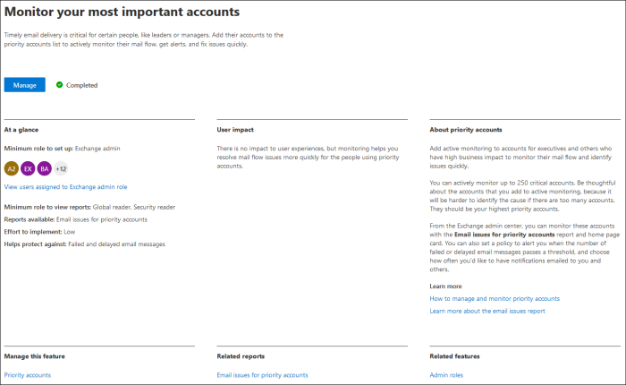

# Новые возможности Центра администрирования Microsoft 365What's new in the Microsoft 365 admin center

::: moniker range="o365-21vianet"

> [!NOTE]
> Некоторые сведения в этой статье могут не применяться к службе Office 365, под управлением 21Vianet.Some of the information in this article might not apply to Office 365 operated by 21Vianet.

::: moniker-end

Мы постоянно добавляем новые функции в Центр администрирования [Microsoft 365,](microsoft-365-admin-center-preview.md)устраняем проблемы, о которых мы знаем, и внося изменения на основе ваших отзывов.We're continuously adding new features to [the Microsoft 365 admin center](microsoft-365-admin-center-preview.md), fixing issues we learn about, and making changes based on your feedback. Посмотрите ниже, чтобы узнать, что доступно для вас сегодня.Take a look below to see what's available for you today. Некоторые функции будут разной скоростью для наших клиентов.Some features get rolled out at different speeds to our customers. Если вы еще не видите функцию, [попробуйте добавить себя в выпуск Targeted.](manage/release-options-in-office-365.md)If you aren't seeing a feature yet, [try adding yourself to targeted release](manage/release-options-in-office-365.md).

Если вы хотите узнать, что нового в других облачных службах Майкрософт:And if you'd like to know what's new with other Microsoft cloud services:

- [Новые возможности Azure Active DirectoryWhat's new in Azure Active Directory](https://docs.microsoft.com/azure/active-directory/fundamentals/whats-new)
- [Новые возможности Центра администрирования ExchangeWhat's new in the Exchange admin center](https://docs.microsoft.com/Exchange/whats-new)
- [Новые возможности Microsoft IntuneWhat's new in Microsoft Intune](https://docs.microsoft.com/mem/intune/fundamentals/whats-new)
- [Новые возможности Центра соответствия требованиям Microsoft 365What's new in the Microsoft 365 compliance center](https://docs.microsoft.com/Office365/SecurityCompliance/whats-new)
- [Новые возможности Microsoft 365 DefenderWhat's new in Microsoft 365 Defender](https://docs.microsoft.com/microsoft-365/security/mtp/whats-new)
- [Новые возможности Центра администрирования SharePointWhat's new in the SharePoint admin center](https://docs.microsoft.com/sharepoint/what-s-new-in-admin-center)
- [Обновления OfficeOffice updates](https://docs.microsoft.com/OfficeUpdates/)

## Ignite 2020 (август & сентября)Ignite 2020 (August & September)

Добро пожаловать в Microsoft Ignite — наше первое сетевое решение Ignite.Welcome to Microsoft Ignite - our first online-only Ignite. Мы надеемся увидеть вас в одном из наших сеансов: Каталог сеансов [Microsoft Ignite 2020.](https://myignite.microsoft.com/sessions)We hope to see you in one of our sessions: [Microsoft Ignite 2020 Session Catalog](https://myignite.microsoft.com/sessions). Вот лишь некоторые из того, о чем мы будем говорить на Ignite.Here's just a few of the things we'll be talking about at Ignite. 
> [!NOTE]
> Не все функции сразу будут доступны всем.Not all features are going to be available to everyone right away. Если вы не видите новые функции, [присоединитесь к выпуску Targeted Release.](manage/release-options-in-office-365.md)If you aren't seeing the new features, [join Targeted Release](manage/release-options-in-office-365.md).

### Управление несколькими арендаторамиMulti-tenant management

Мы разработали набор функций для администраторов с несколькими арендаторами, например для более быстрого и эффективного задания.We've developed a set of features for multi-tenant admins like you to get your job done faster and more efficiently. Дополнительные сведения см. в под [управлением нескольких клиентов.](multi-tenant/manage.md)For more information, see [Manage multiple tenants](multi-tenant/manage.md).

- **Ваши клиенты:** быстро переключаются между управляемыми вами арендаторами.**Your tenants**: Quickly switch between the tenants you manage.
- **Все клиенты**: новая страница, на которой можно быстро увидеть состояние всех служб клиентов, все открытые запросы на обслуживание, продукты и выставление счета, рекомендуемые задачи настройки и количество пользователей в этом клиенте.**All tenants**: A new page where you can quickly see the health of all your tenants' services, any open service requests, your products and billing, recommended setup tasks, and the number of users in that tenant.
- **Настройка:** на странице "Настройка с несколькими арендаторами" можно просмотреть список страницы установки, но она организована для многих клиентов.**Setup**: The multi-tenant Setup page gives you a list view of the Setup page, but organized for many tenants. Вы можете увидеть, какие функции не будут включены, какие задачи будут завершены для всех клиентов, какие задачи по-прежнему должны быть завершены.You can see which features aren't turned on, which tasks are complete for all tenants, tasks that tenants still need to complete. Это представление поможет вам отслеживать внедрение функций и убедиться, что рекомендуемые задачи настройки безопасности всегда будут выполняться.This view will help you keep track of feature adoption and to make sure the recommended security setup tasks are always done.
- **Состояние службы:** в представлении о состоянии службы показано, влияют ли какие-либо инциденты или советы на клиентов.**Service health**: The service health view shows you if any incidents or advisories are affecting the tenants. Он даже покажет, сколько управляемых клиентов затронуты.It will even tell you how many of your managed tenants are affected. Просто выберите инцидент, чтобы получить дополнительные сведения на вкладке обзора, а затем переходить на вкладку "Затронутые клиенты", чтобы развернуть и поддерживать этот клиент.Just select an incident to get more information on the overview tab, then switch over to the Tenants affected tab to drill down and support that tenant.
- **Миграция почтовых** ящиков между клиентами — это новая служба, которая теперь находится в предварительной версии, которая позволяет перемещать почтовые ящики между клиентами без необходимости отключения, а затем входящих почтовых ящиков.**Cross-tenant mailbox migrations** is a new service, now in public preview, that lets you move mailboxes between tenants without the need to offboard and then onboard mailboxes. 
- **Общий доступ к доменам** между арендаторами: скоро вы сможете присоединиться к закрытой предварительной версии, чтобы получить возможности, позволяющие совместно использовать домен для нескольких клиентов.**Cross-tenant domain sharing**: Soon, you can join a private preview for capabilities that allow you to share a domain across multiple tenants. Например, если contoso приобретает Wingtip Toys, contoso может поделиться доменом с Wingtip Toys, чтобы люди в обоих клиентах могли использовать "contoso.com" в качестве адресов электронной почты.For example, if Contoso acquires Wingtip Toys, Contoso can share the domain with Wingtip Toys so that people in both tenants can use "contoso.com" as their email addresses.

### Отслеживание наиболее важных учетных записейMonitor your most important accounts

Вы можете отслеживать и отслеживать неудачные или отложенные сообщения электронной почты, отправленные пользователям, которые оказывают большое влияние на бизнес, например исполнительному директору.You can monitor and track failed or delayed email messages sent to your users who have a high business impact, like your CEO. Вы отслеживайте учетные записи приоритетов, добавляя пользователей в список учетных записей приоритетов в Центре администрирования Microsoft 365.You track priority accounts by adding users to your priority accounts list in the Microsoft 365 admin center. Добавьте руководителей, руководителей, руководителей или других пользователей, которые имеют доступ к конфиденциальной или высокой информации.Add executives, leaders, managers, or other users who have access to sensitive or high priority information.

Учетные записи приоритета доступны только организациям, которые соответствуют следующим требованиям:Priority accounts are only available to organizations that meet both of the following requirements:

- Office 365 E3, Microsoft 365 E3, Office 365 E5 или Microsoft 365 E5.Office 365 E3 or Microsoft 365 E3, or Office 365 E5 or Microsoft 365 E5.
- Не менее 10 000 лицензий и не менее 50 активных пользователей Exchange Online в месяц.At least 10,000 licenses and at least 50 monthly active Exchange Online users.

Существует два способа начать работу:There are two ways to get started:

- Go to **Users**, and then in the "more actions" menu select **Manage priority accounts** to add users to the list.Go to **Users**, and then in the "more actions" menu select **Manage priority accounts** to add users to the list.
- Перейдите **к настройке,** найдите задачу установки **"Мониторинг самых важных** учетных записей" и выберите **"Начало работы".**Go to **Setup**, find the setup task **Monitor your most important accounts**, and then select **Get started**.

Дополнительные сведения об учетных записях с учетной записью приоритета мониторинга. For more info on priority accounts, check out [Monitoring priority accounts](https://docs.microsoft.com/microsoft-365/admin/setup/priority-accounts).

### Поиск быстрее и улучшение результатов с любой страницыSearch faster and get better results from any page

Мы начали развертывание нового интерфейса поиска для Центра администрирования, и мы не можем дождаться, пока вы опробуете его. Alt+S to search from any page.](../media/MAC-WN-GlobalSearch.png)

- Поле поиска перемещено в область header с искомой "Центр администрирования Microsoft 365", поэтому теперь поиск ведется с любой страницы, а не только с домашней страницы.The Search box moved to the header area where it says "Microsoft 365 admin center" so you now search from any page, not just the Home page. У нас даже есть ярлык: **ALT+S**.We've even got a shortcut: **Alt+S**.
- Поиск более умен и даст вам более быстрые результаты.Search is smarter and will give you better results, even faster. Попробуйте ввести "2fa" для начала работы.Try typing "2fa" to get started.
- Результаты поиска у организованы по типу элемента или действию, которые можно принять.Search results are organized by the type of item or action you can take.
  - **Пользователи:** выберите имя пользователя, и вы можете изменить этого пользователя прямо там.**Users**: Select the user's name and you can edit that user right there. Если рядом с их именем выбрано меню "Дополнительные действия", можно сбросить пароль.If you select the "more actions" menu next to their name, you can reset their password. Вы можете искать по отображаемой и фамилии, имени, имени пользователя или основному адресу электронной почты, а также псевдонимам электронной почты.You can search by display name, last name, first name, username or primary email address, and email aliases. Но чтобы получить точное совпадение, наберем основной адрес электронной почты или имя пользователя.But to get an exact match, search by primary email address or username.
  - **Группы:** изменение группы с любой страницы, добавление участников и назначение владельцев.**Groups**: Edit the group from any page, add members, assign owners.
  - **Действия.** Аналогично тому, как можно искать пользователя и сбрасывать его пароль, можно также искать "сбросить пароль" с любой страницы, а затем сбросить один или несколько паролей для пользователей.**Actions**: Similar to how you can search for a user and then reset their password, you can also search "reset password" from any page and then reset one or more passwords for users.
  - **Навигация:** результаты в области навигации могут быстро помочь вам быстро попасть на страницу в Центре администрирования.**Navigation**: Results under Navigation can quickly help you get to a page in the admin center quickly. Например, при поиске по словам "роли" вы будете перенабираться на страницу "Роли" для ролей Azure AD.For example, searching "roles" will take you to the Roles page for Azure AD roles.
  - **Параметры:** поиск любых параметров, связанных с вашей организацией, служб, на которые вы подписаны, а также параметров безопасности и конфиденциальности.**Settings**: Search for any setting related to your organization, the services you subscribe to, and security and privacy settings. 
  - **Домены:** вы можете найти быстрые ссылки на свои домены, а затем эта ссылка поможет вам ться на страницу "Обзор и состояние" этого домена.**Domains**: You can find quick links to your domains, and then the link will take you to that domain's Overview and health page.
  - **Документация.** Если вам не найти результат, мы попытаемся найти документацию для справки.**Documentation**: If we can't find a result for you, we'll try to find some documentation to help. Поиск совпадения занимает немного больше времени, поэтому подождите секунду, чтобы поиск мог найти результаты.It takes a little longer for the curated list of articles to find a match, so wait a second to let Search find the results. 
  - **Feedback**: Didn't find what you were looking for?**Feedback**: Didn't find what you were looking for? Отправьте нам отзыв из поиска.Send us feedback from Search. Мы добавим функции поиска для дополнительных страниц и дополнительных функций в Центре администрирования.We will add searching functionality for more pages and more features across the admin center.

### Мобильное приложение администратора Microsoft 365Microsoft 365 admin mobile app

Мобильное приложение администратора [Microsoft 365,](https://www.microsoft.com/microsoft-365/business/manage-office-365-admin-app)которое входит в состав вашей подписки, позволяет управлять Microsoft 365 с мобильного устройства, чтобы вы могли отойти от рабочего стола, чтобы выполнять задачи каждый день.The [Microsoft 365 admin mobile app](https://www.microsoft.com/microsoft-365/business/manage-office-365-admin-app), which is included with your subscription, lets you manage Microsoft 365 from your mobile device so you can get away from your desk to do every day tasks. На самом деле в приложении более 90 функций, и мы только что добавили еще несколько:In fact, there are over 90 features in the app--and we just added a few more:

- Поддержка политик управления мобильными приложениями и условного доступа **Microsoft Intune:** теперь вы можете использовать личное устройство для управления Microsoft 365, даже если в вашей организации включена политика управления мобильными приложениями и условного доступа Intune.**Support for Microsoft Intune's Mobile Application Management and Conditional Access policies**: You can now use your personal device to manage Microsoft 365 even if your org has turned on Intune's Mobile Application Management and conditional access policies.
- **Уведомления центра сообщений:** включаем уведомления центра сообщений на сайте **"Уведомления** о параметрах", если вы хотите получать уведомления о новых  >   записях центра сообщений.**Message center notifications**: Turn on message center notifications at **Settings** > **Notifications** if you wish to be alerted about new message center posts. С помощью уведомлений мы хотим, чтобы вы оставались в курсе важных сведений и событий в клиенте.Through notifications, we want to ensure you stay informed about important information and events across your tenant.
- **Оповещения о** выставлении счета: вы также можете включить уведомления о выставлении счета на сайте **"Уведомления** о параметрах", если вы хотите получать уведомления о выставлении счета на своем устройстве, если срок действия подписки  >   истекает.**Billing alerts**: You can also turn on billing notifications at **Settings** > **Notifications** if you want to get billing notifications on your device if a subscription is about to expire.
- **Темный режим:** добро пожаловать в темную часть мобильного приложения.**Dark mode**: Welcome to the dark side of the mobile app. Это была одна из самых востребованных функций.This was one of our most requested features. Чтобы **включить его,**  >   перейдите в "Темы параметров".Go to **Settings** > **Themes** to turn it on.
- **Сообщить о проблеме:** теперь вы можете сообщить о проблеме в приложении или просмотреть сообщения о проблемах, о которых сообщили другие администраторы.**Report an issue**: You can now report an issue in the app or view issues reported by other admins. Чтобы **узнать о ее** состоянии, посетите сайт "Состояние службы".Visit **Service health** to check it out.

### Рекомендации по использованию для малого и среднего бизнесаUsage recommendations for small and medium businesses

Малый и средний бизнес может  получить рекомендации на домашней странице, если некоторые люди в организации не активно используют Приложения Teams, OneDrive или Office.Small and medium businesses might get a recommendation on the **Home** page if some of the people in the org aren't actively using Teams, OneDrive, or Office apps. При просмотре рекомендации вы можете быстро отправить неактивным пользователям электронную почту по электронной почте, чтобы помочь им начать работу с приложением и убедиться, что вы получаете полную ценность от ваших подписок.When you view the recommendation, you can quickly email Microsoft training to inactive users to help them get started with the app and to make sure you are getting the full value from your subscriptions.

### Удаленная коллекция работRemote work collection

В октябре мы добавим удаленную рабочую коллекцию, чтобы помочь владельцам малого бизнеса и их сотрудникам работать в сети и удаленно.In October, we'll be adding a remote work collection to help small business owners and their staff get online and working remotely.  **Настройка основных функций** удаленной работы — это список всех функций, рекомендуемых корпорацией Майкрософт для безопасного обеспечения удаленной работы и эффективной совместной работы.**Remote work essentials** setup is a curated list of all features Microsoft recommends to securely enable remote work and to collaborate effectively. Через пару недель вы можете попробовать его в установке удаленной  >  **работы.**In a couple of weeks, you can try it out in **Setup** > **Remote work essentials**.

Дополнительные сведения о том, как безопасно разрешить удаленную работу и удобный веб-адрес, который легко запомнить и делиться, [aka.ms/remote-business.](https://aka.ms/remote-business)For more information about how to securely allow remote work and a handy web address that's easy to remember and share, go to [aka.ms/remote-business](https://aka.ms/remote-business).

### Нужна помощь? переход на другие центры администрированияNeed help? moving to more admin centers

We're continuously looking at and updating the content and tools to keep up with changes in the product.We're continuously looking at and updating the content and tools to keep up with changes in the product. Теперь у нас есть намного больше средств самостоятельной диагностики, которые помогут вам быстро и эффективно устранять проблемы.We now have many more self-serve diagnostic tools to help you resolve issues quickly and efficiently. Вот некоторые из них, которые были недавно добавлены:Here are a few that were recently added:

- Изменение политики регулирования веб-служб ExchangeChange your Exchange Web Service throttling policy
- Проверка состояния предоставления и проверки Teams для определенных пользователейChecking status of Teams provisioning and validation to specific users
- Устранение проблем с установкой DKIMFix DKIM setup issues
- Диагностика ошибок регистрации пользователей IntuneDiagnose Intune user enrollment errors

Мы также развертываем новый и улучшенный интерфейс поддержки, который вы уже видите в Центре администрирования Microsoft 365, в некоторых других центрах администрирования.And we are rolling out the new and improved support experience you already see in the Microsoft 365 admin center to some of the other admin centers. Центр администрирования Teams и Центры администрирования безопасности и соответствия требованиям уже имеют этот новый интерфейс.Teams Admin Center and Security and Compliance Admin Centers already have this new experience. Вскоре центр **администрирования Exchange,** Центр администрирования **SharePoint** **и** Office.com будут обновлены вместе с этим новым интерфейсом справки для администраторов.And soon, **Exchange admin center**, **SharePoint admin center**, and **Office.com** will be updated along with this new help experience for admins.

### Управление изменениями с помощью Планировщика (Майкрософт)Manage changes with Microsoft Planner

В мае мы объявили о том, что скоро вы сможете синхронизировать записи Центра сообщений с Планировщиком (Майкрософт), и теперь он доступен всем.In May, we announced that you'll soon be able to sync Message center posts to Microsoft Planner and now it's available for everyone to use.  Теперь можно создавать задачи из сообщений, назначать их и отслеживать их выполнение.You can now create tasks from messages, assign them, and track them to completion. При первом выборе **синхронизации Планировщика** необходимо подключиться к соответствующему плану.The first time, you select **Planner syncing** you'll need to connect to the appropriate plan.

Чтобы узнать больше об этом, ознакомьтесь с этой статьей и видео, чтобы узнать, как это работает: отслеживание записей центра сообщений [в Планировщике](https://docs.microsoft.com/Office365/Planner/track-message-center-tasks-planner)To learn more about it, check out this article and video to see how it works: [Track your message center posts in Planner](https://docs.microsoft.com/Office365/Planner/track-message-center-tasks-planner)

### Документация, обучение и видеоDocumentation, Training, and Videos

- Совершенно новое и точное время для Microsoft Ignite—[Виртуальный концентратор.](https://adoption.microsoft.com/virtual-hub/)Brand new and just in time for Microsoft Ignite--[The Virtual Hub](https://adoption.microsoft.com/virtual-hub/). Глубокое обучение ИТ-специалистов и разработчиков.Deep dive into technical training for IT pros and developers. Быстро найдите около 20 новых видео в #SIDETRACKED, имя администратора Ignite отслеживается в этом году.Quickly find around 20 new videos as part of #SIDETRACKED, the name of the Ignite admin track this year.
- Новые возможности серии видео [Microsoft 365:](https://www.youtube.com/watch?v=OVjb2lGJ4GU&t=2s) в этом месяце мы освещаем новые функции, доступные в доске для Teams и в Интернете, автоматизацию пользовательской подготовка к Azure AD, новые триггеры Power Automate и действия в Teams и другие.[What's new with Microsoft 365](https://www.youtube.com/watch?v=OVjb2lGJ4GU&t=2s) video series: This month, we cover new features available in Whiteboard for Teams and on the web, how to automate user provisioning to Azure AD, new Power Automate triggers and actions in Teams, and more. Следите за обновлениями на следующий месяц, где мы будем иметь в качестве команды все прекрасное, что происходит на Ignite!And stay tuned for next month, where we'll have a recap of all the great things happening at Ignite!
- Мы изменили страницу документации [По Microsoft 365,](https://docs.microsoft.com/microsoft-365) в первую очередь посвященную решениям.We did a redesign of the [Microsoft 365 documentation](https://docs.microsoft.com/microsoft-365) page that focuses on solutions first. Мы будем выделены новые решения, когда они станут доступны на этой странице, поэтому следите за ним.We'll highlight new solutions as they become available on this page, so keep an eye out.

## Июль 2020 г.July 2020

### Getting ready for Ignite 2020Getting ready for Ignite 2020

По мере перехода на время выпуска Ignite в корпорации Майкрософт мы выпускаем не так много функций, чтобы у нас было много разговоров во время сеансов.As we're moving into Ignite season at Microsoft, we're not releasing as many features so that we have a lot to talk about during our sessions.

Следующее обновление этой статьи будет опубликовано в день открытия нашего первого в сети ignite.The next update to this article will be on opening day of our first online-only Ignite. А в этом году бесплатное участие!And this year, it is free to attend! Ознакомьтесь со службой регистрации: [Microsoft Ignite 2020](https://www.microsoft.com/ignite).Check it out, get signed up: [Microsoft Ignite 2020](https://www.microsoft.com/ignite).

### Ваши продуктыYour products

В управлении подписками было много работы по ускорению загрузки страницы, быстрому поиску и удовлетворению стандартов веб-доступности (рекомендации[WCAG 2.1).](http://www.w3.org/TR/WCAG21/)There has been a lot of work done in the subscriptions management to make the page faster to load, faster to find what you're looking for, and to meet the web accessibility standards ([WCAG 2.1 guidelines](http://www.w3.org/TR/WCAG21/)).

- **Реорганизация таблицы:** таблица была изменена, чтобы можно было группировать похожие подписки.**Table redesign**: The table was redesigned so that you can group similar subscriptions. Перейдите в **"Выставление**  >  **счета вашим продуктам".**Go to **Billing** > **Your products**.
- **Сведения о** продукте: получите больше сведений о подписках, выбрав продукт в списке.**Product details**: Get more details than ever about your subscriptions by selecting the product in the list.
- **Все это можно** сделать здесь: и вам не нужно переходить к нескольким страницам, чтобы управлять одним продуктом.**Do it all from here**: And you don't have to go to jump around several pages to manage one product. Например, если вам нужно отменить подписку, панель откроется для того, чтобы сделать действие прямо там.For example, if you need to cancel a subscription, the panel will open to do the action right there.

### ДоменыDomains

Управление доменом может быть сложным процессом, и мы выпустили новую функцию, чтобы упростить эту задачу.Domain management can be complicated, and we've released a new feature to make that easier. Перейдите в > "Параметры" и выберите домен, чтобы получить дополнительные сведения о вашем домене и его состоянии.Go to Settings > Domains and then select a domain to get more information about your domain and the domain's health.

:::image type="content" source="../media/MAC-WN-DomainDNS.PNG" alt-text="Страница сведений о доменах для contoso.com":::

### Документы, учебные курсы и видео (июль 2020 г.)Docs, training, and videos (July 2020)

Новые возможности серии видеороликов [Microsoft 365:](https://youtu.be/m1Nu8WJgCDY) в этом месяце мы освещаем новые возможности Yammer для интернета и мобильных устройств, как интегрировать приложение Yammer Communities для Microsoft Teams, новые пакеты политик для поддержки сотрудников и менеджеров firstline и другие.[What's new with Microsoft 365](https://youtu.be/m1Nu8WJgCDY) video series: This month, we cover the new Yammer experience for web and mobile, how to integrate the Yammer Communities app for Microsoft Teams, new policy packages to support Firstline Workers and managers, and more.

## Июнь 2020 г.June 2020

### Управление новыми ресурсами OfficeKeeping up with Office What's New management

Несколько месяцев назад мы добавили параметр, который позволяет управлять новыми сообщениями, которые показываются в приложениях [Office пользователя.](#office-whats-new-management)A few months ago, we added a setting that lets you manage the [What's New messages that show up in a user's Office apps](#office-whats-new-management). В этом месяце мы выпустили новую карточку домашней страницы,  которая поможет вам быстро действовать и отслеживать новые сообщения, которые вы хотите показать пользователям в организации.This month, we released a new Home page card that will help you act quickly and keep track of the **What's New** messages that you want shown to the users in your organization.

### Документы, учебные курсы и видео (июнь)Docs, training, and videos (June)

- [Начало работы с TeamsGetting started with Teams](https://support.microsoft.com/office/184f1aba-2f91-43f0-86e1-9fae607e24f6)

## Май 2020 г.May 2020

### Новый канал обновления для OfficeNew update channel for Office

12 мая мы объявили о доступности нового канала обновления для Office: Monthly Enterprise Channel.On May 12, we announced the availability of a new update channel for Office:  Monthly Enterprise Channel. Этот канал обновления предоставляет пользователям новые функции Office один раз в месяц во второй вторник месяца.This update channel provides your users with new Office features once a month, on the second Tuesday of the month.

Если вы разрешаете пользователям самостоятельно устанавливать Office на портале, вы можете выбрать для них Monthly Enterprise Channel.If you allow your users to self-install Office from the portal, you can select Monthly Enterprise Channel for them. Для этого войдите в Центр администрирования Microsoft 365 и перейдите в приложение **"Показать** все параметры параметров организации" — параметры загрузки программного обеспечения  >   >    >    >  **Office.**To do this, sign in to the Microsoft 365 admin center and go to **Show all** >**Settings** > **Org settings** > **Services** > **Office software download settings**. Если выбрать **один раз в месяц (Monthly Enterprise Channel),** все новые самоустройки Office будут настроены на использование Monthly Enterprise Channel.If you select **Once a month (Monthly Enterprise Channel)**, then any new self-installs of Office will be configured to use Monthly Enterprise Channel.

В сочетании с выпуском Monthly Enterprise Channel мы также пересматриваем имена существующих каналов обновления.In conjunction with the release of Monthly Enterprise Channel, we’re also revising the names of the existing update channels. Например, monthly Channel переименовывают в Current Channel.For example, Monthly Channel is being renamed to Current Channel. Новые имена вступает в силу 9 июня 2020 г.The new names take effect on June 9, 2020.

Дополнительные сведения [см. в изменениях каналов обновления для приложений Microsoft 365.](https://docs.microsoft.com/DeployOffice/update-channels-changes)For more information, see [Changes to update channels for Microsoft 365 Apps](https://docs.microsoft.com/DeployOffice/update-channels-changes).

### Новые роли администратораNew admin roles

Мы добавили новые роли администратора Azure Active Directory в Центр администрирования Microsoft 365.We've added some new Azure Active Directory admin roles to the Microsoft 365 admin center.

- Роль администратора гибридных удостоверений предоставляет пользователям разрешение на управление облачными службами предоставления и проверки подлинности.Hybrid identity admin role gives users permission to manage cloud provisioning and authentication services.
- Роль сетевого администратора позволяет пользователям управлять сетевыми расположениями и анализ сетевых данных для приложений Microsoft 365 software as a Service.Network admin role lets users manage network locations and review network insights for Microsoft 365 Software as a Service apps.
- Роль администратора принтера предоставляет разрешение на управление всеми аспектами подключений принтеров и принтеров.Printer admin role grants permission to manage all aspects of printers and printer connections.
- Специалист по принтерам — это подмножество роли администратора принтера, в которой эти пользователи могут регистрировать и отрегистрируйте принтеры, а также обновлять состояние принтера.Printer technician is a subset of the Printer admin role where those users can register and unregister printers, and update printer status.
Дополнительные информацию об этих ролях см. в [дополнительных данных о ролях администраторов.](https://docs.microsoft.com/microsoft-365/admin/add-users/about-admin-roles)To find out more about these roles, see [About admin roles](https://docs.microsoft.com/microsoft-365/admin/add-users/about-admin-roles).

### Экспорт списка группExport groups list

Мы узнали от многих администраторов, что им нужно обмениваться сведениями о группах и их использовании с людьми, у которых нет доступа к центрам администрирования.We've heard from a lot of admins that they need to share information about groups and their usage to people who don't have access to the admin centers. Теперь вы можете экспортировать список групп в CSV-файл в целях аудита, что означает, что вы можете вывести старый сценарий PowerShell.You can now export the Groups list to a CSV file for auditing purposes, which means you can throw out that old PowerShell script. Чтобы опробовать ее, перейдите в **группу**  >  **"Группы"** и выберите **"Экспорт групп"** на панели команд.To try it out, go to **Groups** > **Groups**, and then select **Export groups** from the command bar.

### Центр архитектуры и решений Microsoft 365Microsoft 365 solution and architecture center

Только в этом месяце мы выпустили новый сайт, называемый Центром решений и [https://docs.microsoft.com](https://docs.microsoft.com) [архитектуры Microsoft 365,](https://docs.microsoft.com/microsoft-365/solutions/solution-architecture-center)который объединяет технические рекомендации, необходимые для понимания, планирования и внедрения интегрированных решений Microsoft 365 для безопасной и совместимой совместной работы.Just this month, we released a new site on [https://docs.microsoft.com](https://docs.microsoft.com) called the [Microsoft 365 solution and architecture center](https://docs.microsoft.com/microsoft-365/solutions/solution-architecture-center), which brings together the technical guidance you need to understand, plan, and implement integrated Microsoft 365 solutions for secure and compliant collaboration. В этом центре вы найдете:In this center, you'll find:

- Руководство по основам решенийFoundational solution guidance
- Решения рабочих нагрузок и рекомендации по сценариямWorkload solutions and scenario guidance
- Иллюстрации решений и архитектуры (плакаты!!!)Solution and architecture illustrations (The posters!!!)
- Отраслевые рекомендацииIndustry specific guidance
- Основные принципы проектирования корпоративной архитектурыEnterprise architecture design principals

### Документы, учебные курсы и видео (май)Docs, training, and videos (May)

- Новые возможности серии видео **Microsoft 365:** в этом месяце мы освещаем новые возможности поддержки в Центрах администрирования и безопасности и соответствия требованиям Teams, интеграцию Планировщика с Центром сообщений и новый макет видео 3x3 в Microsoft Teams.**What's new in Microsoft 365 video series**: This month, we cover the new support experience in the Teams admin and Security and Compliance Centers, Planner integration with the Message Center, and the new 3x3 video layout in Microsoft Teams. 
- В [Центре администрирования Microsoft 365](https://docs.microsoft.com/microsoft-365/admin/) была обновлена страница центра справки, которая поможет вам быстрее найти нужные узлы.The [Microsoft 365 admin center help](https://docs.microsoft.com/microsoft-365/admin/) hub page was updated to help you find what you need more quickly. Если вы сейчас посмотрите на эту страницу, мы добавили карточку для информирования о важных обновлениях и изменениях.And if you go look at that page right now, we've added a card to inform you of important updates and changes.

## Апрель 2020 г.April 2020

### Управление ролями IntuneIntune roles management

[Апрель 2020 г.April 2020](#april-2020)

Мы сделали это!Well, we did it! Мы сделали второй шаг на пути к единому интерфейсу ролей, и теперь вы можете управлять ролями Intune в Центре администрирования Microsoft 365.We've taken the second step towards a unified roles experience and you can now manage Intune roles in the Microsoft 365 admin center. Вы также можете использовать такие функции, как возможность поиска ролей и просмотра разрешений ролей.You can also leverage features such as the ability to search for roles and view role permissions. Это означает, что вам не нужны два отдельных средства для управления ролями для Microsoft 365 и Intune.This means you don’t need two separate tools to manage roles for Microsoft 365 and Intune. При входе в Центр администрирования Microsoft 365 вы увидите, что на странице "Роли" есть две pivots: одна для Azure AD и одна для Intune.When you sign into the Microsoft 365 admin center, you’ll see that there are two pivots on the Roles page, one for Azure AD and one for Intune.

### Синхронизация публикаций Центра сообщений в ПланировщикеSync Message Center posts to Planner

Начиная с мая, администраторы выпусков Targeted начнут видеть кнопку "Синхронизация Планировщика" в Центре сообщений.Starting in May, admins who are in Targeted release will start seeing the "Planner syncing" button in the message center. Теперь вы можете отслеживать сообщения, которые требуют действий, выбирать тип сообщений, которые вы хотите отслеживать, назначать сообщения для отслеживания в качестве задач и отмечать сообщения для более позднего внимания.You can now track messages that need action, select the type of messages you'd like to track, assign messages to track as tasks, and tag messages for later attention.

[Присоединяйтесь к выпуску Targeted,](manage/release-options-in-office-365.md) чтобы приступать к работе![Join Targeted Release](manage/release-options-in-office-365.md) to get started!

### "Нужна помощь?""Need help?" запущен в Центре администрирования Teams & безопасности и соответствия требованиямlaunched in Teams admin center & Security and Compliance centers

Центр администрирования Teams, Центр безопасности и Центр соответствия требованиям теперь используют ту же "Нужна помощь?".The Teams admin center, Security center, and Compliance center are now using the same "Need help?" функция, которую Центр администрирования Microsoft 365 использует для поиска справки и связи в службе поддержки.feature that the Microsoft 365 admin center uses for finding help and contacting support. Мы получили большое количество отзывов от администраторов о том, что вам нужна помощь и поддержка такого же уровня, и мы рады сообщить об этом вам.We've received a lot of feedback from admins that you wanted the same level of help and support and we're happy to bring that to you. Попробуйте его и дайте нам свой отзыв!Try it out and give us your feedback!

#### Требуется чат?Need chat?

Наши агенты поддержки работают из дома, принимая все еще дела клиентов и ограничения пропускной способности Интернета, работая из дома, могут повлиять на качество звонка клиента.Our support agents have been working from home while still taking customer cases and limitations on internet bandwidth while working from home can impact customer call quality. Чтобы продолжить поддержку, мы запустили поддержку в прямом чате для коммерческих клиентов в Центре администрирования Microsoft 365.In order to continue supporting you, we have launched live chat support option for commercial customers in the Microsoft 365 admin center.

При создании запроса на обслуживание в дополнение к телефону и электронной почте вы увидите чат.While creating a service request, you'll now see chat as an option, in addition to phone and email. Выберите чат в качестве предпочтительного канала связи и создайте запрос.Select chat as a preferred channel of communication and create the request. После создания запроса вы можете начать чат, когда будете готовы к чату с агентами Майкрософт.Once you've created the  request, you can start the chat when you are ready to chat with Microsoft agents.

### Обновления TeamsTeams updates

С увеличением использования Teams мы добавили несколько функций, которые помогут вам управлять ими.With the increased usage of Teams, we've added a few features to help you manage them.

- На новой карточке рекомендации на домашней странице Центра администрирования показано, какие пользователи не использовали Teams в течение 30 дней.A new recommendation card on the admin center Home page shows which users have not actively used Teams for 30 days. Вы можете отправить этим пользователям обучающее сообщение, чтобы начать использовать Teams.You can send those users a training email to get them started using Teams.
- **Соединяйте** пользователей  с командами: перейдите к настройке, чтобы увидеть новую страницу, которая поможет вам включить Teams для лицензированных пользователей и разрешить гостевой доступ, чтобы вы могли работать с внешними клиентами в Teams.**Bring people together with teams**: Go to **Setup** to see a new page to help you turn on Teams for licensed users and allow guest access, so you can work with external customers in Teams.
- Теперь карточка Microsoft Teams закреплена на домашней странице по умолчанию.A Microsoft Teams card is now pinned by default to your Home page. В нем показано, включен ли Teams и разрешен ли гостевой доступ.It shows whether Teams is turned on, and if guest access is allowed. Он также позволяет проверить состояние настройки для новых лицензированных пользователей Teams и проверить, могут ли сетевые проблемы повлиять на пользователей Teams.It also allows you to check the setup status for newly licensed Teams users, and check if network issues might be impacting Teams users.
- Наконец, Teams теперь является этапом начальной настройка, если вы приобрели лицензию, включаемую Teams.Finally, Teams is now a step in the initial set up flow if you purchased a license that includes Teams.

### Оценка производительностиProductivity score

Оценка производительности дает представление о том, как люди используют облачные службы Майкрософт, и о технологиях, которые их поддерживают.Productivity Score gives insights about how people use Microsoft cloud services and the technology experiences that support them. Этот показатель отражает производительность вашей организации по показателям работы сотрудников и технологий и сравнивает ваш показатель с организациями, например вашей.The score reflects your organization’s performance against employee and technology experience measures and compares your score with organizations like yours. В этом месяце мы представляем следующие новые концепции для предварительного просмотра:This month, we are introducing the following new concepts to the preview experience:

- Представление тенденций основных аналитических данных на домашней странице и страницах с подробными сведениями о категориях -Endpoint Analytics и категории сетевого подключения добавлены в технологический опытTrend view of primary insights on home page and category detail pages -Endpoint Analytics and Network Connectivity categories added to Technology Experience
- Релевантные сведения о техническом опыте, показанные в категориях "Опыт сотрудников"Relevant Technology Experience insight shown in Employee Experience categories
- Новая категория "Коммуникации в рамках взаимодействия с сотрудником"New Communications category as part of Employee Experience
- Сведения о пользователе с организационными метаданными в категориях "Опыт сотрудников"User details with organizational metadata in Employee Experience categories

Если вы хотите узнать больше, ознакомьтесь с блогом" "Измерение и улучшение работы Microsoft 365 с помощью оценки производительности [(Майкрософт)".](https://techcommunity.microsoft.com/t5/microsoft-365-blog/measure-and-improve-the-microsoft-365-experience-with-microsoft/ba-p/1348618)If you'd like to learn more, check out the blog: [Measure and improve the Microsoft 365 experience with Microsoft Productivity Score](https://techcommunity.microsoft.com/t5/microsoft-365-blog/measure-and-improve-the-microsoft-365-experience-with-microsoft/ba-p/1348618). В настоящее время показатель производительности находится в закрытой предварительной версии.Productivity score is currently in private preview. [Присоединяйтесь к закрытой предварительной](https://aka.ms/productivityscorepreview) версии оценки производительности, чтобы приступать к работе.[Join the Productivity score private preview](https://aka.ms/productivityscorepreview) to get started.

### Обновления группGroups updates

В этом месяце у нас есть два обновления для групп:We've got two updates for Groups this month:

- Теперь вы можете редактировать адреса электронной почты для групп Office 365 (также известных как группы в Outlook, и скоро они будут известны как группы Microsoft 365).You can now edit email addresses for Office 365 groups (Also known as Groups in Outlook, and soon to be known as Microsoft 365 groups).
- Мы получили ваш отзыв и добавили более понятные сообщения об ошибках, чтобы понять, почему вы не можете преобразовать группу в microsoft Team.We've heard your feedback and we've added clearer error messaging for why you can't convert a group to a Microsoft Team.

### Документы, видео и учебные курсы (апрель)Docs, videos, and training (April)

Новые возможности серии видеороликов **Microsoft 365:** в этом месяце мы освещаем советы и ресурсы, которые помогут малому предприятию перейти на удаленную работу, в том числе как развернуть Microsoft Teams, ресурсы по дистанционному обучению работе для связи с клиентами и партнерами, а также новый план Business Voice для Microsoft 365.**What's new in Microsoft 365 video series**: This month, we cover tips and resources to help small businesses transition to remote work including how to roll out Microsoft Teams, remote work training resources to stay connected with clients and partners, and the new Microsoft 365 Business Voice plan. [Новые возможности Microsoft 365What's New in Microsoft 365](https://go.microsoft.com/fwlink/p/?linkid=2118096)

#### Для пользователейFor your users

- [Запланировать собраниеSchedule a meeting](https://support.microsoft.com/office/c61b4f61-ee62-4a06-8bf7-0a1cd302700a)
- [Присоединиться к собранию TeamsJoin a Teams meeting](https://support.microsoft.com/office/078e9868-f1aa-4414-8bb9-ee88e9236ee4)
- [Создание команды для всей организацииCreate an org-wide team](https://support.microsoft.com/office/037bb27a-bcc9-48fe-8d72-44d9482420a3)
- [Создание команды с гостямиCreate a Team with guests](https://support.microsoft.com/office/11fbb083-52ee-434d-8c6e-63711fdafac7)
- [Присоединиться к команде в качестве гостяJoin a Team as a guest](https://support.microsoft.com/office/928d1eef-61e2-49ec-b754-c2fe86b34824)
- [Создание адреса электронной почты группыCreate a group email address](https://support.microsoft.com/office/ded875f9-a9de-437f-b559-2ae4f235bb2b)

#### Для администраторов и владельцев бизнесаFor admins and business owners

- [Расширение возможностей малого бизнеса с помощью удаленной работыEmpower your small business with remote work](https://support.microsoft.com/office/9b91a85a-39b4-40a6-a590-0f9bea0ba8e6)
- [Запуск удаленного малого бизнесаRunning a remote small business](https://support.microsoft.com/office/9ac1a0f1-789b-4143-b954-5821d5d89298)
- [Sign up for Microsoft Business BasicSign up for Microsoft Business Basic](https://support.microsoft.com/office/9ac1a0f1-789b-4143-b954-5821d5d89298)
- [Настройка двух факторов для регистрацииSetting up two-factor sign-in](https://support.microsoft.com/office/9ac1a0f1-789b-4143-b954-5821d5d89298)

## Март 2020 г.March 2020

### Исправление рекомендуемой обратной связи: повышение надежности "добавления пользователей" для лицензированияFeatured Feedback Fix: Improve "add user" reliability for licensing

Мы получили большое количество отзывов от администраторов о том, насколько сложно назначать лицензии при добавлении пользователей.We received a lot of feedback from admins about the how hard it is to assign licenses when adding users. We've made the first update to this fix and we've migrated to a more reliable behind-the-scenes service to process those requests.We've made the first update to this fix and we've migrated to a more reliable behind-the-scenes service to process those requests. Если что-то пойдет не так, вы получите сообщение об ошибке, которое позволит повторить попытку.And if something goes wrong, you'll now get an error message that lets you to try again.

### Карточка домашней страницы Microsoft TeamsMicrosoft Teams home page card

При использовании Teams некоторые организации получают закрепленную карточку панели мониторинга, которая делает включение Teams более обнаруживаемым.With the uptick in Teams usage, some orgs will get a pinned dashboard card that makes turning Teams on more discoverable. На карточке также есть ссылки на учебные курсы и документы, которые помогут организации перейти на удаленную работу.The card also has links to training and docs to help your org transition to remote work. Просто перейдите на home-страницу, чтобы увидеть новую карточку. Just go to the **Home** page to see the new card.

### Настройка темы мобильного приложения SharePoint в организацииCustomize your organization's SharePoint mobile app theme

С помощью Центра администрирования Microsoft 365 теперь можно настроить тему организации в мобильном приложении SharePoint для iOS и мобильного приложения SharePoint для Android.Using the Microsoft 365 admin center, you can now customize your organization's theme in SharePoint mobile app for iOS and SharePoint mobile app for Android. Эта функция удобно предоставляет мобильные приложения интрасети, которые могут соответствовать SharePoint Online для сотрудников в путь.This feature conveniently provides a mobile intranet app experience that can match your SharePoint Online for employees on the go. Настройка темы включает изображение логотипа, цвет панели навигации, цвета текста и значка, а также цвета акцентов, что делает его простым распознаванием.Theme customization includes your logo image, navigation bar color, text and icon colors, and accent colors, making for easy recognition.

### Улучшения мастера "Добавление группы"Improvements to the "Add a group" wizard

Когда администраторы создали новую группу и сделали ее командой одновременно, они могут назначать владельцев, у которых нет лицензии на Teams.When admins created a new group - and made it a Team at they same time, they could assign owners who don't have a license that includes Teams. И это создало некоторые проблемы.And that created some headaches. Мы обновили поток мастера, чтобы убедиться, что у владельцев есть лицензия Teams, и если они не могут превратить группу в команду, отключена.We've updated the wizard flow to verify that owners have a Teams license and if they don't the option to turn the group into a Team is disabled.

### Предложения Microsoft 365 для малого и среднего бизнесаMicrosoft 365 offerings for small and medium businesses

Мы знаем, что это объявление на следующий месяц, но мы хотим убедиться, что вы готовы.We know that this is an announcement for next month, but we want to make sure you're prepared.

Начиная с 21 апреля мы внося изменения, связанные с подписками на Office 365 для малого и среднего бизнеса и Office 365 профессиональныйplus.Starting on April 21, we're making changes related to our Office 365 subscriptions for small and medium businesses – and to Office 365 ProPlus. Теперь эти продукты будут использовать бренд Microsoft 365.These products will now use the Microsoft 365 brand.

Новые названия продуктов вступает в силу 21 апреля 2020 г.The new product names go into effect on April 21, 2020. Это изменение только названия продукта, и в настоящее время цены и функции не изменяются.This is a change to the product name only, and there are no pricing or feature changes at this time.

|Текущее имяCurrent name |Новое названиеNew name  |
|---------|---------|
|Office 365 бизнес базовыйOffice 365 Business Essentials     |   Microsoft 365 бизнес базовыйMicrosoft 365 Business Basic      |
|Office 365 бизнес премиумOffice 365 Business Premium     |    Microsoft 365 бизнес стандартMicrosoft 365 Business Standard     |
|Microsoft 365 бизнесMicrosoft 365 Business     |    Microsoft 365 бизнес премиумMicrosoft 365 Business Premium     |
|Office 365 бизнесOffice 365 Business     |    Приложения Microsoft 365 для бизнесаMicrosoft 365 Apps for business       |
|Office 365 профессиональный плюсOffice 365 ProPlus    |   Приложения Microsoft 365 для предприятийMicrosoft 365 apps for enterprise      |

### Видео, учебные курсы и документыVideos, training, and docs

Новые возможности веб-серии [Microsoft 365:](https://go.microsoft.com/fwlink/p/?linkid=2118096)в этом месяце мы освещаем 3-летнюю годовщину Microsoft Teams, а также новые функции, в том числе улучшенное качество звука на собраниях по сети, целевые коммуникации для руководителей первой линии с приложением Shifts, взаимодействие пользователей Teams и Skype и т. д.[What's New in Microsoft 365 web series](https://go.microsoft.com/fwlink/p/?linkid=2118096): In this month's episode, we highlight the 3-year anniversary of Microsoft Teams and cover new features including improved audio quality in online meetings, Targeted Communications for firstline managers with the Shifts app, Teams and Skype consumer interoperability, and more.

## Февраль 2020 г.February 2020

### Исправление функции обратной связи: коммутатор для нескольких организацийFeatured Feedback Fix: Multi-organization switcher

Мы получили большое количество отзывов от партнеров и администраторов о проблемах управления несколькими облачными организациими Майкрософт.We received a lot of feedback from partners and admins about the challenges of managing multiple Microsoft cloud orgs. Одной из первых функций управления в нескольких организациях является переключатель **Organization,** который позволяет переключаться между организацией, которой вы управляете всего за 2 щелчка мыши.One of our first multi-org management features is the **Organization switcher**, which lets you change between the orgs that you manage in just 2 clicks.
> [!TIP]
> Вам не нужно ничего делать, чтобы коммутатор организации появлялся, если вы являетсяе зарегистрированным партнером по крайней мере одной организации.You don't have to do anything to make the organization switcher appear as long as you are the Partner of record for at least one organization.

1. В Центре администрирования Microsoft 365 выберите название организации.In the Microsoft 365 admin center, select the org name.

2. В коммутаторе организации выберите организацию, которая должна управляться.In the organization switcher, select the org you want to manage.

Это буквально!!!That's literally it!!!

### ГруппыGroups

Несколько изменений в области групп в этом месяце:A couple of changes in the groups area this month:

- **Сортировка по имени** группы: можно сортировать список групп в алфавитном порядке, выбрав **столбец имени** группы.**Sort by group name**: You can sort the groups list alphabetically, by selecting the **Group name** column.
- **Восстановление удаленных групп Microsoft 365:** больше не нужно переходить в Центр администрирования Exchange, чтобы восстановить удаленные группы Microsoft 365.**Restore deleted Microsoft 365 groups**: You don't have to go to the Exchange admin center anymore to restore  deleted Microsoft 365 groups. Перейдите **в Центр администрирования Microsoft 365"** "Группы, удаленные" (выберите группу в списке) \>  \>  \> \> **"Восстановление группы".**Go to **Microsoft 365 admin center** \> **Groups** \> **Deleted groups** \> (select a group from the list) \> **Restore group**. Она восстановит группу  обратно в список "Группы" и восстановит электронную почту, беседы, записную книжку, файлы и календарь группы.It'll restore the group back to the **Groups** list and restore the group's email, conversations, notebook, files, and calendar.

### Видео, учебные курсы и документы (февраль)Videos, training, and docs (February)

- Новые возможности серии видео **Microsoft 365:** в этом месяце мы сфокусированы на пользовательских возможностях поиска для SharePoint Online, функции управления "Новые возможности" Office, которая позволяет показывать или скрывать определенные функции от конечных пользователей с помощью области справки в приложении, последние обновления для системы безопасности и соответствия требованиям в Yammer и другие.**What's new in Microsoft 365 video series**: This month, we're focused on custom search capabilities for SharePoint Online, the Office "What's New" management feature that lets you show or hide specific features from end-users via the in-app help pane, the latest security and compliance updates in Yammer, and more. Вот последний видео: "Новые [возможности в Microsoft 365"](https://go.microsoft.com/fwlink/p/?linkid=2118096)Here's the latest episode: [What's New in Microsoft 365](https://go.microsoft.com/fwlink/p/?linkid=2118096)

- **Перемещение в документы:** мы совмещали веб-статьи администрирования Office 365 с содержимым Microsoft 365, и вы могли заметить новый URL-адрес.**Docs move**: We combined the Office 365 admin web articles with the Microsoft 365 content and you might've noticed the new URL. Например, эта статья раньше была опубликована по адресу: **docs.microsoft.com/Office365/Admin/whats-new-in-preview,** а теперь URL-адрес: **docs.microsoft.com/microsoft-365/admin/whats-new-in-preview**.For example, this article used to be hosted at: **docs.microsoft.com/Office365/Admin/whats-new-in-preview**, but the URL is now: **docs.microsoft.com/microsoft-365/admin/whats-new-in-preview**. Если вы закладки страниц, необходимо обновить ссылки; однако ссылки на содержимое будут перенаправлены в новый репо контента.If you've bookmarked pages, you should update your links; however, content links will be redirected to the new content repo.

## Январь 2020 г. — с новым годомJanuary 2020 - Happy New Year

> [!NOTE]
> Знаете ли вы, что на YouTube есть серия видео "Новые возможности [Microsoft 365"?](https://go.microsoft.com/fwlink/p/?linkid=2118096)Did you know that there's a [What's New in Microsoft 365](https://go.microsoft.com/fwlink/p/?linkid=2118096) video series on YouTube? В нем выделены последние функции, которые мы добавили для пользователей.It highlights the latest features that we've rolled out to users. Каждый месяц мы будем начинать связывание с последним видео в разделе ["Видео",](#videos-training-and-docs) "Учебные курсы" и "Документы".Every month, we'll start linking to the latest episode in the [Videos, training, and docs](#videos-training-and-docs) section.     Вот последний видео: "Новые [возможности в Microsoft 365"](https://go.microsoft.com/fwlink/p/?linkid=2118096)Here's the latest episode: [What's New in Microsoft 365](https://go.microsoft.com/fwlink/p/?linkid=2118096)

### Темный режимDark mode

При первом введении темного режима он был доступен только на домашней странице.When we first rolled out dark mode, it was only available on the Home page. Темный режим теперь находится вне предварительного просмотра и находится в выпуске Targeted на большинстве страниц в Центре администрирования.Dark mode is now out of preview and is in Targeted release across most pages in the admin center.

1. Во-первых, необходимо включить выпуск Targeted Release: Go to  \> **Settings** \> **Settings Organization profile** Release \> **preferences**.First, you'll need to turn on Targeted Release: Go to **Settings** \> **Settings** \> **Organization profile** \> **Release preferences**.
1. Чтобы включить темный режим, перейдите на страницу **"Главная"** и выберите кнопку **"Темный** режим".And then to turn on dark mode, go to the **Home** page, and then select the **Dark mode** button. (Он рядом с полем **поиска** и ссылкой **"Новые возможности"** этой статьи.)(It's next to the **Search** field and this article's **What's new** link.)
1. Для любой страницы с темным режимом кнопка находится в  верхней части страницы рядом с новым перегоном Центра администрирования.For any page that has dark mode available, the button is at the top of the page, next to **The new admin center** toggle.

### Управление новыми ресурсами OfficeOffice What's New management

Администраторам нужен контроль над тем, как Корпорация Майкрософт сообщает своим пользователям "Новые возможности" в приложениях Office, и теперь у вас есть этот контроль.Admins want control over how Microsoft communicates "What's New" to their users in the Office apps - and you now have that control. Go to **Settings** \> **Office What's New management Preview**.Go to **Settings** \> **Office What's New management Preview**. Выберите функцию, чтобы просмотреть ее сведения, а затем можно нажать кнопку "Скрыть от пользователей", если вы не хотите, чтобы пользователи видели определенное сообщение "что нового". Select a feature to view its details, and then you can select the **Hide from users** button if you don't want your users to see a particular "what's new" message. Например, ваша организация может подождать, чтобы дать пользователям знать о функции, пока все в вашей организации не обучаются этой функции.For example, your organization might be waiting to let users know about a feature until everyone in your org is trained on it.

Эта функция была впервые выпущена для предварительного просмотра в ноябре, но было несколько обновлений функций, о которые вам следует знать: теперь доступны предварительные обновления для управления новыми средствами [управления Office](https://techcommunity.microsoft.com/t5/microsoft-365-blog/office-what-s-new-management-preview/ba-p/1020438)This feature was first released to preview in November, but there have been a few feature updates that you should know about: [Office What's New management preview updates now available](https://techcommunity.microsoft.com/t5/microsoft-365-blog/office-what-s-new-management-preview/ba-p/1020438)

### ПартнерыPartners

Howdy, Partners!Howdy, Partners! (Не удалось помочь себе.) Мы также получили обновление для вас в этом месяце.(Couldn't help myself.) We've got an update for you this month, as well. Существует новая функция, которая позволяет партнерам предоставить клиентам CSP возможность принять свое соглашение  Microsoft Customer Agreement (MCA) в разделе "Учетные записи вы выставления счетов" в Центре администрирования.There's a new feature that allows Partners to give CSP customers the option to accept their Microsoft Customer Agreement (MCA) in the **Billing accounts** section of the admin center. В этом новом случае:In this new experience:

1. Клиент получает по электронной почте приглашение со ссылкой, чтобы принять партнерскую связь и MCA.The customer receives an invitation email with a link to accept the partner relationship and the MCA.
2. После того как клиент войт, он может просматривать и принимать разрешения MCA и партнеров прямо из Центра администрирования.After the customer signs in, they can view and accept the MCA and partner permissions - right from the admin center.

### Почтовые ящики ресурсаResource mailboxes

Список почтовых ящиков ресурса обновлен до нового стиля.The Resource mailboxes list has been updated to the new style. В Центре администрирования Microsoft 365 перейдите в **"Комнаты** \> **ресурсов" & оборудования.**In the Microsoft 365 admin center, go to **Resources** \> **Rooms & equipment**.

### Видео, учебные курсы и документы (январь)Videos, training, and docs (January)

Ознакомьтесь с учебными курсами для администраторов малого бизнеса, выпущенными в январе:Check out the small business admin training that we released in January:

- [Создание веб-сайта компанииCreate your business website](https://support.microsoft.com/office/3325d50e-d131-403c-a278-7f3296fe33a9)
- [Поиск ответов и справкаFind answers and help](https://support.microsoft.com/office/7f681212-c649-4a3e-a43b-32b1d1e58988)
- [Получение справки или поддержкиGet help or support](https://support.microsoft.com/office/18948a4c-3eb1-4b30-b1bc-a4cc29eb7655)
- [Удаление пользователяDelete a user](https://support.microsoft.com/office/6bcdad7b-732a-4260-997a-8c176bc3d9d6)
- [Выбор подписки МайкрософтChoose a Microsoft subscription](https://support.microsoft.com/office/b9f7c78e-430f-4117-89ec-2eeb1dced2ca)
- [Обзор безопасности Microsoft 365 для бизнесаOverview of Microsoft 365 for business security](https://support.microsoft.com/office/3274b159-a825-46d7-9421-7d6e209389d1)

## Ноябрь и декабрь 2019 г.November and December 2019

Мы объединяя новости за ноябрь и декабрь, так как после Ignite нам приходилось делать очень мало объявлений.We're combining November's and December's news because after Ignite we had very few announcements to make. Посмотрите на вас в новом году!See you in the new year!

### Изменение оплаты с кредитной карты на счет-фактуруChange from credit card to invoice payment

Мы начали использовать возможность изменения способа оплаты с кредитной карты на счет..We've starting to roll out the ability to change your payment method from credit card to an invoice. Перейдите **в "Выставление счета** вашим продуктам", выберите подписку и выберите ссылку "Изменить" рядом с \> оплатой кредитной карты. Go to **Billing**\> **Your products**, select a subscription, and then select the **Edit** link next to the credit card payment.

Хотите узнать больше об этом?Want to read more about it? [Переход с кредитной карты или банковского счета на счет-фактуруChange from credit card or bank account to invoice](../commerce/billing-and-payments/change-payment-method.md)

### Глобальный читательGlobal reader

Мы упоминали роль глобального читателя в выпуске Ignite за октябрь [2019](#october-2019---ignite-edition)г., но так как она развертывается более широко, рассмотрим некоторые сведения:We mentioned the Global reader role in the [October 2019 - Ignite Edition](#october-2019---ignite-edition), but as it's rolling out more broadly, let's discuss some details:

- Роль глобального читателя является аналогом роли глобального администратора только для чтения.The Global reader role is the read-only counterpart to the Global admin role. Глобальный читатель может видеть все, на что у глобального администратора есть разрешение.The Global reader can see everything that the Global admin has permission to do.
- За некоторыми исключениями, например некоторыми функциями обеспечения соответствия требованиям и безопасности, глобальные читатели имеют доступ к просмотру всех центров администрирования Microsoft Cloud, на использование которых у вашей организации есть лицензия.With a few exceptions, like some compliance and security features, Global readers have access to view all of the Microsoft cloud admin centers that your org is licensed to use.
- Назначьте роль глобального читателя пользователям, которым она нужна для планирования, аудита и расследований.Assign the Global reader role to users who need it for planning, audits, and investigations.
- Вы также можете объединить роль глобального читателя с другой ролью, которая имеет меньше разрешений.You can also combine the global reader role with another role that has fewer permissions. Например, владельцу малого бизнеса могут быть назначены роли глобального читателя для администраторов вы выставления счетов, чтобы он мог оплачивать счета и вносить изменения в свою облачную  +   организацию.For example, a small business owner might be assigned the **Billing admin** + **Global reader** roles so that they can pay the bills and stay on top of changes to their cloud organization.
- Глобальные читатели могут перейти на любую страницу в Центре администрирования Microsoft 365.Global readers can go to any page in the Microsoft 365 admin center. Когда они открывают редактируемую страницу, в верхней части будет вывести предупреждение о том, что у них нет разрешения на сохранение изменений, и кнопка сохранения будет отключена.When they open an editable page,  there will be a warning at the top telling them that they don't have permission to save changes, and the save button will be disabled.

Мы будем очень хотим получить ваш отзыв о роли глобального читателя и любых разрешениях на основе ролей, которые вы хотите увидеть в будущем.We'd love to get your feedback about the global reader role and any of the role-based permissions that you'd like to see in the future. [Отзыв о разрешениях на основе ролейGive feedback for role-based permissions](https://office365.uservoice.com/forums/273493-office-365-admin/suggestions/10115430-have-a-consistent-experience-when-assigning-admin)

### Страница "Новые параметры"New Settings page

Все **страницы профилей** организации, **&**  безопасности и & надстройки были объединены в одну страницу с 3 вертикальными вкладками.The **Organization profile**, **Security & privacy**, and **Services & add-ins** pages have all been combined into one page with 3 vertical tabs. И самое лучшее — из одного расположения теперь можно искать все параметры.And the best part -- from one single location, you can now search for all settings.

### Учебные & документыTraining & Docs

Этот раздел является новой функцией этой статьи, в которой мы начнем со ссылками на новые учебные курсы и документацию, которые, как мы считаем, вам будут интересны.This section is a new feature of this article, where we'll start linking to new training and documentation that we think you will find interesting.

В ноябре мы выпустили довольно много учебных путей к веб-сайту [Microsoft Learn,](https://docs.microsoft.com/learn/) чтобы помочь ИТ-специалисты узнать о Microsoft 365 и получить обучение.In November, we released quite a few learning paths to [Microsoft Learn](https://docs.microsoft.com/learn/) website to help IT pros learn about and get trained on Microsoft 365. Ознакомьтесь с ними:Check them out:

- [Основы Microsoft 365Microsoft 365 fundamentals](https://docs.microsoft.com/learn/paths/m365-fundamentals/)
- [Расширение основ OfficeExtend Office fundamentals](https://docs.microsoft.com/learn/paths/extend-office-fundamentals/)
- [Microsoft 365 : модернизация корпоративного развертывания с помощью Windows 10 и приложений Microsoft 365 для предприятийMicrosoft 365 - Modernize your enterprise deployment with Windows 10 and Microsoft 365 Apps for enterprise](https://docs.microsoft.com/learn/paths/m365-getmodern/)
- [Управление корпоративным развертыванием с помощью Microsoft 365Manage your enterprise deployment with Microsoft 365](https://docs.microsoft.com/learn/paths/manage-enterprise-deployment-m365/)
- [Масштабное обновление Microsoft Office в ИТ-средеUpgrade Microsoft Office for IT at scale](https://docs.microsoft.com/learn/paths/m365-office-for-it/)
- [Доставка удаленных рабочих столов и приложений из Azure с помощью виртуального рабочего стола Windows Deliver remote desktops and apps from Azure with Windows Virtual Desktop ](https://docs.microsoft.com/learn/paths/m365-wvd/)
- [Модернизация рабочего места с помощью Microsoft 365 и Surface для бизнесаModernize your workplace with Microsoft 365 and Surface for Business](https://docs.microsoft.com/learn/paths/modernize-workplace-with-m365-and-surface/)
- [Защита удостоверений и доступа с помощью Microsoft 365Protect identity and access with Microsoft 365](https://docs.microsoft.com/learn/paths/m365-identity/)
- [Защита корпоративной информации с помощью Microsoft 365Protect enterprise information with Microsoft 365](https://docs.microsoft.com/learn/paths/m365-information-protection/)
- [Управление безопасностью с помощью Microsoft 365Manage security with Microsoft 365](https://docs.microsoft.com/learn/paths/m365-security-management/)
- [Защита от угроз с помощью Защитника Microsoft 365Defend against threats with Microsoft 365 Defender](https://docs.microsoft.com/learn/paths/m365-security-threat-protection/)
- [Управление совместной работой команды с помощью Microsoft TeamsManage team collaboration with Microsoft Teams](https://docs.microsoft.com/learn/paths/m365-manage-team-collaboration/)
- [Совместная работа с использованием SharePoint в Microsoft 365Collaborate with SharePoint in Microsoft 365](https://docs.microsoft.com/learn/paths/m365-teams-sharepoint/)

## Октябрь 2019 г. — Ignite EditionOctober 2019 - Ignite Edition

Добро пожаловать в выпуск Ignite с новыми новыми данными в Центре администрирования Microsoft 365!Welcome to the Ignite Edition of the What's new in the Microsoft 365 admin center! Конечно, это не полный список объявлений, но вот несколько основных моментов.Of course, this isn't a complete list of announcements, but here are a few highlights. Кроме того, дополнительные сведения о выпусках можно узнать в блогах Ignite:Also, check out the Ignite blogs for more great info about releases:

- ADMIN — улучшения безопасности, производительности и сети [для Microsoft 365.](https://techcommunity.microsoft.com/t5/Microsoft-365-Blog/ADMIN-Security-Productivity-and-Network-Enhancements-for/ba-p/964019)[ADMIN - Security, Productivity, and Network Enhancements for Microsoft 365](https://techcommunity.microsoft.com/t5/Microsoft-365-Blog/ADMIN-Security-Productivity-and-Network-Enhancements-for/ba-p/964019).
- [Новые возможности Microsoft Teams — Ignite 2020.](https://techcommunity.microsoft.com/t5/Microsoft-Teams-Blog/What-s-New-in-Microsoft-Teams-Ignite-2019/ba-p/937025)[What's New in Microsoft Teams - Ignite 2020](https://techcommunity.microsoft.com/t5/Microsoft-Teams-Blog/What-s-New-in-Microsoft-Teams-Ignite-2019/ba-p/937025).

### Управление доступом на основе ролейRole-based access control

С момента начала работы в июне в Центре администрирования было внося множество изменений:There have been a lot of changes for Roles in the admin center since we started rolling out in June:

- **Сравнение ролей** — выберите до 3 ролей, чтобы сравнить разрешения для каждой из них.**Compare roles** - Select up to 3 roles to compare the permissions for each one. Это поможет вам найти наименее разрешающую роль, назначаемую пользователям.This will help you find the least permissive role to assign to users. Перейдите **к ролям,** используйте в первом столбце несколько выборок, чтобы выбрать до 3 ролей, а затем выберите "Сравнить **роли".**Go to **Roles**, use the multi-select checkbox in the first column to choose up to 3 roles, and then select **Compare roles**.

    

- **Избранное—** вы можете добавить звезду в избранные или наиболее часто используемые роли, чтобы легко найти их, отсортировать столбец или создать фильтр.**Favorites** - You can add a star to your favorite or most-used roles, so that you can easily find them by sorting the column or creating a filter.
- **Активные пользователи**  >  **Управление ролями** — это обновление было обновлено в соответствие с изменениями в ролях.**Active users** > **Manage roles** - This has been updated to align with the changes in Roles. Как и в списке ролей, список ролей по умолчанию был заданной для наиболее полезного, но вы можете увидеть все роли, расширив список "Показать все по **категориям".**As with the Roles list, we've scoped the default list of roles to the most useful, but you can see all roles by expanding **Show all by category**.
- **Роль глобального читателя** — вы запросив ее!**Global reader role** - You asked for it! Молодец!You got it! Роль [глобального читателя!](add-users/about-admin-roles.md)The [Global reader](add-users/about-admin-roles.md) role!

### Сообщение о проблемеReport an issue

Состояние службы обновлено до нового стиля, и если на вас влияет проблема, которая не  отображается на панели мониторинга состояния службы, вы можете сообщить о проблеме, чтобы сообщить о проблеме корпорации Майкрософт.Service health has been updated to the new style and if you are impacted by an issue that is not showing up on your Service health dashboard, you can **Report an issue** to let Microsoft know. Перейдите в   >  **службу здравоохранения.**Go to **Health** > **Service health**.

### Подписки на "Замееть""Viral" subscriptions

Как вы знаете, пользователи могут включить бесплатные подписки на множество продуктов, таких как Power BI и App Connect.As you know, users can turn on free subscriptions to a myriad of products like Power BI and App Connect. Теперь вы можете увидеть "подписки на подписки", которые пользователи пытались использовать.You can now see the "viral subscriptions" that your users have been trying. Перейдите в **"Выставление**  >  **счета вашим продуктам".**Go to **Billing** > **Your products**. Выберите фильтр **типа учетной** записи на вкладке "Подписки", чтобы увидеть приобретенные пользователями подписки.Select the **Account type** filter on the subscriptions tab to see the user-purchased subscriptions. При необходимости вы можете удалить эти подписки из своей учетной записи.If needed, you now have the ability to remove these subscriptions from your account.

### Шаблоны пользователяUser templates

Шаблоны позволяют легко добавлять много пользователей, с помощью сохранения и повторного параметров общего параметров для этих пользователей.Templates allow you to easily add many users by saving and reusing the shared settings for these users. Вы можете сохранить значения ролей, лицензий, контактных данных, расположения и других ролей.You can save values for roles, licenses assigned, contact information, location, and more. При использовании шаблона для создания нового пользователя он автоматически получает сохраненные значения для этих параметров.When you use the template to create a new user, they will automatically get the saved value for these settings. Перейдите **к пользователям**  >  **"Активные пользователи"** и выберите шаблоны пользователей, чтобы попробовать их. Go to **Users** > **Active users**, and then select **User templates** to try it out.

### Управление "Новые возможности" Office (предварительная версия)Office "What's New" management (Preview)

Когда в приложение Office будет выпущена важная функция Office, пользователи получат карточку "Новые возможности", чтобы узнать о новой функции.When an important ‎Office‎ feature is released to an Office app, users will get a "What's new" card to learn about the new feature. Если вы не хотите, чтобы пользователи видели карточку, ее можно скрыть.If you don't want users to see the card, you can hide it. Вы также можете выбрать, когда пользователи увидят карточку, показывая ее.You can also choose when you'd like users to see the card by showing it. Перейдите **в "Параметры** управления новыми данными  >  **Office",** чтобы проверить его.Go to **Settings** > **Office What's New management** to check it out.

### Изменение URL-адреса SharePointSharePoint URL change

Технически это не новости Центра администрирования Microsoft 365, но мы очень рады, что хотели бы убедиться, что вы видите эти новости:Technically, this isn't the Microsoft 365 admin center's news to tell, but we're so excited we wanted to make sure you see this news:
> [!IMPORTANT]
> Теперь вы можете добраться до Центра администрирования SharePoint с помощью обычного URL-адреса: [https://admin.microsoft.com/SharePoint](https://admin.microsoft.com/SharePoint)You can now get to YOUR SharePoint admin center with a regular URL: [https://admin.microsoft.com/SharePoint](https://admin.microsoft.com/SharePoint)

Дополнительные сведения см. в новых [сведениях в Центре администрирования SharePoint.](https://docs.microsoft.com/sharepoint/what-s-new-in-admin-center)For more info, see [What's new in the SharePoint admin center](https://docs.microsoft.com/sharepoint/what-s-new-in-admin-center).

## Сентябрь 2019 г.September 2019

Мы собираемся выпускать некоторые интересные выпуски функций на ignite 2019, поэтому мы объявляем только о нескольких новых функциях, выпущенных в сентябре.We are ramping up for some exciting feature releases at Ignite 2019, so we're only announcing a few new features that were released in September. Но следите за статьей следующего месяца, она будет опубликована в первый день Ignite!But stay tuned for next month's article, it'll be published on the first day of Ignite!

### Исправление функции обратной связи — возможность преобразования почтового ящика удаленного пользователя в общий почтовый ящик возвращаетсяFeatured Feedback Fix – The option to convert the deleted user's mailbox to a shared mailbox is back

Мы получили ваш отзыв вслух и ясно, и мы вернули возможность предоставить другому пользователю доступ к почтовому ящику удаленного пользователя, преобразовав его в общий **почтовый ящик.**We heard your feedback loud and clear and we brought back the ability to give someone else access to a deleted user's mailbox by converting it to a **shared mailbox**. Добавление этого в мастер удаления пользователя позволяет решить, что делать с данными:Adding this back to the delete user wizard lets you decide what to do with the data:

- Email: Give someone else access to the deleted user's mailbox by converting it to a shared mailbox.Email: Give someone else access to the deleted user's mailbox by converting it to a shared mailbox.
- Файлы: сохраните файлы OneDrive и предодав доступ другому человеку.Files: Save their OneDrive files and give someone else access.
- Разрешения: удалите разрешения, если другие имеют доступ к этому почтовому ящику.Permissions: Remove permissions if others had access to this mailbox.
- Псевдонимы: удалите псевдонимы электронной почты, чтобы их можно было использовать для другого пользователя.Aliases: Remove email aliases so they are available to use for another user right away.

### Первоначальная настройкаInitial setup

Мы обновили еще один из наших начальных мастеров настройки: Microsoft 365 для бизнеса.There's been an update to another of our initial setup wizards: Microsoft 365 for business. Шаги были оптимизирована, и мы переместили две задачи настройки на страницу установки:The steps have been streamlined and we've moved two of the set up tasks into the Setup page:

- **Защита компьютеров с Windows 10** — настройка политик для лучшей защиты устройств с Windows 10 от вирусов, вредоносных программ и атак злоумышленников.**Secure Windows 10 computers** - set up policies to better protect your Windows 10 devices from viruses, malware, and attacks by hackers.
- Автоматически **установите Office.** Когда вы включите эту службу и пользователи подключит свои компьютеры к Microsoft 365 бизнес, их компьютеры будут автоматически обновляться до последних версий приложений Office и обновляться.**Automatically install Office** - When you turn this on and users have connected their PCs to Microsoft 365 Business, their computers will automatically update to the latest Office apps - and stay up to date.

## Август 2019 г.August 2019

### Выставление счетовBilling

В этом месяце мы получили некоторые обновления для вы выставления счета и подписок:We've got some updates for billing and subscriptions this month:

- Подписки на устройства: вы можете назначить или отозначить лицензии на приложения **Microsoft 365** для образования (устройства) устройствам в Центре администрирования Microsoft 365.Device-based subscriptions: You can assign or unassign **Microsoft 365 Apps for Education (device)** licenses to devices in the Microsoft 365 admin center. **Приложения Microsoft 365** для образования (устройство) — это лицензия на надстройки, которая позволяет назначить лицензию устройству.**Microsoft 365 Apps for Education (device)** is an add-on license that will lets you to assign a license to a device. Перейдите **в "Выставление счета** вашим  >  **продуктам",** чтобы найти и приобрести лицензию.Go to **Billing** > **Your products** to find and purchase the license.
- Управление лицензиями на основе пользователей: мы обновили то, как назначать лицензии  >  **пользователям-активным** пользователям в новом стиле.User-based license management: We've updated how you assign licenses in **Users** > **Active users** to the new style. Дополнительные сведения см. в указанных ниже статьях.For more information, see:
  - [Назначение лицензий пользователямAssign licenses to users](manage/assign-licenses-to-users.md)
  - [Отмена назначения лицензий пользователямUnassign licenses from users](manage/remove-licenses-from-users.md)

### Обновления страницы установкиSetup page updates

Теперь у программы установки есть категории  и разделы, в том числе раздел "Рекомендуемый для вас", в котором мы интеллектуально рекомендуем следующий шаг по включаемой функции и настройке организации.Setup now has categories and sections, including a **Recommended for you** section where we intelligently suggest your next step in turning on features and setting up your organization. Мы также добавили новую функцию, чтобы настроить:We've also added a new feature to set up:

- **Microsoft Defender для Office 365:** если у вашей организации есть лицензия на использование Microsoft Defender для Office 365 и вы еще не настроили его или не включили, вы увидите эту страницу.**Microsoft Defender for Office 365** - If your org is licensed to use Microsoft Defender for Office 365 and you haven't configured it or turned it on yet, you'll see this page. Перейдите **в "Установку",** чтобы попробовать ее.Go to **Setup** to try it out.

### Сообщение о проблеме (август)Report an issue (August)

Если на вас повлияет проблема, которая не отображается на панели  мониторинга состояния службы, функция "Отчет о проблеме" поможет вам быстро и легко сообщить нам об этом.If you are impacted by an issue that is not showing up on your Service health dashboard, the **Report an issue** feature will provide you with a quick and easy way to let us know. Перейдите в   >  **службу здравоохранения.**Go to **Health** > **Service health**.

## Июль 2019 г.July 2019

### Центр сообщенийMessage center

Центр сообщений обновлен до нового дизайна и выглядит замечательно!The Message center has been updated to the new design and it looks amazing!

- Теперь вы можете просматривать **сообщения по статусу.**You can now view **Messages by status**. Просто выберите одну из вкладок: **все** активные **сообщения,** сообщения высокой важности, непрочитанные и **отклоненные** сообщения.Just select one of the tabs: **All active messages**, **High importance**, **Unread messages**, and **Dismissed messages**.
- Вы также можете фильтровать данные по категориям", "Планирование  изменений", "Предотвращение или устранение проблем" и "Оставайтесь в курсе сообщений".   You can also filter by category **Data privacy**, **Plan for change**, **Prevent or fix issues**, and **Stay informed** message categories.
- Выберите сообщение из списка, и на панели команд есть несколько параметров: **"Отклонять",**"Пометить как прочитанные" или "Пометить как непрочитанные" или **"Поделиться".**  Select a message from the list and you have a few options in the command bar: **Dismiss**, **Mark as read** or **Mark as unread**, or **Share**.
- А когда вы открываете сообщение, у вас есть еще больше возможностей:And when you open a message, you have even more options:
  - Скопируйте ссылку на сообщение в буфер обмена, чтобы сохранить его для более поздней или поделиться им с коллегами.Copy a link of the message to your clipboard to save it for later or to share it with colleagues.
  - Пометить сообщения как **прочитанные** или **непрочитанные.**Mark messages as **Read** or **Unread**.
  - Отдайте отзыв о  сообщении, выбрав "Нравится" или "Не нравится", откроется окно отзывов с просьбой предоставить отзыв о том, что вам нравится или что не нравится в этом сообщении.Give feedback about a message by selecting **Like** or **Dislike**, a feedback pane opens asking you to provide specific feedback on what you liked or didn't like about this message.

### Аналитика области навигацииNavigation pane intelligence

 Теперь в области навигации запоминается ваше последнее действие, и вы отображаете ее в последнем состоянии, в которое она была оставлена.The navigation pane now remembers your last actions and shows you the pane in the last state that you left it in. Он также делает часто используемые элементы видимыми по умолчанию.It will also make frequently used items visible by default.

### Начальная & на странице установкиInitial setup & the Setup page

У нас есть несколько интересных изменений, которые помогут вам настроить вашу организацию.We've got some exciting changes to help you get your organization set up. Сначала рассмотрим разницу между настройкой и **страницей установки.** First off, let's discuss the difference between **setup** and the **Setup page**. **Программа** установки относится к мастеру начальной настройки, который использовался для встройки веб-служб Майкрософт.**Setup** refers to the initial setup wizard that you used to onboard to Microsoft's online services. Обычно он включает три действия: подключение **домена,** **добавление пользователей** и **скачивание приложений Office.**That usually includes three specific steps: **Connect a domain**, **Add users**, and **Download the Office apps**. Страница  "Установка" — это страница в Центре администрирования, на которую рекомендовано настроить задачи, чтобы обеспечить получение всех своих подписок, например включение функций, для которых вы приобрели лицензии.The **Setup page** is the page in the admin center that has recommended set up tasks to ensure that you're getting the most out of your subscriptions - like turning on features you've purchased licenses for.

- **Программа** установки — мастер начальной настройки обновлен для **подписок Microsoft 365 для** бизнеса.**Setup** - The initial setup wizard has been updated for **Microsoft 365 for business** subscriptions. Этот новый дизайн поможет новым организациям быстрее и с большим успехом пройти мастер.This new design will help new organizations get through the wizard faster and with greater success.
- **Страница установки** — страница **установки** помогает завершить настройку и обеспечение безопасности служб, которые приходят с вашими подписками.**Setup page** - The **Setup** page helps you finish setting up and securing the services that come with your subscriptions. На странице установки также можно увидеть все отклоненные **рекомендации.**You can also see any dismissed recommendations on the **Setup** page. Чтобы узнать, доступна ли она для ваших подписок, перейдите в центр администрирования **Microsoft 365.**  >  To see if it's available for your subscriptions yet, go to the **Microsoft 365 admin center** > **Setup**.

### Выставление & подписокBilling & subscriptions

- **Тип** программного продукта— теперь можно просматривать программные продукты, приобретенные у поставщика облачных служб (CSP).**Software** product type - You can now view software products purchased through a Cloud Service Provider (CSP). Чтобы увидеть ваши загрузки и ключи, перейдите на вкладку **"Выставление счета**  >    >  **программного** обеспечения ваших продуктов".To see your downloads and keys, go to **Billing** > **Your products** > **Software** tab.
- Вы можете просматривать современные продукты и службы Azure в Центре администрирования Microsoft 365 независимо от того, приобрели ли вы их у майкрософт или у стороного поставщика.You can view Modern Azure products and services from the Microsoft 365 admin center, whether you purchased them from Microsoft or a third-party provider. Примеры современных продуктов Azure:Examples of Modern Azure products included:
  - Azure Reserved Virtual InstancesAzure Reserved Virtual Instances
  - Планы поддержки AzureAzure Support Plans
  - Преимущества гибридного использования Azure (AHUB)Azure Hybrid Use Benefits (AHUB)
  - Управление приложениямиManage Applications
  - Службы устройствDevice Services
  - Подписки AzureAzure Subscriptions

### Упрощение многофакторной проверки подлинностиSimplify multi-factor authentication

Администраторы имеют доступ к конфиденциальной информации в организации.Admins have access to sensitive information in your organization. Требовать от всех администраторов использования многофакторной проверки подлинности при входе.Require all admins to use multi-factor authentication when signing in. Новый мастер поможет вам сделать это всего за один шаг.The new wizard helps you get it done with just one step. Чтобы опробовывать его, перейдите в **службу "Настройка** усиленной безопасности  >  **при входе".**To try it out, go to **Setup** > **Strengthen sign-in security**.

### ПользователиUsers

Страницы **"Удаленные пользователи"** и "Гостевых пользователей" обновлены до нового стиля. The **Deleted users** and **Guest users** pages were updated to the new style.

- **Гостевых пользователей:** вы добавляете гостевых пользователей, приглашая их для просмотра или обмена файлами из SharePoint или OneDrive.**Guest users**: You add guest users by inviting them to view or share files from SharePoint or OneDrive. Гостевых пользователей можно просматривать **у**  >  **гостевых пользователей.**You can view guest users from **Users** > **Guest users**.
- **Удаленные пользователи:** на  обновленной странице "Удаленные пользователи" вы можете сделать все действия, которые можно было бы сделать в более старой версии Центра администрирования, но теперь вы добавляете и удаляете столбцы.**Deleted users**: On the updated **Deleted users** page, you can do all the actions that you could in the older admin center, but now you add and remove columns. У нас есть множество вариантов столбцов.And we have a lot of column options to choose from. Фактически это те же столбцы, которые можно выбрать на странице **"Активные пользователи".**In fact, it's the same columns that you can choose on the **Active users** page.

## Июнь 2019 г.June 2019

### Рекомендуемый запрос обратной связи — темный режимFeatured feedback request - Dark mode

Просмотр Центра администрирования в темном режиме находится в предварительной версии!Viewing the admin center in dark mode is in preview! Проверить его на домашней странице **можно** только сейчас.You can test it out on the **Home** page only right now. На **домашней** странице кнопка **темного** режима находится на панели команд рядом со ссылкой **"Что нового".**On the **Home** page, the **Dark mode** button is in the command bar next to the **What's new** link.

### Управление ролямиRoles management

В конце июня мы начали развертывание нового способа управления ролями администраторов.At the end of June we started rolling out new way to manage admin roles. Когда он будет доступен, перейдите к **ролям.**  >  When it's available for you, go to **Roles** > **Roles**. До этого момента посмотрите — это замечательно!Until then, take a look - it's awesome!
    

Этот новый интерфейс упрощает просмотр пользователей с разрешениями администратора и назначение ролей, которые будут предоставлять нужный уровень доступа администраторам.This new experience makes it easier to see who has admin permissions and to assign roles that grant the right level of access to your admins. Кроме того, мы добавили дополнительные роли из Azure AD, чтобы не тратить время на использование нескольких центров администрирования.And we also added more roles from Azure AD so that you don't waste time going to multiple admin centers.
Что еще можно здесь сделать?What else can you do here?

- Экспортировать список всех администраторов в организации, которым назначены роли Azure Active Directory в Microsoft 365.Export a list of all admins in your org who are assigned Azure Active Directory roles in Microsoft 365.  
- Просмотр всех администраторов, которые назначены определенной роли, добавление или удаление администраторов из определенной роли, поиск ролей по имени и ключевому слову, а также дополнительные данные о том, что каждая роль позволяет пользователю делать.View all admins assigned to a specific role, add or remove admins from a specific role, search for roles by name and keyword, and learn more about what each role allows a user to do.
- Быстро найди определенную роль и создайте фильтры.Quickly search for a specific role and create filters.

### Способ оплатыPayment method

Мы обновили платы за подписки.We've updated how you pay for your subscriptions. Перейдите **к выставлению счетов**&  >  **способов**  >  **оплаты.**Go to **Billing** > **Bills & payments** > **Payment methods**. Способы оплаты можно просмотреть в представлении списка.You can see your payment methods in a list view. Выберите любой элемент в списке, чтобы удалить его, изменить его и легко увидеть, с какой подпиской связан метод оплаты.Select any item in the list to remove it, edit it, and easily see which subscription that payment method is associated with.

## Май 2019 г.May 2019

### Рекомендуемое исправление майя — чувствительность к делуMay's featured fix - Case sensitivity

Теперь при поиске общих почтовых ящиков, контактов, ресурсов и разрешений почтовых ящиков условия поиска не должны быть чувствительны к делу.Now when you search for shared mailboxes, contacts, resources, and mailbox permissions, your search terms don't have to be case-sensitive.

**Управление пользователями и группой** В этом месяце мы обновили список  заблокированных **пользователей,** сброс **пароля,** представление списка контактов,  представление списка групп и страницы сведений о группах до нового стиля Центра администрирования. **User and group management** This month, we updated **Block user**, **Reset password**, **Contacts** list view, **Groups** list view, and the **Groups** details pages to the new admin center style.

- В новом **представлении** списка "Группы" вы получаете более объемные данные о группах, а также можете настраивать способ просмотра данных, а список групп запоминает, как вы хотите видеть свои данные.With the new **Groups** list view, you get richer data about your groups, and you can customize the way you see your data -- and the groups list remembers how you want to see your data. Например, теперь вы можете фильтровать группы с **Teams,** чтобы узнать, являются ли ваши группы частью команды, и добавить столбец состояния **Teams.**For example, you can now filter on **Groups with Teams** to see if your groups are part of a Team and you can add the **Teams status** column.
- Список групп также обеспечивает все улучшения, которые мы вносит в список при управлении пользователями, включая быстрые действия и контекстную панели команд.The groups list also brings with it all the improvements we made to the list experience in user management, including quick actions and the contextual command bar.

**рекомендации****Recommendations** 
Вы можете увидеть новое всплывающее письмо с рекомендациями в Центре администрирования— мы только что добавили 4 новых.You might see a new recommendation pop-up in your admin center - we just added 4 new ones. Конечно, вы увидите рекомендации, только если мы считаем, что это будет полезно для вашей организации.Of course, you'll only see recommendations if we think it will benefit your organization. Но не подождите, пока мы не откажемся от рекомендации— вы можете добавить ее из библиотеки карт.But don't wait until we show you the recommendation - you can add it from the card library.

- **Срок действия пароля истекает** — рекомендуется устанавливать для паролей "Никогда не **истекает срок действия".****Password expiry** - We recommend that passwords get set to **Never expire**. Если у вашей организации другой параметр, вы можете просто увидеть эту рекомендацию.And if your org has a different setting, you might just see this recommendation.
- **Слишком много глобальных** администраторов. Так как слишком много глобальных администраторов является угрозой безопасности, если у вас более 4 глобальных администраторов, вы увидите эту рекомендацию.**Too many global admins** - Because having too many global admins is a security threat, if you have more than 4 global admins, you'll see this recommendation. Мы рекомендуем дать пользователям только тот доступ, который им необходим для работы.We suggest giving users only the access they need to get their job done.
- Защита устройств **Intune** . Если ваши лицензии включают Intune и мы обнаружили, что вы еще не завершили настройку Intune или зарегистрировали свои устройства, мы рекомендуем создать политику Intune для защиты файлов организации при доступе пользователей к ним с мобильных устройств.**Intune device protection** - If your licenses include Intune and we detect that you either haven't finished setting up Intune or enrolled your devices, we'll recommend that you create an Intune policy to protect your organization's files when users access them from their mobile devices.
- **Помесячные** обновления функций Office. Мы получили отзывы от наших очень маленьких клиентов о том, что когда они получают ежемесячные обновления функций Office, их пользователи более довольны.**Get monthly Office feature updates** - We've gotten feedback from our very small customers that when they get monthly Office feature updates, their users are  happier. Таким образом, если вы очень малый бизнес и в настоящее время получаете обновления функций Office каждые шесть месяцев, вы увидите эту рекомендацию.So, if you're a very small business and you're currently get your Office feature updates every six months, you'll see this recommendation.

**Настройки****Settings**  
Что касается параметров, изменений было достаточно много.As for settings, there have been quite a few changes. В основном просто обновив существующие параметры до нового стиля Центра администрирования.Mostly, just updating the existing settings to the new admin center style. По мере продвижения вперед и добавления новых параметров, которые вы никогда не видели, мы начнем упоминать их здесь.As we're moving forward and add new settings that you've never seen before, we'll start mentioning them here. И у нас есть одно целое, чтобы объявить: **современная проверка подлинности.**And we've got one-whole setting to announce: **Modern authentication**. Да, существует новый параметр, чтобы включить **современную проверку подлинности!**Yes, there is a new setting to turn on **Modern authentication**! Чтобы получить его, перейдите в **&**"Современная проверка подлинности" надстройки.  >    >  To check it out, go to **Settings** > **Services & add-ins** > **Modern authentication**.

## Апрель 2019 г.April 2019

Для Центра администрирования все выглядит отлично.Things are looking great for the admin center. Мы прочли ваши отзывы и предложения, ответили на большинство из них и действительно сделали все, что вам нужно сказать.We've been reading your feedback and suggestions, answering most of them, and really taking all you have to say to heart. Конечно, мы по-прежнему работаем над тем, чтобы все было четно со старым Центром администрирования.Of course, we're still doing the work to make sure everything is up to parity with the old admin center. Помните, что по мере того, как мы развявим новые функции, вы можете не сразу получить их.And please remember - as we roll out new features, you might not get it right away.

### Featured feature - Add usersFeatured feature - Add users

В апреле мы повявим вас с мастером добавления пользователей...  подождите... добавление пользователей.For April, we're featuring the **Add user** wizard that walks you through...wait for it...adding users. Это пошаговая пошаговая отправка базовых сведений, таких как электронная почта и отображаемая информация, назначение лицензии и роли, добавление контактных данных пользователя и проверка учетной записи пользователя перед фиксацией.It's a step-by-step to add the user's basic info like email and display name, assigning a license and a role, adding their contact information, and then reviewing the user's account before you commit. **Почему мы влияли на это изменение?****Why did we make this change?** Мы узнали, что вам не нравится почти бесконечный прокрутки, чтобы добавить пользователей в предыдущий опыт.We heard your feedback that you didn't like the nearly infinite scroll to add users in the previous experience.
    

Это можно проверить двумя способами:There are two ways you can check it out:  

1. На **домашней странице** выберите **"Добавить пользователя"** в **карточке управления "Пользователь".**From the **Home** page, select **Add user** from the **User management** card. Мастер откроется прямо там, поэтому вам не придется переходить от какой-либо работы, вы делаете на **домашней** странице.The wizard opens right there, so you don't have to navigate from any work you're doing on the **Home** page.
2. Перейдите **к пользователям**  >  **"Активные пользователи"** и выберите **"Добавить пользователя"** на панели команд.Go to **Users** > **Active users**, and then select **Add user** from the command bar.
  

Мы влили еще несколько изменений в управление пользователями, а вот краткий список:We've made a few more changes to **user management**, here's a quick list:

- The **Manage roles** pane has been updated to the new style and is accessible.The **Manage roles** pane has been updated to the new style and is accessible. Мы также обновили пользовательские области **блокировки** и **удаления** до нового стиля.We've also updated the **Block user** and **Delete user** panes to the new style.
- **Управление лицензиями на продукты,** измененные на панели команд.**Manage product licenses** changed position in the command bar.
- Изменить фотографию пользователя стало проще.Changing a user's photo is now easier. В **активном пользователе** выберите пользователя, а затем **измените фотографию** под изображением.In **Active users** select a user, and then **Change photo** under their picture.

### Но подождите!But wait! Там большеThere's more

- На домашней странице есть  новый баннер программы установки, который вы увидите, если вы еще не завершили настройку, например добавление домена, добавление пользователей и скачивание приложений Office.There's a new setup banner on the **Home** page that you'll see if you haven't finished the set up steps, like adding a domain, adding users, and downloading the Office apps.
- Список **групп** и области сведений обновлены до нового стиля.The **Group** list and details pane have been updated to the new style. Перейдите **в группы**  >  **групп,** чтобы просмотреть изменения.Go to **Groups** > **Groups** to view the changes.
  - Если говорить о группах, мы также добавили вкладку **Microsoft Teams** в области сведений о группах, где вы можете превратить любую группу Microsoft 365 в команду.Speaking of groups, we've also added a **Microsoft Teams** tab to the groups details pane where you can turn any Microsoft 365 group into a Team. Чтобы "объединить" группу, выберите любую группу Microsoft 365 в списке, выберите вкладку **Microsoft Teams** и **создайте команду.**To "teamify" a group select any Microsoft 365 group from the list, select the **Microsoft Teams** tab, and then **Create Team**. Если группа уже является командой, вы получите ссылку для управления этой группой в Центре **администрирования Teams.**If the group is already a Team, you'll get a link to manage it from the **Teams admin center**.
  - Наконец, вы можете добавить состояние **Teams** в **список** групп.Finally, you can add the **Teams status** to the **groups** list. В заголке столбца выберите **"Выберите столбцы, чтобы**  >  **сохранить состояние**  >  **Teams".**On the column header, select **Choose columns** > **Teams status** > **Save**.
- **Новые ограниченные роли** администратора. Мы выпустим некоторые новые роли администраторов, чтобы предоставить пользователям только необходимый им доступ.**New limited admin roles** - We've release some new admin roles so that you can give users only the access they need.
  - **Администратор Kaizala:** пользователи в этой роли имеют разрешение на выполнение всех задач управления в Microsoft Kaizala, включая создание пользователей в каталоге Kaizala и управление ими, управление группами Kaizala, управление карточками действий и соединителями, а также создание запросов на обслуживание.**Kaizala admin**: Users in this role have permission to perform all management tasks within Microsoft Kaizala, including create and manage users in Kaizala directory, manage Kaizala groups, manage action cards and connectors, and create service requests.
  - **Администратор поиска:** пользователи с этой ролью имеют полный доступ ко всем функциям управления Поиском (Майкрософт) в Центре администрирования Microsoft 365.**Search admin**: Users in this role have full access to all Microsoft Search management features in the Microsoft 365 admin center. Администраторы поиска могут делегировать пользователям роли администратора поиска и редактора поиска, а также создавать контент, например закладки, вопросы&элементы и расположения.Search admins can delegate the Search admin and Search editor roles to users, and create and manage content, like bookmarks, Q&A items, and locations. Кроме того, эти пользователи могут просматривать Центр сообщений, отслеживать состояние служб и создавать запросы на обслуживание.Additionally, these users can view the Message center, monitor service health, and create service requests.
  - **Редактор** поиска: пользователи с этой ролью могут создавать, администрировать и удалять контент поиска (Майкрософт) в Центре администрирования Microsoft 365, включая закладки, вопросы&вопросы и расположения.**Search editor**: Users in this role can create, manage, and delete content for Microsoft Search in the Microsoft 365 admin center, including bookmarks, Q&A items, and locations.
- В этом месяце существует ряд изменений в **выставлении** счета...There's a bonanza of **Billing** changes this month...
  - Теперь вы можете обновить CVV для существующих кредитных карт, не удаляя и не добавляя их еще раз.You can now update the CVV for existing credit cards without having to delete it and add it again. Вы можете обновить CVV, переходить к способам  >  **оплаты счетов.**You can update the CVV by going to **Bills** > **Payment methods**.
    - Мы упростили поиск ваших  счетов и понимание проблем с выставлением счетов, которые могут возникнуть у вашей учетной записи.We've made it easier to locate your **Invoices** and understand any billing issues your account may be having. Теперь вы можете видеть счета в веб-браузере вместо того, чтобы скачивать PDF-файл.And now you can see your Bills in the web browser instead of having to download the PDF. Перейдите в  >  **счета-фактуры.**Go to **Bills** > **Invoices**.
    - На странице **"Ваши продукты"** мы совокупим сведения о вашей подписке, если у вас есть несколько подписок одного типа.On the **Your products** page, we now aggregate your subscription information if you've got multiple subscriptions of the same type.

## Март 2019 г. Мы официально выпустили Центр администрированияMarch 2019 - We've officially released the admin center

Если вы пропустили интересные новости, мы официально выпустим новый и улучшенный Центр администрирования Microsoft 365!Well, if you missed the exciting news, we've officially release the new and improved Microsoft 365 admin center! Вот запись блога, в которой мы объявили о нем: новый Центр администрирования [Microsoft 365, доступный сегодня.](https://techcommunity.microsoft.com/t5/Microsoft-365-Blog/The-new-Microsoft-365-admin-center-available-today/ba-p/377870)Here's the blog post where we announced it: [The new Microsoft 365 admin center available today](https://techcommunity.microsoft.com/t5/Microsoft-365-Blog/The-new-Microsoft-365-admin-center-available-today/ba-p/377870). For March, we'll rely on the blog post for you to check out the features released - plus, you can also read the post for the features that are getting released in the near future, which we're not allowed to do in core content.For March, we'll rely on the blog post for you to check out the features released - plus, you can also read the post for the features that are getting released in the near future, which we're not allowed to do in core content.
    
У нас есть одно  изменение области & подписок на выставление счета, которое мы хотим упомянуть.We do have one change to the **Billing & subscriptions** area that we'd like to mention. Я имею в виду, что вы не считаете, что мы закончили улучшать его, не так ли?I mean, y'all didn't think we were done with improving it, did you? Так как это не так!Because we're not! В этом месяце мы добавили возможность управления отношениями с партнерами в учетные записи вы   >  **выставления счетов.**In fact, this month we added added the ability to manage your partner relationships to **Billing** > **Billing accounts**. Здесь вы можете просмотреть отношения с партнерами между помощником, CSP и непрямыми посредниками.From here you can review your partner relationships across Advisor, CSP, and Indirect resellers. Вы также можете принимать новые запросы на отношения с партнерами, включая делегирование разрешений администратора.You can also accept new partner relationship requests, including delegated admin permissions.

Как всегда, ваш отзыв важен для нас, поэтому продолжайте!As always, your feedback is important to us, so keep it coming! На любой странице в Центре администрирования вы  можете дать отзыв, выбрав "Обратная связь" в правом нижнем правом окну, рядом с запросом "Нужна **помощь"?**On any page in the admin center, you can give feedback by selecting **Give feedback** in the bottom-right, next to **Need help?**

## Февраль 2019 г. — выставление & Subscriptions EditionFebruary 2019 - Billing & Subscriptions Edition

В этом месяце мы сосредоточимся на всех улучшениях, которые мы внося в области, которые часто называются "Выставление счета и подписки".This month, we're going to focus on all the improvements we've made to the areas affectionately referred to as "Billing and subscriptions". В прошлом вы, вероятно, не ссылались на эти моменты тщательно, но мы считаем, что теперь...In the past, you probably didn't refer to those things affectionately, but we think you will now...

- **Способы оплаты.** Мы получили ваш отзыв о том, что обновление метода оплаты было сложным, и мы влияли на него множество изменений.**Payment methods** - We heard your feedback that updating your payment method was difficult and we've made a lot of changes around it. Перейдите к **методам оплаты по**  >  **выставлению счета.**Go to **Billing** > **Payment methods**. Вы можете легко увидеть способы оплаты, например карту Visa, и подписку, с которой она связана.You can easily see your payment methods, like your Visa card, and which subscription it is associated with. В списке способов оплаты выберите меню "Подробнее" (3 маленьких точки рядом с датой окончания срока действия), а затем выберите "Просмотр **подписок".** In your list of payment methods, select the **More** menu (3 little dots next to the expiration date), and then select **View subscriptions**. Вы также можете редактировать и удалять способы оплаты с помощью меню **"Больше".**You can also edit and delete your payment methods using the **More** menu.
- **Счетная запись** — клиенты целевого выпуска сначала увидят страницу новой учетной записи вы выставления счетов, а затем мы развявим ее по всему миру.**Billing account** - Targeted release customers will see the new Billing account page first and then we'll roll it out to world-wide. Когда он вам будет доступен, перейдите к учетной записи **вы**  >  **выставления счетов.**When it's available for you, go to **Billing** > **Billing account**. Что можно сделать на новой странице учетной записи вычета?What can you do on the new billing account page? Я рады, что вы задали вопрос:I'm glad you asked:
  - Обновите адрес и другие контактные данные в профиле организации непосредственно на этой странице.Update the address and other contact information in your organizational profile directly from this page. Вам не нужно переходить в профиль организации параметров,  >  если это не нужно.You don't have to go to **Settings** > **Organization profile**, unless you want to.
  - А мы упростим жизнь для клиентов с прямым или корпоративном лицензированием, вы можете принимать и рецензировать соглашения с клиентами из учетных записей вы **выставления счетов.**And we're making life easier for Direct or Volume licensing customers, you can accept and review customer agreements from **Billing accounts**. Вы также можете подключаться к другим организационным ресурсам, что позволяет связывать организации для обмена лицензиями и ресурсами.You can also connect with other orgs allowing you to link the orgs together to share licenses and resources.
- Мы также внесем несколько небольших улучшений и исправлений ошибок:We've also done a few smaller enhancements and bug fixes:
  - Повторное отключение подписки с помощью оплаты счетаReactivate a subscription with an Invoice payment
  - Изменение адреса использования службы для подписокEdit the service usage address for your subscriptions
  - На странице сведений о запасах мы добавили некоторые улучшения уведомлений, мы привяжем вас к фактической странице, на которой вы можете сделать работу, а в карточке сведений об инвентаризации есть дополнительные действия.And on the Inventory details page, we've added some notification enhancements, we link you to the actual page where you can do the work, and there are more actions on the inventory details card. Перейдите к **сведениям о**  >    >  **выставлении счетов в любом** счете.Go to **Billing** > **Bills** > **View details** on any invoice.

## Январь 2019 г. — с новым годомJanuary 2019 - Happy New Year

- Добавление в надстройки **& services** — мы обновили  больше страниц > служб & надстройки.Still adding in **Services & add-ins** - We've updated more of the **Settings > Services & add-ins** pages. Попробуйте интегрированные приложения или отчеты, чтобы увидеть последние версии.Try Integrated Apps or Reports to see the latest.
- **Ищете улучшения?****Searching for improvements?** Не посмотрите дальше, чем поле **поиска** на панели команд.Look no further than the **Search** box in the command bar. Он был обновлен, чтобы вы могли выполнять поиск задач.It's been updated to let you search for tasks. Например, попробуйте "сбросить пароль" или "добавить пользователя".For example, try "password reset" or "add a user".

### Исправление рекомендуемой обратной связи — лицензии и приложенияFeatured Feedback Fix - Licenses and apps

Мы повторно сочетаем **лицензии и приложения** в области сведений о пользователях на основе ваших отзывов.We re-combined **Licenses and apps** in the user details pane based on your feedback. Изначально мы разделили эти две функции, чтобы предоставить место для получения сведений о всех лицензиях и возможностях приложений.We initially separated the two features to provide space for the details of all license and all app possibilities. Мы узнали от вас, что разделение лицензий и приложений на две области добавило путаницу.We heard from you that separating licenses and apps into two panes added confusion. Мы прослушали и вернули лицензии и приложения на одну вкладку. Теперь вы можете убедиться, что приложение отключено во всех лицензиях, которые назначены пользователю в одной области.We listened, and brought licenses and apps back together into one tab. Now you can make sure that an app is turned off in all licenses assigned to a user in one pane. Файлы cookie и файлы cookie.Milk and cookies. Лицензии и приложения.Licenses and apps. Теперь мы получаем его.We get it now.

Ознакомьтесь с ней: **> активные пользователи** > "Изменить" или **"Добавить > лицензии и приложения"**Check it out: **Users > Active users > Edit** or **Add user > Licenses and Apps**
