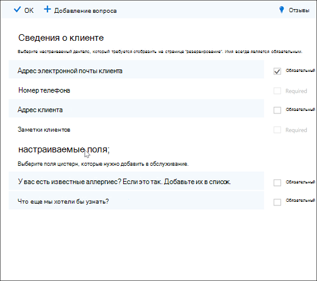
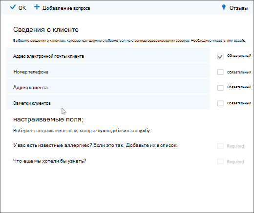
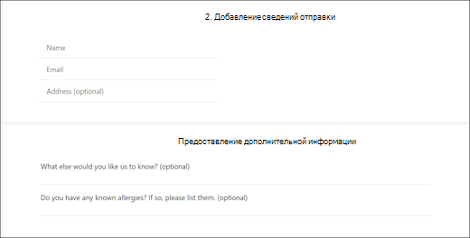

# Добавление обязательных и пользовательских вопросов на страницу резервирования

С помощью Bookings вы можете задавать вопросы клиентам при резервированиях. Он также позволяет выбрать, какие вопросы являются требуемой.

Вы связываете вопросы со службой, поэтому у каждой службы может быть разный набор вопросов. Например, дизайнер может спросить у клиентов, которые резервирует встречу по цветам, если у них есть известные оттенки или оттенки. Это позволяет вам и вашим клиентам сэкономить время, когда они приедут на встречу.

Пользователи увидят настраиваемые вопросы при создании встречи на странице резервирования. Сотрудники будут видеть настраиваемые вопросы при создании нового резервирования из календаря Bookings или при просмотре существующей встречи. Bookings сохраняет все ваши вопросы в эталмовом списке, чтобы вам не нужно было повторно создавать одинаковые вопросы для каждой службы. Вы также можете выбрать, являются ли вопросы обязательными или необязательными.

> [!NOTE]
> Ответы клиента на вопросы можно увидеть при взгляде на его встречу в календаре резервирования.

Дополнительные сведения о персонализации и настройке страницы резервирования см. в [подстройке страницы резервирования.](customize-booking-page.md)

## Добавление настраиваемой информации в службы

1. Войдите в Microsoft 365 и перейдите в **Bookings.**

1. Перейдите **в "Службы"** и либо отредактируете существующую службу, либо **добавьте службу.**

1. Прокрутите вниз до раздела **"Настраиваемые поля"** и выберите **"Изменить".**

   Мы уже добавили некоторые основные вопросы о клиенте: электронная почта клиента, номер телефона, адрес клиента и заметки клиента. При первом этом вопросы о клиенте выделены серым цветом. Это означает, что пользователь увидит этот вопрос. Если вы выберете вопрос, поле выделения вокруг него исчезнет, и вашему клиенту не будет задан этот вопрос.

   В этом примере номер телефона и заметки клиента были отключены, и мы создали два новых настраиваемого вопроса.

   

1. Чтобы сделать вопрос нужным, выберите **необходимый контрольный** ящик. Ваш клиент не сможет завершить резервирование, пока не ответит на необходимые вопросы.

1. Чтобы создать настраиваемый вопрос, выберите **"Добавить вопрос"** в верхней части панели. Запишите свой вопрос и выберите **"Сохранить".**

1. Щелкните вопрос, чтобы включить его. Вокруг него появляется выделенная поле, и вопрос включен.

1. Нажмите **кнопку** "ОК" в верхней части страницы и **сохраните службу.**

Bookings сохранит все ваши настраиваемые вопросы в основном списке, чтобы вы могли легко добавлять вопросы в каждую службу, не внося одинаковые вопросы. Например, если вы откроете другую службу, вопрос, созданный для первой службы, будет отключен в разделе "Настраиваемые поля". Щелкните вопрос, чтобы отобразить выделенный прямоугольник и включить вопрос.

В этом примере можно увидеть, что вопросы, добавленные для первой службы, доступны для этой службы. Все вопросы, которые вы создаете для этой службы, будут доступны для всех служб.

   

Если страница резервирования уже опубликована, больше ничего делать не нужно. Клиенты увидят вопросы при следующей книге. Если страница резервирования еще не опубликована,  перейдите на страницу резервирования в Outlook в Интернете и выберите "Сохранить **и опубликовать".**

> [!WARNING]
> Вы также можете удалить вопросы из этого списка. Однако при удалении вопроса он будет удален из каждой службы. Мы рекомендуем отключить вопрос, выбрав его, чтобы не влиять на другие службы. Вы можете увидеть, что вопрос отключен, если он не находится в выделенной прямоугольнике.

## Взаимодействие с клиентами

Когда ваши клиенты будут бронировать встречу с вами, в разделе "Добавление сведений" покажутся основные вопросы о **клиенте.** Все добавляемые вами настраиваемые вопросы будут в разделе **"Предоставление дополнительных** сведений".

## Опыт работы сотрудников

Когда ваши клиенты бронят встречу с вами, ваши сотрудники будут видеть вопросы и ответы клиента в календаре резервирования. Чтобы увидеть его, перейдите в **календарь Bookings** \>  и откройте встречу.

