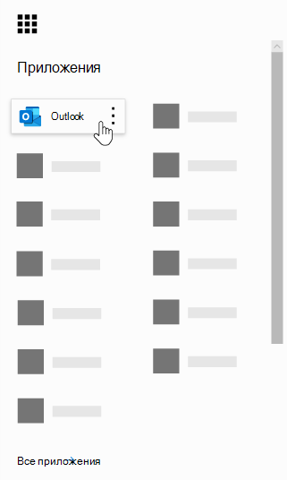
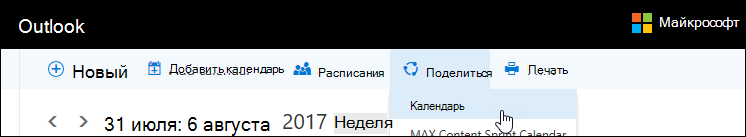
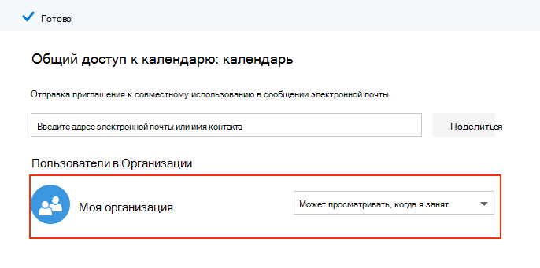
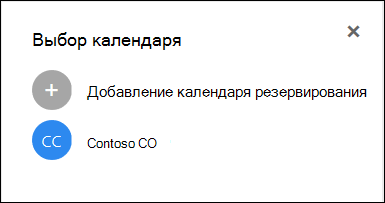

# Часто задамые вопросы о резервированиях МайкрософтMicrosoft Bookings Frequently Asked Questions

## ОбщиеGeneral

### Что такое Microsoft Bookings?What is Microsoft Bookings?

Microsoft Bookings — это приложение Microsoft 365, которое упрощает планирование и управление встречами.Microsoft Bookings is a Microsoft 365 app that makes scheduling and managing appointments easy. Бронирование включает веб-календарь бронирования и интегрируется с Outlook, чтобы оптимизировать календарь сотрудников, что позволяет клиентам гибко бронировать время, которое будет для них наиболее оптимальным.Bookings includes a Web-based booking calendar and integrates with Outlook to optimize your staff’s calendar, giving your customers flexibility to book a time that works best for them. Автоматические сообщения уведомлений уменьшают количество неявок, а организации экономят время с помощью повторяющихся задач планирования.Automated notification emails reduce no-shows, and organizations save time with a reduction in repetitive scheduling tasks. Бронирование позволяет легко проводить виртуальные встречи через Skype или Microsoft Teams и помогает управлять планированием дня через приложение Bookings в Teams.Bookings helps you easily conduct virtual appointments via Skype or Microsoft Teams, and helps you manage day-to-day scheduling via the Bookings app in Teams. Благодаря встроенной возможности настройки, Bookings предназначен для удовлетворения потребностей нескольких частей любой организации.With built-in ability to customize, Bookings is designed to meet the needs of multiple parts of any organization.

### Как использовать microsoft Bookings?How do I use Microsoft Bookings?

Bookings — это онлайн-служба, поэтому вам не нужно ничего скачивать.Bookings is an online service, so you don't need to download anything. Просто перейдите к выбору приложения в веб-службе Microsoft 365.Just go to the app chooser within the Microsoft 365 Web experience. Администраторы также могут использовать приложение-компаньон Bookings для получения последних сведений о клиентах и их встречах.Administrators can also use the Bookings companion app to stay current with the latest information about customers and their appointments.

### Кто имеет доступ к microsoft Bookings?Who has access to Microsoft Bookings?

Заказы доступны и активны по умолчанию для клиентов Microsoft 365 Business Premium, Microsoft 365 Business Standard, A3, A5, E3 и E5 по всему миру.Bookings is available and active by default for Microsoft 365 Business Premium, Microsoft 365 Business Standard, A3, A5, E3, and E5 customers worldwide. Бронирование также доступно в Office 365 под управлением 21Vianet.Bookings is also available in Office 365 operated by 21Vianet.

### Увидят ли мои клиенты личный или бизнес-календарь?Will my customers see my personal or business calendar?

Ваши клиенты увидят только календарь бронирований, который вы публикуете в Интернете для служб, времени и сотрудников, которые вы хотите зарегистрировать.Your customers will only see the Bookings calendar that you publish online for the services, times, and staff that you choose to register.

### Как изменить атрибут, который можно забронировать в статье Управление персоналом?How do I change a bookable attribute under Manage staff?

При добавлении сотрудников они получили бы электронное письмо, чтобы принять или отклонить запрос.When staff members were added, they would have received an email to accept or reject the request. Они могут открыть ту же электронную почту и выбрать "Reject", чтобы сделать их так, чтобы они не были забронировать.They can open the same email and select "Reject" to make them so that they aren't bookable. В настоящее время у нас нет способа, чтобы отладить это из приложения.We currently do not have a way to toggle this from inside the app.

### Как конечные пользователи могут получить доступ к приложению Bookings?How do end users access the Bookings app?

Все, кто имеет лицензию на Microsoft 365 Business Premium, Microsoft 365 Business Standard, A3, A5, E3, E5 или добавляется в качестве сотрудника в роли администратора или просмотра, могут получить доступ к bookings в выборе приложения в веб-службе Microsoft 365.Anyone who is licensed for Microsoft 365 Business Premium, Microsoft 365 Business Standard, A3, A5, E3, E5, or is added as a staff member in either the Administrator or Viewer roles can access Bookings in the app chooser within the Microsoft 365 Web experience. Существует также приложение-компаньон для iOS и Android.There is also a companion app available for iOS and Android.

### Можно ли использовать Bookings на собственном веб-сайте?Can I use Bookings in my own Web site?

Да.Yes. Мы предоставляем вам способ встраить календарь бронирований на сайте с помощью iFrame.We provide a way for you to embed your Bookings calendar in your site via an iFrame. Код встраивки ссылок расположен на вкладке **"Бронирование"** в приложении Bookings.Link embedding code is located in the **Bookings page** tab within the Bookings app.

### Можно ли использовать Bookings, даже если у меня нет веб-страницы для бизнеса?Can I use Bookings even if I don’t have a Web page for my business?

Да.Yes. Мы предоставляем ссылку на страницу бронирования в вкладке **"Бронирование"** в веб-приложении.We provide a link to your booking page within the **Booking page** tab in the Web app. Вы просто должны предоставить эту ссылку своим клиентам или клиентам, и они увидят последние сведения о доступности для вашего бизнеса.You just need to provide that link to your customers or clients, and they will see the latest availability information for your business. Кроме того, вы можете поделиться страницей бронирования в социальных сетях или даже использовать функцию встраив ее для ее пользования в iFrame.Alternatively, you can share the booking page in social media or even use the embed feature to host it in an iFrame. Кроме того, вы можете управлять доступом к странице путем отключения прямой индексации поисковых систем и ограничения доступа только к тем, кто находится в вашей организации.You also have the ability to control who can access the page by disabling direct search engine indexing and restricting access to only those within your organization.

### Может ли наш ИТ-отдел управлять доступом конечных пользователей к Bookings?Can our IT department control whether end users can access Bookings?

Заказы доступны в клиентах Microsoft 365 Business Premium, Microsoft 365 Business Standard, M365 A3/A5 и E3/E5 по умолчанию, но администраторы могут отключить его в центре администрирования Microsoft 365, если они будут выбирать.Bookings is available in Microsoft 365 Business Premium, Microsoft 365 Business Standard, M365 A3/A5 and E3/E5 tenants by default, but administrators can turn it off in the Microsoft 365 admin center if they choose. Для этого [следуйте этим инструкциям.](turn-bookings-on-or-off.md)To do so, [follow these instructions](turn-bookings-on-or-off.md).

Если клиент хочет отключить доступ к bookings для определенных лицензий, имеющих право на получение лицензий в клиенте, он может либо использовать групповую политику для ограничения лицензий, либо реализовать политику почтовых ящиков OWA, которая будет ограничивать возможность создания новых календарей резервирования.If a customer wants to disable access to Bookings for certain eligible licenses in their tenant, they can either use a group policy to restrict licenses or implement an OWA Mailbox policy that will restrict who is able to create new Bookings calendars.

Если вы используете политику почтовых ящиков OWA для отключения доступа к bookings, у всех пользователей будет лицензия Bookings, однако при попытке получить доступ к приложению они будут успешными только в том случае, если они являются частью политики или если они были добавлены в существующий календарь бронирований в качестве персонала.If you use an OWA Mailbox policy to disable access to Bookings, all users will have a Bookings license, however when they attempt to access the app, they will only be successful if they are part of the policy or if they have been added to an existing Bookings calendar as staff. Сведения [здесь](turn-bookings-on-or-off.md) в разделе "Разрешить только выбранным пользователям создавать календари бронирований".Details [here](turn-bookings-on-or-off.md) in the “Allow only selected users to create Bookings calendars” section.

### Настраивается ли бронирование?Is Bookings customizable?

Да, бронирование настраивается и может использоваться для различных сценариев.Yes, Bookings is customizable and can be used for various scenarios. При настройке календаря бронирований можно настроить многие аспекты веб-страницы планирования, бизнес-данные, сведения о персонале, типы служб и политики планирования.When setting up a Bookings calendar, many aspects of the Web-based scheduling page, your business information, staff details, service types, and scheduling policies can be customized.

### Доступны ли все функции исходного веб-приложения Bookings в Microsoft Teams?Is all the functionality of the original Bookings Web app available in Microsoft Teams?

Облегченная версия Bookings теперь доступна в качестве приложения в Teams.A lightweight version of Bookings is now available as an app in Teams. Начальное объявление [здесь](https://www.microsoft.com/microsoft-365/blog/2020/03/06/empowering-care-teams-with-new-tools-in-microsoft-365/).The initial announcement is [here](https://www.microsoft.com/microsoft-365/blog/2020/03/06/empowering-care-teams-with-new-tools-in-microsoft-365/). В веб-приложении можно использовать функции глубокой ссылки, и после установки можно ежедневно использовать Bookings, не покидая Teams.There is deep link functionality to pop out in the Web app, and after setup, day-to-day use of Bookings can be done without ever leaving Teams. Информация передается по платформам.Information flows across platforms.

### Является ли бронирование предложением для малого бизнеса или корпоративным предложением или обоими?Is Bookings a small business offering or an Enterprise offering or both?

Бронирование — идеальное решение для клиентов предприятия и малого бизнеса в различных отраслях.Bookings is an ideal solution for both Enterprise and small business customers, across various industries. К числу случаев использования относятся:Use cases include:

- Финансовые услугиFinancial services
    - консультацииconsultations
    - банковские и страховые услугиbanking and insurance services
    - налоговые декларацииtax filings

- Кадры (HR)Human resources (HR)
    - собеседования с кандидатамиcandidate interviews
    - onboardingonboarding
    - помощь по льготамbenefits assistance
    - обучение и семинарыtraining and seminars

- ЗдравоохранениеHealthcare
    - визиты пациентовpatient visits
    - совместная работа поставщика и поставщикаprovider-to-provider collaboration
    - консультации по страхованиюinsurance consults

- Государственные & сектораGovernment & Public Sector
    - судебные слушания и судебные разбирательстваcourt hearings and trials
    - общедоступные службыpublic services
    - встречи в отделеdepartment appointments

- Образование -- K-12Education -- K-12
    - конференции родительского учителяparent-teacher conferences
    - городская ратуша школыschool town hall
    - визиты студента-консультантаstudent-counselor visits

- Образование -- Высший эдEducation -- Higher Ed
    - часы работыoffice hours
    - репетиторингtutoring
    - студенческие службыstudent services
    - Регистрацию на экзаменеexam sign-up

- Розничная торговляRetail
    - вспомогательные покупкиassisted shopping
    - планирование подрядчикаcontractor scheduling
    - службы проектированияdesign services

- Общие потребности предприятия и малого бизнесаGeneral Enterprise and small business needs
    - собрания клиентов и клиентовcustomer and client meetings
    - техническая поддержкаtech support
    - юридические обзорыlegal reviews
    - средстваfacilities

## Ценообразование и лицензированиеPricing and licensing

### Как получить заказы Microsoft Bookings?How do I get Microsoft Bookings?

Заказы доступны в Microsoft 365 для клиентов с лицензиями Microsoft 365 Business Premium, Microsoft 365 Business Standard, A3, A5, E3 и E5, а также с приложением-компаньоном для iOS и Android.Bookings is available in Microsoft 365 for customers with Microsoft 365 Business Premium, Microsoft 365 Business Standard, A3, A5, E3, and E5 licenses, along with an iOS and Android companion app. Бронирование не доступно в качестве автономных приложений.Bookings isn't available as a standalone app. Outlook Web App Outlook в Интернете необходимо включить резервирование, так как оно хранит данные в Outlook.Outlook Web App or Outlook on the web must be enabled to use Bookings, as it stores data within Outlook.

Лицензия Bookings предоставляет продукту полные функциональные возможности, включая создание и управление календарями.A Bookings license provides full functionality to the product, including creating and managing calendars. Он также позволяет пользователям просматривать и изменять существующие календари, если эти пользователи добавляются в качестве сотрудников в роли администратора или просмотра.It also enables the ability for users to view and edit existing calendars, when those users are added as staff in an Administrator or Viewer role.

### Нужно ли перенести учетную запись электронной почты из текущего поставщика в Microsoft 365?Do I need to migrate my email account from my current provider to Microsoft 365?

Вы можете сохранить текущего поставщика, но Bookings отправит все уведомления по электронной почте, используемой в вашей учетной записи Microsoft 365.You can keep your current provider, but Bookings will send all notifications to the email used in your Microsoft 365 account.

### Могут ли мои сотрудники использовать Bookings без учетной записи Microsoft 365?Can my employees use Bookings without a Microsoft 365 account?

Да.Yes. Вы можете добавить сотрудников с любой электронной почты, и они будут по-прежнему получать подтверждение электронной почты и приглашение календаря, когда кто-то книги встречи с ними.You can add your staff with any email, and they will still get the email confirmation and the calendar invite when someone books an appointment with them.

### Могу ли я создать несколько календарей резервирования в одной учетной записи Microsoft 365 и переключиться между ними?Can I create more than one Bookings calendar under the same Microsoft 365 account and switch between them?

Да.Yes. С одной учетной записью можно создать и управлять более чем одним календарем резервирования.You can create and manage more than one Bookings calendar with one account. Вы можете переключаться между ними с помощью caret рядом с бизнес-именем в веб-приложении Bookings.You can switch between them using the caret next to the business name in the Bookings Web app.

### Что делать, если моя организация имеет смешанные лицензии с F1/F3, E1 и E3/E5?What if my organization has mixed licenses with F1/F3, E1, and E3/E5?

Мы понимаем, что во многих организациях имеется смесь лицензирования Microsoft 365.We recognize that many organizations have a mixture of Microsoft 365 licensing. Например, клиент может иметь лицензии M365 E3 для сотрудников в своей штаб-квартире, но лицензии M365 E1 (или F1 или F3) для сотрудников магазина.For example, a customer may have M365 E3 licenses for employees in their headquarters, but M365 E1 (or F1 or F3) licenses for their store employees.

В этом примере сотрудники штаб-квартиры с лицензией M365 E3 имеют полный доступ к резервированиям, что означает, что они могут создавать новые календари, изменять параметры, добавлять сотрудников, публиковать страницу бронирования, создавать и управлять встречами в календаре и вытягивать отчеты.In this example, the headquarters employees with an M365 E3 license have full access to Bookings, which means they can create new calendars, edit settings, add staff, publish a booking page, create and manage appointments within the calendar, and pull reports.

Сотрудники магазина с лицензиями E1/F1/F3 или без лицензий по-прежнему могут быть добавлены в качестве персонала в календари в роли гостя, а затем забронироваться для встреч, и они будут получать сообщения подтверждения при заказе.Those store employees with E1/F1/F3 licenses, or with no licenses, can still be added as staff to calendars in a Guest role and then booked for appointments, and they will receive confirmation emails when they are booked. Они по-прежнему могут быть забронены в течение доступных и запланированных часов, как указано на вкладке сотрудников. Доступность календаря Bookings ограничивает время бронирования в установленные часы и часы обслуживания.They can still be booked during their available/scheduled hours as listed in the staff tab. The Bookings calendar availability constrains bookable times by their set hours and service hours.

Сотрудники магазина также будут отображаться как недоступные в Bookings, если встреча уже назначена в это время через веб-приложение Bookings.The store employees will also display as unavailable in Bookings if an appointment has already been scheduled at that time through the Bookings Web app. Встречи, забронировав через Bookings, будут отражаться как занятые в календаре сотрудника в Bookings.Appointments booked via Bookings will reflect as busy on a staff member's calendar within Bookings. Персонал с включенной лицензией без бронирования по-прежнему может повлиять на их доступность личного календаря в Bookings при условии, что они находятся в одном клиенте.Staff with a non-Bookings enabled license can still have their personal calendar impact their availability in Bookings, provided they are within the same tenant.

Люди в роли Гостей могут просматривать любую информацию, предоставленную клиентом в рамках начального создания встречи.People in the Guests role can view any of the information the customer has provided within the initial appointment creation. Например, если представителю магазина, который забронировали для встречи, необходимо вызвать клиента до встречи, у них будет доступ к сведениям, которые клиент предоставляет в процессе планирования.For example, if the store representative who is booked for the appointment is required to call the customer prior to the appointment, they will have access to the information the customer provides during the scheduling process. Сотрудник, который забронирует, будет иметь доступ ко всем сведениям, которые появляются в электронной почте подтверждения, и событию календаря .ics (например, номеру телефона клиента, если он был введен).The staff member who is booked will have access to all information that appears in the confirmation email, and the .ics calendar event (such as the customer phone number if it was entered).

Пользователи роли "Гость" не смогут получить доступ к веб-приложению Bookings для изменения параметров или просмотра и управления встречами (добавить, отменить и перенести).People in the Guest role will not have the ability to access the Bookings Web app to change settings or to view and manage appointments (add, cancel, and reschedule). Однако они могут записаться на прием от имени клиентов, используя страницу самообслуживки, так же, как и клиент.However, they can make appointments on behalf of customers using the Self-service page, in the same way that a customer would make an appointment.

Мы рекомендуем лицензирование бизнес-менеджера или администратора каждого магазина с лицензией, которая имеет право на бронирование, для настройка страниц и встреч и управления ими.We recommend licensing a business manager or administrator of each store with a Bookings-eligible license to set up and manage pages and appointments. Затем остальные сотрудники будут работать с сотрудником, лицензированным с помощью Bookings, чтобы перенести или отменить бронирование.The rest of the staff would then work with the employee licensed with Bookings to reschedule or cancel a booking.

## Функции продуктаProduct features

### Где в моем клиенте Microsoft 365 показываются календари бронирований?\*\*Where do Bookings calendars show up in my Microsoft 365 tenant?\*\*

Каждый новый календарь Резервирования создает соответствующий почтовый ящик в Exchange, а также соответствующую запись в Azure Active Directory (AAD), где запись указана как пользователь без лицензии.Each new Bookings calendar creates a corresponding mailbox in Exchange, as well as a related entry in Azure Active Directory (AAD), where the entry is listed as an unlicensed user.

### Можно ли удалить ранее созданный календарь резервирования?Can I delete a previously created Bookings calendar?

Чтобы удалить календарь Bookings, необходимо удалить связанный почтовый ящик в Exchange.To delete a Bookings calendar, you must delete the associated mailbox in Exchange.

### Если я создаю календарь и кто-то другой имеет доступ к Бронированиям, смогут ли они увидеть мой календарь?If I create a calendar and someone else has access to Bookings, would they be able to see my calendar?

Единственными людьми, которые имеют доступ к календарям bookings, которые вы создаете (через веб-приложение), является тот, кто был добавлен в качестве персонала в роли администратора или просмотра.The only people who have access to Bookings calendars that you create (through the Web app) is anyone who has been added as staff, in either an Administrator or Viewer role. Администраторы клиентов смогут увидеть список всех почтовых ящиков Bookings в Exchange и AAD.Tenant admins will be able to see a list of all Bookings mailboxes in Exchange and AAD.

### Интегрированы ли собрания видеоконференциалов в приложение Bookings?Are video conferencing meetings integrated into the Bookings app?

Онлайн-собрания доступны в bookings при использовании клиентов Skype или Microsoft Teams.Online meetings are available within Bookings when using the Skype or Microsoft Teams clients. Онлайн-собрания можно включить на уровне службы, а клиент собрания, который вы выберете (Skype или Teams), будет по умолчанию набором для заказаного сотрудника.Online meetings can be enabled at the service-level, and the meeting client you choose (Skype or Teams) will be the one set by default for a booked staff member. Чтобы присоединиться к собраниям в Интернете, каждая новая встреча будет иметь уникальную ссылку на собрание, прикрепленную к встрече, и кроме того, в событие и в сообщениях подтверждения включаются легкие варианты соединения.To join the online meetings, each new appointment will have a unique meeting link attached to the appointment, and in addition, easy join options are included in the event and in confirmation emails.

### Как работает политика планирования?How does scheduling policy work?

Параметр Под **названием Максимальное** время заранее определяет максимальное заранее (замеряется в днях), которое можно сделать для бронирования.A setting called **Maximum lead time** determines the farthest in advance (measured in days) that a booking can be made. Должно быть не менее 24 часов между минимальным временем работы **(минимальное** время, в часах, для бронирования и отмены) и максимальным временем.There must be at least 24 hours between **Minimum lead time** (the minimum lead time, in hours, for bookings and cancellations) and Maximum lead time. Максимальное время окончания может быть установлено до одного дня, если минимальное время работы заданной 0 часов, что в этом случае означает, что клиент может отменить бронирование до момента его начала, а клиенты могут планировать бронирование только в том случае, если встреча назначена на следующий день.Maximum lead time can be set to one day if Minimum lead time is set to 0 hours, which in this case means a customer can cancel a booking up until the time that it starts, and customers can only schedule bookings if the appointment is within the next day.

:::image type="content" source="media/bookings-faq-scheduling.png" alt-text="Планирование в резервированиях":::

### Как бронирование работает в часовых поясах?How does Bookings work across time zones?

Все время находятся в бизнес-часовом поясе (локальном часовом поясе) по умолчанию.All times are in the business time zone (your local time zone) by default. В этом часовом поясе будут отображаться все параметры, настроенные для календаря бронирований, например рабочие часы.Any setting that you configure for a Bookings calendar, such as working hours, will appear in this time zone. Страница самообслуживки имеет возможность отображать все время встречи в часовом поясе пользователя, которое можно отключить при желании.The Self-service page has the ability to display all the appointment times in the end-user's time zone, which can be turned off if desired. Если **на** вкладке "Бронирование" всегда сохраняются интервалы времени в бизнес-часовом поясе, то люди, посетив страницу, увидят интервалы времени в своих локальных часовых поясах.If **Always show time slots in business time zone** remains unchecked on the Bookings page tab, then people visiting the page will see time slots in their own local time zones.

:::image type="content" source="media/bookings-faq-region.png" alt-text="Параметры региона резервирования и часовой пояс":::

Для сотрудников в Bookings не предусмотрены временные зоны.There is no provision to set time zone for staff in Bookings. Часовой пояс сотрудников, а значит, и часы работы, будут в часовом поясе бизнеса.Staff time zone, and thus business hours, will be in the business time zone.

### Можно ли отправлять уведомления электронной почты в качестве доменного имени клиента?Can email notifications be sent as the tenant domain name?

Адреса электронной почты контролируются и управляются на уровне параметров Microsoft 365 и зависят от параметров конфигурации домена.The email addresses are controlled and managed at the Microsoft 365 settings level and depend on the domain configuration settings there. Дополнительные сведения можно найти [здесь](/powershell/module/exchange/get-accepteddomain).More information can be found [here](/powershell/module/exchange/get-accepteddomain).

### Зависит ли возможность отправки SMS-сообщений от другой службы или определенной конфигурации?Is the ability to send SMS messages dependent on a different service or specific configuration?

SMS-сообщения в настоящее время доступны в Северной Америке, а для доставки SMS будет использоваться учетная запись Skype или Twilio.SMS messages are currently available in North America, and a Skype or Twilio account will be used for SMS delivery.

### Как можно показывать встречи с бронированием в календаре человека?How can Bookings appointments show up on a person’s calendar?

Подтверждение бронирования отправляется в почтовые ящики поставщика услуг и клиента.The confirmation of the booking is sent to both the service provider’s and customer’s inboxes. Письмо-подтверждение содержит вложение файла \*.ics, которое затем можно добавить в календарь пользователя со всеми соответствующими сведениями о встрече.The confirmation email contains an \*.ics file attachment, which can then be added to the user’s calendar with all relevant appointment details.

### Что вызывает поставщик услуг, сотрудников и клиентов электронной почты?What triggers service provider or staff and customer emails?

Электронная почта запускается на основе параметров в вкладке Services в веб-приложении Bookings.Emails are triggered based on settings in the Services tab in the Bookings Web app. Бронирование, выполненное клиентом на странице Самообслуживка или на вкладке Календарь в веб-приложении Bookings, вызовет подтверждение и/или сообщение напоминания.A booking made by the customer on the Self-service page, or on the Calendar tab in the Bookings Web app, will trigger a confirmation and/or a reminder email. То же самое произойдет, когда кто-то внося изменения в бронирование с помощью кнопки **Управление** бронированием в электронной почте подтверждения или в веб-приложении.The same thing will happen when someone makes a change to the booking via the **Manage booking** button in the confirmation email or within the Web app. Напоминания отправляются в указанный период времени до встречи, как описано на вкладке Services в веб-приложении Bookings.Reminder emails are sent at a specified time period prior to an appointment, as detailed in the Services tab in the Bookings Web app.

### Могу ли я заказать встречи в классе с 1:00 вместо 1:1?Can I book classroom-style appointments that are 1:many instead of 1:1?

Да, у нас есть функциональность групповых бронирований, которая позволяет нескольким людям одновременно заказать одно и то же назначение (например, для фитнес-класса).Yes, we have a group bookings functionality that allows multiple people to book the same appointment at the same time (such as for a fitness class). Эта функциональность подробно описана [здесь](https://techcommunity.microsoft.com/t5/microsoft-bookings-blog/microsoft-bookings-now-supports-online-meetings-and-group/ba-p/1214120).This functionality is described in detail [here](https://techcommunity.microsoft.com/t5/microsoft-bookings-blog/microsoft-bookings-now-supports-online-meetings-and-group/ba-p/1214120).

### Могут ли календари оставаться неопубликованными (не общедоступными), но доступными для назначенных пользователей?Can calendars remain unpublished (not public-facing) but still accessible to designated users?

Да.Yes. На вкладке Страницы Бронирования в веб-приложении есть чековая шкатулка: необходимо заказать учетную запись **Microsoft 365 или Office 365** от моей организации.There is a check box on the Booking page tab in the Web app: **Require a Microsoft 365 or Office 365 account from my organization to book**. Выбор этого контрольного окна ограничивает доступ к странице самообслуживки только тем, которые находятся в вашем клиенте.Selecting this check box restricts Self-service page access to only those that are within your tenant. К календарю Bookings, который находится в веб-приложении для создания и управления, можно получить доступ только к тем лицам, которые добавлены в качестве персонала на страницу с ролями администратора или просмотра.The Bookings calendar that sits within the Web app for creation and management can only be accessed by those individuals added as staff to the page with Administrator or Viewer roles.

:::image type="content" source="media/bookings-faq-access-ctrl.png" alt-text="Управление доступом к страницам в Bookings":::

### Как часто обновляется главная страница?How frequently does the Home page update?

Последние данные, связанные с домашней страницей, извлекаются при загрузке веб-приложения.The latest data linked to your Home page is retrieved  whenever the Web app is loaded. Дополнительные сведения о типе информации, отслеживаемой Bookings, см. в этой [статье поддержки.](metrics-and-activity-tracking.md)For further details on the type of information tracked by Bookings, see this [support article](metrics-and-activity-tracking.md).

### Можно ли отключить уведомления электронной почты для отключения?Can I turn off the email notifications for Time Off?

Запись времени отключения в веб-приложении Bookings всегда вызывает уведомление сотрудников.Recording Time Off within the Bookings Web app will always trigger a notification email to staff members. Если какие-либо сотрудники не уверены в уведомлении, рекомендуем добавить дополнительные подробности в заметки или заголовок уведомления о времени отключения, чтобы лучше информировать сотрудников о том, что происходит на стороне администратора.If any staff members are confused about the notification, we recommend you add more detail in the notes or title of the Time Off notification, to better inform staff about what is occurring on the admin side.

### Можно ли клонировать или дублировать календари резервирования и можно ли их приумножить для простого масштабирования?Can Bookings calendars be cloned or duplicated, and can they be templatized for easy scaling?

Этот процесс должен был бы использовать API Graph для получения сведений о почтовых ящиках, а затем использовать эти сведения для создания нового почтового ящика.The process would be to use the Graph API to get mailbox details, and then use those details to create a new mailbox. Документация по API [здесь.](/graph/api/resources/booking-api-overview?view=graph-rest-beta)API documentation is [here](/graph/api/resources/booking-api-overview?view=graph-rest-beta).

### Какие отчеты доступны в Bookings?What reporting is available in Bookings?

Все сотрудники Bookings, на которые назначена роль Администратора, могут скачать разделенные вкладками значения (. TSV) файл со всеми заказами, сделанными за последние 120 дней.All Bookings staff assigned to the Administrator role can download a tab-separated values (.TSV) file with all bookings made in the past 120 days. Отчеты о резервированиях можно скачать в . TSV-форма со вкладки Главная на странице Bookings.Bookings reports can be downloaded in .TSV form from the Home tab of the Bookings page. API Bookings также может использоваться для сбора этих данных для более настраиваемых и определенных целей.The Bookings API can also be used to collect this data for more customized and specific purposes.

### Можно ли одновременно делиться только одной службой на странице самообслуживки?Is it possible to share only one service on the Self-service page at a time?

Да, можно создать отдельные календари резервирования для каждой службы или перейти на вкладку Services, изменить службу, а в верхней части страницы вы увидите возможность поделиться URL-адресом только для этой конкретной службы.Yes, you can either create separate Bookings calendars for each service, or you can go to the Services tab, edit a service, and at the top of the page you will see an option to share a URL only for that specific service.

### Какие варианты доступны для встраения формы согласия или раскрытия информации для тех, кто бронирует встречу?What options are available for embedding a consent form or disclosure for those booking an appointment?

Мы рекомендуем включить в поле согласие на использование данных клиента на странице Booking и настроить формулировку для правильной передачи требований к раскрытию или согласию организации. We recommend enabling the **Customer data usage consent** check box in the Booking page and customizing the wording to properly convey your organization's disclosure or consent requirements. Другой вариант заключается в добавлении настраиваемого поля к службе, которое включает ссылку на форму согласия, и требовать от клиентов подтверждения того, что они завершили форму, прежде чем они смогут приступить к назначению.Another option is to add a custom field to the service that includes a link to the consent form, and require customers to confirm that they have completed the form before they can proceed with making an appointment. Вы также можете добавить URL-адрес формы согласия в качестве дополнительных заметок в сообщениях подтверждения и напоминаний, но это не помешает пользователям записаться на прием.You can also add the consent form URL as additional notes in confirmation and reminder emails, but this will not prevent users from booking an appointment.

### Какие изменения могут быть внесены в возможности выбора персонала на странице самообслуживки?What changes can be made to the staff selection capability on the Self-service booking page?

Возможность выбора клиентами определенных сотрудников при бронировании может быть  полностью удалена путем отобрания разрешить клиентам выбирать конкретного человека для параметра бронирования на странице Booking или разделе Services.The ability for customers to select specific staff members when booking can be removed completely by de-selecting the **Allow customers to choose a specific person for the booking** option from the Booking page or the Services section. Резервирование автоматически назначает доступному сотруднику случайным образом бронирование в зависимости от доступности персонала.Bookings will automatically assign an available staff member at random to the booking, based on staff availability.

### Может ли Bookings поддерживать множество одновременно запросов на бронирование и посещений страниц самообслуживки?Can Bookings support many concurrent booking requests and Self-service page visits?

Бронирование может поддерживать одновременно большое количество посетителей и бронирований.Booking can support a large quantity of visitors and bookings at one time. Если на странице имеется очень большой объем трафика, пользователи будут получать ошибку "занят сервером".If the page experiences a very large volume of traffic, users will receive a “server busy” error. Доступность встречи обновляется при загрузке страницы, а также при бронировании.Appointment availability is updated when the page is loaded, as well as when a booking is made. Если несколько человек одновременно пытаются заказать одно и то же назначение, bookings позволит только одному человеку заказать это время и отправить уведомление другим потенциальным клиентам и побудить их найти другое время.If multiple people are trying to book the same appointment at one time, Bookings will only let one person book that time and give a notification message to the other potential customers, and prompt them to find a different time.

## КонфиденциальностьPrivacy

### Где хранятся данные Bookings?Where is Bookings data stored?

Bookings — это приложение Microsoft 365, то есть все данные хранятся на платформе Microsoft 365 и в Exchange.Bookings is a Microsoft 365 app, meaning all data is stored within the Microsoft 365 platform and in Exchange. Заказы следуют всем политикам хранения данных, за которыми следит Корпорация Майкрософт, которые являются той же политикой, что и все приложения Office.Bookings follows all data storage policies that are set by Microsoft, which are the same policies that all Office apps follow. При бронировании используются общие почтовые ящики в Exchange для хранения сведений о клиентах, сотрудниках, службах и встречах.Bookings uses shared mailboxes in Exchange to store customer, staff, service, and appointment details. Политики соответствия требованиям для общих почтовых ящиков в Exchange также применяются для почтовых ящиков Bookings.Compliance policies for shared mailboxes in Exchange also apply for Bookings mailboxes. Все данные клиента (включая сведения, предоставляемые клиентами при бронировании) запечатлены в Bookings и хранятся в приложении, поэтому хранятся в Exchange.All customer data (including information provided by customers when booking) is captured in Bookings and is stored within the app, thus it is stored within Exchange. Microsoft Bookings использует те же политики, что и Microsoft 365, которые можно [найти здесь.](https://www.microsoft.com/online/legal/v2/?docid=22&langid=en-us)Microsoft Bookings uses the same policies used by Microsoft 365, which you can find [here.](https://www.microsoft.com/online/legal/v2/?docid=22&langid=en-us)

### Существует ли способ централизованного управления календарями бронирований для всех пользователей?Is there a way to centrally manage Bookings calendars for all users?

Каждый календарь резервирования поддерживается независимо.Each Bookings calendar is maintained independently. Нет консолидированного представления, кроме выпадаемого поиска после нажатия на уходу на домашней странице.There is no consolidated view, other than the search drop-down after clicking the caret on the home page.

### Как проверка подлинности пользователей?How are users authenticated?

Доступ к веб-приложению Bookings включает проверку подлинности с помощью регулярной проверки подлинности Azure Active Directory (AAD).Access to the Bookings Web app involves authentication through the regular Azure Active Directory (AAD) authentication. Страница самообслуживки может быть доступна всем, кто имеет ссылку на веб-страницу.The Self-service booking page can be made available to everyone with the Web page link. Однако при выборе учетной записи **Require a Microsoft 365 или Office 365** из моей организации для настройки книги страница ограничена для использования только в клиенте Microsoft 365 (с помощью проверки подлинности AAD).However, when the **Require a Microsoft 365 or Office 365 account from my organization** to book setting is selected, the page is restricted for use only within the Microsoft 365 tenant (using AAD authentication).

:::image type="content" source="media/bookings-faq-access-ctrl.png" alt-text="Управление доступом к страницам в Bookings":::

### По какой-либо причине данные клиентов покидают производственную систему?Does customer data leave the production system for any reason?

Да, так как Bookings является частью Exchange, мы разрешаем API Graph и API Web Services (EWS) для клиентов загружать собственные данные, к которым они имеют доступ.Yes, since Bookings is a part of Exchange, we allow Graph APIs and Exchange Web Services (EWS) APIs for the customers to download their own data to which they have access.

### Существует ли возможность настройки адресов электронной почты для ответов клиентов?Is there the ability to customize email addresses for customer replies?

Существует возможность определить, на какой адрес электронной почты клиент отправляет свои ответы.There is the ability to define which email address customer send their replies to. Этот параметр находится на **вкладке Бизнес-информации.** Само имя почтового ящика Bookings также можно изменить в Exchange с помощью обычных процессов переименования почтовых ящиков Exchange.This setting is on the **Business information** tab. The Bookings mailbox name itself can also be changed within Exchange, through usual Exchange mailbox renaming processes.

### Мы хотим, чтобы клиент принял наши условия во время процесса бронирования.We would like for the customer to accept our terms and conditions during the booking process. Возможно ли это?Is that possible?

Эта функция уже существует для соответствия GDPR.This feature already exists for GDPR compliance. На странице Booking имеется поле для пользовательского согласия, прямо в разделе сведения о публикации.The Booking page has a field for custom consent, right under the publishing details section. Просто проверьте это поле и напишите собственное пользовательское сообщение о согласии, и оно будет показываться в качестве необходимого поля на странице Самообслуживка.Just check that box and write your own custom consent message and it will show up as a required field on the Self-service page. Дата и время, в которые будет записано согласие клиента на предоставление.The date and time that the customer grants consent will be recorded.

В этом разделе не поддерживается насыщенный текст, но думаю, ссылки можно добавить в разделе бизнес-информации и будет показываться чуть ниже окна согласия.This section does not support rich text, but think links can be added under the business information section and would show up just below the consent check box.

### Как определить почтовые ящики, связанные с бронированием в Exchange?How can Bookings-associated mailboxes in Exchange be identified?

Следующая команда может использоваться для получения сведений о всех почтовых ящиках и пользователях Bookings, которые имеют к ним доступ.The following command can be used to retrieve information of all Bookings mailboxes and users who have access to them.

`Get-Mailbox -RecipientTypeDetails SchedulingMailbox -ResultSize:Unlimited | Get-MailboxPermission |Select-Object Identity,User,AccessRights | Where-Object {($_.user -like '*@*')}`

## Технические вопросыTechnical Questions

### Если пользователь запланировать встречу для службы, состоящей из собрания в Интернете, как получить ссылку Microsoft Teams на собрание, если поле необязательных адресов электронной почты будет пустым?If a user schedules an appointment for a service consisting of an online meeting, how do they receive the Microsoft Teams link to the meeting if they leave the optional email address field empty?

Если в системе нет сведений о электронной почте клиента, отправка почты подтверждения клиенту невозмедена, и поэтому они не получат ссылку Teams.If the system does not have the customer's email information, there is no way for the confirmation mail to be delivered to the customer, and thus they will not receive a Teams link. Решение заключается в том, чтобы задать адрес электронной почты в качестве необходимого поля, которое можно сделать на вкладке Services of Bookings.The solution is to set the email address as a required field, which you can do on the Services tab of Bookings. Обратите внимание, что при создании новой службы в Bookings поле электронной почты клиента по умолчанию задалось как необходимое поле.Note that whenever you create a new service in Bookings, the customer email field is set as a required field by default.

### Как сотрудникам назначены назначения при выборе "Любое" или когда клиенты не имеют возможности выбрать сотрудника для назначения?How are staff assigned to appointments when “Anyone” is selected, or when customers do not have the ability to choose a staff member for the appointment?

В этих сценариях сотрудники назначены случайным образом из всех сотрудников, доступных во время записи на прием.Staff are assigned randomly in these scenarios, out of all staff members available at the time of the appointment being booked. В настоящее время нет возможности обеспечить равное распределение случайных назначений между всеми сотрудниками или ограничения количества назначенных назначений каждому сотруднику.Currently there is no way to ensure equal distribution of randomly assigned appointments across all members of the staff, or to cap the number of assigned appointments to each staff member. Если после ряда случайных назначений необходимо выполнять балансировку нагрузки, ее можно выполнять вручную на вкладке Calendar на странице Bookings.If there is load-balancing that needs to be done across your staff after a number of random assignments, it can be done manually in the Calendar tab within the Bookings page.

### Как пользователи могут отказаться от получения SMS-сообщений, если они уже выбрали ранее?How can users opt out of receiving SMS messages if they have already opted in previously?

При бронировании встречи с включенными SMS-текстовыми сообщениями клиентам будет предложено проверить выбор в поле при каждом бронировании.When booking an appointment with SMS text messages enabled, customers will be prompted to check the opt in box each time they book. Клиенты также могут напрямую отвечать на SMS-сообщение (поставщика SMS), указывающее, что они хотели бы, чтобы сообщения прекращались, а затем на этот номер телефона не будут отправляться дополнительные тексты.Customers can also reply directly to the SMS message (the SMS provider) indicating that they would like the messages to cease, and then no further texts will be sent to that phone number. Если клиент откажется от получения текстовых сообщений от поставщика, а не от самого Bookings, он больше не будет получать SMS-сообщения в будущем, даже если он войт со страницы Bookings.If the customer opts out of receiving text messages from the provider, not from Bookings itself, they will no longer receive SMS messages in the future, even when opting in from the Bookings page.

## Устранение неполадокTroubleshooting

### Календарь этого сотрудника нельзя синхронизироватьThis staff member's calendar can't be synced

Если вы получаете ошибку "Календарь этого сотрудника нельзя синхронизировать", в этом разделе содержится несколько процедур устранения неполадок, которые помогут устранить ошибку.If you receive the error, "This staff member's calendar can't be synced", this section contains several troubleshooting procedures to help you resolve the error.

> [!NOTE]
> Бронирование включено по умолчанию для клиентов с подписками Microsoft 365 Business Standard, Microsoft 365 A3 или Microsoft 365 A5.Bookings is turned on by default for customers who have the Microsoft 365 Business Standard, Microsoft 365 A3, or Microsoft 365 A5 subscriptions. Бронирование также доступно для клиентов с Office 365 Enterprise E3 и Office 365 Enterprise E5, но по умолчанию оно отключено.Bookings is also available to customers who have Office 365 Enterprise E3 and Office 365 Enterprise E5, but it is turned off by default. Чтобы начать работу, [см. в руб. Получить доступ к microsoft Bookings.](get-access.md)To get started, see [Get access to Microsoft Bookings](get-access.md). Чтобы включить или отключить бронирование, см. в рублении Включить или отключить бронирование [для вашей организации.](turn-bookings-on-or-off.md)To turn Bookings on or off, see [Turn Bookings on or off for your organization](turn-bookings-on-or-off.md).

Если вы ищете сведения о синхронизации календаря сотрудников, см. в рубке [Добавить сотрудников в Bookings.](add-staff.md)If you are looking for information on syncing your staff's calendar, see [Add staff to Bookings](add-staff.md). Убедитесь, что на странице **Сведения о персонале** проверяются события в календаре, **влияющие на** доступность.Make sure on the **Staff details** page, **Events on calendar affect availability** is checked.

### Сотруднику необходимо изменить разрешения календаряThe staff member needs to change their calendar permissions

Для правильной синхронизации бронирований с календарями сотрудников каждый сотрудник должен делиться своим календарем.In order for Bookings to properly sync with your staff members' calendars, each staff member must share their calendar. Каждый сотрудник должен следовать этим инструкциям, чтобы поделиться собственным календарем.Each staff member must follow these instructions to share their own calendar.

1. Вопишите в Microsoft 365, а затем выберите **Outlook** из запуска приложения.Sign in to Microsoft 365, and then select **Outlook** from the app launcher.

   > [!div class="mx-imgBorder"]
   > 

1. В верхней части страницы выберите **Share** \> **Calendar**.At the top of the page, select **Share** \> **Calendar**.

   

1. В разделе **"Люди в организации"** выберите выпадаемую шкатулку рядом с "Моя организация", а затем выберите "Можно просмотреть", когда я **занят.**In the **People inside your organization** section, select the drop-down box next to **My Organization**, and then select **Can view when I'm busy**.

   > [!NOTE]
   > Этот параметр делится сведениями о вашей бесплатной или загруженной информации с Bookings и другими пользователями в вашей организации.This setting shares your free/busy information with Bookings and with other users in your organization. Он не содержит других сведений, например о том, какой тип назначенной встречи, с кем назначена встреча, или расположение.It does not include any other information, such as what type of appointment you have scheduled, who you have scheduled the appointment with, or the location.

   > [!div class="mx-imgBorder"]
   > 

1. Нажмите кнопку **Готово**.Select **Done**.

### Мы не можем найти сотрудника в нашей организацииWe can't find a staff member in our organization

Если сотрудник покинул вашу компанию и вы удалили его из организации Microsoft 365 или Office 365, вам все равно необходимо удалить этого пользователя из резервирования, чтобы он не ошеломил в календаре и не бронировать встречи с ними.If an employee has left your company and you removed them from your Microsoft 365 or Office 365 organization, you still need to remove that user from Bookings so they won't show up in the calendar and to prevent customers from booking appointments with them.

1. Войдите в Microsoft 365 и перейдите в **службу бронирования.** \> Sign in to Microsoft 365, and then go to **Bookings** \> **Staff**.

1. Наведите курсор мыши на имя сотрудника.Hover your mouse cursor over the staff member's name. **Редактировать** **и** удалять значки отображаются справа от **столбца Телефон.****Edit** and **delete** icons appear to the right of the **Phone** column.

1. Выберите **значок Delete.**Select the **Delete** icon.

1. В поле подтверждения выберите **ОК**.In the confirmation box, select **OK**.

> [!NOTE]
> Если у вас несколько календарей резервирования, необходимо удалить пользователя из всех них.If you have more than one booking calendar, you must remove the user from all of them.

Чтобы проверить, есть ли у вас несколько календарей, в левом меню выберите стрелку падения рядом с именем вашей компании, а затем выберите **Открыть**.To check if you have more than one calendar, in the left menu, select the drop-down arrow next to your company name, and then select **Open**. Если у вас только один календарь, вы увидите только возможность добавить календарь бронирования.If you only have one calendar, then you will see only the option to add a booking calendar. В этом примере показан второй календарь с именем "Contoso CO".This example shows that there is a second calendar named "Contoso CO".

### Существует ошибка синхронизации, мы не можем определитьThere's a syncing error we can't identify

Это переходная ошибка, которая обычно возникает из-за нестабильного подключения к Интернету.This is a transient error and typically occurs because of an unstable internet connection. Эти проблемы обычно решаются самостоятельно через несколько минут.These problems usually resolve themselves after a few minutes.

Если вы все еще видите эту ошибку после продолжительного периода времени или видите ее часто, обратитесь в службу поддержки.If you still see this error after an extended period of time or you are seeing it often, please contact support.

## Дополнительные ресурсыAdditional resources

  - [Microsoft Bookings расширяет доступность в блоге предприятийMicrosoft Bookings expands availability in the enterprises blog](https://techcommunity.microsoft.com/t5/microsoft-bookings-blog/microsoft-bookings-expands-availability-in-enterprises/ba-p/1214065)

  - [Видео о том, как работает microsoft BookingsHow Microsoft Bookings Works video](https://support.office.com/article/microsoft-bookings-69c45b78-6de4-4f28-9449-cdcc18b7ae45)

  - [Начало использования microsoft BookingsStart using Microsoft Bookings](get-access.md)

  - [Включение и отключение Microsoft BookingsTurn Microsoft Bookings on or off](turn-bookings-on-or-off.md)

  - [Добавление пользователей по отдельности или оптомAdd users individually or in bulk](../admin/add-users/add-users.md?view=o365-worldwide.)

  - [Добавление сотрудников в BookingsAdd staff to Bookings](add-staff.md)

  - [Компоненты API для автоматизации после определения шаблонаAPI components to automate after template has been defined](/graph/api/bookingbusiness-post-bookingbusinesses)

  - [URL-адрес календаря резервирования для отображенияURL to Bookings Calendar for Display](https://outlook.office.com/bookings/calendar)

  - [Бронирование политик соответствия требованиямBookings compliance policies](/compliance/regulatory/gdpr-dsr-Office365?view=o365-worldwide#bookings)

  - [Настройка и публикация страницы резервированияCustomize and publish your booking page](customize-booking-page.md)

  - [Конфигурация почтового ящика клиентаTenant Mailbox configuration](/powershell/module/exchange/get-accepteddomain)

  - [Групповое бронированиеGroup Bookings](https://techcommunity.microsoft.com/t5/microsoft-bookings-blog/microsoft-bookings-now-supports-online-meetings-and-group/ba-p/1214120)

  - [Бронирование метрик и отслеживание действийBookings metrics and activity tracking](metrics-and-activity-tracking.md)

  - [M365 Public RoadmapM365 Public Roadmap](https://www.microsoft.com/microsoft-365/roadmap?filters=&searchterms=bookings)

  - Отправка отзывов [через UserVoice](https://outlook.uservoice.com/forums/314907-microsoft-bookings/suggestions/39505261-365-admins-should-have-full-access-to-all-bookings)Submit feedback via [UserVoice](https://outlook.uservoice.com/forums/314907-microsoft-bookings/suggestions/39505261-365-admins-should-have-full-access-to-all-bookings)
