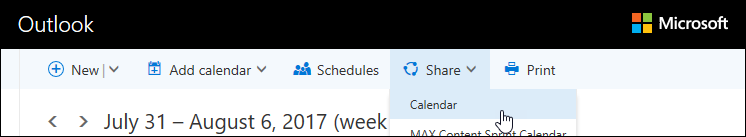
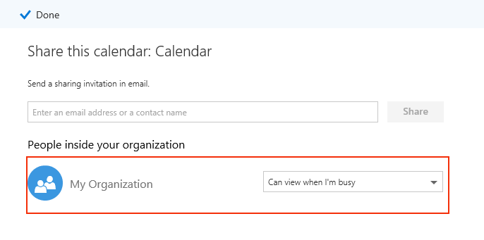

# Вопросы и ответы по Microsoft Bookings

## Общие

### Что такое Microsoft Bookings?

Microsoft Bookings — это приложение Microsoft 365, упрощающие планирование встреч и управление встречами. Bookings включает в себя веб-календарь резервирования и интегрируется с Outlook для оптимизации календаря сотрудников, предоставляя клиентам возможность резервировать время, оптимальное для них. Автоматические уведомления по электронной почте сокращают количество неявок, а организации экономят время, сокращая количество повторяющихся задач планирования. Bookings помогает легко проводить виртуальные встречи через Skype или Microsoft Teams, а также управлять расписаниями в день с помощью приложения Bookings в Teams. Благодаря встроенной возможности настройки Bookings разработан для удовлетворения потребностей нескольких частей любой организации.

### Как использовать Microsoft Bookings?

Bookings — это веб-служба, поэтому вам не нужно ничего скачивать. Просто перейдите к выбору приложения в веб-приложении Microsoft 365. Администраторы также могут использовать приложение-компаньон Bookings для получения последних сведений о клиентах и их встречах.

### У кого есть доступ к Microsoft Bookings?

Bookings доступен и активен по умолчанию для клиентов Microsoft 365 бизнес премиум, Microsoft 365 бизнес стандарт, A3, A5, E3 и E5 по всему миру. Служба Bookings также доступна в Office 365 под управлением 21Vianet.

### Будут ли мои клиенты видеть мой личный или бизнес-календарь?

Ваши клиенты будут видеть только календарь Bookings, который вы публикуете в Интернете для служб, времени и сотрудников, которые вы решили зарегистрировать.

### Как изменить атрибут, который можно заказать в статье "Управление персоналом"?

После того как сотрудники были добавлены, они получили бы электронное письмо, чтобы принять или отклонить запрос. Они могут открыть то же сообщение электронной почты и выбрать "Отклонить", чтобы сделать их недоступными для записи. В настоящее время у нас нет способа перегона внутри приложения.

### Как конечные пользователи могут получить доступ к приложению Bookings?

Любой, у кого есть лицензия на Microsoft 365 бизнес премиум, Microsoft 365 бизнес стандарт, A3, A5, E3, E5 или добавленный в качестве сотрудника в ролях администратора или просмотра, может получить доступ к Bookings в веб-приложении Microsoft 365. Кроме того, для iOS и Android доступно приложение-компаньон.

### Можно ли использовать Bookings на собственном веб-сайте?

Да. Мы предоставляем вам способ встраить календарь Bookings на сайт через iFrame. Код встраивки ссылок находится на вкладке **страницы Bookings** в приложении Bookings.

### Можно ли использовать Bookings, даже если у меня нет веб-страницы для моей компании?

Да. Мы предоставляем ссылку на вашу страницу резервирования на **вкладке** "Резервирование" в веб-приложении. Вам просто нужно предоставить эту ссылку своим клиентам, и они увидят последние сведения о доступности для вашего бизнеса. Кроме того, вы можете поделиться страницей резервирования в социальных сетях или даже использовать функцию встраиваемого использования для ее использования в iFrame. Вы также можете управлять доступом к странице, отключая прямую индексацию поисковой системы и ограничивая доступ только теми, кто имеет доступ в организации.

### Может ли наш ИТ-отдел контролировать, могут ли конечные пользователи получать доступ к Bookings?

Bookings доступен в клиентах Microsoft 365 бизнес премиум, Microsoft 365 бизнес стандарт, M365 A3/A5 и E3/E5 по умолчанию, но администраторы могут отключить его в Центре администрирования Microsoft 365, если они этого хотят. Для этого [следуйте этим инструкциям.](turn-bookings-on-or-off.md)

Если клиент хочет отключить доступ к Bookings для определенных подходящих лицензий в своем клиенте, он может использовать групповую политику для ограничения лицензий или внедрить политику почтовых ящиков OWA, которая ограничивает пользователей, имеющих возможность создавать новые календари Bookings.

Если вы используете политику почтовых ящиков OWA для отключения доступа к Bookings, у всех пользователей будет лицензия Bookings, но при попытке доступа к приложению они будут успешными только в том случае, если они являются частью политики или добавлены в существующий календарь Bookings в качестве персонала. [Подробные](turn-bookings-on-or-off.md) сведения здесь, в разделе "Разрешить только выбранным пользователям создавать календари Bookings".

### Можно ли настроить Bookings?

Да, Bookings можно настраивать и использовать для различных сценариев. При настройке календаря Bookings можно настроить многие аспекты веб-страницы планирования, бизнес-сведения, сведения о персонале, типы служб и политики планирования.

### Доступны ли все функции исходного веб-приложения Bookings в Microsoft Teams?

Облегченная версия Bookings теперь доступна как приложение в Teams. Здесь можно найти начальное [объявление.](https://www.microsoft.com/microsoft-365/blog/2020/03/06/empowering-care-teams-with-new-tools-in-microsoft-365/) В веб-приложении есть функция глубоких ссылок, и после настройки ежедневное использование Bookings можно делать, не выходя из Teams. Информация передается на разных платформах.

### Является ли Bookings предложением для малого бизнеса или корпоративным или и тем, и тем и иным?

Bookings — это идеальное решение для корпоративных и малых предприятий в различных отраслях. К числу случаев использования относятся:

- Финансовые услуги
    - консультации
    - банковские и страховые услуги
    - налоговые документы

- Отдел кадров
    - опросы кандидатов
    - ветвь
    - помощь по преимуществам
    - учебные курсы и семинары

- Здравоохранение
    - посещения пациентов
    - совместная работа между поставщиками
    - страховые консультации

- Государственные & государственного сектора
    - судебные разбирательства и пробные процессы
    - общедоступные службы
    - встречи отдела

- Образование — K-12
    - конференции родительского преподавателя
    - school city зал
    - посещения учащихся

- Образование — высший уровень образования
    - office hours
    - ing
    - службы учащихся
    - регистрацию на экзамене

- Розничная торговля
    - покупки с помощью помощи
    - планирование подрядчика
    - службы проектирования

- Общие потребности предприятия и малого бизнеса
    - собрания клиентов и клиентов
    - техническая поддержка
    - юридические проверки
    - facilities

## Цены и лицензирование

### Как получить Microsoft Bookings?

Bookings доступен в Microsoft 365 для клиентов с лицензиями Microsoft 365 бизнес премиум, Microsoft 365 бизнес стандарт, A3, A5, E3 и E5, а также с сопутствующим приложением для iOS и Android. Приложение Bookings не доступно в качестве автономных приложений. Outlook Web App Или Outlook в Интернете должны быть включены для использования Bookings, так как в ней хранится данные в Outlook.

Лицензия Bookings предоставляет продукту все функции, включая создание календарей и управление им. Он также позволяет пользователям просматривать и редактировать существующие календари, когда эти пользователи добавляются в качестве персонала в роли администратора или просмотра.

### Нужно ли мне перенести свою учетную запись электронной почты с текущего поставщика в Microsoft 365?

Вы можете оставить текущего поставщика, но Bookings отправит все уведомления по электронной почте, используемой в вашей учетной записи Microsoft 365.

### Могут ли мои сотрудники использовать Bookings без учетной записи Microsoft 365?

Да. Вы можете добавить сотрудников с любой электронной почтой, и они по-прежнему получат подтверждение электронной почты и приглашение в календарь, когда кто-то пишите с ними встречу.

### Можно ли создать несколько календарей Bookings с одной учетной записью Microsoft 365 и переключиться между ними?

Да. Вы можете создавать несколько календарей Bookings и управлять ими с помощью одной учетной записи. Вы можете переключаться между ними, используя подмену рядом с названием компании в веб-приложении Bookings.

### Что делать, если у моей организации есть смешанные лицензии с F1/F3, E1 и E3/E5?

Мы понимаем, что многие организации имеют сочетание лицензирования Microsoft 365. Например, у клиента могут быть лицензии M365 E3 для сотрудников в их главный офис, а у сотрудников Магазина — лицензии M365 E1 (или F1 или F3).

В этом примере сотрудники главный офиса с лицензией M365 E3 имеют полный доступ к Bookings, что означает, что они могут создавать новые календари, изменять параметры, добавлять сотрудников, публиковать страницу резервирования, создавать встречи в календаре и управлять ими, а также получать отчеты.

Сотрудники магазина с лицензиями E1/F1/F3 или без лицензий по-прежнему могут быть добавлены в качестве сотрудников в календари в роли гостя, а затем забронироваться для встреч, и они получат по электронной почте подтверждение при заказе. Они по-прежнему могут быть бронироваться в часы, доступные или запланированные, как указано на вкладке персонала. Доступность календаря Bookings ограничивает время резервирования установленными часами и часами обслуживания.

Сотрудники магазина также будут отображаться как недоступные в Bookings, если встреча уже была запланирована в это время через веб-приложение Bookings. Встречи, забронированые через Bookings, отражаются в календаре сотрудника в Bookings как занятые. Сотрудники с лицензией, не отключаемой от Bookings, могут по-прежнему влиять на доступность личного календаря в Bookings, если они находятся в одном клиенте.

Люди с ролью "Гости" могут просматривать любую информацию, предоставленную клиентом при первоначальном создании встречи. Например, если представителю магазина, который был зарезе запасом для встречи, требуется позвонить клиенту до встречи, он получит доступ к информации, которую предоставляет клиент в процессе планирования. Сотрудник, который бронирует данные, получит доступ ко всем сведениям, которые появляются в сообщении подтверждения, а также к событию календаря ICS (например, номеру телефона клиента, если он был введен).

Пользователи в роли гостя не смогут получить доступ к веб-приложению Bookings для изменения параметров, просмотра встреч и управления ими (добавления, отмены и повторного расписки). Однако они могут делать встречи от имени клиентов на странице самообслуживия так же, как и клиент.

Мы рекомендуем лицензировать бизнес-менеджера или администратора каждого магазина с лицензией на Bookings, чтобы настроить страницы и встречи и управлять ими. Затем остальные сотрудники будут работать с сотрудником, лицензированным с Bookings, чтобы перезаписывать или отменять резервирование.

## Функции продукта

### Где календари Bookings показываются в моем клиенте Microsoft 365?**

Каждый новый календарь Bookings создает соответствующий почтовый ящик в Exchange, а также связанную запись в Azure Active Directory (AAD), где запись указана как пользователь без лицензии.

### Можно ли удалить ранее созданный календарь Bookings?

Чтобы удалить календарь Bookings, необходимо удалить связанный почтовый ящик в Exchange.

### Если я создаю календарь и кто-то другой имеет доступ к Bookings, сможет ли он увидеть мой календарь?

Доступ к календарям Bookings, которые вы создаете (через веб-приложение), имеют только те, кто был добавлен в качестве персонала в роли администратора или просмотра. Администраторы клиента смогут увидеть список всех почтовых ящиков Bookings в Exchange и AAD.

### Интегрированы ли собрания видеоконференций в приложение Bookings?

Онлайн-собрания доступны в Bookings при использовании клиентов Skype или Microsoft Teams. Собрания по сети могут быть включены на уровне службы, а выбираемый вами клиент собрания (Skype или Teams) по умолчанию будет настроен для забронировать сотрудника. Чтобы присоединиться к собраниям по сети, каждая новая встреча будет иметь уникальную ссылку на собрание, прикрепленную к встрече, а также в событиях и сообщениях для подтверждения.

### Как работает политика планирования?

Параметр с **названием "Максимальное** время передвинуйки" определяет самое далекое заранее (измеряемое в днях), за которое можно сделать резервирование. Должно быть не менее 24 часов между минимальным временем работы **(минимальное** время в часах для резервирования и отмены) и максимальным временем. Максимальное время начала можно установить в один день, если минимальное время начала — 0 часов, что в данном случае означает, что клиент может отменить резервирование до начала, а клиенты могут запланировать резервирование, только если встреча будет выполнена в течение следующего дня.

:::image type="content" source="media/bookings-faq-scheduling.png" alt-text="Планирование в Bookings":::

### Как Bookings работает в разных часовых поясах?

По умолчанию все время находятся в бизнес-часовом поясе (локальном часовом поясе). Это означает, что любой параметр, настроенный для календаря Bookings, например рабочие часы, будет отображаться в этом часовом поясе. На странице "Самообслужение" можно отобразить все время встречи в часовом поясе пользователя, которое при желании можно отключить. Если **на** вкладке "Bookings" всегда показывать интервалы времени в бизнес-часовом поясе, люди, посетив эту страницу, будут видеть интервалы времени в своих локальных часовых поясах.

:::image type="content" source="media/bookings-faq-region.png" alt-text="Параметры региона и часовой пояс Bookings":::

Настройка часового пояса для сотрудников в Bookings не предусмотрена. Часовой пояс персонала, а значит, и часы работы, будет в часовом поясе предприятия.

### Можно ли отправлять уведомления по электронной почте в качестве доменного имени клиента?

Адреса электронной почты контролируются и управляются на уровне параметров Microsoft 365 и зависят от параметров конфигурации домена. Дополнительные сведения можно найти [здесь.](https://docs.microsoft.com/powershell/module/exchange/get-accepteddomain)

### Зависит ли возможность отправки SMS-сообщений от другой службы или конкретной конфигурации?

SMS-сообщения в настоящее время доступны в Северной Америке, а для доставки SMS будет использоваться учетная запись Skype или Twilio.

### Как встречи Bookings могут показываться в календаре человека?

Подтверждение резервирования отправляется в почтовые ящики поставщика услуг и клиента. Сообщение с подтверждением содержит вложение в файл *.ics, которое затем можно добавить в календарь пользователя со всеми соответствующими сведениями о встрече.

### Что активирует сообщения электронной почты поставщика услуг, сотрудников и клиентов?

Сообщения электронной почты инициируются на основе параметров на вкладке "Службы" в веб-приложении Bookings. Резервирование, выполненное клиентом на странице самостоятельного обслуживания или на вкладке "Календарь" в веб-приложении Bookings, инициирует подтверждение и/или напоминание по электронной почте. То же происходит, когда кто-то вносит  изменения в резервирование с помощью кнопки "Управление резервированием" в сообщении с подтверждением или в веб-приложении. Напоминания отправляются в указанный период времени до встречи, как описано на вкладке "Службы" в веб-приложении Bookings.

### Можно ли заказать встречи в стиле аудитории 1:1, а не 1:1?

Да, у нас есть функция резервирования групп, которая позволяет нескольким людям одновременно резервировать одинаковые встречи (например, для занятий фитнесом). Эта функция подробно описана [здесь.](https://techcommunity.microsoft.com/t5/microsoft-bookings-blog/microsoft-bookings-now-supports-online-meetings-and-group/ba-p/1214120)

### Могут ли календари оставаться неопубликованными (не общедоступными), но доступными для указанных пользователей?

Да. На вкладке "Резервирование" в веб-приложении есть один из них: требовать от моей организации учетную запись **Microsoft 365 или Office 365.** Этот запрет ограничивает доступ к страницам самообслужки только теми, которые находятся в вашем клиенте. Доступ к календарю Bookings, который находится в веб-приложении для создания и управления, могут получить только те люди, которые были добавлены в качестве персонала на страницу с ролями администратора или просмотра.

:::image type="content" source="media/bookings-faq-access-ctrl.png" alt-text="Управление доступом к странице резервирования в Bookings":::

### Как часто обновляется домашняя страница?

Последние данные, связанные с домашней страницей, извлекаются при загрузке веб-приложения. Дополнительные сведения о типе информации, отслеживаемой Bookings, см. в этой [статье о поддержке.](metrics-and-activity-tracking.md)

### Можно ли отключить уведомления по электронной почте о времени отключения?

При записи времени отключения в веб-приложении Bookings сотрудникам всегда будет отправлено уведомление. Если какие-либо сотрудники не уверены в уведомлении, рекомендуем добавить дополнительные подробности в заметки или название уведомления о времени простоя, чтобы лучше информировать сотрудников о том, что происходит на стороне администратора.

### Можно ли клонировать или дублировать календари Bookings и можно ли их использовать для простого масштабирования?

Этот процесс будет использовать API Graph для получения сведений о почтовом ящике, а затем использовать эти сведения для создания нового почтового ящика. Документация по API находится [здесь.](https://docs.microsoft.com/graph/api/resources/booking-api-overview?view=graph-rest-beta)

### Какие отчеты доступны в Bookings?

Все сотрудники Bookings, которые назначены роли администратора, могут скачать значения, разделенные вкладками (. TSV- файл со всеми резервированиями за последние 120 дней. Отчеты Bookings можно скачать в . TSV-форма на вкладке "Главная" страницы Bookings. API Bookings также можно использовать для сбора этих данных в более настраиваемых и конкретных целях.

### Можно ли одновременно делиться только одной службой на странице самообслужки?

Да, вы можете создать отдельные календари Bookings для каждой службы или перейти на вкладку "Службы", изменить службу, а в верхней части страницы вы увидите возможность поделиться URL-адресом только для этой конкретной службы.

### Какие варианты доступны для встраения формы согласия или раскрытия для резервирования встречи?

Мы рекомендуем включить на странице "Резервирование" параметр "Согласие на использование данных клиента" и настроить его для правильной передачи требований вашей организации к раскрытию или согласию.  Другой вариант заключается в добавлении настраиваемого поля в службу, которое содержит ссылку на форму согласия, и требовать от клиентов подтверждения того, что форма заполнена, прежде чем они смогут приступить к встрече. Вы также можете добавить URL-адрес формы согласия в качестве дополнительных заметок в сообщениях для подтверждения и напоминания, но это не помешает пользователям резервировать встречу.

### Какие изменения можно внести в возможность выбора персонала на странице самостоятельного резервирования?

Возможность клиентов выбирать определенных сотрудников, когда резервирование можно полностью  удалить, отобирая параметр "Разрешить клиентам выбирать определенного сотрудника для варианта резервирования" на странице "Резервирование" или в разделе "Службы". Bookings автоматически назначит доступного сотрудника в случайном порядке в зависимости от доступности персонала.

### Может ли Bookings поддерживать большое количество запросов на бронирование и посещений страниц самообслуживения?

Резервирование может поддерживать одновременно большое количество посетителей и резервирования. Если на странице имеется очень большой объем трафика, пользователи получают сообщение об ошибке "сервер занят". Доступность встречи обновляется при загрузке страницы, а также при бронировании. Если несколько человек пытаются заказать одну и ту же встречу одновременно, Bookings позволит только одному человеку заказать это время и отправить уведомление другим потенциальным клиентам и побудить их найти другое время.

## Конфиденциальность

### Где хранятся данные Bookings?

Bookings — это приложение Microsoft 365, т. е. все данные хранятся на платформе Microsoft 365 и в Exchange. Bookings следует всем политикам хранения данных, установленным корпорацией Майкрософт, которые являются одинаковыми политиками, за которыми следуют все приложения Office. Bookings использует общие почтовые ящики в Exchange для хранения сведений о клиентах, сотрудниках, службах и встречах. Политики соответствия требованиям для общих почтовых ящиков в Exchange также применяются к почтовым ящикам Bookings. Все данные клиента (включая сведения, предоставляемые клиентами при резервированиях) сохраняются в Bookings и хранятся в приложении, поэтому хранятся в Exchange. Microsoft Bookings использует те же политики, что и Microsoft  365.

### Есть ли способ централизованного управления календарями Bookings для всех пользователей?

Каждый календарь Bookings поддерживается независимо друг от друга. Консолидированное представление, кроме выпадаемого поиска, после нажатия кнопки "Уход" на домашней странице, не существует.

### Как пользователи могут проверить подлинность?

Доступ к веб-приложению Bookings включает проверку подлинности с помощью обычной проверки подлинности Azure Active Directory (AAD). Страница самостоятельного резервирования может быть доступна всем, у кого есть ссылка на веб-страницу. Однако если выбран параметр "Требовать учетную запись **Microsoft 365 или Office 365** от моей организации для записи", эта страница будет ограничена для использования только в клиенте Microsoft 365 (с использованием проверки подлинности AAD).

:::image type="content" source="media/bookings-faq-access-ctrl.png" alt-text="Управление доступом к странице резервирования в Bookings":::

### По какой-либо причине данные клиента покидают производственную систему?

Да, так как Bookings входит в состав Exchange, мы разрешаем API Graph и Веб-службы Exchange (EWS) клиентам загружать собственные данные, к которым у них есть доступ.

### Есть ли возможность настраивать адреса электронной почты для ответов клиентов?

Существует возможность определить, на какой адрес электронной почты клиент отправляет ответы. Этот параметр находится на **вкладке "Бизнес-информация".** Имя почтового ящика Bookings также можно изменить в Exchange с помощью обычных процессов переименования почтовых ящиков Exchange.

### Мы хотим, чтобы клиент принял наши условия в процессе резервирования. Это возможно?

Эта функция уже существует для обеспечения соответствия требованиям GDPR. На странице резервирования есть поле для пользовательского согласия прямо в разделе сведений о публикации. Просто задайте этот ящик и напишите собственное пользовательское сообщение согласия, которое будет отображно в качестве обязательного поля на странице самообслужки. Дата и время, когда клиент предоставляет согласие, будут записаны.

В этом разделе не поддерживается ИНФОРМ, но ссылки на представление можно добавить в разделе бизнес-информации, и они будут показываться сразу же после этого.

### Как определить почтовые ящики, связанные с Bookings, в Exchange?

Следующая команда может использоваться для получения сведений о всех почтовых ящиках Bookings и пользователях, у которых к ним есть доступ.

`Get-Mailbox -RecipientTypeDetails SchedulingMailbox -ResultSize:Unlimited | Get-MailboxPermission |Select-Object Identity,User,AccessRights | Where-Object {($\_.user -like '\*@\*')}`

## Технические вопросы

### Если пользователь запланировать встречу для службы, состоящей из собрания по сети, как получить ссылку на собрание в Microsoft Teams, если оставить необязательное поле адреса электронной почты пустым?

Если в системе нет сведений электронной почты клиента, то нет способа доставки сообщения подтверждения клиенту, поэтому он не получит ссылку На Teams. Решением является настройка адреса электронной почты в качестве обязательного поля, которое можно сделать на вкладке "Службы" в Bookings. Обратите внимание, что при создании новой службы в Bookings поле электронной почты клиента по умолчанию устанавливается в качестве обязательного поля.

### Как сотрудники назначены встречам при выборе "Любой человек" или когда клиенты не могут выбрать сотрудника для встречи?

Персонал в этих сценариях назначить случайным образом, из всех сотрудников, доступных на момент забронировать встречу. В настоящее время не существует способа обеспечить одинаковое распределение случайным образом назначенной встречи по всем сотрудникам или максимальное количество назначенных встреч каждому сотруднику. Если имеется балансировка нагрузки, которая должна выполняться сотрудниками после ряда случайных назначений, это можно сделать вручную на вкладке "Календарь" на странице Bookings.

### Как пользователи могут отказаться от получения SMS-сообщений, если они уже сделали это ранее?

При резервирование встречи с включенными SMS-сообщениями клиентам будет предложено проверить, следует ли делать это при каждой книге. Клиенты также могут ответить непосредственно на SMS-сообщение (поставщик SMS), указывающее на то, что они хотят прекратить отправку сообщений, после чего на этот номер телефона не будут отправляться никакие дополнительные тексты. Если клиент отказался от получения текстовых сообщений от поставщика, а не от самого Bookings, он больше не будет получать SMS-сообщения даже при отказе со страницы Bookings.

## Устранение неполадок

### Не может быть синхронизирован календарь этого сотрудника

Если вы получили сообщение об ошибке "Не синхронизировать календарь этого сотрудника", этот раздел содержит несколько процедур устранения неполадок, которые помогут устранить ошибку.

> [!NOTE]
> Bookings включен по умолчанию для клиентов, у которых есть подписки на Microsoft 365 бизнес стандарт, Microsoft 365 A3 или Microsoft 365 A5. Bookings также доступен для клиентов с Office 365 корпоративный E3 и Office 365 корпоративный E5, но по умолчанию он отключен. To get started, see [get access to Microsoft Bookings](get-access.md). Чтобы включить или отключить Bookings, см. "Включите или отключите [Bookings для вашей организации".](turn-bookings-on-or-off.md)

Если вы ищете сведения о синхронизации календаря сотрудников, см. сведения [о добавлении сотрудников в Bookings.](add-staff.md) Убедитесь, что на странице **сведений** о персонале проверяются события в **календаре, влияющие на** доступность.

### Сотруднику необходимо изменить разрешения календаря

Чтобы bookings правильно синхронизировался с календарями сотрудников, каждый сотрудник должен делиться своим календарем. Каждый сотрудник должен следовать этим инструкциям, чтобы поделиться своим календарем.

1. Во sign in to Microsoft 365, and then select **Outlook** from the app launcher.

   > [!div class="mx-imgBorder"]
   > 

1. В верхней части страницы выберите **"Поделиться** \> **календарем".**

   

1. In the **People inside your organization** section, select the drop-down box next to My **Organization**, and then select Can view **when I'm busy**.

   > [!NOTE]
   > Этот параметр делится сведениями о занятости с Bookings и другими пользователями в вашей организации. В нем не содержатся другие сведения, такие как тип запланированной встречи, сведения о том, с кем запланирована встреча, или о расположении.

   > [!div class="mx-imgBorder"]
   > 

1. Нажмите кнопку **Готово**.

### Мы не можем найти сотрудника в организации

Если сотрудник уошел из вашей компании и вы удалили его из своей организации Microsoft 365 или Office 365, вам все равно необходимо удалить этого пользователя из Bookings, чтобы он не отошел в календаре, и чтобы клиенты не могли резервировать встречи с ним.

1. Войдите в Microsoft 365 и перейдите к сотруднику **Bookings.** \> 

1. Наведите указатель мыши на имя сотрудника. **Значки** **редактирования** и удаления отображаются справа от столбца **"Телефон".**

1. Выберите **значок** "Удалить".

1. В поле подтверждения выберите **"ОК".**

> [!NOTE]
> Если у вас несколько календарей резервирования, необходимо удалить пользователя из всех календарей.

Чтобы проверить, есть ли у вас несколько календарей, в меню слева выберите стрелку вниз рядом с названием компании, а затем выберите **"Открыть".** Если у вас только один календарь, вы увидите только возможность добавления календаря резервирования. В этом примере показано, что существует второй календарь с именем "Contoso CO".

### Ошибка синхронизации, которая не может быть выявлена

Это нестабильная ошибка, которая обычно возникает из-за нестабильного подключения к Интернету. Эти проблемы обычно устраняются самостоятельно через несколько минут.

Если вы по-прежнему видите эту ошибку после длительного периода времени или часто видите ее, обратитесь в службу поддержки.

## Дополнительные ресурсы

  - [Microsoft Bookings расширяет доступность в блоге для предприятий](https://techcommunity.microsoft.com/t5/microsoft-bookings-blog/microsoft-bookings-expands-availability-in-enterprises/ba-p/1214065)

  - [Видео о работе Microsoft Bookings](https://support.office.com/article/microsoft-bookings-69c45b78-6de4-4f28-9449-cdcc18b7ae45)

  - [Начало использования Microsoft Bookings](get-access.md)

  - [Включение и отключение Microsoft Bookings](turn-bookings-on-or-off.md)

  - [Добавление пользователей по отдельности или массово](https://docs.microsoft.com/microsoft-365/admin/add-users/add-users?view=o365-worldwide.)

  - [Добавление сотрудников в Bookings](add-staff.md)

  - [Компоненты API для автоматизации после определения шаблона](https://docs.microsoft.com/graph/api/bookingbusiness-post-bookingbusinesses)

  - [URL-адрес календаря Bookings для отображения](https://outlook.office.com/bookings/calendar)

  - [Политики соответствия требованиям Bookings](https://docs.microsoft.com/microsoft-365/compliance/gdpr-dsr-office365?view=o365-worldwide#bookings)

  - [Настройка и публикация страницы резервирования](customize-booking-page.md)

  - [Конфигурация почтового ящика клиента](https://docs.microsoft.com/powershell/module/exchange/get-accepteddomain)

  - [Group Bookings](https://techcommunity.microsoft.com/t5/microsoft-bookings-blog/microsoft-bookings-now-supports-online-meetings-and-group/ba-p/1214120)

  - [Показатели Bookings и отслеживание действий](metrics-and-activity-tracking.md)

  - [M365 Public Roadmap](https://www.microsoft.com/microsoft-365/roadmap?filters=&searchterms=bookings)

  - Отправка отзыва через [UserVoice](https://outlook.uservoice.com/forums/314907-microsoft-bookings/suggestions/39505261-365-admins-should-have-full-access-to-all-bookings)
