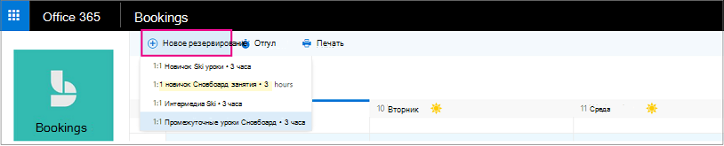
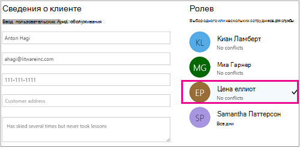

# Создание резервирования вручнуюCreate a manual booking

Для резервирований можно назначать время и сотрудников двумя способами.Bookings can be scheduled and staffed in two different ways. Первый способ — это клиент, использующий страницу резервирования или встроенную страницу бронирования, которую вы добавляете на свой веб-сайт.The first way is by the customer using a standalone booking page or an embedded booking page that you add to your website. Другой способ — вы или ваш сотрудник можете ввести параметры резервирования вручную (например, когда клиент назначает встречу по телефону).The other way is for you or one of your employees to enter the bookings manually, such as when a customer calls for an appointment. В этой статье рассматривается создание резервирований вручную.This article covers the manual scenario.

1. В Microsoft 365 выберите пусковую пусковую площадку Приложения, а затем выберите **Bookings**.In Microsoft 365, select the App launcher, and then select **Bookings**.

   

1. В области навигации выберите **Календарь** \> **Создать резервирование**.In the navigation pane, select **Calendar** \> **New booking**.

   

1. Выберите службу, которая будет предоставлена.Select the service to be provided. Определение [предложений служб в Microsoft Bookings](define-service-offerings.md) для инструкций по настройке служб.See [Define your service offerings in Microsoft Bookings](define-service-offerings.md) for service setup instructions.

1. Введите сведения о клиенте, включая его имя, адрес электронной почты, номер телефона и другие важные данные.Enter the customer information, including name, email address, phone number, and other relevant details.

1. Выберите сотрудника. Список сотрудников настраивается на странице "Услуги".Select the staff member to provide the service. The list of staff members shown is based on what you set up on the services page.

   

1. Введите сведения об услуге, в том числе дату, время, место и другие нужные данные. После ввода действительного адреса электронной почты клиента кнопка **Сохранить** изменится на **Отправить**, и вы увидите примечание о том, что клиенту будет отправлено подтверждение. В подтверждение включается вложение, позволяющее добавить данные в календарь. Выбранные сотрудники также получат приглашения со сведениями, которые они смогут добавить в свои личные календари.Enter the service details, including date, time, location, and other relevant information. Once you enter a valid email address for the customer, the **Save** button will change to **Send**, and you'll see a note telling you that a confirmation will be sent to the customer. The customer confirmation includes an attachment for them to add to their calendar. Selected staff members will also receive meeting invitations with the appointment information so they can add it to their personal calendars.

1. Выберите **Добавить напоминание по электронной почте**.Select **Add an email reminder**.

1. Укажите, когда должно быть отправлено напоминание, куда оно должно быть отправлено **(клиент,** **персонал,** все участники), и каким должно быть сообщение напоминания.Specify when the reminder should be sent, where it should be sent (**Customer**, **Staff**, **All attendees**), and what the reminder message should be.

1. Щелкните **Сохранить** \> **Отправить**.Select **Save** \> **Send**.

   Вот пример напоминания о том, что клиент получит:Here's an example email of the reminder your customer will receive:

:::image type="content" source="../media/bookings-confirmed-email.png" alt-text="Снимок экрана: пример электронной почты подтверждения из ручного бронирования":::