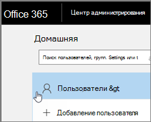
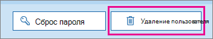

# <a name="delete-a-booking-calendar-in-bookings"></a>Удаление календаря резервирования в резервированиях

В этой статье объясняется, как можно удалить нежелательный календарь резервирования. Вы можете удалить календарь резервирования в центре администрирования Microsoft 365 или использовать PowerShell. Книга "книги" является почтовым ящиком в Exchange Online, поэтому удалите соответствующую учетную запись пользователя, чтобы удалить календарь резервирования.

> [!IMPORTANT]
> Все календари резервирования, созданные в 2017 или до, необходимо удалить с помощью инструкций PowerShell, приведенных в этом разделе. Все календари резервирования, созданные в 2018 или After, можно удалить в центре администрирования Microsoft 365.

Календарь резервирования содержит все релевантные сведения об этом календаре резервирования и данных, в том числе:

- Деловые сведения, логотип и рабочие часы, добавленные при создании календаря резервирования
- Подходящие сотрудники и службы, добавленные при создании календаря резервирования
- Все резервирования и временные встречи, добавленные в календарь резервирования после его создания.

> [!WARNING]
> После удаления календаря резервирования эти дополнительные сведения также безвозвратно удаляются и не могут быть восстановлены.

## <a name="delete-a-booking-calendar-in-the-microsoft-365-admin-center"></a>Удаление календаря резервирования в центре администрирования Microsoft 365

1. Перейдите в Центр администрирования Microsoft 365.

1. В Центре администрирования выберите пункт **Пользователи**.

   

1. На странице **Активные пользователи** выберите имена пользователей, которых хотите удалить, и нажмите кнопку **Удалить пользователя**.

   

## <a name="delete-a-booking-calendar-using-exchange-online-powershell"></a>Удаление календаря резервирования с помощью Exchange Online PowerShell

Необходимые условия и рекомендации по подключению к Exchange Online PowerShell приведены [в статье подключение к Exchange Online PowerShell](https://docs.microsoft.com/powershell/exchange/connect-to-exchange-online-powershell) .

Для выполнения этих действий необходимо использовать активное командное окно Microsoft PowerShell, которое было запущено, выбрав параметр "Запуск от имени администратора".

1. Введите следующую команду:

   ```PowerShell
    $user = get-credential
   ```

1. При появлении соответствующего запроса войдите в систему, используя учетные данные администратора клиента для клиента Microsoft 365, на котором размещается календарь резервирования, который требуется окончательно удалить.

1. В командной строки PowerShell введите следующую команду:

   ```PowerShell
    $s = New-Pssession -ConnectionUri https://outlook.office365.com/powershell-liveid -Credential $user -Authentication basic -AllowRedirection -ConfigurationName Microsoft.Exchange
   ```

1. Введите следующую команду:

   ```PowerShell
    Import-PSSession $s
   ```

1. Когда обработка этой команды завершится, введите следующую команду, чтобы получить список почтовых ящиков резервирования в вашем клиенте:

   ```PowerShell
    get-mailbox -RecipientTypeDetails Scheduling
   ```

1. Введите следующую команду:

   ```PowerShell
   remove-mailbox [BookingCalendarToDelete]
   ```

   > [!IMPORTANT]
   > Будьте осторожны, чтобы ввести точное имя псевдонима почтового ящика, который требуется удалить.

1. Чтобы убедиться, что календарь удален, введите следующую команду:

   ```PowerShell
    get-mailbox -RecipientTypeDetails Scheduling
   ```

   Удаленный календарь не будет отображаться в выходных данных.
