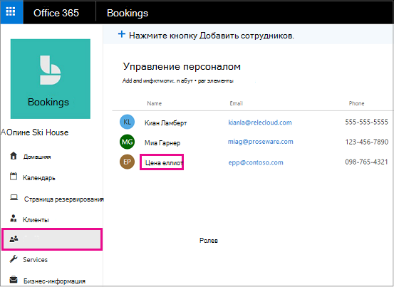
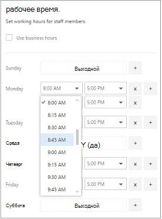
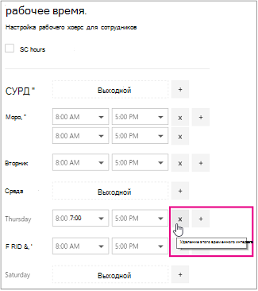

# Рабочие часы сотрудников в резервировании Майкрософт

Настройка рабочих часов для сотрудников гарантирует, что их доступность будет точно отображаться, когда ваши клиенты попытаются их зарегистрировать. По умолчанию часы работы каждого сотрудника соответствуют рабочим часам, заданным в приложении Microsoft Резервирования. В разделе "Задайте рабочие часы" [введите деловые данные](enter-business-information.md#set-your-business-hours).

На странице **персонал** можно настроить рабочие часы сотрудников в соответствии с потребностями вашего предприятия и сотрудников.

Если вы хотите добавить нерабочие дни сотрудника, чтобы клиенты не смогли выбрать его, когда его нет на работе, см. статью [Планирование нерабочих дней и отпусков](schedule-closures-time-off-vacation.md).

## Настройка рабочих часов для сотрудников

Просмотрите это видео или выполните указанные ниже действия, чтобы задать рабочее время сотрудника.

> [!VIDEO https://www.microsoft.com/videoplayer/embed/RWuXUq]

1. В Microsoft 365 выберите средство запуска приложений, а затем выберите пункт **резервирования**.

1. В области навигации щелкните **Сотрудники** и выберите нужного сотрудника.

   

1. В разделе "Часы работы", снимите флажок **Использовать рабочие часы**.

1. Выберите время начала и завершения для каждого дня с помощью раскрывающихся списков. Время можно изменять с приращением в 15 минут.

   

1. Щелкните **+** , чтобы добавить селекторы начала и окончания.

1. Нажмите Сохранить.

## Добавление выходных дней сотрудника

Если запланировать для сотрудника выходной день, он будет недоступен на странице резервирования и клиенты не смогут выбрать его для той или иной услуги в соответствующей день.

1. На экране рабочие часы выберите значок **x** рядом с днем, на который сотрудник отключится.

   

1. Если вы хотите запланировать день, который ранее был отмечен как выходной, выберите знак, **+** расположенный рядом с днем, для которого нужно запланировать.

> [!TIP]
> Если планируется запланировать время отпуска сотрудников или другие крупные блоки нерабочего времени, ознакомьтесь с разделом "Планирование нерабочего времени сотрудников" в [календарном плане, время и время отпуска](schedule-closures-time-off-vacation.md#schedule-employee-time-off).
