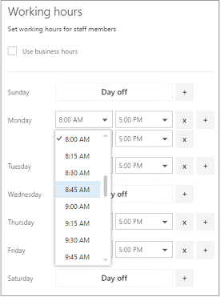

# Рабочие часы сотрудников в резервировании МайкрософтEmployee working hours in Microsoft Bookings

Настройка рабочих часов для сотрудников гарантирует, что их доступность будет точно отображаться, когда ваши клиенты попытаются их зарегистрировать.Setting employee working hours ensures that their availability is accurately shown when your customers try to book them. По умолчанию часы работы каждого сотрудника соответствуют рабочим часам, заданным в приложении Microsoft Резервирования.By default, the working hours for each of your employees match the business hours you've established in the Microsoft Bookings app. В разделе "Задайте рабочие часы" [введите деловые данные](enter-business-information.md#set-your-business-hours).See the "Set your business hours" section of [Enter business information](enter-business-information.md#set-your-business-hours).

На странице **персонал** можно настроить рабочие часы сотрудников в соответствии с потребностями вашего предприятия и сотрудников.On the **Staff** page, you can customize employee working hours to match the needs of your business and employees.

Если вы хотите добавить нерабочие дни сотрудника, чтобы клиенты не смогли выбрать его, когда его нет на работе, см. статью [Планирование нерабочих дней и отпусков](schedule-closures-time-off-vacation.md).If you want to book time off for staff members so customers can't book them while they're out of the office, see [Schedule business closures, time off, and vacation time](schedule-closures-time-off-vacation.md) for instructions.

> [!NOTE]
> Для клиентов, у которых есть подписки Microsoft 365 бизнес Standard, Microsoft 365 a3 или Microsoft 365 A5, резервирование включается по умолчанию.Bookings is turned on by default for customers who have the Microsoft 365 Business Standard, Microsoft 365 A3, or Microsoft 365 A5 subscriptions. Кроме того, они доступны пользователям Office 365 корпоративный E3 и Office 365 корпоративный, но по умолчанию она отключена.Bookings is also available to customers who have Office 365 Enterprise E3 and Office 365 Enterprise E5, but it is turned off by default. Чтобы приступить к работе, ознакомьтесь [со статьей получение доступа к книгам Майкрософт](get-access.md).To get started, see [Get access to Microsoft Bookings](get-access.md). Чтобы включить или отключить резервирование, ознакомьтесь со статьей [Включение или отключение учета для Организации](turn-bookings-on-or-off.md).To turn Bookings on or off, see [Turn Bookings on or off for your organization](turn-bookings-on-or-off.md).

## Настройка рабочих часов для сотрудниковCustomize employee working hours

Просмотрите это видео или выполните указанные ниже действия, чтобы задать рабочее время сотрудника.Watch this video or follow the steps below to set an employee's working hours.

> [!VIDEO https://www.microsoft.com/videoplayer/embed/RWuXUq]

1. В Microsoft 365 выберите средство запуска приложений, а затем выберите пункт **резервирования**.In Microsoft 365, select the app launcher, and then select **Bookings**.

1. В области навигации щелкните **Сотрудники** и выберите нужного сотрудника.In the navigation pane, select **Staff**, and then select the staff member whose hours you want to set.

   

1. В разделе "Часы работы", снимите флажок **Использовать рабочие часы**.Under Working hours, clear the **Use business hours** checkbox.

1. Выберите время начала и завершения для каждого дня с помощью раскрывающихся списков. Время можно изменять с приращением в 15 минут.Use the dropdowns to select start and end times for each day. Times are available in 15-minute increments.

   

1. Щелкните **+** , чтобы добавить селекторы начала и окончания.Click **+** to add start- and end-time selectors.

1. Нажмите Сохранить.Select Save.

## Добавление выходных дней сотрудникаSet an employee's days off

Если запланировать для сотрудника выходной день, он будет недоступен на странице резервирования и клиенты не смогут выбрать его для той или иной услуги в соответствующей день.When you schedule a day off for an employee, that employee will appear unavailable on the booking page. Customers using the booking page will be unable to schedule him or her for service on that day.

1. На экране рабочие часы выберите значок **x** рядом с днем, на который сотрудник отключится.On the working hours screen, select the **x** next to the day that the employee will have off.

   

1. Если вы хотите запланировать день, который ранее был отмечен как выходной, выберите знак, **+** расположенный рядом с днем, для которого нужно запланировать.If you want to schedule a day that was previously marked as a day off, select the **+** sign next to the day you want to schedule.

> [!TIP]
> Если планируется запланировать время отпуска сотрудников или другие крупные блоки нерабочего времени, ознакомьтесь с разделом "Планирование нерабочего времени сотрудников" в [календарном плане, время и время отпуска](schedule-closures-time-off-vacation.md#schedule-employee-time-off).If scheduling employee vacation time or other large blocks of time off, see the "Schedule employee time off" section of [Schedule business closures, time off, and vacation time](schedule-closures-time-off-vacation.md#schedule-employee-time-off).
