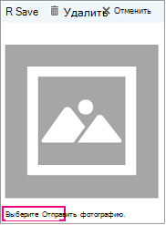

# Ввод сведений о компании

В разделе Microsoft резервирования страница бизнес-информации в веб-приложении содержит все сведения, которые обычно встречаются на странице "о нас". Эти сведения включают в себя соответствующее имя, адрес, номер телефона, URL-адрес веб-сайта, политику конфиденциальности, логотип и рабочие часы.

Предоставленные здесь сведения будут отображаться на страницах клиентов и клиентов, которые используются для учета встреч (которые называются страницей резервирования), а также в сообщениях и памятках, отправляемых им в соответствии с резервированием. Ниже приведен пример этих сведений на странице "резервирование".

   

> [!NOTE]
> Чтобы приступить к работе, ознакомьтесь [со статьей получение доступа к книгам Майкрософт](get-access.md). Чтобы включить или отключить резервирование, ознакомьтесь со статьей [Включение или отключение учета для Организации](turn-bookings-on-or-off.md).

## Ввод названия компании и контактных данных

1. В Microsoft 365 выберите средство запуска приложений, а затем выберите пункт **резервирования**.

1. В области навигации выберите **Сведения о компании**.

1. Введите соответствующее имя, адрес и номер телефона, которые будут использоваться для календаря резервирования.

1. В разделе **Отправка ответов клиентов на**Введите предпочтительный адрес электронной почты, на который будут пересылаться ответы на подтверждения и напоминания о резервировании.

1. В поле **URL-адрес веб-сайта** введите URL-адрес домашней страницы для вашего бизнеса.

1. Введите & URL-адреса **условий** политики и условий **конфиденциальности** .

1. Нажмите **Сохранить**.

## Ввод рабочих часов

По умолчанию в приложении Bookings в качестве рабочих часов используется интервал с 8:00 утра до 5:00 вечера (с понедельника по пятницу). Время можно изменять с приращением в 15 минут. В приложении Bookings используется 12-часовой формат.

Настройка **рабочих часов для** рабочих часов. Это время, в течение которого ограничены все резервирования. Дополнительные ограничения времени, когда можно заставлять встречи, могут быть заданы для каждой службы и для каждого сотрудника на страницах службы и персонал соответственно.

1. На странице "Сведения о компании" в разделе "Рабочие часы" с помощью раскрывающихся списков выберите время начала и окончания для каждого рабочего дня.

1. Щелкните **+** , чтобы добавить селекторы начала и окончания.

## Настройка рабочих часов для смены с перерывом

Может потребоваться заблокировать часть каждого дня или недели для проведения собраний сотрудников, обновления инвентаризации или получения дополнительных сведений о ритм. С помощью приложения "резервирования" можно ограничить количество встреч пользователей указанными интервалами времени.

Например, у вас есть собраний сотрудников на четверг от 1 часов до 2:30 и хотите заблокировать это время, чтобы все сотрудники сотрудников могли присутствовать. Для этого сделайте следующее:

1. На странице "Сведения о компании" в разделе "Рабочие часы" выберите время начала и окончания для четверга. В этом примере мы используем 8:00 утра и 1:00 дня.

1. Нажмите **+**, чтобы создать новую строку для четверга.

   

1. В новой строке выберите 2:30 p.m. время начала и 6:00 p.m. время окончания.

   

1. Нажмите Сохранить.

    Когда клиент откроет страницу резервирования, он увидит, что по четвергам ваша компания закрыта с 1 до 2:30.

## Отправка логотипа

Если вы еще не добавили логотип компании в приложение Bookings, это можно сделать на странице "Сведения о компании".

1. На странице "сведения о компании" в разделе Отправить логотип нажмите кнопку **изменить**.

1. Выберите **Отправить фотографию**.

   

1. Нажмите кнопку **Сохранить**.
